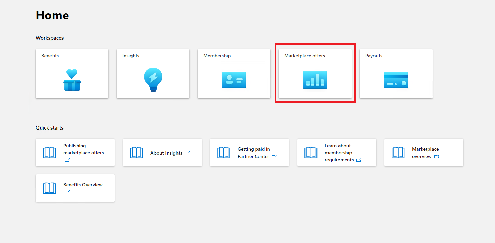

# Benutzerhandbuch für Partner für Microsoft 365 App Compliance-Programm – SaaS

|Phase|Position|
|---|---|
|Phase 1| Herausgebernachweis|
|Phase 2| Microsoft 365-Zertifizierung|

## 1. Übersicht 

Dieses Dokument dient als schrittweise Anleitung für unsere Partner, die für Microsoft 365 App Compliance-Programm registriert sind, um Publisher Nachweis und Zertifizierung für ihre SaaS-Apps über das Partner Center-Portal zu erhalten.

## 2. Akronymen & Definitionen
|Akronym | Definition |
|----|----|
|[PC (Partner Center)](https://partner.microsoft.com/)|Ein Portal für alle Microsoft-Partner. Ein Partner meldet sich beim Partner Center an und sendet einen Selbsteinschätzungsfragebogen. Partner Center für [Microsoft 365 App Compliance](https://partner.microsoft.com/dashboard/home)|
|ISV | Unabhängiger Softwareanbieter a.k.a. Partner oder Entwickler |
|App-Quelle | App-Katalog |
|Beispiel |[Jetzt virtueller Agent](https://appsource.microsoft.com/product/office/WA104381816)|

## 3. Publisher Nachweisworkflow

**Startseite**: Dies ist die Startseite, sobald sich ein Partner beim Partner Center anmeldet.

  
**Schritt 1** : Auswählen von Marketplace-Angeboten

  
**Schritt 2**: Nachdem Sie "Marketplace-Angebote" ausgewählt haben, wechseln Sie zu "Kommerzieller Marketplace".

Wählen Sie eine App aus der Liste aus, und eine andere Navigationsleiste wird mit der Option "App-Compliance" angezeigt.
  
**Schritt 3**: Auswählen von "App-Compliance"
  

  
**Schritt 4**: Ausfüllen des Selbstbewertungsfragebogens für Publisher Nachweis.

  
**HINWEIS Wenn Sie zur Aktualisierung/erneuten Übermittlung Ihrer Anwendung zurückkehren, klicken Sie auf die Dropdownliste für "Produkt auswählen", wählen Sie die App aus, und klicken Sie auf "Klonen".**

**Sie können auch die Import/Export-Funktion nutzen, um das Formular offline abzuschließen und es nach Abschluss des Formulars zu importieren.**

 
**Schritt 5**: Klicken Sie nach Abschluss auf "Absenden", die Bewertung lautet nun "Überprüft".
 
  
  
**Genehmigen/Ablehnen von Szenarien:**
  
A. Publisher Ablehnung des Nachweises
- Im Falle einer Ablehnung kann ein Partner:
     - Fehlerbericht anzeigen
          - Der Partner wird per E-Mail benachrichtigt, und er kann den Fehlerbericht im Partner Center anzeigen.
     - Aktualisieren sie den Selbsteinschätzungsfragebogen, und übermitteln Sie ihn erneut.
        

B.  Publisher Genehmigung des Nachweises
- Nach Genehmigung kann der Partner:
     - Aktualisieren und erneutes Übermitteln des Nachweises
     - Abgeschlossenen Publisher Nachweis anzeigen
     - Starten des Microsoft 365 Zertifizierungsprozesses
        
        
  
 
  
**Nach Publisher Genehmigung des Nachweises: Beispiel für einen Link in AppSource für vom Herausgeber bestätigte Apps.**
  

   
## 4. Microsoft 365 Zertifizierungsworkflow
  
Ein Partner kann den Zertifizierungsprozess starten, indem er das Kontrollkästchen aktiviert und auf 'Absenden' klickt.
  
 
  
**Schritt 1**: Ursprüngliche Dokumentübermittlung

Füllen Sie alle Details aus, laden Sie relevante Dokumente hoch, und klicken Sie auf 'Absenden'.
  
 

  
Beim Klicken auf "Absenden" wird die ursprüngliche Dokumentübermittlung überprüft.

  
Ein Analyst fordert eine Überarbeitung an, falls die ursprünglichen Dokumente nicht ausreichend oder relevant sind. Der Analyst arbeitet mit dem Partner zusammen, um die richtigen Dokumente zur Genehmigung zu erhalten.

Sobald der Analyst die ursprüngliche Dokumentübermittlung genehmigt hat, muss der Partner die Kontrollanforderungen übermitteln.
  
**Schritt 2**: Steuern der Anforderungsübermittlung
  
Füllen Sie alle Details aus, laden Sie relevante Dokumente hoch, und klicken Sie auf 'Absenden'.

  

 
Wenn Sie auf "Absenden" klicken, wird die ursprüngliche Dokumentübermittlung überprüft.

  
Ein Analyst fordert eine Überarbeitung an, falls die Kontrollanforderungsdokumente nicht ausreichend oder relevant sind. Der Analyst arbeitet mit dem Partner zusammen, um die richtigen Dokumente zur Genehmigung zu erhalten.

  
 
 
Falls die Übermittlung nicht den Genehmigungsstandards entspricht, lehnt der Analyst die Übermittlung ab.
  
Der Partner kann mit dem Analysten zusammenarbeiten, um die relevanten Informationen und Dokumente bereitzustellen.

  
Sobald alle Sicherheitsstandards erfüllt sind, genehmigt der Analyst die Einreichung, und der Partner wird Microsoft 365 zertifiziert.

  
**Nach der Zertifizierungsgenehmigung: Beispiel für Microsoft 365 Zertifizierungssignal in AppSource.** 

 
## 5. Microsoft 365 Verlängerungsworkflow:
  
**Microsoft 365Publisher Workflow zur Verlängerung des Nachweises und der Zertifizierung:**  

Microsoft 365 App Compliance-Programm bietet jetzt einen jährlichen Verlängerungsprozess an. Während dieses Vorgangs können App-Entwickler ihren vorhandenen Publisher Fragebogen und die dokumente aktualisieren, die für Microsoft 365 Zertifizierung erforderlich sind. 
 
**Vorteile:** 

- Verwalten Sie Ihr Zertifizierungssignal in AppSource, dem Office Store, dem Teams Store und verschiedenen Verwaltungsportalen, um Ihre App von anderen zu unterscheiden. 
- Erhöhen Sie das Vertrauen der Kunden in die Verwendung Ihrer zertifizierten App. 
- Unterstützen Sie IT-Administratoren bei fundierten Entscheidungen mit aktualisierten Zertifizierungsinformationen.

Der neue Erneuerungsprozess ist im [Partner Center](https://partner.microsoft.com/dashboard/home) verfügbar, um eine nahtlose Erfahrung zu bieten. Eine Verlängerungserinnerung wird ab 90 Tagen vor dem Ablaufdatum im Partner Center angezeigt. Regelmäßige Erinnerungen werden auch per E-Mail um 90, 60 und 30 Tage vor Ablauf gesendet. 
 
**Phase 1: Publisher Verlängerung des Nachweises:**
  
Die Publisher Antworten auf den Nachweis der App müssen jährlich erneut gesendet werden. Wenn sich der Nachweis der 1-Jahres-Marke nähert, wird eine E-Mail-Erinnerung gesendet, die eine erneute Übermittlung des Nachweises fördert. 
 
**Schritt 1**: Wählen Sie **"Verlängern**" aus, um den Publisher Nachweis zu verlängern.
  

  
**Schritt 2**: Überprüfen Sie die Antworten auf den vorherigen Publisher-Nachweis, und aktualisieren Sie bei Bedarf mit den neuesten Informationen. 
  
Reichen Sie Publisher Nachweis zur Verlängerung ein, wenn Sie bereit sind. Sie wird von einem M365 App Compliance-Analysten überprüft.

  
**Publisher Verlängerung des Nachweises genehmigt:**
  

  
**Publisher Nachweis abgelaufen:**
  
Die Informationen der App müssen vor dem Ablaufdatum erneuert werden, um die Seite Publisher Nachweis der App in den Microsoft-Dokumenten beizubehalten. Eine rechtzeitige Verlängerung sorgt außerdem für eine kontinuierliche Badging und Symbole für die App in verschiedenen Storefronts. 
 

**Hinweis**: Nach Ablauf kann Publisher Verlängerungsprozess des Nachweises jederzeit gestartet werden, indem Sie auf "Verlängern" klicken.
 
**Phase 2: Microsoft 365 Verlängerung der Zertifizierung**
  
Die Zertifizierungsinformationen der App müssen jährlich erneut gesendet werden. Dies erfordert eine erneute Gültigkeitsvalidierung der In-Scope-Steuerelemente Ihrer aktuellen Umgebung. Wenn sich die Zertifizierung dem 1-Jahres-Zeichen nähert, wird eine E-Mail-Benachrichtigung gesendet, die eine erneute Übermittlung der Dokumente und Nachweise fördert.
 
 

**Genehmigungs-/Ablehnungsszenarien für die Zertifizierungsverlängerung:**

**Szenario 1:** 

Die Zertifizierungsverlängerung wurde gestartet und wird überprüft.
 
 

Szenario 1A: 

Ablehnung der Zertifizierungsverlängerung: 
- Die Zertifizierung kann abgelehnt werden, wenn: 
     - Die App verfügt nicht über die erforderlichen Tools, Prozesse oder Konfigurationen und kann die erforderlichen Änderungen nicht im Zertifizierungsfenster implementieren. 
     - Die App weist hervorragende Sicherheitsrisiken auf und kann im Zertifizierungsfenster nicht behoben werden. 
 

Szenario 1B: 

Die Verlängerung der Zertifizierung ist genehmigt.

**Ablauf der Zertifizierung:**

Die Informationen der App müssen vor dem Ablaufdatum erneuert werden, um die Zertifizierungsseite der App in den Microsoft-Dokumenten aufrechtzuerhalten. Eine rechtzeitige Verlängerung sorgt außerdem für weitere Badging- und Symbole für die App in AppSource- und Team-Store.

  
Hinweis: Nach Ablauf kann Publisher Bestätigungs- und Zertifizierungsprozess jederzeit gestartet werden, indem Sie auf "Verlängern" klicken. 
