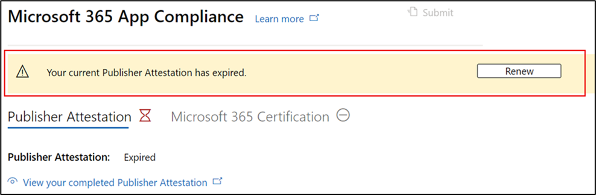

# Benutzerhandbuch des Partners für Microsoft 365 App Compliance-Programm

|Phase|Titel|
|---|---|
|Phase 1| Herausgebernachweis|
|Phase 2| Microsoft 365-Zertifizierung|

## 1. Übersicht
Dieses Dokument dient als schrittweise Benutzeranleitung für unsere Partner, die im Microsoft 365 App Compliance-Programm registriert sind und Publisher Nachweis und Zertifizierung über das Partner Center-Portal durchführen möchten.

## 2. Akronyme & Definitionen
| Akronym |Definition |
|---|----|
|PC [(Partner Center)](https://partner.microsoft.com/)|Ein Portal für alle Microsoft-Partner. Ein Partner meldet sich beim Partner Center an und sendet einen Fragebogen zur Selbstbewertung. [Partner Center](https://partner.microsoft.com/dashboard/home) für Microsoft 365 App Compliance|
|ISV|Unabhängiger Softwareanbieter. Aka. Partner oder Entwickler|
|App-Quelle| [Katalog von Apps](https://appsource.microsoft.com/)
|Beispiel|[Jetzt virtueller Agent](https://appsource.microsoft.com/product/office/WA104381816)|

## 3. Publisher Nachweisworkflow

**Startseite:** Dies ist die Zielseite, sobald sich ein Partner beim Partner Center anmeldet.

**Schritt 1:**   Auf der linken Seite der Seite in der Navigationsleiste:
- Auswählen Office Speichers
- Select Overview

Bei Auswahl von "Übersicht" kann der Partner eine Liste der über Partner Center übermittelten Apps anzeigen, die für das Microsoft 365 Compliance-Programm verfügbar sind.

**Schritt 2:** Wählen Sie eine App aus der Liste aus, um den Publisher Nachweisprozess zu starten.

Beim Auswählen einer App wird eine andere Navigationsleiste mit der Option "App-Compliance" angezeigt.

**Schritt 3:** Wählen Sie "App-Compliance" aus.

**Schritt 4:** Ausfüllen des Selbstbewertungsfragebogens für Publisher Nachweis

**Hinweis: Wenn Sie ihre Anwendung aktualisieren/erneut übermitteln möchten, klicken Sie auf dropdown für "Produkt auswählen", wählen Sie die App aus, und klicken Sie auf "Klonen".**

Sie können auch das feature Import/Export verwenden, um das Formular offline auszufüllen und es nach Abschluss zu importieren.

**Schritt 5:** Nachdem Sie abgeschlossen sind, klicken Sie auf "Übermitteln", die Bewertung wird jetzt "Überprüft" angezeigt.

### Genehmigen/Ablehnen von Szenarien:

**A. Publisher Ablehnung des Nachweiss**

- Im Falle einer Ablehnung in dieser Phase kann ein Partner:
    - Fehlerbericht anzeigen
         - Der Partner wird per E-Mail benachrichtigt und kann den Fehlerbericht im Partner Center anzeigen.
    - Aktualisieren und erneutes Übermitteln Publisher Attestation

**B. Publisher Genehmigung des Nachweiss**

- Nach der Genehmigung kann der Partner:
    - Aktualisieren und erneutes Übermitteln des Attests
    - Anzeigen und Freigeben abgeschlossener Publisher Attestation
    - Starten Microsoft 365 Zertifizierungsprozesses

**Post Publisher Attestation Approval: Example of link in AppSource for publisher attested apps**

## 4. Microsoft 365-Zertifizierungsworkflow

Ein Partner kann den Zertifizierungsprozess starten, indem er das Kontrollkästchen aktiviert und auf "Absenden" klickt. 

**Schritt 1:** Füllen Sie alle Details aus, laden Sie relevante Dokumente hoch, und klicken Sie auf "Übermitteln".

 

Wenn Sie auf "Absenden" klicken, wird die Übermittlung des Nachweises überprüft. 

Ein Analyst fordert eine Überarbeitung für den Fall an, dass die ersten Dokumente nicht ausreichend oder relevant sind. Der Analyst arbeitet mit dem Partner zusammen, um die richtigen Dokumente zur Genehmigung zu erhalten. 

Nachdem der Analyst die ursprüngliche Dokumentübermittlung genehmigt hat, muss der Partner die Steuerungsanforderungen übermitteln. 

**Schritt 2:** Anforderungsübermittlung steuern: Füllen Sie alle Details aus, laden Sie relevante Dokumente hoch, und klicken Sie auf "Übermitteln". 

 
 

Wenn Sie auf "Absenden" klicken, wird die Zertifizierungsübermittlung überprüft. 

Ein Analyst fordert eine Überarbeitung für den Fall an, dass die Kontrollanforderungsdokumente nicht ausreichend oder relevant sind. Der Analyst arbeitet mit dem Partner zusammen, um die richtigen Dokumente zur Genehmigung zu erhalten. 

 
 

Falls die Übermittlung die Genehmigungsstandards nicht erfüllt, wird der Analyst die Übermittlung ablehnen. Der Partner kann mit dem Analysten zusammenarbeiten, um die relevanten Informationen und Dokumente bereitzustellen. 

Sobald alle Sicherheitsstandards erfüllt sind, genehmigt der Analyst die Übermittlung, und der Partner wird Microsoft 365 zertifiziert. 

**Nach der Zertifizierungsgenehmigung: Beispiel für Microsoft 365-Zertifizierungssignal in AppSource**

## 5. Microsoft 365-Verlängerungsworkflow:
  
**Microsoft 365 Publisher Nachweis- und Zertifizierungsverlängerungsworkflow:** Microsoft 365 App Compliance-Programm bietet jetzt einen jährlichen Verlängerungsprozess. Während dieses Vorgangs können App-Entwickler ihren vorhandenen Publisher Attestation-Fragebogen und dokumente aktualisieren, die für Microsoft 365 Zertifizierung erforderlich sind. 
 
**Vorteile:** 

- Verwalten Sie Ihr Zertifizierungssignal in AppSource, die Teams Store, die Office Store und andere Storefronts, um die App zu unterscheiden. 
- Erhöhen Sie das Kundenvertrauen bei der Verwendung Ihrer zertifizierten App. 
- Helfen Sie IT-Administratoren, fundierte Entscheidungen mit aktualisierten Zertifizierungsinformationen zu treffen. 

Der Verlängerungsprozess ist im [Partner Center](https://partner.microsoft.com/dashboard/home) verfügbar, um eine nahtlose Erfahrung zu bieten. Eine Erinnerung zur Verlängerung wird ab 90 Tagen vor dem Ablaufdatum im Partner Center angezeigt. Regelmäßige Erinnerungen werden auch 90, 60 und 30 Tage vor Ablauf per E-Mail gesendet.

**Phase 1: Publisher Verlängerung des Nachweiss:** 

Der neue Verlängerungsprozess ist im [Partner Center](https://partner.microsoft.com/dashboard/home) verfügbar, um eine nahtlose Erfahrung zu bieten. Eine Erinnerung zur Verlängerung wird ab 90 Tagen vor dem Ablaufdatum im Partner Center angezeigt. Regelmäßige Erinnerungen werden auch 90, 60 und 30 Tage vor Ablauf per E-Mail gesendet. 

**Schritt 1:** Wählen Sie **"Verlängern"** aus, um den Publisher Nachweis zu verlängern. 

**Schritt 2:** Überprüfen Sie die vorherigen Publisher Antworten auf den Nachweis, und aktualisieren Sie bei Bedarf die neuesten Informationen. Übermitteln Sie Publisher Nachweis zur Verlängerung, wenn sie bereit ist. Sie wird von einem Microsoft 365 App-Compliance-Analysten überprüft.

**Publisher Bestätigungsverlängerung genehmigt**

**Publisher Nachweis ist abgelaufen:** Die Informationen der App müssen vor dem Ablaufdatum verlängert werden, um die Seite Publisher Nachweis der App in den Microsoft-Dokumenten zu verwalten. Eine rechtzeitige Verlängerung stellt außerdem eine fortlaufende Bereinigung und Symbole für die App in AppSource, Teams Store, Office Store und anderen Storefronts sicher.

Hinweis: Nach Ablauf des Vorgangs kann Publisher Verlängerungsvorgang für den Nachweis jederzeit durch Klicken auf "Verlängern" gestartet werden. 

**Phase 2: Microsoft 365 Zertifizierungsverlängerung** 

Die Zertifizierungsinformationen der App müssen jährlich erneut übermittelt werden. Dies erfordert eine erneute Überprüfung der In-Scope-Steuerelemente Ihrer aktuellen Umgebung. Wenn die Zertifizierung sich dem 1-Jahres-Zeichen nähert, wird eine E-Mail-Benachrichtigung gesendet, die eine erneute Übermittlung der Dokumente und Nachweise fördert. 

**Genehmigungs-/Ablehnungsszenarien für die Zertifizierungsverlängerung:**
 
**Szenario 1:** 

Die Zertifizierungsverlängerung wurde gestartet und wird überprüft.

**Szenario 1A:**

Ablehnung der Zertifizierungsverlängerung: Die Zertifizierung kann abgelehnt werden, wenn: 
- Die App verfügt nicht über die erforderlichen Tools, Prozesse oder Konfigurationen und kann die erforderlichen Änderungen im Zertifizierungsfenster nicht implementieren. 
- Die App verfügt über ausstehende Sicherheitsrisiken und kann im Zertifizierungsfenster nicht behoben werden. 
 

    
**Szenario 1B:** 

Zertifizierungsverlängerung wird genehmigt  

**Ablauf der Zertifizierung:**
 
Die Informationen der App müssen vor dem Ablaufdatum verlängert werden, um die Zertifizierungsseite der App in den Microsoft-Dokumenten aufrechtzuerhalten. Eine rechtzeitige Verlängerung stellt auch eine fortlaufende Bereinigung und Symbole für die App in AppSource und Team Store sicher.

Die Informationen der App müssen vor dem Ablaufdatum verlängert werden, um die Zertifizierungsseite der App in den Microsoft-Dokumenten aufrechtzuerhalten. Eine rechtzeitige Verlängerung stellt außerdem eine fortlaufende Bereinigung und Symbole für die App in AppSource, Teams Store, Office Store und anderen Storefronts sicher. 

    
**Hinweis:** Nach Ablauf kann Publisher Nachweis- und Zertifizierungsprozess jederzeit durch Klicken auf "Verlängern" gestartet werden. 

