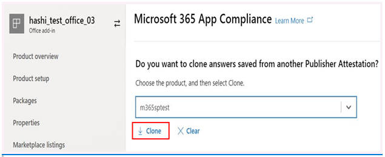
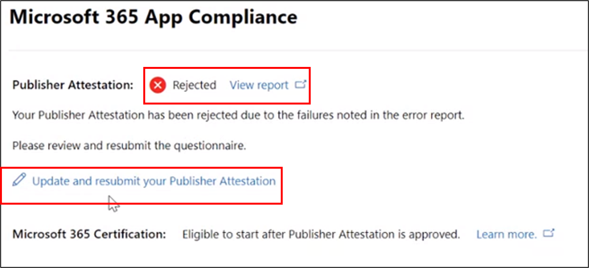

# Benutzerhandbuch des Partners für Microsoft 365 App Compliance Program

|||
|---|---|
|Ebene 1| Publisher Attestation|
|Ebene 2| Microsoft 365-Zertifizierung|

## 1. Übersicht
Dieses Dokument dient als schrittweise Anleitung für unsere Partner, die für das Microsoft 365-App-Compliance-Programm registriert sind, um publisher attestation and certification though Partner Center portal zu durchlaufen.

## 2. Akronyme & Definitionen
| | |
|---|----|
|Akronym | Definition |
|PC (Partner Center)|Ein Portal für alle Microsoft-Partner. Ein Partner meldet sich beim Partner Center an und sendet Self-Assessment Fragebogen https://partner.microsoft.com/|
|ISV|Unabhängiger Softwareanbieter A.k.a. Partner oder Entwickler|
|App-Quelle| Katalog von Apps (https://appsource.microsoft.com/)
||Beispiel: Jetzt virtueller Agent (https://appsource.microsoft.com/en-us/product/office/WA104381816)|

## 3. Publisher Attestation Workflow

Startseite: Dies ist die Zielseite, sobald sich ein Partner beim Partner Center anmeldet.

**Schritt 1**   : Auf der linken Seite der Seite in der Navigationsleiste:
1. Auswählen des Office-Speichers
1. Auswählen der Übersicht

Wenn Sie "Übersicht" auswählen, kann der Partner eine Liste der apps sehen, die über das Partner Center übermittelt wurden und für das Microsoft 365 Compliance-Programm verfügbar sind.

**Schritt 2** : Wählen Sie eine App aus der Liste aus, um den Publisher-Attestation-Prozess zu starten.

Beim Auswählen einer App wird eine andere Navigationsleiste mit der Option "App Compliance" angezeigt.

**Schritt 3**: Auswählen von "App-Compliance"

**Schritt 4**: Ausfüllen des Self-Assessment Für Publisher Attestation

**Hinweis**:Wenn Sie ihre Anwendung aktualisieren/erneut übermitteln möchten, klicken Sie auf Dropdown für "Produkt auswählen", wählen Sie die App aus, und klicken Sie auf "Klonen".

 

Sie können auch das Import/Export-Feature nutzen, um das Formular offline zu vervollständigen und nach Abschluss des Vorgangs zu importieren. 

**Schritt 5**: Nachdem Sie abgeschlossen sind, klicken Sie auf "Übermitteln", die Bewertung wird nun überprüft.

### Genehmigen/Ablehnen von Szenarien:

**A.Publisher Attestation Rejection**

Bei Ablehnung in dieser Phase kann ein Partner:
-   Fehlerbericht anzeigen.
    - Partner werden im Partner Center und per E-Mail benachrichtigt.
-   Aktualisieren Self-Assessment Antworten.
-   Self-Assessment erneut übermitteln.

**B.Publisher Attestation Re-submission**

**C.Publisher Attestation Approval**

-   Nach der Genehmigung kann der Partner:
    - Aktualisieren und erneutes Übermitteln von Bescheinigungen
    - Anzeigen und Freigeben abgeschlossener Publisher Attestation
    - Starten des M365-Zertifizierungsprozesses

**Post Publisher Verification Approval: Beispiel für Link in AppSource für vom Herausgeber bestätigte Apps**

## 4. Microsoft 365-Zertifizierungsworkflow

Sobald der Partner auf "Übermitteln" klickt und alle Dokumente und Nachweise zur Überprüfung übermittelt: 

### Microsoft 365 Certification – Submitted

**Microsoft 365-Zertifizierung – Abgelehnt**

**Microsoft 365-Zertifizierung – Genehmigt**

**Post Certification Approval: Beispiel für Microsoft 365-Zertifizierungsabzeichen in AppSource**

## 5. Workflow für vorhandene ISVs

Wenn Sie ein vorhandener ISV sind und Publisher Attestation aktualisieren möchten.

**Schritt 1**: Klicken Sie auf den Link 'Publisher Attestation aktualisieren und erneut übermitteln'.

**Hinweis:** Wenn Sie ihre Anwendung aktualisieren/erneut übermitteln möchten, klicken Sie auf Dropdown für "Produkt auswählen", wählen Sie die App aus, und klicken Sie auf "Importieren".

**Schritt 2:** Nehmen Sie Aktualisierungen an Ihrem Formular vor, und klicken Sie auf Speichern/Übermitteln.

Sobald sie übermittelt wurde, wird sie überprüft.

## 6. Microsoft 365 Re-Certification Workflow:

Wenn eine App ihr einjähriges Zertifizierungsjubiläum erreicht, werden regelmäßig Erinnerungen an die Erneuerung der Zertifizierung angezeigt.

**Publisher Attestation Completed. Zertifizierung inProgress.**

Genehmigung/Ablehnung Secnario: A. Zertifizierung abgelehnt

B. Zertifizierung genehmigt

Ablaufszenario: A. Publisher Attestation Expired

B. Zertifizierung abgelaufen

