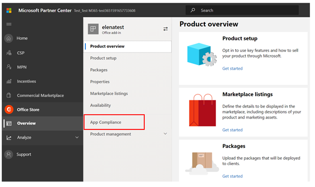
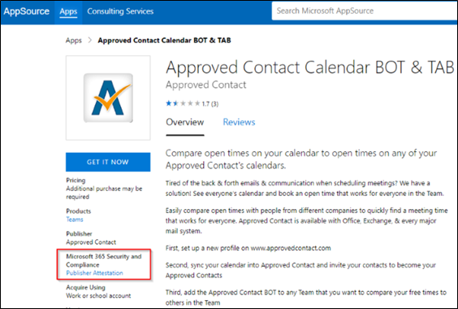

# Benutzerhandbuch des Partners für Microsoft 365 App Compliance-ProgrammPartner's User Guide for Microsoft 365 App Compliance Program

|PhasePhase|TitelTitle|
|---|---|
|Phase 1Phase 1| HerausgebernachweisPublisher Attestation|
|Phase 2Phase 2| Microsoft 365-ZertifizierungMicrosoft 365 Certification|

## 1. Übersicht1. Overview
Dieses Dokument dient als schrittweise Anleitung für unsere Partner, die im Microsoft 365 App Compliance-Programm registriert sind und Publisher Nachweis und Zertifizierung über das Partner Center-Portal durchführen möchten.This document acts as a step-by-step user guide for our partners enrolled in the Microsoft 365 App Compliance program aiming to undergo Publisher Attestation and Certification though the Partner Center portal.

## 2. Akronyme & Definitionen2. Acronyms & Definitions
| AkronymAcronym |DefinitionDefinition |
|---|----|
|PC [(Partner Center)](https://partner.microsoft.com/)PC [(Partner Center)](https://partner.microsoft.com/)|Ein Portal für alle Microsoft-Partner.A portal for all Microsoft partners. Ein Partner meldet sich beim Partner Center an und sendet einen Fragebogen zur Selbstbewertung.A partner logs in to Partner Center and submits self-assessment questionnaire. [Partner Center](https://partner.microsoft.com/dashboard/home) für Microsoft 365 App Compliance[Partner Center](https://partner.microsoft.com/dashboard/home) for Microsoft 365 App Compliance|
|ISVISV|Unabhängiger Softwareanbieter.Independent Software Vendor. Aka.A.k.a. Partner oder Entwicklerpartner or developer|
|App-QuelleApp Source| [Katalog von AppsCatalog of apps](https://appsource.microsoft.com/)
|BeispielExample|[Jetzt virtueller AgentNow virtual agent](https://appsource.microsoft.com/product/office/WA104381816)|

## 3. Publisher Nachweisworkflow3.   Publisher Attestation Workflow

**Startseite:** Dies ist die Zielseite, sobald sich ein Partner beim Partner Center anmeldet.**Home Page** : This is the landing page once a partner logs in to Partner Center.

**Schritt 1:**   Auf der linken Seite der Seite in der Navigationsleiste:**Step 1**   : On the left side of the page, in the navigation bar:
- Auswählen Office SpeichersSelect Office store
- Select OverviewSelect Overview

Bei Auswahl von "Übersicht" kann der Partner eine Liste der über Partner Center übermittelten Apps anzeigen, die für das Microsoft 365 Compliance-Programm verfügbar sind.Upon selecting ‘Overview’, partner can see list of apps submitted through Partner Center and available for the Microsoft 365 Compliance program.

**Schritt 2:** Wählen Sie eine App aus der Liste aus, um den Publisher Nachweisprozess zu starten.**Step 2** : Select an app from the list to begin the Publisher Attestation process.

Beim Auswählen einer App wird eine andere Navigationsleiste mit der Option "App-Compliance" angezeigt.On selecting an app, another navigation bar will pop up with option ‘App Compliance.’

**Schritt 3:** Wählen Sie "App-Compliance" aus.**Step 3**: Select ‘App Compliance’

**Schritt 4:** Ausfüllen des Fragebogens zur Selbstbewertung für Publisher Nachweis**Step 4**: Fill out the self-assessment questionnaire for Publisher Attestation

**Hinweis: Wenn Sie ihre Anwendung aktualisieren/erneut übermitteln möchten, klicken Sie auf dropdown für "Produkt auswählen", wählen Sie die App aus, und klicken Sie auf "Klonen".****Note If you are coming back to update/re-submit your application, click dropdown for ‘Choose the product’, select the app and click ‘Clone.’**

Sie können auch das feature Import/Export verwenden, um das Formular offline auszufüllen und es nach Abschluss zu importieren.You can also leverage the Import/Export feature to complete the form offline and import it once completed.

**Schritt 5:** Wenn Sie abgeschlossen sind, klicken Sie auf "Übermitteln", die Bewertung wird jetzt "Überprüft" angezeigt.**Step 5**: Once completed, click on ‘Submit’, the assessment will now be ‘Under Review.'

### Genehmigen/Ablehnen von Szenarien:Approve/Reject Scenarios:

**A. Publisher Ablehnung des Nachweiss****A. Publisher Attestation Rejection**

- Im Falle einer Ablehnung in dieser Phase kann ein Partner:In case of rejection at this stage, an partner can:
    - Fehlerbericht anzeigenView failure report
         - Der Partner wird per E-Mail benachrichtigt und kann den Fehlerbericht im Partner Center anzeigen.Partner will be notified via email, and they can view the failure report in Partner Center
    - Aktualisieren und erneutes Übermitteln Publisher AttestationUpdate and re-submit Publisher Attestation

**B. Publisher Genehmigung des Nachweiss****B. Publisher Attestation Approval**

- Nach der Genehmigung kann der Partner:Upon approval partner can:
    - Aktualisieren und erneutes Übermitteln des AttestsUpdate and resubmit attestation
    - Anzeigen und Freigeben abgeschlossener Publisher AttestationView and share completed Publisher Attestation
    - Starten Microsoft 365 ZertifizierungsprozessesStart Microsoft 365 Certification process

**Post Publisher Attestation Approval: Example of link in AppSource for publisher attested apps****Post Publisher Attestation Approval: Example of link in AppSource for publisher attested apps**

## 4. Microsoft 365-Zertifizierungsworkflow4. Microsoft 365 Certification Workflow

Ein Partner kann den Zertifizierungsprozess starten, indem er das Kontrollkästchen aktiviert und auf "Absenden" klickt.A partner can begin the Certification process by selecting the checkbox and clicking ‘Submit’ 

**Schritt 1:** Ursprüngliche Dokumentübermittlung Füllen Sie alle Details aus, laden Sie relevante Dokumente hoch, und klicken Sie auf "Übermitteln".**Step 1:** Initial Document Submission Fill out all the details, upload relevant documents and Click ‘Submit’

 

Wenn Sie auf "Absenden" klicken, wird die Übermittlung des Nachweises überprüft.On clicking submit, the attestation submission will be under review. 

Ein Analyst fordert eine Überarbeitung für den Fall an, dass die ersten Dokumente nicht ausreichend oder relevant sind.An analyst requests a revision in case the initial documents are not sufficient or relevant. Der Analyst arbeitet mit dem Partner zusammen, um die richtigen Dokumente zur Genehmigung zu erhalten.The analyst will work with the partner to help get the right documents for approval. 

Nachdem der Analyst die ursprüngliche Dokumentübermittlung genehmigt hat, muss der Partner die Steuerungsanforderungen übermitteln.Once the analyst approves the initial document submission, the partner needs to submit the control requirements. 

**Schritt 2:** Anforderungsübermittlung steuern: Füllen Sie alle Details aus, laden Sie relevante Dokumente hoch, und klicken Sie auf "Übermitteln".**Step 2:** Control Requirement Submission Fill out all the details, upload relevant documents and Click ‘Submit’ 

 
 

Wenn Sie auf "Absenden" klicken, wird die Zertifizierungsübermittlung überprüft.On clicking Submit, the certification submission will be under review. 

Ein Analyst fordert eine Überarbeitung für den Fall an, dass die Kontrollanforderungsdokumente nicht ausreichend oder relevant sind.An analyst requests a revision in case the control requirement documents are not sufficient or relevant. Der Analyst arbeitet mit dem Partner zusammen, um die richtigen Dokumente zur Genehmigung zu erhalten.The analyst will work with the partner to help get the right documents for approval. 

 
 

Falls die Übermittlung die Genehmigungsstandards nicht erfüllt, wird der Analyst die Übermittlung ablehnen.In case the submission does not satisfy the approval standards, the analyst will reject the submission. Der Partner kann mit dem Analysten zusammenarbeiten, um die relevanten Informationen und Dokumente bereitzustellen.The partner can work with the analyst to provide the relevant information and documents. 

Sobald alle Sicherheitsstandards erfüllt sind, genehmigt der Analyst die Übermittlung, und der Partner wird Microsoft 365 zertifiziert.Once all the security standards have been met, the analyst will approve the submission and the partner will be Microsoft 365 Certified. 

**Nach der Zertifizierungsgenehmigung: Beispiel für Microsoft 365-Zertifizierungssignal in AppSource****Post Certification Approval: Example of Microsoft 365 certification badge in AppSource**

## 5. Microsoft 365-Verlängerungsworkflow:5.   Microsoft 365 Renewal Workflow:
  
**Microsoft 365 Publisher Nachweis- und Zertifizierungsverlängerungsworkflow:** Microsoft 365 App Compliance-Programm bietet jetzt einen jährlichen Verlängerungsprozess.**Microsoft 365 Publisher Attestation and Certification Renewal Workflow:** Microsoft 365 App Compliance Program now offers an annual renewal process. Während dieses Vorgangs können App-Entwickler ihren vorhandenen Publisher Attestation-Fragebogen und dokumente aktualisieren, die für Microsoft 365 Zertifizierung erforderlich sind.During this process, app developers can update their existing Publisher Attestation questionnaire and documents required for Microsoft 365 Certification. 
 
**Vorteile:****Benefits:** 

- Verwalten Sie Ihr Zertifizierungssignal in AppSource, die Teams Store, die Office Store und andere Storefronts, um die App zu unterscheiden.Maintain your certification badge in AppSource, the Teams Store, the Office Store and other storefronts to differentiate the app. 
- Erhöhen Sie das Kundenvertrauen bei der Verwendung Ihrer zertifizierten App.Increase customer confidence in using your certified app. 
- Helfen Sie IT-Administratoren, fundierte Entscheidungen mit aktualisierten Zertifizierungsinformationen zu treffen.Help IT admins make informed decisions with updated certification information. 

Der Verlängerungsprozess ist im [Partner Center](https://partner.microsoft.com/dashboard/home) verfügbar, um eine nahtlose Erfahrung zu bieten.The renewal process is available in [Partner Center](https://partner.microsoft.com/dashboard/home) to provide a seamless experience. Eine Erinnerung zur Verlängerung wird ab 90 Tagen vor dem Ablaufdatum im Partner Center angezeigt.A renewal reminder will be shown in Partner Center starting 90 days before the expiration date. Regelmäßige Erinnerungen werden auch 90, 60 und 30 Tage vor Ablauf per E-Mail gesendet.Periodic reminders will also be sent via email at 90, 60 and 30 days before expiration.

**Phase 1: Publisher Verlängerung des Nachweiss:****Phase 1: Publisher Attestation Renewal:** 

Der neue Verlängerungsprozess ist im [Partner Center](https://partner.microsoft.com/dashboard/home) verfügbar, um eine nahtlose Erfahrung zu bieten.The new renewal process is available in [Partner Center](https://partner.microsoft.com/dashboard/home) to provide a seamless experience. Eine Erinnerung zur Verlängerung wird ab 90 Tagen vor dem Ablaufdatum im Partner Center angezeigt.A renewal reminder will be shown in Partner Center starting 90 days before the expiration date. Regelmäßige Erinnerungen werden auch 90, 60 und 30 Tage vor Ablauf per E-Mail gesendet.Periodic reminders will also be sent via email at 90, 60 and 30 days before expiration. 

**Schritt 1:** Wählen Sie **"Verlängern"** aus, um den Publisher Nachweis zu verlängern.**Step 1**: Select **Renew** to renew the Publisher Attestation. 

**Schritt 2:** Überprüfen Sie die vorherigen Publisher Antworten auf den Nachweis, und aktualisieren Sie bei Bedarf die neuesten Informationen.**Step 2**: Review the previous Publisher Attestation answers and update with the latest information as needed. Übermitteln Sie Publisher Nachweis zur Verlängerung, wenn sie bereit ist.Submit Publisher Attestation for renewal when ready. Sie wird von einem Microsoft 365 App-Compliance-Analysten überprüft.It will be reviewed by an Microsoft 365 app compliance analyst.

**Publisher Bestätigungsverlängerung genehmigt****Publisher Attestation Renewal Approved**

**Publisher Nachweis ist abgelaufen:** Die Informationen der App müssen vor dem Ablaufdatum verlängert werden, um die Seite Publisher Nachweis der App in den Microsoft-Dokumenten zu verwalten. Eine rechtzeitige Verlängerung stellt außerdem eine fortlaufende Bereinigung und Symbole für die App in AppSource, Teams Store, Office Store und anderen Storefronts sicher.**Publisher Attestation Expired:** The app’s information needs to be renewed before the expiration date to maintain the app’s Publisher Attestation page on the Microsoft docs. Timely renewal will also ensure continued badging and icons for the app in AppSource, Teams Store, Office Store and other storefronts.

Hinweis: Nach Ablauf des Vorgangs kann Publisher Verlängerungsvorgang für den Nachweis jederzeit durch Klicken auf "Verlängern" gestartet werden.Note: Once expired, Publisher Attestation renewal process can be started anytime by clicking ‘Renew’. 

**Phase 2: Microsoft 365 Zertifizierungsverlängerung****Phase 2: Microsoft 365 Certification Renewal** 

Die Zertifizierungsinformationen der App müssen jährlich erneut übermittelt werden.The app’s certification information needs to be resubmitted on an annual basis. Dies erfordert eine erneute Überprüfung der In-Scope-Steuerelemente Ihrer aktuellen Umgebung.This will require revalidation of the in-scope controls of your current environment. Wenn die Zertifizierung sich dem 1-Jahres-Zeichen nähert, wird eine E-Mail-Benachrichtigung gesendet, die eine erneute Übermittlung der Dokumente und Nachweise fördert.When the Certification nears 1-year mark an email notification will be sent encouraging a resubmission of the documents and evidence. 

**Genehmigungs-/Ablehnungsszenarien für die Zertifizierungsverlängerung:****Certification Renewal Approve/Reject Scenarios:**
 
**Szenario 1:****Scenario 1:** 

Die Zertifizierungsverlängerung wurde gestartet und wird überprüft.Certification renewal has started and is under review.

**Szenario 1A:****Scenario 1A:**

Ablehnung der Zertifizierungsverlängerung: Die Zertifizierung kann abgelehnt werden, wenn:Certification renewal rejection: Certification may be rejected if: 
- Die App verfügt nicht über die erforderlichen Tools, Prozesse oder Konfigurationen und kann die erforderlichen Änderungen im Zertifizierungsfenster nicht implementieren.The app does not have the required tooling, processes, or configurations in place and will not be able to implement required changes within the certification window. 
- Die App verfügt über ausstehende Sicherheitsrisiken und kann im Zertifizierungsfenster nicht behoben werden.The app has outstanding vulnerabilities in place and cannot be fixed within the certification window. 
 

    
**Szenario 1B:****Scenario 1B:** 

Zertifizierungsverlängerung wird genehmigtCertification renewal is approved  

**Ablauf der Zertifizierung:****Certification Expiration:**
 
Die Informationen der App müssen vor dem Ablaufdatum verlängert werden, um die Zertifizierungsseite der App in den Microsoft-Dokumenten aufrechtzuerhalten. Eine rechtzeitige Verlängerung stellt außerdem eine fortlaufende Bereinigung und Symbole für die App in AppSource und Team Store sicher.The app’s information needs to be renewed before the expiration date to maintain app’s Certification page on the Microsoft docs. Timely renewal will also ensure continued badging and icons for the app in AppSource and Team Store.

Die Informationen der App müssen vor dem Ablaufdatum verlängert werden, um die Zertifizierungsseite der App in den Microsoft-Dokumenten aufrechtzuerhalten. Eine rechtzeitige Verlängerung stellt außerdem eine fortlaufende Bereinigung und Symbole für die App in AppSource, Teams Store, Office Store und anderen Storefronts sicher.The app’s information needs to be renewed before the expiration date to maintain app’s Certification page on the Microsoft docs. Timely renewal will also ensure continued badging and icons for the app in AppSource, Teams Store, Office Store and other storefronts. 

    
**Hinweis:** Nach Ablauf kann Publisher Nachweis- und Zertifizierungsprozess jederzeit durch Klicken auf "Verlängern" gestartet werden.**Note**: Once expired, Publisher Attestation and Certification process can be started anytime by clicking ‘Renew’. 

