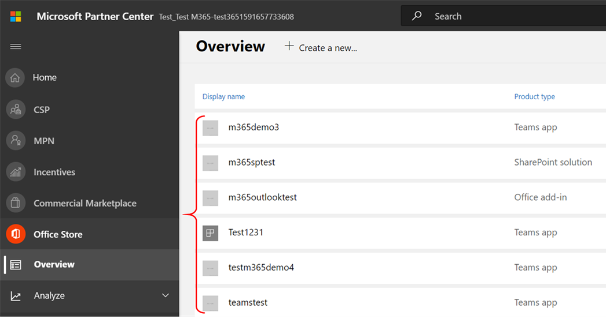

# Benutzerhandbuch des Partners für Microsoft 365 App-Compliance-Programm

|||
|---|---|
|Ebene 1| Herausgebernachweis|
|Ebene 2| Microsoft 365-Zertifizierung|

## 1. Übersicht
Dieses Dokument dient als schrittweise Anleitung für unsere Partner, die für das Microsoft 365-App-Compliance-Programm registriert sind, das die Publisher-Zertifizierung über das Partner Center-Portal durchlaufen soll.

## 2. Akronyme & Definitionen
| | |
|---|----|
|Akronym | Definition |
|PC (Partner Center)|Ein Portal für alle Microsoft-Partner. Ein Partner meldet sich beim Partner Center an und sendet Self-Assessment Fragebogen https://partner.microsoft.com/|
|ISV|Unabhängiger Softwareanbieter A.k.a. Partner oder Entwickler|
|App-Quelle| Katalog von Apps (https://appsource.microsoft.com/)
||Beispiel: Jetzt virtueller Agent (https://appsource.microsoft.com/en-us/product/office/WA104381816)|

## 3. Publisher-Workflow

Startseite: Dies ist die Zielseite, sobald sich ein Partner beim Partner Center anmeldet.

**Schritt 1**   : Auf der linken Seite der Seite in der Navigationsleiste:
1. Auswählen Office Speichers
1. Auswählen der Übersicht

Wenn Sie "Übersicht" auswählen, kann der Partner eine Liste der Apps sehen, die über das Partner Center übermittelt wurden und für das Microsoft 365 zur Verfügung stehen.

**Schritt 2** : Wählen Sie eine App aus der Liste aus, um den Publisher zu starten.

Beim Auswählen einer App wird eine andere Navigationsleiste mit der Option "App Compliance" angezeigt.

**Schritt 3**: Auswählen von "App-Compliance"

**Schritt 4**: Ausfüllen des Self-Assessment Fragebogens für Publisher Attestation

**Hinweis**:Wenn Sie ihre Anwendung aktualisieren/erneut übermitteln möchten, klicken Sie auf Dropdown für "Produkt auswählen", wählen Sie die App aus, und klicken Sie auf "Klonen".

 

Sie können auch das Import/Export verwenden, um das Formular offline zu vervollständigen und nach Abschluss zu importieren. 

**Schritt 5**: Nachdem Sie abgeschlossen sind, klicken Sie auf "Übermitteln", die Bewertung wird nun überprüft.

### Genehmigen/Ablehnen von Szenarien:

**A.Publisher Attestation Rejection**

Bei Ablehnung in dieser Phase kann ein Partner:
-   Fehlerbericht anzeigen.
    - Partner werden im Partner Center und per E-Mail benachrichtigt.
-   Aktualisieren Self-Assessment Antworten.
-   Self-Assessment erneut übermitteln.

**B.Publisher Erneute Übermittlung von Attesten**

**C.Publisher Attestation Approval**

-   Nach der Genehmigung kann der Partner:
    - Aktualisieren und erneutes Übermitteln von Bescheinigungen
    - Anzeigen und Freigeben abgeschlossener Publisher Attestation
    - Starten des M365-Zertifizierungsprozesses

**Post Publisher Verification Approval: Beispiel für einen Link in AppSource für vom Herausgeber bestätigte Apps**

## 4. Microsoft 365 Zertifizierungsworkflow

Sobald der Partner auf "Übermitteln" klickt und alle Dokumente und Nachweise zur Überprüfung übermittelt: 

### Microsoft 365 Zertifizierung – Übermittelt

**Microsoft 365 Zertifizierung – Abgelehnt**

**Microsoft 365 Zertifizierung – Genehmigt**

**Post Certification Approval: Beispiel für Microsoft 365 Zertifizierungsabzeichen in AppSource**

## 5. Workflow für vorhandene ISVs

Wenn Sie ein vorhandener ISV sind und den Publisher aktualisieren möchten.

**Schritt 1**: Klicken Sie auf "Aktualisieren und erneut senden" Publisher Attestation.

**Hinweis:** Wenn Sie ihre Anwendung aktualisieren/erneut übermitteln möchten, klicken Sie auf Dropdown für "Produkt auswählen", wählen Sie die App aus, und klicken Sie auf "Importieren".

**Schritt 2:** Nehmen Sie Aktualisierungen an Ihrem Formular vor, und klicken Sie auf Speichern/Übermitteln.

Sobald sie übermittelt wurde, wird sie überprüft.

## 6. Microsoft 365 Publisher Und Zertifizierungserneuerungsworkflow:

Microsoft 365 Das App-Compliance-Programm bietet jetzt einen jährlichen Verlängerungsprozess. Während dieses Prozesses können App-Entwickler ihre vorhandenen Publisher und Dokumente aktualisieren, die für die Zertifizierung Microsoft 365 sind. 

**Vorteile:**

- Verwalten Sie Ihr Zertifizierungsabzeichen in AppSource und Store, um Ihre App von anderen zu unterscheiden. 
- Erhöhen Sie das Vertrauen der Kunden in die Verwendung Ihrer zertifizierten App. 
- Unterstützen Sie IT-Administratoren dabei, fundierte Entscheidungen mit aktualisierten Zertifizierungsinformationen zu treffen. 

Der neue Erneuerungsprozess ist im [Partner Center verfügbar,](https://partner.microsoft.com/en-us/dashboard/home) um eine nahtlose Erfahrung zu bieten. Eine Verlängerungserinnerung wird im Partner Center ab 90 Tagen vor dem Ablaufdatum angezeigt. Regelmäßige Erinnerungen werden auch per E-Mail an 90, 60 und 30 Tage vor Ablauf gesendet.

**Ebene 1: Publisher Verlängerung des Attests:** 

Die Publisher der App müssen jährlich erneut übermittelt werden. Wenn sich die Bescheinigung dem 1-Jahres-Zeichen nähert, wird eine E-Mail-Erinnerung gesendet, in der eine erneute Übertragung des Attests ermutigt wird. 

**Schritt 1**: Wählen Sie **Verlängern aus,** um den Publisher zu verlängern. 

**Schritt 2**: Überprüfen Sie die vorherigen Publisher, und aktualisieren Sie sie bei Bedarf mit den neuesten Informationen. Senden Publisher zur Verlängerung, wenn sie bereit ist. Es wird von einem M365 App Compliance Analyst überprüft.

**Publisher Attestation Expired:** Die Informationen der App müssen vor dem Ablaufdatum erneuert werden, um die Publisher der App in den Microsoft-Dokumenten zu verwalten. Eine rechtzeitige Verlängerung stellt außerdem sicher, dass die App in AppSource und team Store.

Hinweis: Nach ablaufendem Publisher verlängerungsprozess jederzeit gestartet werden, indem Sie auf "Erneuern" klicken. 

**Ebene 2: Microsoft 365 Zertifizierungserneuerung** 

Die Zertifizierungsinformationen der App müssen jährlich erneut übermittelt werden. Dies erfordert eine erneuteValidierung der Bereichssteuerelemente Ihrer aktuellen Umgebung. Wenn die Zertifizierung auf ein Jahr näher rückt, wird eine E-Mail-Benachrichtigung gesendet, in der eine erneute Zustellung der Dokumente und Nachweise ermutigt wird. 

**Genehmigungs-/Ablehnungsszenarien für die Zertifizierungserneuerung:**

**Szenario 1:** 

Publisher Der Nachweis ist abgeschlossen. Die Verlängerung der Zertifizierung wurde gestartet und wird überprüft. 

**Szenario 1A:**

Ablehnung der Zertifizierungserneuerung: Die Zertifizierung kann abgelehnt werden, wenn: 

 - Die App verfügt nicht über die erforderlichen Tools, Prozesse oder Konfigurationen und kann die erforderlichen Änderungen im Zertifizierungsfenster nicht implementieren. 
 - Die App verfügt über ausstehende Sicherheitsrisiken und kann nicht innerhalb des Zertifizierungsfensters behoben werden. 

    
**Szenario 1B:** 

Zertifizierungserneuerung wird genehmigt  

**Ablauf der Zertifizierung:**

Die Informationen der App müssen vor dem Ablaufdatum erneuert werden, um die Zertifizierungsseite der App in den Microsoft-Dokumenten zu erhalten. Eine rechtzeitige Verlängerung stellt außerdem sicher, dass die App in AppSource und team Store. 

    
**Hinweis**: Nach ablaufendem Publisher der Nachweis- und Zertifizierungsprozess jederzeit gestartet werden, indem Sie auf "Erneuern" klicken. 

