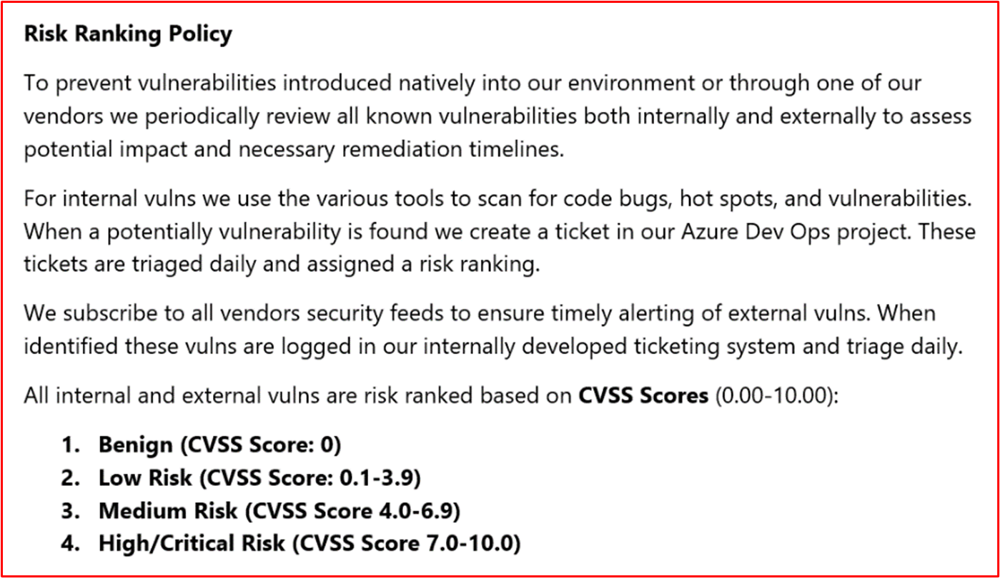
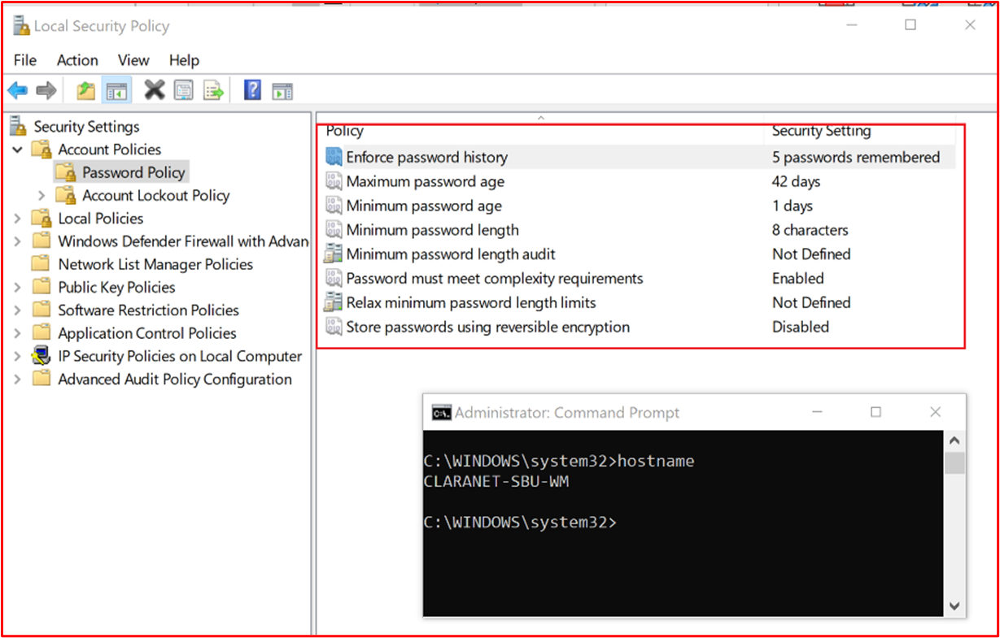
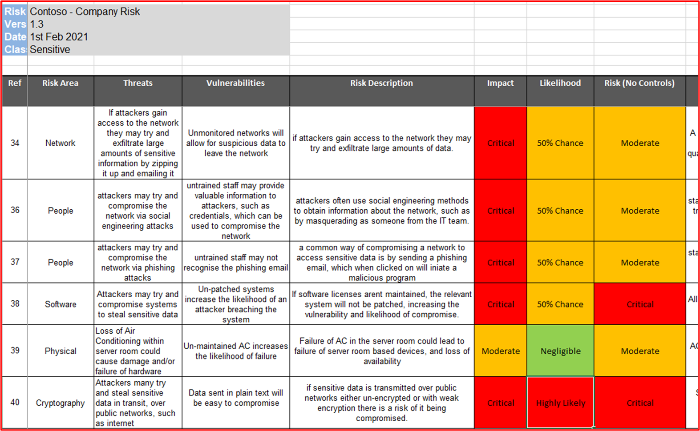
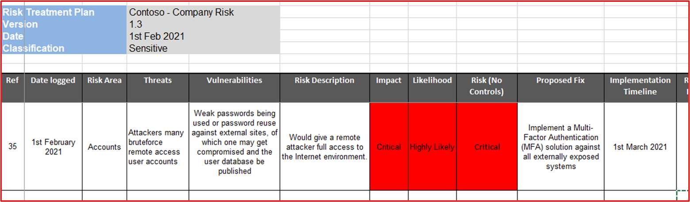
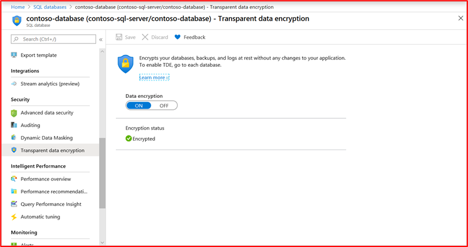
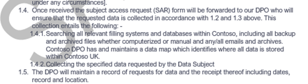
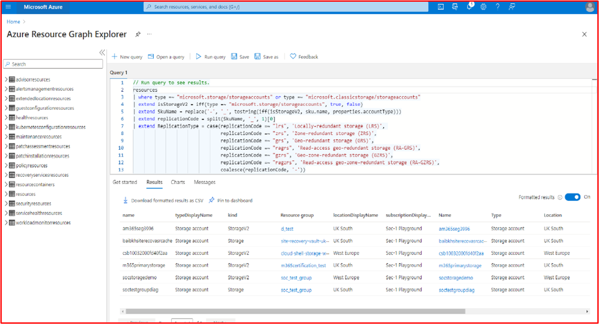

# Microsoft 365-Zertifizierung – Beispielnachweishandbuch

## Übersicht

Dieses Handbuch wurde erstellt, um ISVs Beispiele für die Art der Nachweise und den Umfang der detaillierten Anforderungen für jedes der Microsoft 365 Zertifizierungssteuerelemente bereitzustellen. Alle in diesem Dokument freigegebenen Beispiele stellen nicht den einzigen Nachweis dar, der verwendet werden kann, um zu veranschaulichen, dass Steuerelemente erfüllt werden, sondern dienen nur als Richtlinie für die Art der erforderlichen Nachweise. 

Bitte beachten Sie: Die tatsächlichen Schnittstellen, Screenshots und Dokumentationen, die zur Erfüllung der Anforderungen verwendet werden, variieren je nach Produktverwendung, Systemeinrichtung und internen Prozessen. Beachten Sie außerdem, dass der ISV bei Bedarf eine Richtlinien- oder Prozedurdokumentation benötigt, um die ACTUAL-Dokumente und keine Screenshots zu senden, wie möglicherweise in einigen der Beispiele gezeigt. 

Es gibt zwei Abschnitte in der Zertifizierung, die Übermittlungen erfordern:
1. [**Die anfängliche Dokumentübermittlung:**](../docs/initialdocumentsubguide.md) eine kleine Gruppe von Dokumenten auf hoher Ebene, die für die Bereichsdefinition Ihrer Bewertung erforderlich sind.
1. **Die Übermittlung von Nachweisen:** der vollständige Nachweissatz, der für jedes steuerelementbezogene Steuerelement für Ihre Zertifizierungsbewertung erforderlich ist. 

## Structure 

Dieses Dokument ist direkt den Steuerelementen zugeordnet, die Ihnen während der Zertifizierung im Partner Center angezeigt werden. Die in diesem Dokument bereitgestellten Anleitungen sind wie folgt detailliert:
- Sicherheitsdomäne: Die drei Sicherheitsdomänen, in die alle Steuerelemente gruppiert sind: Anwendungssicherheit, Betriebssicherheit und Datensicherheit und Datenschutz.
- Steuerelemente: = Beschreibung der Bewertungsaktivität – Diese Steuerelemente und die zugeordnete Nummer (Nein) werden direkt aus der Microsoft 365 Zertifizierungscheckliste entnommen.  
- Intent: = Die Absicht, warum die Sicherheitssteuerung in das Programm einbezogen wird, und das spezifische Risiko, das es mindern soll.  Es besteht die Möglichkeit, dass diese Informationen ISVs die Gründe für das Steuerelement liefern, um die Arten von Nachweisen, die gesammelt werden müssen, besser zu verstehen und zu verstehen, auf welche ISV achten müssen und welche Kenntnisse und Kenntnisse sie bei der Erstellung ihrer Nachweise haben müssen.
- Beispielrichtlinien für Nachweise: = Wird als Leitfaden für die Aufgaben der Beweissammlung in der Microsoft 365 Prüflistentabelle für zertifizierungen bereitgestellt, können die ISV-Mitarbeiter auf diese Weise eindeutig Beispiele für die Art der Nachweise anzeigen, die vom Zertifizierungsanalysten verwendet werden können, der es verwenden wird, um eine sichere Entscheidung zu treffen, dass ein Steuerelement vorhanden und beibehalten wird – es ist keinesfalls vollständig.
- Beispiel für Nachweise: = Dieser Abschnitt enthält Beispielfotos und Bilder potenzieller Nachweise, die für die einzelnen Steuerelemente in der Microsoft 365 Prüflistenkalkulation erfasst werden, insbesondere für die Domänen "Betriebssicherheit" und "Datensicherheit und Datenschutzsicherheit" (Registerkarten in der Tabelle). Bitte beachten Sie alle Informationen mit roten Pfeilen und Feldern in den Beispielen, um Ihr Verständnis der Anforderungen zu unterstützen, die erforderlich sind, um jedes Steuerelement zu erfüllen.

## Sicherheitsdomäne: Anwendungssicherheit

**Steuerelement 1 – Steuerelement 16**:

Die Anwendungssicherheits-Domänensteuerelemente können mit einem Penetrationstestbericht versehen werden, der innerhalb der letzten 12 Monate ausgestellt wurde und zeigt, dass Ihre App keine ausstehenden Sicherheitsrisiken aufweist. Die einzige erforderliche Übermittlung ist ein übersichtlicher Bericht eines unabhängigen Unternehmens. 

## Sicherheitsdomäne: Betriebssicherheit/sichere Entwicklung

Die Sicherheitsdomäne "Betriebssicherheit/sichere Entwicklung" soll sicherstellen, dass ISVs eine reihe von Techniken zur Sicherheitsminderung gegen bedrohungsbezogene Bedrohungen implementieren.  Dies dient zum Schutz der Betriebsumgebung und der Softwareentwicklungsprozesse zum Erstellen sicherer Umgebungen.

#### Schutz vor Schadsoftware – Virenschutz

**Steuerelement Nr. 1:** Bereitstellen von Richtliniendokumentationen, die Antivirenmethoden und -verfahren regeln.
- Absicht: Die Absicht dieses Steuerelements besteht darin, das Verständnis eines ISV über die Probleme zu bewerten, mit denen er bei der Berücksichtigung der Bedrohung durch Computerviren konfrontiert ist. Durch die Einrichtung und Verwendung bewährter Methoden der Branche bei der Entwicklung einer Antivirenrichtlinie und -prozesse stellt ein ISV eine Ressource bereit, die auf die Fähigkeit ihrer Organisation zugeschnitten ist, die Von Schadsoftware ausgesetzten Risiken zu mindern, und listet bewährte Methoden bei der Virenerkennung und -beseitigung auf und liefert Nachweise dafür, dass die dokumentierte Richtlinie empfohlene Sicherheitsleitfäden für die Organisation und ihre Mitarbeiter bereitstellt. Durch die Dokumentation einer Richtlinie und eines Verfahrens, wie der ISV Antischadsoftware-Dezencies bereitstellt, stellt dies den konsistenten Rollout und die Wartung dieser Technologie sicher, um das Risiko von Schadsoftware in der Umgebung zu verringern.

- Beispielrichtlinien für Nachweise: Stellen Sie eine Kopie Ihrer Antivirus-/Antischadsoftware-Richtlinie bereit, in der die Prozesse und Verfahren aufgeführt sind, die in Ihrer Infrastruktur implementiert sind, um bewährte Methoden für Antivirus/Schadsoftware zu fördern.
Beispielbeweis

- Beispielbeweis:

**Hinweis:** Dieser Screenshot zeigt ein Richtlinien-/Prozessdokument. IsVs erwarten, dass sie die dokumentation zur tatsächlichen unterstützenden Richtlinie/Prozedur freigeben und nicht einfach nur einen Screenshot bereitstellen.

**Steuerelement Nr. 2:** Liefern Sie nachweisbare Nachweise dafür, dass Antivirensoftware über alle beispielierten Systemkomponenten hinweg ausgeführt wird.

- Absicht: Es ist wichtig, dass In Ihrer Umgebung Virenschutzmaßnahmen (AV) (oder Antischadsoftwareschutz) ausgeführt werden, um sich vor Cybersicherheitsrisiken zu schützen, die Sie möglicherweise kennen oder nicht, da potenziell schädliche Angriffe sowohl in der Raffinesse als auch in der Anzahl zunehmen. Wenn AV für alle Systemkomponenten bereitgestellt wird, die deren Verwendung unterstützen, können Sie einige der Risiken verringern, die durch die Einführung von Antischadsoftware in die Umgebung bestehen. Es ist nur erforderlich, dass ein einzelner Endpunkt ungeschützter ist, um potenziell einen Angriffsvektor für einen Bedrohungsakteur bereitzustellen, um in der Umgebung Fuß zu fassen. AV sollte daher als eine von mehreren Schutzebenen zum Schutz vor dieser Art von Bedrohung verwendet werden.

- Beispielrichtlinien für Nachweise: Um nachzuweisen, dass eine aktive Instanz von AV in der bewerteten Umgebung ausgeführt wird. Stellen Sie einen Screenshot für _jedes Gerät_ im Beispiel bereit, das die Verwendung von Antivirensoftware unterstützt, die den laufenden Antivirenprozess zeigt, die Antivirensoftware aktiv ist oder wenn Sie über eine zentralisierte Verwaltungskonsole für Virenschutz verfügen, können Sie dies möglicherweise über diese Verwaltungskonsole veranschaulichen. Wenn Sie die Verwaltungskonsole verwenden, stellen Sie sicher, dass Sie in einem Screenshot nachweisen, dass die beispielierten Geräte verbunden sind und funktionieren.

- Nachweisbeispiel 1: Der folgende Screenshot wurde aus dem Azure Security Center erstellt. es zeigt, dass eine Antischadsoftwareerweiterung auf der VM mit dem Namen &quot;MSPGPRODAZUR01&quot; bereitgestellt wurde.

- Beweisbeispiel 2

Der nachstehende Screenshot wurde von einem Windows 10-Geräten erstellt, der zeigt, dass &quot;der Echtzeitschutz&quot; für den Hostnamen &quot;CSVNET-SBU-WM&quot; eingeschaltet ist.

**Steuerelement Nr. 3:** Liefern Sie demonstratablen Nachweis, dass Antivirensignaturen in allen Umgebungen (innerhalb von 1 Tag) auf dem neuesten Stand sind.

- Absicht: Hunderte von Tausenden neuer Schadsoftware und potenziell unerwünschter Anwendungen (PUA) werden täglich identifiziert. Um angemessenen Schutz vor neu veröffentlichter Schadsoftware zu bieten, müssen AV-Signaturen regelmäßig aktualisiert werden, um neu veröffentlichte Schadsoftware zu berücksichtigen.

- Dieses Steuerelement ist vorhanden, um sicherzustellen, dass der ISV die Sicherheit der Umgebung und die Auswirkungen berücksichtigt hat, die veraltete AV auf die Sicherheit haben kann.

- Beispielrichtlinien für Nachweise: Bereitstellen von Antivirenprotokolldateien von jedem Beispielgerät, die zeigen, dass Updates täglich angewendet werden.

- Beispielbeweis: Der folgende Screenshot zeigt, wie Microsoft Defender mindestens täglich aktualisiert wird, indem &#39;Ereignis 2000 angezeigt wird, Windows Defender&#39; das Update ist. Der Hostname wird angezeigt und zeigt an, dass dieser aus dem bereichsbezogenen System &quot;CSVNET-SBU-WM&quot; stammt.

**Hinweis:** Die bereitgestellten Nachweise müssten einen Export der Protokolle umfassen, um tägliche Updates über einen längeren Zeitraum anzuzeigen. Einige Antivirenprodukte generieren Updateprotokolldateien, sodass diese Dateien bereitgestellt oder aus der Ereignisanzeige exportiert werden sollten.

**Steuerelement Nr. 4:** Stellen Sie demonstratable Nachweise dafür bereit, dass Antivirensoftware so konfiguriert ist, dass Bei-Zugriff-Scans oder regelmäßige Überprüfungen in allen beispielierten Systemkomponenten durchgeführt werden.

**Hinweis:** Wenn die Überprüfung bei Zugriff nicht aktiviert ist, **müssen** mindestens tägliche Scans und alerting_ aktiviert _be.

- Absicht: Dieses Steuerelement soll sicherstellen, dass Schadsoftware schnell identifiziert wird, um die Auswirkungen auf die Umgebung zu minimieren. Wenn Bei-Zugriff-Scans durchgeführt werden und mit der automatischen Blockierung von Schadsoftware kombiniert werden, hilft dies, Schadsoftware-Infektionen zu stoppen, die von der Antivirensoftware bekannt sind. Wenn die Überprüfung beim Zugriff aufgrund von Risiken falsch positiver Ergebnisse, die zu Dienstausfällen führen, nicht wünschenswert&#39;, müssen geeignete tägliche (oder mehr) Überprüfungs- und Benachrichtigungsmechanismen implementiert werden, um eine zeitnahe Reaktion auf Schadsoftware-Infektionen sicherzustellen, um den Schaden zu minimieren.

- Beispielrichtlinien für Nachweise: Stellen Sie einen Screenshot für _jedes Gerät_ in dem Beispiel bereit, das Antivirensoftware unterstützt, und zeigen Sie an, dass Antivirensoftware auf dem Gerät ausgeführt wird und für die Überprüfung beim Zugriff (Echtzeitüberprüfung) konfiguriert ist, **ODER** stellen Sie einen Screenshot bereit, der zeigt, dass die regelmäßige Überprüfung für die tägliche Überprüfung aktiviert ist, die Warnung konfiguriert ist und das Datum der letzten Überprüfung für _jedes Gerät_ im Beispiel.

- Beispielbeweis: Der folgende Screenshot zeigt, dass echtzeitschutz für den Host, ALSONET-SBU-WM&quot;, &quot;aktiviert ist.

**Steuerelement Nr. 5:** Stellen Sie demonstratable Nachweise dafür bereit, dass Antivirensoftware so konfiguriert ist, dass Schadsoftware automatisch blockiert oder isoliert wird und warnungsübergreifend in allen beispielierten Systemkomponenten angezeigt wird.

- Absicht: Die Raffinesse von Schadsoftware entwickelt sich ständig weiter, zusammen mit dem unterschiedlichen Grad der Verwendung, die sie mit sich bringen können. Die Absicht dieses Steuerelements besteht darin, entweder die Ausführung von Schadsoftware zu verhindern und sie daher daran zu hindern, ihre potenziell schädliche Nutzlast auszuführen, oder wenn die automatische Blockierung keine Option ist, um die Zeit zu begrenzen, die Schadsoftware zum Schaden führen kann, indem sie die potenzielle Schadsoftware-Infektion warnt und sofort darauf reagiert.

- Beispielrichtlinien für Denknachweise: Stellen Sie einen Screenshot für _jedes Gerät_ in dem Beispiel bereit, das Antivirus unterstützt, und zeigen Sie an, dass der Virenschutz auf dem Computer ausgeführt wird und so konfiguriert ist, dass Schadsoftware automatisch blockiert wird, warnungen oder Quarantäne und Warnung aktiviert sind.

- Beispielbeweis 1: Der folgende Screenshot zeigt, dass der HOST &quot;VONNET-SBU-WM&quot; mit Echtzeitschutz für Microsoft Defender Antivirus konfiguriert ist. Wie die Einstellung besagt, wird dadurch Schadsoftware gefunden und verhindert, dass sie auf dem Gerät installiert oder ausgeführt wird.

**Steuerelement Nr. 6:** Stellen Sie demonstratable Nachweise dafür bereit, dass Anwendungen vor der Bereitstellung genehmigt werden.

- Absicht: Mit der Anwendungssteuerung genehmigt die Organisation alle Anwendungen/Prozesse, die auf dem Betriebssystem ausgeführt werden dürfen. Dieses Steuerelement soll sicherstellen, dass ein Genehmigungsprozess vorhanden ist, um zu autorisieren, welche Anwendungen/Prozesse ausgeführt werden können.

- Beispielrichtlinien für Nachweise: Es können Nachweise dafür bereitgestellt werden, dass der Genehmigungsprozess befolgt wird. Dies kann durch signierte Dokumente, die Nachverfolgung innerhalb von Änderungskontrollsystemen oder die Verwendung von etwa Azure DevOps oder JIRA zum Nachverfolgen dieser Anforderungen und Autorisierung bereitgestellt werden.

- Beispielbeweis: Der folgende Screenshot zeigt eine Genehmigung durch die Geschäftsleitung, dass jede Anwendung, die in der Umgebung ausgeführt werden darf, einem Genehmigungsprozess folgt. Dies ist ein papierbasierter Prozess bei Contoso, es können jedoch auch andere Mechanismen verwendet werden.

**Steuerelement Nr. 7:** Stellen Sie demonstratable Nachweise dafür bereit, dass eine vollständige Liste genehmigter Anwendungen mit geschäftlicher Begründung vorhanden ist und beibehalten wird.

- Absicht: Es ist wichtig, dass Organisationen eine Liste aller Anwendungen verwalten, die genehmigt wurden, zusammen mit Informationen dazu, warum die Anwendung/der Prozess genehmigt wurde. Dadurch wird sichergestellt, dass die Konfiguration aktuell bleibt und anhand eines Basisplans überprüft werden kann, um sicherzustellen, dass nicht autorisierte Anwendungen/Prozesse nicht konfiguriert sind.

- Beispielrichtlinien für Nachweise: Geben Sie die dokumentierte Liste der genehmigten Anwendungen/Prozesse zusammen mit der geschäftlichen Begründung an.

- Beispielnachweis: Im folgenden Screenshot sind die genehmigten Anwendungen mit geschäftlicher Begründung aufgeführt.

**Hinweis:** Dieser Screenshot zeigt ein Dokument. IsVs erwarten, dass sie das tatsächliche Unterstützende Dokument freigeben und nicht einfach nur einen Screenshot bereitstellen.

**Steuerelement Nr. 8:** Stellen Sie unterstützende Dokumentation bereit, in der angegeben wird, dass die Anwendungsteuerungssoftware so konfiguriert ist, dass sie bestimmten Anwendungssteuerungsmechanismen entspricht.

- Intent: The configuration of the application control technology should be documented along with a process of how to maintain the technology, d. h. add and delete applications/processes. Im Rahmen dieser Dokumentation sollte die Art des verwendeten Mechanismus für jede Anwendung/jeden Prozess detailliert beschrieben werden. Dies wird in das nächste Steuerelement eingespeist, um sicherzustellen, dass die Technologie wie dokumentiert konfiguriert ist.

- Beispielrichtlinien für Nachweise: Bereitstellen von unterstützenden Dokumentationen, in denen beschrieben wird, wie die Anwendungssteuerung eingerichtet wurde und wie die einzelnen Anwendungen/Prozesse innerhalb der Technologie konfiguriert wurden.

- Beispielnachweis: Im folgenden Screenshot ist der Steuerungsmechanismus aufgeführt, der zum Implementieren des Anwendungssteuerelements verwendet wird. Unten sehen Sie, dass eine App Zertifikatsteuerelemente und die anderen über den Dateipfad verwenden.

**Hinweis:** Dieser Screenshot zeigt ein Dokument. IsVs erwarten, dass sie das tatsächliche Unterstützende Dokument freigeben und nicht einfach nur einen Screenshot bereitstellen.

**Steuerelement Nr. 9:** Stellen Sie demonstratable Nachweise dafür bereit, dass die Anwendungssteuerung als dokumentiert von allen beispielierten Systemkomponenten konfiguriert ist.

- Absicht: Dies dient dazu, zu überprüfen, ob die Anwendungssteuerung im gesamten Beispiel gemäß der Dokumentation konfiguriert ist.

- Beispielrichtlinien für Nachweise: Stellen Sie einen Screenshot für _jedes Gerät_ im Beispiel bereit, um zu zeigen, dass Anwendungssteuerelemente konfiguriert und aktiviert sind. Dadurch sollten Computernamen, die Gruppen, zu denen sie gehören, und die Anwendungssteuerungsrichtlinien angezeigt werden, die auf diese Gruppen und Computer angewendet werden.

- Nachweisbeispiel: Der folgende Screenshot zeigt ein Gruppenrichtlinienobjekt mit aktivierten Softwareeinschränkungsrichtlinien.

Dieser nächste Screenshot zeigt die Konfiguration in Übereinstimmung mit dem obigen Steuerelement.

Dieser nächste Screenshot zeigt die M365-Umgebung und die Computer, die in dem Bereich enthalten sind, der auf dieses GPO-Objekt &#39;Domänencomputer Einstellungen&#39; angewendet wird.

Dieser letzte Screenshot zeigt den In-Scope-Server &quot;DBServer1&quot; innerhalb der ORGANISATIONSeinheit innerhalb des obigen Screenshots.

### Patchverwaltung – Risikobewertung

Die schnelle Identifizierung und Behebung von Sicherheitsrisiken trägt dazu bei, die Risiken eines Bedrohungsakteurs zu minimieren, der die Umgebung oder Anwendung gefährdet. Die Patchverwaltung ist in zwei Abschnitte unterteilt: Risikobewertung und Patching. Diese drei Steuerelemente umfassen die Identifizierung von Sicherheitsrisiken und deren Rangfolge entsprechend dem von ihnen ausgehenden Risiko.

Diese Sicherheitssteuerungsgruppe gilt für PaaS-Hostingumgebungen (Platform-as-a-Service), da die Anwendungs-/Add-In-Softwarebibliotheken und die Codebasis von Drittanbietern basierend auf der Risikobewertung gepatcht werden müssen.

**Steuerelement Nr. 10:** Bereitstellen einer Richtliniendokumentation, die bestimmt, wie neue Sicherheitsrisiken identifiziert und einer Risikobewertung zugewiesen werden.

- Absicht: Die Absicht dieses Steuerelements besteht darin, über unterstützende Dokumentationen zu verfügen, um sicherzustellen, dass Sicherheitsrisiken schnell erkannt werden, um das Zeitfenster zu verringern, das Bedrohungsteilnehmer haben, um diese Sicherheitsrisiken zu nutzen. Es muss ein robuster Mechanismus vorhanden sein, um Sicherheitsrisiken zu identifizieren, die alle von den Organisationen verwendeten Systemkomponenten abdecken. Beispielsweise Betriebssysteme (Windows Server, Ubuntu usw.), Anwendungen (Tomcat, MS Exchange, PvWinds usw.), Codeabhängigkeiten (AngularJS, jQuery usw.). Organisationen müssen nicht nur die rechtzeitige Identifizierung von Sicherheitsrisiken innerhalb des Vermögens sicherstellen, sondern auch alle Sicherheitsrisiken entsprechend bewerten, um sicherzustellen, dass die Behebung innerhalb eines geeigneten Zeitrahmens basierend auf dem Risiko durchgeführt wird, das die Sicherheitslücke darstellt.

**Hinweis** Auch wenn Sie in einer reinen Platform as a Service-Umgebung ausgeführt werden, sind Sie dennoch dafür verantwortlich, Sicherheitsrisiken innerhalb Ihrer Codebasis zu identifizieren, z. B. Bibliotheken von Drittanbietern.

- Beispielrichtlinien für Nachweise: Bereitstellen der Supportdokumentation (keine Screenshots)

- Beispielnachweis: Dieser Screenshot zeigt einen Codeausschnitt einer Risikobewertungsrichtlinie.

**Hinweis:** Dieser Screenshot zeigt ein Richtlinien-/Prozessdokument. IsVs erwarten, dass sie die tatsächliche Unterstützende Richtlinien-/Prozedurdokumentation freigeben und nicht einfach eine screenshot._

**Steuerelement Nr. 11:** Bereitstellen von Nachweisen dafür, wie neue Sicherheitsrisiken identifiziert werden.

- Absicht: Die Absicht dieses Steuerelements besteht darin, sicherzustellen, dass der Prozess befolgt wird und&#39;robust genug ist, um neue Sicherheitsrisiken in der gesamten Umgebung zu identifizieren. Dies sind möglicherweise nicht nur die Betriebssysteme. Kann Anwendungen enthalten, die in der Umgebung ausgeführt werden, sowie codeabhängigkeiten.

- Beispielrichtlinien für Nachweise: Nachweise können durch Anzeigen von Abonnements für Mailinglisten, manuelle Überprüfung von Sicherheitsquellen für neu veröffentlichte Sicherheitsrisiken (müssten mit Zeitstempeln der Aktivitäten, z. B. mit JIRA oder Azure DevOps) bereitgestellt werden, tools, die veraltete Software finden (z. B. Snyk bei der Suche nach veralteten Softwarebibliotheken oder Nessus mit authentifizierten Scans, die identifizieren  veraltete Software.

**Hinweis** Wenn Sie Nessus verwenden, müsste dies regelmäßig ausgeführt werden, um Sicherheitsrisiken schnell zu erkennen. Wir empfehlen dies mindestens wöchentlich.

- Beispielbeweis: Dieser Screenshot zeigt, dass eine E-Mail-Gruppe verwendet wird, um über Sicherheitsrisiken benachrichtigt zu werden.

**Steuerelement Nr. 12:** Stellen Sie Nachweise bereit, die belegen, dass allen Sicherheitsrisiken eine Risikorangfolge zugewiesen wurde, sobald sie identifiziert wurde.

- Absicht: Patching muss auf dem Risiko basieren, je riskanter die Sicherheitslücke, desto schneller muss es behoben werden. Die Risikobewertung identifizierter Sicherheitsrisiken ist ein integraler Bestandteil dieses Prozesses. Mit diesem Steuerelement soll sichergestellt werden, dass ein dokumentierter Risikobewertungsprozess ausgeführt wird, um sicherzustellen, dass alle identifizierten Sicherheitsrisiken entsprechend dem Risiko bewertet werden. Organisationen verwenden in der Regel die CVSS-Bewertung (Common Vulnerability Scoring System), die von Anbietern oder Sicherheitsexperten bereitgestellt wird. Wenn sich die Organisation auf CVSS stützt, wird empfohlen, dass ein Mechanismus für die erneute Rangfolge in den Prozess einbezogen wird, damit die Organisation die Rangfolge basierend auf einer internen Risikobewertung ändern kann. Manchmal ist die Sicherheitsanfälligkeit aufgrund der Art und Weise, wie die Anwendung in der Umgebung bereitgestellt wurde, möglicherweise keine Anwendung. Beispielsweise kann eine Java-Sicherheitslücke veröffentlicht werden, die sich auf eine bestimmte Bibliothek auswirkt, die nicht von der Organisation verwendet wird.

- Beispielrichtlinien für Nachweise: Stellen Sie Nachweise anhand eines Screenshots oder auf andere Weise bereit, z. B. DevOps/Jira, der zeigt, dass Sicherheitsrisiken den Risikobewertungsprozess durchlaufen und der Organisation eine geeignete Risikobewertung zugewiesen wird.

- Beispielbeweis: Dieser Screenshot zeigt die Risikobewertung innerhalb von Spalte D und die erneute Rangfolge in den Spalten F und G, wenn die Organisation eine Risikobewertung durchführt und feststellt, dass das Risiko herabgestuft werden kann. Nachweise für eine erneute Bewertung von Risikobewertungen müssten als unterstützende Nachweise bereitgestellt werden.

### Patchverwaltung – Patching

Die folgenden Steuerelemente gelten für das Patchingelement für die Patchverwaltung. Um eine sichere Betriebsumgebung zu gewährleisten, müssen Anwendungen/Add-Ons und unterstützende Systeme entsprechend gepatcht sein. Es muss ein geeigneter Zeitrahmen zwischen Identifizierung (oder Veröffentlichung) und Patching verwaltet werden, um das Zeitfenster zu verringern, in dem eine Sicherheitslücke von einem Bedrohungsakteur ausgenutzt werden kann. Die Microsoft 365-Zertifizierung sieht keine &#39;Patchfenster-&#39; vor, Zertifizierungsanalysten werden jedoch Zeiträume ablehnen, die nicht angemessen sind.

Diese Sicherheitssteuerungsgruppe gilt für PaaS-Hostingumgebungen (Platform-as-a-Service), da die Anwendungs-/Add-In-Softwarebibliotheken und die Codebasis von Drittanbietern basierend auf der Risikobewertung gepatcht werden müssen.

**Steuerelement Nr. 13:** Bereitstellen einer Richtliniendokumentation für das Patchen von systeminternen Komponenten, die einen geeigneten minimalen Patching-Zeitrahmen für kritische, hohe und mittlere Sicherheitsrisiken enthält. und Außerbetriebnahme von nicht unterstützten Betriebssystemen und Software.

- Absicht: Patchverwaltung ist für viele Security Compliance Frameworks erforderlich, z. B. PCI-DSS, ISO 27001, NIST (SP) 800-53. Die Bedeutung einer guten Patchverwaltung darf nicht übermäßig wichtig sein, da Sicherheits- und Funktionalitätsprobleme in Software, Firmware und Minderung von Sicherheitsrisiken behoben werden können, was zur Reduzierung der Möglichkeiten zur Nutzung beiträgt. Die Absicht dieses Steuerelements besteht darin, das Zeitfenster zu minimieren, das ein Bedrohungsakteur hat, um Sicherheitsrisiken auszunutzen, die möglicherweise in der in-Scope-Umgebung vorhanden sind.

- Beispielrichtlinien für Nachweise: Stellen Sie eine Kopie aller Richtlinien und Verfahren bereit, die den Prozess für die Patchverwaltung detailliert beschreiben. Dies sollte einen Abschnitt in einem minimalen Patchingfenster enthalten, und dass nicht unterstützte Betriebssysteme und Software in der Umgebung nicht verwendet werden dürfen.

- Beispielnachweis: Unten sehen Sie ein Beispiel für ein Richtliniendokument.

**Hinweis:** Dieser Screenshot zeigt ein Richtlinien-/Prozessdokument. IsVs erwarten, dass sie die tatsächliche Unterstützende Richtlinien-/Prozedurdokumentation freigeben und nicht einfach eine screenshot._

**Steuerelement Nr. 14:** Liefern Sie demonstratablen Nachweis, dass alle stichprobenierten Systemkomponenten gepatcht werden.

**Hinweis:** Schließen Sie alle Software-/Drittanbieterbibliotheken ein.

- Intent: Patching vulnerabilities ensures that the differing modules that form part of the information technology infrastructure (hardware, software, and services) are kept up to date and free from known vulnerabilities. Patching muss so schnell wie möglich durchgeführt werden, um das Risiko eines Sicherheitsvorfalls zwischen der Veröffentlichung von Sicherheitsrisikodetails und Patching zu minimieren. Dies ist noch wichtiger, wenn die Ausnutzung von Sicherheitsrisiken bekannt ist.

- Beispielrichtlinien für Nachweise: Bereitstellen eines Screenshots für _jedes Gerät_ im Beispiel und unterstützende Softwarekomponenten, die zeigen, dass Patches in Übereinstimmung mit dem dokumentierten Patchingprozess installiert sind.

- Beispielbeweis: Der folgende Screenshot zeigt, dass die In-Scope-Systemkomponente &quot;CSVNET-SBU-WM&quot; Windows Updates gemäß der Patchingrichtlinie durchführt.

**Hinweis:** Patching aller systeminternen Komponenten muss nachweisbar sein. Dies umfasst z. B. Folgendes: Betriebssystemupdates, Anwendungs-/Komponentenupdates (i.e__.,_ _Apache Tomcat, OpenSSL usw.), Softwareabhängigkeiten (z. B. JQuery, AngularJS usw.) usw._

**Steuerelement Nr. 15:** Stellen Sie demonstratable Nachweise dafür bereit, dass nicht unterstützte Betriebssysteme und Softwarekomponenten in der Umgebung nicht verwendet werden.

- Absicht: Software, die nicht von Anbietern gewartet wird, wird überstunden, unter bekannten Sicherheitsrisiken, die nicht behoben sind. Daher darf die Verwendung von nicht unterstützten Betriebssystemen und Softwarekomponenten nicht in Produktionsumgebungen verwendet werden.

- Beispielrichtlinien für Nachweise: Stellen Sie einen Screenshot für _jedes Gerät_ im Beispiel bereit, auf dem die Version des ausgeführten Betriebssystems (einschließlich des Servers&#39;Namen im Screenshot) angezeigt wird. Stellen Sie außerdem sicher, dass in der Umgebung ausgeführte Softwarekomponenten unterstützte Versionen ausführen. Dies kann durch die Bereitstellung der Ausgabe interner Berichte zu Sicherheitsrisiken (sofern authentifizierte Überprüfungen enthalten sind) und/oder durch die Ausgabe von Tools erfolgen, die Drittanbieterbibliotheken wie [Snyk](https://snyk.io/), [Trivy](https://github.com/aquasecurity/trivy) oder [NPM-Überwachung](https://docs.npmjs.com/cli/v7/commands/npm-audit) überprüfen. Wenn sie nur in PaaS ausgeführt wird, muss nur das Patchen von Drittanbieterbibliotheken von den Patching-Steuerelementgruppen abgedeckt werden.

- Beispielbeweis: Der folgende Nachweis zeigt, dass auf der bereichsbezogenen Systemkomponente (SYSTEM COMPONENT) EINE Software ausgeführt wird, die vom Anbieter unterstützt wird, da Nessus keine Probleme&#39;gekennzeichnet hat.

**Hinweis:** Der vollständige Bericht muss für die Zertifizierungsanalysten freigegeben werden.

- Beispielnachweis 2

Dieser Screenshot zeigt, dass die integrierte Systemkomponente &quot;GIFNET-SBU-WM&quot; unter einer unterstützten Windows Version ausgeführt wird.

- Beispielnachweis 3

Der folgende Screenshot zeigt die [Trivy-Ausgabe](https://github.com/aquasecurity/trivy) , in der der vollständige Bericht&#39;keine nicht unterstützten Anwendungen auflistet.

**Hinweis:** Der vollständige Bericht muss für die Zertifizierungsanalysten freigegeben werden.

### Prüfung auf Schwachstellen

Durch die Einführung regelmäßiger Sicherheitsrisikobewertungen können Organisationen Schwachstellen und Unzufälligkeiten in ihren Umgebungen erkennen, die einen Einstiegspunkt für einen böswilligen Akteur darstellen können, um die Umgebung zu kompromittieren. Die Überprüfung von Sicherheitsrisiken kann dazu beitragen, fehlende Patches oder Fehlkonfigurationen innerhalb der Umgebung zu identifizieren. Durch regelmäßige Durchführung dieser Überprüfungen kann eine Organisation geeignete Korrekturen vornehmen, um das Risiko einer Kompromittierung aufgrund von Problemen zu minimieren, die häufig von diesen Tools zur Überprüfung von Sicherheitsrisiken erfasst werden.

**Steuerelement Nr. 16:** Bereitstellen der vierteljährlichen Berichte zur Überprüfung von Infrastruktur- und Webanwendungsrisiken. Die Überprüfung muss auf den gesamten öffentlichen Speicherbedarf (IP-Adressen und URLs) und interne IP-Bereiche durchgeführt werden.

**Hinweis:** Dies **MUSS** den vollständigen Bereich der Umgebung umfassen.

- Absicht: Die Überprüfung von Sicherheitsrisiken sucht nach möglichen Schwachstellen in einem Computersystem, in Netzwerken und Webanwendungen einer Organisation, um Löcher zu identifizieren, die möglicherweise zu Sicherheitsverstößen und der Offenlegung vertraulicher Daten führen können. Die Überprüfung von Sicherheitsrisiken ist häufig durch Branchenstandards und Behördliche Vorschriften erforderlich, z. B. PCI DSS (Payment Card Industry Data Security Standard).

- Ein Bericht der Sicherheitsmetrik mit dem Titel &quot;["2020 Security Metrics Guide to PCI DSS Compliance](https://info.securitymetrics.com/pci-guide-2020)&quot; " gibt an, dass &#39;im Durchschnitt 166 Tage ab dem Zeitpunkt, an dem eine Organisation Sicherheitslücken hatte, bis ein Angreifer das System kompromittiert hat. Sobald Angreifer kompromittiert wurden, hatten sie durchschnittlich 127 Tage Lang Zugriff auf vertrauliche Daten&#39; daher ist diese Kontrolle darauf ausgelegt, potenzielle Sicherheitsschwächen innerhalb der bereichsbezogenen Umgebung zu identifizieren.

- Beispielrichtlinien für Nachweise: Stellen Sie die vollständigen Scan-Berichte für jedes Quartal&#39;Sicherheitsrisikoscans bereit, die in den letzten 12 Monaten durchgeführt wurden. In den Berichten sollten die Ziele eindeutig angegeben werden, um zu überprüfen, ob der vollständige öffentliche Speicherbedarf enthalten ist, und gegebenenfalls jedes interne Subnetz. Stellen Sie **ALLE** Scanberichte für **JEDES** Quartal bereit.

- Beispielbeweis: Beispielbeweis wäre die Bereitstellung der Scanberichte aus dem verwendeten Scantool. Jedes Quartal&#39;Überprüfungsberichte sollten zur Überprüfung bereitgestellt werden. Die Überprüfung muss die gesamten Systemkomponenten der Umgebungen umfassen. jedes interne Subnetz und jede öffentliche IP-Adresse/URL, die für die Umgebung verfügbar ist.

**Steuerelement Nr. 17:** Stellen Sie demonstratable Nachweise dafür bereit, dass die Behebung von Sicherheitsrisiken, die während der Überprüfung auf Sicherheitslücken erkannt wurden, in Übereinstimmung mit Ihrem dokumentierten Patching-Zeitrahmen gepatcht wird.

- Absicht: Wenn Sicherheitsrisiken und Fehlkonfigurationen nicht schnell erkannt, verwaltet und behoben werden, kann dies das Risiko einer Kompromittierung, die zu potenziellen Datenschutzverletzungen führt,&#39;Organisation erhöhen. Die ordnungsgemäße Identifizierung und Behebung von Problemen wird als wichtig für den Gesamtsicherheitsstatus und die Umgebung einer Organisation&#39;betrachtet, die den bewährten Methoden verschiedener Sicherheitsframeworks entspricht. Beispiel: ISO 27001 und PCI DSS.

- Beispielrichtlinien für Nachweise: Stellen Sie geeignete Artefakte (d. h. Screenshots) bereit, die zeigen, dass eine Stichprobe der entdeckten Sicherheitsrisiken durch die Überprüfung auf Sicherheitsrisiken in Übereinstimmung mit den patchenden Fenstern behoben wird, die bereits in Steuerelement 13 oben bereitgestellt wurden.

- Beispielbeweis: Der folgende Screenshot zeigt eine Nessus-Überprüfung der bereichsbezogenen Umgebung (ein einzelner Computer in diesem Beispiel mit dem Namen &quot;GIF&quot;) mit Sicherheitsrisiken am 2. August 2021.

Der folgende Screenshot zeigt, dass die Probleme 2 Tage später behoben wurden, die sich innerhalb des in der Patchingrichtlinie definierten Patchfensters befinden.

**Hinweis:** Für dieses Steuerelement müssen Zertifizierungsanalysten Berichte zu Sicherheitslückenüberprüfungen und Korrekturen für jedes Quartal der letzten zwölf Monate anzeigen.

### Firewalls

Firewalls stellen häufig eine Sicherheitsgrenze zwischen vertrauenswürdigen (internen Netzwerk), nicht vertrauenswürdigen (Internet) und halb vertrauenswürdigen (DMZ)-Umgebungen bereit. Diese sind in der Regel die erste Verteidigungslinie innerhalb einer tiefgreifenden Sicherheitsstrategie einer Organisation, die darauf ausgelegt ist, die Datenverkehrsflüsse für Ein- und Ausgangspunkte zu steuern und unerwünschten Datenverkehr zu blockieren. Diese Geräte müssen streng kontrolliert werden, um sicherzustellen, dass sie effektiv funktionieren und keine Fehlkonfigurationen ausführen, die die Umgebung gefährden könnten.

**Steuerelement Nr. 18:** Bereitstellen von Richtliniendokumentation, die Die Methoden und Verfahren für die Firewallverwaltung regelt.

- Absicht: Firewalls sind eine wichtige erste Verteidigungslinie in einer mehrstufigen Sicherheitsstrategie (umfassende Verteidigung), die Umgebungen vor weniger vertrauenswürdigen Netzwerkzonen schützt. Firewalls steuern in der Regel Datenverkehrsflüsse basierend auf IP-Adressen und Protokollen/Ports. Funktionsreichere Firewalls können auch zusätzliche &quot;Schutzmechanismen auf Anwendungsebene&quot; bereitstellen, indem anwendungsbasierter Datenverkehr überprüft wird, um schutz vor Missbrauch, Sicherheitsrisiken und Bedrohungen basierend auf den Anwendungen, auf die zugegriffen wird, zu schützen. Diese Schutzmaßnahmen sind nur so gut wie die Konfiguration der Firewall. Daher müssen starke Firewallrichtlinien und Supportverfahren vorhanden sein, um sicherzustellen, dass sie so konfiguriert sind, dass ein angemessener Schutz interner Ressourcen bereitgestellt wird. Eine Firewall mit einer Regel zum Zulassen des gesamten Datenverkehrs von EINER BELIEBIGEn Quelle an ein BELIEBIGEs Ziel fungiert beispielsweise nur als Router.

- Beispielrichtlinien für Nachweise: Bereitstellen der vollständigen Dokumentation zu Firewallrichtlinien/-verfahren. Dieses Dokument sollte alle nachstehenden Punkte und alle zusätzlichen bewährten Methoden behandeln, die für Ihre Umgebung gelten.

- Beispielbeweis: Unten sehen Sie ein Beispiel für die Art von Firewallrichtliniendokument, die wir benötigen (dies ist eine Demo, die möglicherweise nicht abgeschlossen ist).

**Steuerelement Nr. 19:** Stellen Sie nachweisbare Nachweise dafür bereit, dass alle standardmäßigen administrativen Anmeldeinformationen vor der Installation in Produktionsumgebungen geändert werden.

- Absicht: Organisationen müssen darauf achten, dass der Anbieter standardmäßige Administratoranmeldeinformationen bereitstellt, die während der Konfiguration des Geräts oder der Software konfiguriert werden. Standardanmeldeinformationen sind häufig öffentlich von den Anbietern verfügbar und können einem externen Bedrohungsakteur die Möglichkeit bieten, eine Umgebung zu kompromittieren. Bei einer einfachen Suche im Internet nach den iDrac-Standardanmeldeinformationen (Integrated Dell Remote Access Controller) wird beispielsweise _"root::..."_ als Standardbenutzername und -kennwort hervorgehoben. Dadurch erhält jemand Remotezugriff auf die Remoteserververwaltung. Mit diesem Steuerelement soll sichergestellt werden, dass Umgebungen nicht anfällig für Angriffe über Standardanmeldeinformationen des Anbieters sind, die während der Geräte-/Anwendungshärtung nicht geändert wurden.

- Beispielrichtlinien für Nachweise

- Dies kann über eine Screensharing-Sitzung nachgewiesen werden, bei der der Zertifizierungsanalyst versuchen kann, sich mit den Standardanmeldeinformationen bei den in-Scope-Geräten zu authentifizieren.

- Beispielbeweis

Der folgende Screenshot zeigt, was der Zertifizierungsanalyst anhand eines ungültigen Benutzernamens/Kennworts aus einer WatchGuard-Firewall sehen würde.

**Steuerelement Nr. 20:** Stellen Sie nachweisbare Nachweise dafür bereit, dass Firewalls an der Begrenzung der Bereichsumgebung installiert und zwischen dem Umkreisnetzwerk (auch als DMZ, demilitarisierte Zone und überprüftes Subnetz bezeichnet) und internen vertrauenswürdigen Netzwerken installiert werden.

- Absicht: Firewalls ermöglichen die Steuerung des Datenverkehrs zwischen verschiedenen Netzwerkzonen unterschiedlicher Sicherheitsebenen. Da alle Umgebungen mit dem Internet verbunden sind, müssen Firewalls an der Grenze installiert werden, d. h. zwischen dem Internet und der Bereichsumgebung. Darüber hinaus müssen Firewalls zwischen den weniger vertrauenswürdigen DMZ-Netzwerken (De-Ized Zone) und internen vertrauenswürdigen Netzwerken installiert werden. DMZs werden in der Regel verwendet, um Datenverkehr aus dem Internet zu bedienen und sind daher ein Angriffsziel. Durch die Implementierung einer DMZ und die Verwendung einer Firewall zur Steuerung von Datenverkehrsflüssen bedeutet eine Gefährdung der DMZ&#39;nicht notwendigerweise eine Gefährdung der internen vertrauenswürdigen Netzwerke und Unternehmens-/Kundendaten. Es sollte eine angemessene Protokollierung und Warnung vorhanden sein, damit Organisationen schnell eine Kompromittierung erkennen können, um die Möglichkeit für den Bedrohungsakteur zu minimieren, die internen vertrauenswürdigen Netzwerke weiter zu kompromittieren. Dieses Steuerelement soll sicherstellen, dass eine angemessene Kontrolle zwischen vertrauenswürdigen und weniger vertrauenswürdigen Netzwerken besteht.

- Beispielrichtlinien für Nachweise: Nachweise sollten anhand von Firewallkonfigurationsdateien oder Screenshots bereitgestellt werden, die zeigen, dass eine DMZ vorhanden ist. Dies sollte mit den bereitgestellten Architekturdiagrammen übereinstimmen, in denen die verschiedenen Netzwerke veranschaulicht werden, die die Umgebung unterstützen. Ein Screenshot der Netzwerkschnittstellen in der Firewall in Verbindung mit dem Netzwerkdiagramm, das bereits als Teil der anfänglichen Dokumentübermittlung bereitgestellt wurde, sollte diesen Nachweis liefern.

- Beispielbeweis: Unten sehen Sie einen Screenshot einer WatchGuard-Firewall, die zwei DMZ demonstriert, eine für die eingehenden Dienste (mit dem Namen DMZ), die andere für das Jumpbox-Steuerelement (Verbundian Host).

**Steuerelement Nr. 21:** Stellen Sie nachweisbare Nachweise dafür bereit, dass der gesamte öffentliche Zugriff in der demilitarisierten Zone (DMZ) beendet wird.

- Absicht: Öffentlich zugängliche Ressourcen sind für eine Vielzahl von Angriffen offen. Wie bereits oben erwähnt, besteht die Absicht einer DMZ darin, weniger vertrauenswürdige Netzwerke aus vertrauenswürdigen internen Netzwerken zu segmenten, die vertrauliche Daten enthalten können. Eine DMZ gilt als weniger vertrauenswürdig, da ein großes Risiko besteht, dass Hosts, auf die öffentlich zugegriffen werden kann, von externen Bedrohungsbeteiligten kompromittiert werden. Der öffentliche Zugriff sollte immer in diesen weniger vertrauenswürdigen Netzwerken beendet werden, die durch die Firewall angemessen segmentiert sind, um interne Ressourcen und Daten zu schützen. Mit dieser Steuerung soll sichergestellt werden, dass der gesamte öffentliche Zugriff innerhalb dieser weniger vertrauenswürdigen DMZs beendet wird, als ob Ressourcen in den vertrauenswürdigen internen Netzwerken öffentlich zugänglich wären. Eine Gefährdung dieser Ressourcen stellt einen Bedrohungsakteur in das Netzwerk bereit, in dem vertrauliche Daten gespeichert werden.

- Beispielrichtlinien für Nachweise

- Nachweise hierfür können Firewallkonfigurationen sein, in denen die eingehenden Regeln angezeigt werden und wo diese Regeln enden, entweder durch weiterleiten von öffentlichen IP-Adressen an die Ressourcen oder durch Bereitstellen der NAT (Network Address Translation) des eingehenden Datenverkehrs.

- Beispielbeweis

Im folgenden Screenshot sind drei eingehende Regeln aufgeführt, von denen jede die NAT für die Subnetze 10.0.3.x und 10.0.4.x anzeigt, bei denen es sich um die DMZ-Subnetze handelt.

**Steuerelement Nr. 22:** Stellen Sie nachweisbare Nachweise dafür bereit, dass der gesamte über die Firewall zulässige Datenverkehr einen Genehmigungsprozess durchläuft.

- Absicht: Da Firewalls eine sperrbare Barriere zwischen nicht vertrauenswürdigem Datenverkehr und internen Ressourcen und zwischen Netzwerken unterschiedlicher Vertrauensebenen sind, müssen Firewalls sicher konfiguriert werden und sicherstellen, dass nur Datenverkehr aktiviert wird, der für Geschäftsvorgänge erforderlich ist. Durch das Zulassen eines unnötigen Datenverkehrsflusses oder eines Datenverkehrsflusses, der übermäßig eingeschränkt ist, kann dies zu Schwachstellen innerhalb der Verteidigung an der Grenze dieser verschiedenen Netzwerkzonen führen. Durch die Einrichtung eines stabilen Genehmigungsprozesses für alle Firewalländerungen wird das Risiko der Einführung einer Regel reduziert, die ein erhebliches Risiko für die Umgebung mit sich bringt. Verizon&#39;[2020 Data Breach Investigation Report](https://enterprise.verizon.com/en-gb/resources/reports/dbir/) hebt hervor, dass &quot;Fehler&#39;,&quot; die Fehlkonfigurationen enthalten, der einzige Aktionstyp ist, der von Jahr zu Jahr ständig zunimmt.

- Beispielrichtlinien für Nachweise: Nachweise können in Form einer Dokumentation vorliegen, in der eine Firewalländerungsanforderung autorisiert wird, die minutenweise von einer CAB-Besprechung (Change Advisor Board) oder von einem Änderungskontrollsystem nach allen Änderungen stammen kann.

- Beispielnachweis: Der folgende Screenshot zeigt eine Firewallregeländerung, die mit einem papierbasierten Prozess angefordert und autorisiert wird. Dies kann beispielsweise durch DevOps oder Jira erreicht werden.

**Steuerelement Nr. 23:** Stellen Sie nachweisbare Nachweise dafür bereit, dass die Firewallregelbasis so konfiguriert ist, dass Datenverkehr nicht explizit definiert wird.

- Absicht: Die meisten Firewalls verarbeiten die Regeln in einem Top-Down-Ansatz, um eine übereinstimmende Regel zu finden. Wenn eine Regel übereinstimmt, wird die Aktion dieser Regel angewendet, und die weitere Verarbeitung der Regeln wird beendet. Wenn keine Übereinstimmungsregeln gefunden werden, wird der Datenverkehr standardmäßig verweigert. Wenn die&#39;Firewall nicht standardmäßig Datenverkehr abgibt, wenn keine übereinstimmende Regel gefunden wird, muss die Regelbasis eine "Alle verweigern&quot;"-Regel am **Ende aller** Firewalllisten enthalten&quot;. Dadurch wird sichergestellt, dass die Firewall bei der Verarbeitung der Regeln nicht standardmäßig in einen Standardzustand "Zulassen"&#39;, sodass Datenverkehr zugelassen wird, der nicht explizit definiert&#39;wurde.

- Beispielrichtlinien für Nachweise: Nachweise können über die Firewallkonfiguration bereitgestellt werden, oder durch Screenshots mit allen Firewallregeln, die eine Regel "Alle&quot; verweigern" am Ende anzeigen&quot;, oder wenn die Firewall Datenverkehr abbricht, der&#39;nicht standardmäßig mit einer Regel übereinstimmt, geben Sie dann einen Screenshot aller Firewallregeln und einen Link zu administrativen Handbüchern des Anbieters ein, in dem hervorgehoben wird, dass die Firewall standardmäßig den gesamten Datenverkehr löscht, der nicht übereinstimmt.

- Beispielnachweis: Unten sehen Sie einen Screenshot der WatchGuard-Firewallregelbasis, der zeigt, dass keine Regeln konfiguriert sind, um den gesamten Datenverkehr zuzulassen. Am Ende gibt es keine Verweigerungsregel, da der WatchGuard Datenverkehr abgibt,&#39;standardmäßig nicht übereinstimmen.

Der folgende WatchGuard-Hilfecenter-Link; [https://www.watchguard.com/help/docs/help-center/en-US/Content/en-US/Fireware/policies/policies\_about\_c.html](https://www.watchguard.com/help/docs/help-center/en-US/Content/en-US/Fireware/policies/policies_about_c.html) enthält die folgenden Informationen:

**Steuerelement Nr. 24:** Liefern Sie nachweisbare Nachweise dafür, dass die Firewall nur starke Kryptografie auf allen administrativen Schnittstellen unterstützt, die keine Konsole sind.

- Absicht: Um Man-in-the-Middle-Angriffe des administrativen Datenverkehrs zu verringern, sollten alle administrativen Schnittstellen, die keine Konsole sind, nur starke Kryptografie unterstützen. Der Hauptabsicht dieses Steuerelements besteht darin, die administrativen Anmeldeinformationen zu schützen, während die Nicht-Konsolenverbindung eingerichtet wird. Darüber hinaus kann dies auch zum Schutz vor Lauschangriffen auf die Verbindung beitragen und versuchen, administrative Funktionen zum Neukonfigurieren des Geräts oder als Teil der Reconnaissance wiederzugeben.

- Beispielrichtlinien für Nachweise: Bereitstellen der Firewallkonfiguration, wenn die Konfiguration die kryptografische Konfiguration der administrativen Schnittstellen bereitstellt, die keine Konsole sind (nicht alle Geräte enthalten dies als konfigurierbare Optionen). Wenn dies nicht innerhalb der Konfiguration&#39;, können Sie möglicherweise Befehle für das Gerät ausgeben, um anzuzeigen, was für diese Verbindungen konfiguriert ist. Einige Anbieter veröffentlichen diese Informationen möglicherweise in Artikeln, sodass dies auch eine Möglichkeit zum Nachweis dieser Informationen sein kann. Schließlich müssen Sie möglicherweise Tools ausführen, um die unterstützte Verschlüsselung auszugeben.

- Beispielnachweis: Der folgende Screenshot zeigt die Ausgabe von [SSLScan](https://github.com/rbsec/sslscan) für die Web-Admin-Schnittstelle der WatchGuard-Firewall am TCP-Port 8080. Dies zeigt TLS 1.2 oder höher mit einer Verschlüsselungschiffre von AES-128bit an.

**Hinweis**: Die WatchGuard-Firewalls unterstützen auch Verwaltungsfunktionen mithilfe von SSH (TCP Port 4118) und WatchGuard System Manager (TCP Ports 4105 &amp; 4117). Es müssten auch Nachweise für diese Nicht-Konsolen-Verwaltungsschnittstellen bereitgestellt werden.

**Steuerelement Nr. 25:** Stellen Sie demonstratable Nachweise dafür bereit, dass Sie firewallregelüberprüfungen mindestens alle 6 Monate durchführen.

- Absicht: Im Laufe der Zeit besteht das Risiko, dass die Konfiguration in Systemkomponenten mit der in-Scope-Umgebung erfolgt. Dies kann häufig Zufälligkeiten oder Fehlkonfigurationen verursachen, die das Risiko einer Gefährdung der Umgebung erhöhen können. Die Konfiguration kann aus zahlreichen Gründen eingeführt werden, z. B. temporäre Änderungen bei der Problembehandlung, temporäre Änderungen bei Ad-hoc-Funktionalen Änderungen, um schnelle Korrekturen für Probleme einzuführen, die manchmal aufgrund des Drucks einer schnellen Korrektur übermäßig eingeschränkt sein können. Als Beispiel können Sie eine temporäre Firewallregel &quot;einführen, die allen&quot; ermöglicht, ein dringendes Problem zu bewältigen. Die Absicht dieses Steuerelements besteht in zweiFachen: erstens, um zu ermitteln, wo fehlkonfigurierte Konfigurationen vorliegen, was zu Unzufälligkeiten führen kann, und zweitens, um Firewallregeln zu identifizieren, die nicht mehr benötigt werden und daher entfernt werden können, d. h., wenn ein Dienst eingestellt wurde, die Firewallregel jedoch zurückgelassen wurde.

- Beispielrichtlinien für Nachweise: Nachweise müssen nachweisen können, dass die Überprüfungsbesprechungen stattgefunden haben. Dies kann erfolgen, indem Besprechungsminuten der Firewallüberprüfung und alle zusätzlichen Änderungskontrollnachweise freigegeben werden, die alle aktionen aus der Überprüfung anzeigen. Stellen Sie sicher, dass die Daten vorhanden sind, da wir&#39;mindestens zwei dieser Besprechungen (d. h. alle sechs Monate) anzeigen müssen.

- Beispielbeweis: Der folgende Screenshot zeigt den Nachweis einer Firewallüberprüfung, die im Januar 2021 stattfindet.

Der folgende Screenshot zeigt Denknachweis für eine Firewallüberprüfung, die im Juli 2021 stattfindet.

### Firewalls – WAFs

Es ist optional, eine Webanwendungsfirewall (Web Application Firewall, WAF) in der Lösung bereitzustellen. Wenn ein WAF verwendet wird, zählt dies als zusätzliches Guthaben für die Bewertungsmatrix innerhalb der &#39;Operational Security&#39; Sicherheitsdomäne. WAFs können Webdatenverkehr überprüfen, um Webdatenverkehr zwischen dem Internet und veröffentlichten Webanwendungen zu filtern und zu überwachen, um webanwendungsspezifische Angriffe zu identifizieren. Webanwendungen können von vielen Angriffen betroffen sein, die spezifisch für Webanwendungen sind, z. B. SQL Injection (SQLi), Cross Site Scripting (XSS), Cross Site Request Forgery (CSRF/XSRF) usw. und WAFs sind so konzipiert, dass sie vor diesen Arten von schädlichen Nutzlasten geschützt sind, um Webanwendungen vor Angriffen und potenziellen Kompromittierungen zu schützen.

**Steuerelement Nr. 26:** Stellen Sie demonstratable Nachweise dafür bereit, dass die Webanwendungsfirewall (Web Application Firewall, WAF) so konfiguriert ist, dass schädlicher Datenverkehr aktiv überwacht, benachrichtigt und blockiert wird.

- Absicht: Dieses Steuerelement ist vorhanden, um zu bestätigen, dass die WAF für alle eingehenden Webverbindungen vorhanden ist und dass es so konfiguriert ist, dass es entweder blockiert oder vor böswilligem Datenverkehr benachrichtigt wird. Um eine zusätzliche Schutzebene für Webdatenverkehr bereitzustellen, müssen WAFs für alle eingehenden Webverbindungen konfiguriert werden. Andernfalls könnten externe Bedrohungsteilnehmer die WAFs umgehen, die für diese zusätzliche Schutzebene entwickelt wurden. Wenn die WAF&#39;nicht so konfiguriert ist, dass bösartiger Datenverkehr aktiv blockiert wird, muss die WAF in der Lage sein, mitarbeitern, die schnell auf den potenziellen schädlichen Datenverkehr reagieren können, eine sofortige Warnung bereitzustellen, um die Sicherheit der Umgebung zu gewährleisten und die Angriffe zu stoppen.

- Beispielrichtlinien für Nachweise: Stellen Sie eine Konfigurationsausgabe aus dem WAF bereit, die die eingehenden Webverbindungen hervorhebt, die bereitgestellt werden, und dass die Konfiguration aktiv schädlichen Datenverkehr blockiert oder überwacht und benachrichtigt. Alternativ können Screenshots der spezifischen Einstellungen freigegeben werden, um zu veranschaulichen, dass eine Organisation dieses Steuerelement erfüllt.

- Beispielnachweis: Die folgenden Screenshots zeigen, dass die CONTOSO Production Azure Application Gateway WAF-Richtlinie aktiviert ist und für &#39;Prevention&#39;-Modus konfiguriert ist, der aktiv schädlichen Datenverkehr löscht.

Der folgende Screenshot zeigt die Front-End-IP-Konfiguration.

**Hinweis:** Nachweise sollten alle öffentlichen IPs demonstrieren, die von der Umgebung verwendet werden, um sicherzustellen, dass alle Eingangspunkte behandelt werden, weshalb dieser Screenshot ebenfalls enthalten ist.

Der folgende Screenshot zeigt die eingehenden Webverbindungen, die diese WAF verwenden.

Der folgende Screenshot zeigt die ContosoAppGWCoreRules,die\_\_ zeigt, dass dies für den api.contoso.com Dienst ist.

**Steuerelement Nr. 27:** Liefern Sie nachweisbare Nachweise dafür, dass die WAF ssl-Offloading unterstützt.

- Absicht: Die Konfiguration der WAF zur Unterstützung von SSL-Offloading ist wichtig, da die WAF andernfalls https-Datenverkehr nicht überprüfen kann. Da diese Umgebungen HTTPS-Datenverkehr unterstützen müssen, ist dies eine wichtige Funktion für waf, um sicherzustellen, dass schädliche Nutzlasten innerhalb von HTTPS-Datenverkehr identifiziert und beendet werden können.

- Beispielrichtlinien für Nachweise: Bereitstellen von Konfigurationsnachweisen über einen Konfigurationsexport oder Screenshots, der zeigt, dass ssl-Offloading unterstützt und konfiguriert wird.

- Beispielnachweis: Die Konfiguration eines SSL-Listener-fähigen SSL-Offloadings innerhalb des Azure-Anwendungsgateways finden Sie auf der Microsoft-Dokumentationsseite ["Übersicht über die TLS-Beendigung und das Ende von TLS mit Anwendungsgateway](https://docs.microsoft.com/azure/application-gateway/ssl-overview) ". Der folgende Screenshot zeigt dies für das Azure-Anwendungsgateway "Contoso Production" konfiguriert.

**Steuerelement Nr. 28:** 'Stellen Sie demonstratable Nachweise dafür bereit, dass waf gegen einige oder alle der folgenden Klassen von Sicherheitsrisiken gemäß dem OWASP Core Rule Set (3.0 oder 3.1) geschützt ist:
- Protokoll- und Codierungsprobleme,
- Headereinfügung, Anforderungsentsprechung und Antwortteilung,
- Datei- und Pfaddurchlaufangriffe,
- RFI-Angriffe (Remote File Inclusion),
- Remotecodeausführungsangriffe,
- PHP-Einschleusungsangriffe,
- Websiteübergreifende Skriptingangriffe,
- SQL-Injection-Angriffe,
- Session Fixation-Angriffe.

- Absicht: WAFs müssen konfiguriert werden, um Angriffsnutzlasten für allgemeine Klassen von Sicherheitsrisiken zu identifizieren. Mit diesem Steuerelement soll sichergestellt werden, dass die angemessene Erkennung von Sicherheitsrisikoklassen durch den OWASP Core Rule Set abgedeckt wird.

- Beispielrichtlinien für Nachweise: Bereitstellen von Konfigurationsnachweisen über einen Konfigurationsexport oder Screenshots zeigen, dass die meisten oben identifizierten Sicherheitsrisikoklassen von der Überprüfung abgedeckt werden.

- Beispielnachweis: Der folgende Screenshot zeigt, dass die WAF-Richtlinie für das Azure-Anwendungsgateway für die Contoso-Produktion so konfiguriert ist, dass sie mit dem OWASP Core Rule Set Version 3.2 überprüft wird.

### Änderungssteuerung

Ein festgelegter und verstandener Change Control-Prozess ist wichtig, um sicherzustellen, dass alle Änderungen einen strukturierten Prozess durchlaufen, der wiederholbar ist. Indem sie sicherstellen, dass alle Änderungen einen strukturierten Prozess durchlaufen, können Organisationen sicherstellen, dass Änderungen effektiv verwaltet, von Peers überprüft und angemessen getestet werden, bevor sie abgemeldet werden. Dies trägt nicht nur dazu bei, das Risiko von Systemausfällen zu minimieren, sondern auch das Risiko potenzieller Sicherheitsvorfälle durch fehlerhafte Änderungen zu minimieren.

**Steuerelement Nr. 29:** Bereitstellen von Richtliniendokumentation, die Änderungskontrollprozesse steuert.

- Absicht: Um eine sichere Umgebung und sichere Anwendung aufrechtzuerhalten, muss ein robuster Änderungskontrollprozess eingerichtet werden, um sicherzustellen, dass alle Infrastruktur- und Codeänderungen mit starker Überwachung und definierten Prozessen durchgeführt werden. Dadurch wird sichergestellt, dass Änderungen dokumentiert werden, Sicherheitsauswirkungen berücksichtigt werden, überlegungen wurden, welche Auswirkungen die Änderung auf die Sicherheit haben wird usw. Die Absicht besteht darin, sicherzustellen, dass der Änderungskontrollprozess dokumentiert ist, um sicherzustellen, dass ein sicherer und konsistenter Ansatz für alle Änderungen innerhalb der Umgebung und der Anwendungsentwicklungspraktiken angewendet wird.

- Beispielrichtlinien für Nachweise: Die dokumentierten Richtlinien/Verfahren zur Änderungssteuerung sollten mit den Zertifizierungsanalysten geteilt werden.

- Beispielbeweis: Unten sehen Sie den Beginn einer Beispielrichtlinie für die Änderungsverwaltung. Geben Sie ihre vollständigen Richtlinien und Verfahren im Rahmen der Bewertung an.

**Hinweis:** Dieser Screenshot zeigt ein Richtlinien-/Prozessdokument. IsVs erwarten, dass sie die dokumentation zur tatsächlichen unterstützenden Richtlinie/Prozedur freigeben und nicht einfach nur einen Screenshot bereitstellen.

**Steuerelement Nr. 30:** Stellen Sie demonstratable Nachweise dafür bereit, dass Entwicklungs- und Testumgebungen eine Aufgabentrennung von der Produktionsumgebung erzwingen.

- Absicht: Die meisten Entwicklungs-/Testumgebungen der meisten Organisation&#39;sind nicht auf die gleiche Weise konfiguriert wie die Produktionsumgebungen und daher weniger sicher. Darüber hinaus sollten Tests nicht innerhalb der Produktionsumgebung durchgeführt werden, da dies zu Sicherheitsproblemen führen oder sich negativ auf die Servicebereitstellung für Kunden auswirken kann. Durch die Beibehaltung separater Umgebungen, die eine Aufgabentrennung erzwingen, können Organisationen sicherstellen, dass Änderungen auf die richtigen Umgebungen angewendet werden, wodurch das Risiko von Fehlern reduziert wird, indem Änderungen an Produktionsumgebungen implementiert werden, wenn sie für die Entwicklungs-/Testumgebung vorgesehen waren.

- Beispielrichtlinien für Nachweise: Es können Screenshots bereitgestellt werden, die verschiedene Umgebungen veranschaulichen, die für Entwicklungs-/Testumgebungen und Produktionsumgebungen verwendet werden. In der Regel verfügen Sie über unterschiedliche Personen/Teams mit Zugriff auf jede Umgebung, oder wenn dies nicht möglich ist, verwenden die Umgebungen unterschiedliche Autorisierungsdienste, um sicherzustellen, dass sich Benutzer nicht versehentlich in der falschen Umgebung anmelden können, um Änderungen anzuwenden.

- Beispielnachweis: Der folgende Screenshot zeigt ein Azure-Abonnement für die TEST-Umgebung von Contoso&#39;.

Dieser nächste Screenshot zeigt ein separates Azure-Abonnement für die &#39;PRODUCTION&#39;-Umgebung von Contoso&#39;.

**Steuerelement Nr. 31:** Stellen Sie demonstratable Nachweise dafür bereit, dass vertrauliche Produktionsdaten in entwicklungs- oder testumgebungen nicht verwendet werden.

- Absicht: Wie bereits oben erwähnt, implementieren Organisationen keine Sicherheitsmaßnahmen einer Entwicklungs-/Testumgebung in derselben Umgebung wie die Produktionsumgebung. Daher erhöhen Sie durch die Verwendung vertraulicher Produktionsdaten in diesen Entwicklungs-/Testumgebungen das Risiko einer Kompromittierung und müssen die Verwendung von live/vertraulichen Daten in diesen Entwicklungs-/Testumgebungen vermeiden.

**Hinweis:** Sie können Livedaten in Entwicklungs-/Testumgebungen verwenden, sofern die Entwicklung/der Test in den Umfang der Bewertung einbezogen wird, damit die Sicherheit anhand der Microsoft 365 Zertifizierungssteuerelemente bewertet werden kann.

- Beispielrichtlinien für Nachweise: Nachweise können bereitgestellt werden, indem Screenshots der Ausgabe derselben SQL Abfrage für eine Produktionsdatenbank (Bearbeiten vertraulicher Informationen) und die Entwicklungs-/Testdatenbank freigegeben werden. Die Ausgabe derselben Befehle sollte unterschiedliche Datensätze erzeugen. Wo Dateien gespeichert werden, sollten beim Anzeigen der Inhalte der Ordner in beiden Umgebungen auch unterschiedliche Datensätze veranschaulicht werden.

- Beispielbeweis: Der folgende Screenshot zeigt die obersten 3 Datensätze (für die Übermittlung von Nachweisen geben Sie die top 20) aus der Produktionsdatenbank an.

Der nächste Screenshot zeigt dieselbe Abfrage aus der Entwicklungsdatenbank mit unterschiedlichen Datensätzen.

Dies zeigt, dass die Datensätze unterschiedlich sind.

**Steuerelement Nr. 32:** Stellen Sie demonstratable Nachweise dafür bereit, dass dokumentierte Änderungsanforderungen Auswirkungen der Änderung, Details zu Back-Out-Verfahren und durchzuführende Tests enthalten.

- Absicht: Die Absicht dieses Steuerelements besteht darin, sicherzustellen, dass die angeforderte Änderung berücksichtigt wurde. Die Auswirkungen der Änderung auf die Sicherheit des Systems/der Umgebung müssen berücksichtigt und klar dokumentiert werden. Alle Back-Out-Verfahren müssen dokumentiert werden, um die Wiederherstellung zu unterstützen, falls ein Fehler auftritt, und schließlich müssen Details zu Tests, die erforderlich sind, um zu überprüfen, ob die Änderung erfolgreich war, ebenfalls berücksichtigt und dokumentiert werden.

- Beispielrichtlinien für Nachweise: Nachweise können durch Exportieren eines Beispiels von Änderungsanforderungen, Bereitstellen von Papieränderungsanforderungen oder Bereitstellen von Screenshots der Änderungsanforderungen bereitgestellt werden, die diese drei Details in der Änderungsanforderung enthalten.

- Beispielbeweis: Die folgende Abbildung zeigt eine neue Siteübergreifende Skripterstellungs-Sicherheitslücke (Cross Site Scripting Vulnerability, XSS), die zugewiesen wird, und ein Dokument für änderungsanforderung.

Die folgenden Tickets zeigen die Informationen, die für die Reise zur Lösung des Tickets festgelegt oder dem Ticket hinzugefügt wurden.

 

Die beiden folgenden Tickets zeigen die Auswirkungen der Änderung am System und alle Backout-Verfahren, die im Falle eines Problems erforderlich sein können. Sie können sehen, wie sich Änderungen auswirken, und Back-Out-Verfahren haben einen Genehmigungsprozess durchlaufen und wurden zu Testzwecken genehmigt.

Auf der linken Seite des Bildschirms können Sie sehen, dass das Testen der Änderungen genehmigt wurde. Auf der rechten Seite sehen Sie, dass die Änderungen jetzt genehmigt und getestet wurden.

Beachten Sie während des gesamten Prozesses, dass es sich bei der Person, die den Auftrag ausführt, um die Person, die die Arbeit ausführt, um unterschiedliche Personen handelt.

Das obige Ticket zeigt, dass die Änderungen jetzt für die Implementierung in die Produktionsumgebung genehmigt wurden. Das rechte Feld zeigt, dass der Test erfolgreich war und erfolgreich war und dass die Änderungen nun in Prod Environment implementiert wurden.

**Steuerelement Nr. 33:** Stellen Sie demonstratable Nachweise dafür bereit, dass Änderungsanforderungen einem Autorisierungs- und Abmeldungsprozess unterzogen werden.

- Intent: Process must be implemented which forbids changes to be carried out without proper authorization and sign off. Die Änderung muss autorisiert werden, bevor sie implementiert wird, und die Änderung muss nach Abschluss abgemeldet werden. Dadurch wird sichergestellt, dass die Änderungsanforderungen ordnungsgemäß überprüft wurden und eine Person mit Autorität die Änderung abgemeldet hat.

- Beispielrichtlinien für Nachweise: Nachweise können durch Exportieren eines Beispiels von Änderungsanforderungen, Bereitstellen von Papieränderungsanforderungen oder Bereitstellen von Screenshots der Änderungsanforderungen, die zeigen, dass die Änderung autorisiert wurde, vor der Implementierung bereitgestellt werden und dass die Änderung nach Abschluss abgemeldet wurde.

- Beispielbeweis: Der folgende Screenshot zeigt ein Beispiel für ein Jira-Ticket, das zeigt, dass die Änderung autorisiert werden muss, bevor sie von einer anderen Person als dem Entwickler/Antragsteller implementiert und genehmigt wird. Sie können sehen, dass die Änderungen hier von einer person mit Autorität genehmigt wurden. Rechts wurde nach Abschluss des Vorgangs von dp signiert.

Im ticket unten sehen Sie, dass die Änderung nach Abschluss abgemeldet wurde und den abgeschlossenen und geschlossenen Auftrag anzeigt.

### Sichere Softwareentwicklung/Bereitstellung

Organisationen, die an Softwareentwicklungsaktivitäten beteiligt sind, müssen häufig mit konkurrierten Prioritäten zwischen Sicherheits- und TTM-Druck (Time to Market) konfrontiert sein. Die Implementierung sicherheitsrelevanter Aktivitäten während des gesamten Softwareentwicklungslebenszyklus (SDLC) kann jedoch nicht nur Geld sparen, sondern auch Zeit sparen. Wenn die Sicherheit als Nachwirkung übrig bleibt, werden Probleme in der Regel nur während der Testphase des (CSVC) identifiziert, was häufig zeitaufwändiger und kostspieliger für die Behebung sein kann. In diesem Sicherheitsabschnitt soll sichergestellt werden, dass sichere Softwareentwicklungsmethoden befolgt werden, um das Risiko zu verringern, dass Codierungsfehler in die software, die entwickelt wird, eingeführt werden. Darüber hinaus werden in diesem Abschnitt einige Steuerelemente behandelt, um die sichere Bereitstellung von Software zu unterstützen.

**Steuerelement Nr. 34:** Bereitstellen von Richtlinien und Verfahren, die sichere Softwareentwicklung und -bereitstellung unterstützen, einschließlich Bewährter Methoden für sicheres Codieren für allgemeine Sicherheitsrisikoklassen wie OWASP Top 10 oder SANS Top 25 CWE.

- Absicht: Organisationen müssen alles in ihrer Macht Stehende tun, um sicherzustellen, dass Software sicher entwickelt und frei von Sicherheitsrisiken ist. Um dies zu erreichen, sollten ein robuster sicherer Softwareentwicklungslebenszyklus (SDLC) und bewährte Methoden für sicheres Codieren eingerichtet werden, um sichere Codierungstechniken und sichere Entwicklung während des gesamten Softwareentwicklungsprozesses zu fördern. Die Absicht besteht darin, die Anzahl und den Schweregrad von Sicherheitsrisiken in der Software zu verringern.

- Beispielrichtlinien für Nachweise: Stellen Sie die dokumentierte SDLC- und/oder Supportdokumentation bereit, die zeigt, dass ein sicherer Entwicklungslebenszyklus verwendet wird und dass allen Entwicklern Anleitungen bereitgestellt werden, um bewährte Methoden für sicheres Codieren zu fördern. Werfen Sie einen Blick auf [OWASP in SDLC](https://owasp.org/www-project-integration-standards/writeups/owasp_in_sdlc/) und das [OWASP Software Assurance Maturity Model](https://owaspsamm.org/model/) (SAMM).

- Beispielnachweis: Nachfolgend sehen Sie einen Auszug aus dem Verfahren für die Entwicklung sicherer Software von Contoso&#39;, das sichere Entwicklungs- und Codierungspraktiken veranschaulicht.

**Hinweis:** Diese Screenshots zeigen das Dokument zur sicheren Softwareentwicklung. IsVs erwarten, dass sie die tatsächliche unterstützende Dokumentation freigeben und nicht einfach nur einen Screenshot bereitstellen.

**Steuerelement Nr. 35:** Stellen Sie demonstratable Nachweise dafür bereit, dass Codeänderungen einem Überprüfungs- und Autorisierungsprozess durch einen zweiten Prüfer unterzogen werden.

- Absicht: Mit diesem Steuerelement ist es beabsichtigt, eine Codeüberprüfung durch einen anderen Entwickler durchzuführen, um Codierungsfehler zu erkennen, die eine Sicherheitslücke in der Software darstellen könnten. Die Autorisierung sollte eingerichtet werden, um sicherzustellen, dass Codeüberprüfungen durchgeführt werden, Tests durchgeführt werden usw. vor der Bereitstellung. Der Autorisierungsschritt kann überprüfen, ob die richtigen Prozesse befolgt wurden, was dem oben definierten SDLC zugrunde liegt.

- Beispielrichtlinien für Nachweise: Stellen Sie nachweise dafür bereit, dass Code einer Peer-Review unterzogen wird und autorisiert werden muss, bevor er auf die Produktionsumgebung angewendet werden kann. Dieser Nachweis kann über einen Export von Änderungstickets erfolgen, der zeigt, dass Codeüberprüfungen durchgeführt wurden und die Änderungen autorisiert wurden, oder durch Codeüberprüfungssoftware wie Crucible ([https://www.atlassian.com/software/crucible](https://www.atlassian.com/software/crucible)).

- Beispielbeweis

Unten sehen Sie ein Ticket, das zeigt, dass Codeänderungen einem Überprüfungs- und Autorisierungsprozess durch eine andere Person als den ursprünglichen Entwickler unterzogen werden. Es zeigt, dass eine Codeüberprüfung vom Zugewiesenen angefordert wurde und einer anderen Person für die Codeüberprüfung zugewiesen wird.

Die folgende Abbildung zeigt, dass die Codeüberprüfung einer anderen Person als dem ursprünglichen Entwickler zugewiesen wurde, wie im hervorgehobenen Abschnitt auf der rechten Seite des bilds unten dargestellt. Auf der linken Seite können Sie sehen, dass der Code überprüft wurde und eine &#39;ÜBERGEBENE CODEÜBERPRÜFUNG&#39; Status vom Codebearbeiter erhalten hat.

Das Ticket muss jetzt von einem Vorgesetzten genehmigt werden, bevor die Änderungen in Liveproduktionssysteme eingefügt werden können.

 Die abbildung oben zeigt, dass dem überprüften Code die Genehmigung zur Implementierung auf den Liveproduktionssystemen erteilt wurde.

 Nachdem die Codeänderungen vorgenommen wurden, wird der letzte Auftrag abgemeldet, wie in der abbildung oben dargestellt.

Bitte beachten Sie, dass während des gesamten Prozesses drei Personen beteiligt sind: der ursprüngliche Entwickler des Codes, der Codeprüfer und ein Vorgesetzter, der die Genehmigung erteilt und sich abmeldet. Um die Kriterien für dieses Steuerelement zu erfüllen, wird erwartet, dass Ihre Tickets diesem Prozess folgen. Mindestens drei Personen, die am Änderungskontrollprozess für Ihre Codeüberprüfungen beteiligt sind.

**Steuerelement Nr. 36:** Stellen Sie demonstratable Nachweise dafür bereit, dass Entwickler jährlich eine sichere Schulung zur Softwareentwicklung durchführen.

- Absicht: Für alle Programmiersprachen gibt es bewährte Methoden und Techniken zum Codieren, um sicherzustellen, dass Code sicher entwickelt wird. Es gibt externe Schulungskurse, die Entwicklern die verschiedenen Arten von Software-Sicherheitsrisikoklassen und die Codierungstechniken vermitteln sollen, die verwendet werden können, um die Einführung dieser Sicherheitsrisiken in die Software zu beenden. Die Absicht dieses Steuerelements besteht darin, diese Techniken allen Entwicklern beizubringen und sicherzustellen, dass diese Techniken nicht vergessen werden oder neuere Techniken gelernt werden, indem sie diese auf jährlicher Basis anwenden.

- Beispielrichtlinien für Nachweise: Stellen Sie Nachweise anhand von Zertifikaten bereit, wenn sie von einem externen Schulungsunternehmen durchgeführt werden, oder durch Bereitstellen von Screenshots der Schulungstagebücher oder anderer Artefakte, die zeigen, dass Entwickler an Schulungen teilgenommen haben. Wenn diese Schulung über interne Ressourcen durchgeführt wird, stellen Sie auch den Nachweis des Schulungsmaterials bereit.

- Beispielbeweis: Unten sehen Sie die E-Mail, die Mitarbeiter im DevOps Team anfordert, bei der jährlichen OWASP-Schulung der top Ten-Schulung registriert zu werden.

Unten sehen Sie, dass die Schulung mit geschäftlicher Begründung und Genehmigung angefordert wurde. Anschließend folgen Screenshots aus der Schulung und ein Abschlussdatensatz, der zeigt, dass die Person die jährliche Schulung abgeschlossen hat.

**Steuerelement Nr. 37:** Stellen Sie demonstratable Nachweise dafür bereit, dass Coderepositorys mit mehrstufiger Authentifizierung (MFA) gesichert sind.

- Intent: If a threat actor can access and modify a software&#39;s code base, he/she could introduce vulnerabilities, backdoors, or malicious code into the code base and therefore into the application. Es gibt bereits mehrere Fälle davon, wobei wahrscheinlich der am meisten öffentlich zugängliche Not Weistya-Ransomware-Angriff ist, der berichtend durch ein kompromittiertes Update an der schädlichen Steuersoftware namens M.E.Doc infiziert wurde (siehe [Was ist NotAnte](https://www.itpro.co.uk/malware/34381/what-is-notpetya)).

- Beispielrichtlinien für Nachweise: Bereitstellen von Nachweisen anhand von Screenshots aus dem Code-Repository, für die **alle** Benutzer die MFA aktiviert haben.

- Beispielbeweis: Der folgende Screenshot zeigt, dass MFA für alle 8 GitLab-Benutzer aktiviert ist.

**Steuerelement Nr. 38:** Stellen Sie demonstratable Nachweise dafür bereit, dass Zugriffssteuerungen vorhanden sind, um Coderepositorys zu sichern.

- Absicht: Ausgehend vom vorherigen Steuerelement sollten Zugriffssteuerungen implementiert werden, um den Zugriff nur auf einzelne Benutzer zu beschränken, die an bestimmten Projekten arbeiten. Indem Sie den Zugriff einschränken, begrenzen Sie das Risiko, dass nicht autorisierte Änderungen durchgeführt werden, und führen dadurch unsichere Codeänderungen ein. Es sollte ein Ansatz mit den geringsten Rechten zum Schutz des Code-Repositorys verwendet werden.

- Beispielrichtlinien für Nachweise: Stellen Sie anhand von Screenshots aus dem Code-Repository Nachweise bereit, dass der Zugriff auf erforderliche Personen beschränkt ist, einschließlich verschiedener Berechtigungen.

- Beispielbeweis: Der folgende Screenshot zeigt Mitglieder des &quot;Kundenprojekts&quot; in GitLab, das contoso-Kundenportal &quot;&quot;ist. Wie im Screenshot zu sehen ist, verfügen Benutzer über unterschiedliche &quot;Rollen&quot; , um den Zugriff auf das Projekt zu beschränken.

### Kontoverwaltung

Sichere Kontoverwaltungspraktiken sind wichtig, da Benutzerkonten die Basis für den Zugriff auf Informationssysteme, Systemumgebungen und Daten bilden. Benutzerkonten müssen ordnungsgemäß gesichert werden, da die Anmeldeinformationen des Benutzers kompromittiert werden&#39;kann nicht nur eine Grundlage für die Umgebung und den Zugriff auf vertrauliche Daten bieten, sondern auch administrative Kontrolle über die gesamte Umgebung oder Schlüsselsysteme bieten, wenn der Benutzer&#39;Anmeldeinformationen über Administratorrechte verfügt.

**Steuerelement Nr. 39:** Bereitstellen von Richtliniendokumentationen, die kontoverwaltungspraktiken und -verfahren regeln.

- Absicht: Benutzerkonten werden weiterhin von Bedrohungsteilnehmern ausgerichtet und sind häufig die Quelle einer Datenkompromittiert. Durch die Konfiguration übermäßig eingeschränkter Konten erhöhen Organisationen nicht nur den Pool der &#39;privilegierten&#39; Konten, die von einem Bedrohungsakteur genutzt werden können, um eine Datenschutzverletzung auszuführen, sondern können auch das Risiko einer erfolgreichen Ausnutzung einer Sicherheitslücke erhöhen, die bestimmte Berechtigungen erfordern würde, um erfolgreich zu sein.

-  BeyondTrust erstellt jedes Jahr einen &quot;Microsoft-Sicherheitsrisikobericht&quot; , der Sicherheitsrisiken von Microsoft für das vorherige Jahr analysiert und Prozentsätze dieser Sicherheitsrisiken angibt, die davon abhängig sind, dass das Benutzerkonto über Administratorrechte verfügt. In einem kürzlich veröffentlichten Blogbeitrag &quot;["New Microsoft Vulnerabilities Report" wird eine 48 %ige YoY-Erhöhung der Sicherheitsrisiken &amp; gezeigt, wie sie mit geringsten Rechten](https://www.beyondtrust.com/blog/entry/microsoft-vulnerabilities-report)&quot; abgemildert werden können, 90 % der kritischen Sicherheitsrisiken in Internet Explorer, 85 % der kritischen Sicherheitsrisiken in Microsoft Edge und 100 % der kritischen Sicherheitsrisiken in Microsoft Outlook durch Entfernen von Administratorrechten entschärft worden wären. Zur Unterstützung der sicheren Kontoverwaltung müssen Organisationen sicherstellen, dass unterstützende Richtlinien und Verfahren zur Förderung bewährter Sicherheitsmethoden vorhanden sind und befolgt werden, um diese Bedrohungen zu mindern.

- Beispielrichtlinien für Nachweise: Geben Sie die dokumentierten Richtlinien und Prozedurdokumente an, die Ihre Kontoverwaltungsmethoden abdecken. Die behandelten Themen sollten mindestens an den Steuerelementen innerhalb der Microsoft 365 Zertifizierung ausgerichtet sein.

- Beispielnachweis: Der folgende Screenshot zeigt ein Beispiel für eine Kontoverwaltungsrichtlinie für Contoso.

**Hinweis:** Dieser Screenshot zeigt ein Richtlinien-/Prozessdokument. IsVs erwarten, dass sie die dokumentation zur tatsächlichen unterstützenden Richtlinie/Prozedur freigeben und nicht einfach nur einen Screenshot bereitstellen.

**Steuerelement Nr. 40:** Stellen Sie demonstratable Nachweise dafür bereit, dass Standardanmeldeinformationen in den beispielierten Systemkomponenten deaktiviert, entfernt oder geändert werden.

- Absicht: Obwohl dies immer weniger beliebt ist, gibt es immer noch Fälle, in denen Bedrohungsteilnehmer standardmäßige und gut dokumentierte Benutzeranmeldeinformationen nutzen können, um Komponenten des Produktionssystems zu kompromittieren. Ein beliebtes Beispiel hierfür ist Dell iDRAC (Integrated Dell Remote Access Controller). Dieses System kann zum Remoteverwaltung eines Dell-Servers verwendet werden, der von einem Bedrohungsakteur genutzt werden könnte, um die Kontrolle über das Betriebssystem des Servers&#39;zu erlangen. Die Standardanmeldeinformationen von root::systems sind dokumentiert und können häufig von Bedrohungsteilnehmern genutzt werden, um Zugriff auf systeme zu erhalten, die von Organisationen verwendet werden. Dieses Steuerelement soll sicherstellen, dass diese Standardanmeldeinformationen deaktiviert oder entfernt werden.

- Beispielrichtlinien für Nachweise: Es gibt verschiedene Möglichkeiten, Nachweise zur Unterstützung dieses Steuerelements zu sammeln. Screenshots von konfigurierten Benutzern in allen Systemkomponenten können hilfreich sein, d. h. Screenshots der Dateien Linux /etc/shadow und /etc/passwd helfen zu veranschaulichen, ob Konten deaktiviert wurden. Bitte beachten Sie, dass die /etc/shadow-Datei erforderlich ist, um zu veranschaulichen, dass Konten wirklich deaktiviert sind, indem Sie beobachten, dass der Kennworthash mit einem ungültigen Zeichen beginnt, z. B. &#39;!&#39;, das angibt, dass das Kennwort nicht verwendet werden kann. Der Ratschlag wäre, nur einige Zeichen des Kennworts zu deaktivieren und den Rest zu redigieren. Andere Optionen sind screensharing-Sitzungen, bei denen der Prüfer die Standardanmeldeinformationen manuell testen konnte, z. B. in der obigen Erläuterung zu Dell iDRAC muss der Prüfer versuchen, sich mit allen Dell iDRAC-Schnittstellen mit den Standardanmeldeinformationen zu authentifizieren.

- Beispielbeweis: Der folgende Screenshot zeigt Benutzerkonten, die für die bereichsinterne Systemkomponente &quot;CSVNET-SBU-WM&quot; konfiguriert sind. Es werden mehrere Standardkonten angezeigt. Administrator, DefaultAccount und Guest zeigen jedoch in den folgenden Screenshots, dass diese Konten deaktiviert sind.

Dieser nächste Screenshot zeigt, dass das Administratorkonto in der bereichsbezogenen Systemkomponente &quot;CSVNET-SBU-WM&quot; deaktiviert ist.

Dieser nächste Screenshot zeigt, dass das Gastkonto in der bereichsbezogenen Systemkomponente &quot;CSVNET-SBU-WM&quot; deaktiviert ist.

Dieser nächste Screenshot zeigt, dass das DefaultAccount in der bereichsbezogenen Systemkomponente &quot;CSVNET-SBU-WM&quot; deaktiviert ist.

**Steuerelement Nr. 41:** Stellen Sie demonstratable Nachweise dafür bereit, dass die Kontoerstellung, -änderung und -löschung einen etablierten Genehmigungsprozess durchläuft.

- Absicht: Es ist beabsichtigt, einen etablierten Prozess einzurichten, um sicherzustellen, dass alle Kontoverwaltungsaktivitäten genehmigt werden, um sicherzustellen, dass die Kontoberechtigungen die Grundsätze der geringsten Rechte einhalten und dass Kontoverwaltungsaktivitäten ordnungsgemäß überprüft und nachverfolgt werden können.

- Beispielrichtlinien für Nachweise: Nachweise würden in der Regel in Form von Änderungsanforderungstickets vorliegen, ITSM-Anforderungen (IT Service Management) oder Zettel mit Anforderungen für zu erstellende, zu ändernde oder zu löschende Konten wurden durch einen Genehmigungsprozess durchlaufen.

- Beispielbeweis: Die folgenden Abbildungen zeigen die Kontoerstellung für einen neuen Starter für das DevOps-Team, das eine RBAC-Einstellung basierend auf den Produktionsumgebungsberechtigungen ohne Zugriff auf die Entwicklungsumgebung und standardmäßigen nicht privilegierten Zugriff auf alles andere benötigt.

Die Kontoerstellung hat den Genehmigungsprozess und den Abmeldevorgang durchlaufen, nachdem das Konto erstellt und das Ticket geschlossen wurde.

**Steuerelement Nr. 42:** Stellen Sie demonstratable Nachweise dafür bereit, dass ein Prozess zum Deaktivieren oder Löschen von Konten vorhanden ist, die nicht innerhalb von 3 Monaten verwendet werden.

- Intent: Inactive accounts can sometimes become compromised either because they are targeted in brute force attacks which may not be flagged as the user will not be trying to log into the accounts, or by way of a password database breach where a user&#39;s password has been reused and is available within a username/password dump on the Internet. Nicht verwendete Konten sollten deaktiviert/entfernt werden, um die Angriffsfläche zu reduzieren, die ein Bedrohungsakteur zum Ausführen von Kontokompromittierenaktivitäten hat. Diese Konten können darauf zurückzuführen sein, dass ein Leaveer-Prozess nicht ordnungsgemäß durchgeführt wird, ein Mitarbeiter langfristige Zeit in Anspruch oder ein Mitarbeiter, der in den Karenz-/Paternitäts-Leaveen geht. Durch die Implementierung eines vierteljährlichen Prozesses zur Identifizierung dieser Konten können Organisationen die Angriffsfläche minimieren.

- Beispiel für Nachweisrichtlinien: Nachweise sollten zweifach sein. Zunächst ein Screenshot oder Dateiexport mit der &quot;letzten Anmeldung&quot; aller Benutzerkonten innerhalb der Bereichsumgebung. Dies können lokale Konten sowie Konten innerhalb eines zentralisierten Verzeichnisdiensts sein, z. B. AAD (Azure Active Directory). Dies zeigt, dass keine Konten aktiviert sind, die älter als 3 Monate sind. Zweitens: Nachweise für den vierteljährlichen Überprüfungsprozess, die möglicherweise belegen, dass die Aufgabe innerhalb von ADO (Azure DevOps) oder JIRA-Tickets abgeschlossen wird, oder durch Papieraufzeichnungen, die abgemeldet werden sollten.

- Beispielbeweis: Dieser erste Screenshot zeigt die Ausgabe des Skripts, das vierteljährlich ausgeführt wird, um das letzte Anmeldeattribut für Benutzer innerhalb AAD anzuzeigen.

Wie im obigen Screenshot zu sehen ist, zeigen zwei Benutzer, dass sie sich seit einiger Zeit nicht angemeldet haben. Die folgenden beiden Screenshots zeigen, dass diese beiden Benutzer deaktiviert sind.

**Steuerelement Nr. 43:** Stellen Sie demonstratable Nachweise dafür bereit, dass eine Richtlinie für sichere Kennwörter oder andere geeignete Gegenmaßnahmen zum Schutz von Benutzeranmeldeinformationen vorhanden sind.  Als Mindestrichtlinie sollte Folgendes verwendet werden:
- Mindestlänge des Kennworts von 8 Zeichen
- Kontosperrschwellenwert von höchstens 10 Versuchen
- Kennwortverlauf von mindestens 5 Kennwörtern
- Erzwingung der Verwendung von sicherem Kennwort

- Absicht: Wie bereits erwähnt, sind Benutzeranmeldeinformationen häufig das Ziel von Angriffen durch Bedrohungsteilnehmer, die versuchen, Zugriff auf die Umgebung einer Organisation&#39;zu erhalten. Die Absicht einer Richtlinie für sichere Kennwörter besteht darin, Benutzer zu zwingen, sichere Kennwörter zu wählen, um die Wahrscheinlichkeit zu verringern, dass Bedrohungsteilnehmer sie erzwingen können. Die Absicht, die &quot;oder andere geeignete Gegenmaßnahmen&quot; hinzuzufügen, besteht darin, zu erkennen, dass Organisationen andere Sicherheitsmaßnahmen implementieren können, um Benutzeranmeldeinformationen basierend auf Branchenentwicklungen wie &quot;[der NIST-Sonderpublikation 800-63B](https://pages.nist.gov/800-63-3/sp800-63b.html)&quot; zu schützen.

- Beispielrichtlinien für Nachweise: Nachweise für eine Richtlinie mit starkem Kennwort können in Form eines Screenshots eines Gruppenrichtlinienobjekts einer Organisation oder von Kontorichtlinien für lokale Sicherheitsrichtlinien &quot;à Kennwortrichtlinie&quot; und &quot;Kontorichtlinien à Einstellungen für Kontosperrungsrichtlinien&quot; vorliegen. Der Nachweis hängt von den verwendeten Technologien ab. d. h. für Linux kann es sich um die Konfigurationsdatei /etc/pam.d/common-password handeln, für BitBucket im &quot;Abschnitt "Authentifizierungsrichtlinien&quot; " im Verwaltungsportal ([https://support.atlassian.com/security-and-access-policies/docs/manage-your-password-policy/](https://support.atlassian.com/security-and-access-policies/docs/manage-your-password-policy/)) usw.

- Beispielbeweis: Der nachstehende Nachweis zeigt die Kennwortrichtlinie, die in der &quot;lokalen Sicherheitsrichtlinie&quot; der in-Scope-Systemkomponente &quot;CSVNET-SBU-WM&quot; konfiguriert ist.

Der folgende Screenshot zeigt die Kontosperrungseinstellungen für eine WatchGuard-Firewall.

Unten sehen Sie ein Beispiel für eine minimale Passphraselänge für die WatchLaufzeit-Firewall.

**Steuerelement Nr. 44:** Stellen Sie demonstratable Nachweise dafür bereit, dass eindeutige Benutzerkonten für alle Benutzer ausgestellt werden.

- Absicht: Der Zweck dieses Steuerelements ist die Rechenschaftspflicht. Indem Benutzer ihre eigenen eindeutigen Benutzerkonten ausstellen, sind Benutzer für ihre Aktionen verantwortlich, da Benutzeraktivitäten für einen einzelnen Benutzer nachverfolgt werden können.

- Beispielrichtlinien für Nachweise: Nachweise sind Screenshots mit konfigurierten Benutzerkonten in den systembezogenen Komponenten, die Server, Coderepositorys, Cloud-Verwaltungsplattformen, Active Directory, Firewalls usw. umfassen können.

- Beispielbeweis: Der folgende Screenshot zeigt Benutzerkonten, die für die bereichsinterne Systemkomponente &quot;CSVNET-SBU-WM&quot; konfiguriert sind.

Dieser nächste Screenshot zeigt, dass das Administratorkonto in der bereichsbezogenen Systemkomponente &quot;CSVNET-SBU-WM&quot; deaktiviert ist.

Dieser nächste Screenshot zeigt, dass das Gastkonto in der bereichsbezogenen Systemkomponente &quot;CSVNET-SBU-WM&quot; deaktiviert ist.

Dieser nächste Screenshot zeigt, dass das DefaultAccount in der bereichsbezogenen Systemkomponente &quot;CSVNET-SBU-WM&quot; deaktiviert ist.

**Steuerelement Nr. 45:** Liefern Sie demonstratablen Nachweis, dass die Prinzipien der geringsten Rechte innerhalb der Umgebung befolgt werden.

- Absicht: Benutzern sollten nur die Berechtigungen zur Verfügung gestellt werden, die zur Erfüllung ihrer Aufgabenfunktion erforderlich sind. Dies soll das Risiko begrenzen, dass ein Benutzer absichtlich oder unbeabsichtigt auf Daten zugreift, die er nicht&#39;oder eine böswillige Aktion ausführt. Durch Befolgen dieses Prinzips wird auch die potenzielle Angriffsfläche (d. h. privilegierte Konten) reduziert, auf die ein Angreifer mit böswilligen Bedrohungen abzielen kann.

- Beispielrichtlinien für Nachweise: Die meisten Organisationen verwenden Gruppen, um Berechtigungen basierend auf Teams innerhalb der Organisation zuzuweisen. Nachweise können Screenshots sein, die die verschiedenen privilegierten Gruppen und nur Benutzerkonten aus den Teams zeigen, die diese Berechtigungen benötigen. In der Regel wird dies mit unterstützenden Richtlinien/Prozessen gesichert, die jede definierte Gruppe mit den erforderlichen Berechtigungen und geschäftlichen Begründungen definieren, und eine Hierarchie von Teammitgliedern zur Überprüfung der Gruppenmitgliedschaft ist ordnungsgemäß konfiguriert.

- Beispiel: Innerhalb von Azure sollte die Gruppe "Besitzer" sehr begrenzt sein, daher sollte diese dokumentiert werden und der Gruppe eine begrenzte Anzahl von Personen zugewiesen sein. Ein weiteres Beispiel wäre eine begrenzte Anzahl von Mitarbeitern mit der Möglichkeit, Codeänderungen vorzunehmen. Möglicherweise wird eine Gruppe mit diesem Recht eingerichtet, wobei die Mitarbeiter davon ausgehen, dass diese Berechtigung konfiguriert werden muss. Dies sollte dokumentiert werden, damit der Zertifizierungsanalyst mit den konfigurierten Gruppen auf das Dokument verweisen kann usw.

- Beispielnachweis: Der folgende Screenshot zeigt, dass die Umgebung mit Gruppen konfiguriert ist, die gemäß der Auftragsfunktion zugewiesen werden.

Der folgende Screenshot zeigt, dass Benutzer basierend auf ihrer Auftragsfunktion Gruppen zugewiesen werden.

**Steuerelement Nr. 46:** Stellen Sie demonstratable Nachweise dafür bereit, dass ein Prozess zum Sichern oder Sichern von Dienstkonten vorhanden ist und der Prozess befolgt wird.

- Absicht: Dienstkonten werden häufig von Bedrohungsteilnehmern als Ziel verwendet, da sie häufig mit erhöhten Rechten konfiguriert sind. Diese Konten folgen möglicherweise nicht den Standardkennwortrichtlinien, da der Ablauf von Dienstkontokennwörtern häufig die Funktionalität unterbricht. Daher können sie mit unsicheren Kennwörtern oder Kennwörtern konfiguriert werden, die innerhalb der Organisation wiederverwendet werden. Ein weiteres potenzielles Problem, insbesondere in einer Windows Umgebung, kann sein, dass das Betriebssystem den Kennworthash zwischenspeichert. Dies kann ein großes Problem darstellen, wenn eines der Folgenden vorliegt: Das Dienstkonto ist innerhalb eines Verzeichnisdiensts konfiguriert, da dieses Konto für den Zugriff auf mehrere Systeme mit konfigurierter Berechtigungsstufe verwendet werden kann oder das Dienstkonto lokal ist. Die Wahrscheinlichkeit ist, dass dasselbe Konto/Kennwort auf mehreren Systemen innerhalb der Umgebung verwendet wird. Die oben genannten Probleme können dazu führen, dass ein Bedrohungsakteur Zugriff auf mehr Systeme innerhalb der Umgebung erhält und zu einer weiteren Erhöhung von Rechten und/oder lateralen Bewegungen führen kann. Daher soll sichergestellt werden, dass Dienstkonten ordnungsgemäß gehärtet und gesichert werden, um zu verhindern, dass sie von einem Bedrohungsakteur übernommen werden, oder indem das Risiko begrenzt wird, wenn eines dieser Dienstkonten kompromittiert wird.

- Beispielrichtlinien für Nachweise: Es gibt viele Anleitungen im Internet, um Dienstkonten zu härten. Nachweise können in Form von Screenshots vorliegen, die veranschaulichen, wie die Organisation die sichere Härtung des Kontos implementiert hat. Einige Beispiele (die Erwartung ist, dass mehrere Techniken verwendet werden) umfassen:
- Beschränken der Konten auf eine Gruppe von Computern in Active Directory
- Das Festlegen des Kontos, sodass die interaktive Anmeldung nicht zulässig&#39;,
- Festlegen eines äußerst komplexen Kennworts,
- Aktivieren Sie für Active Directory, dass das &quot;Konto vertraulich ist und nicht delegiert&quot; werden kann. Diese Techniken werden im folgenden Artikel &quot;["Segmentierung" und "Freigegebenes Active Directory" für eine Karteninhaberdatenumgebung](https://pciramblings.com/2019/12/13/segmentation-and-shared-active-directory-of-a-cardholder-data-environment/)&quot; erläutert.

- Beispielnachweis: Es gibt mehrere Möglichkeiten, ein Dienstkonto zu sichern, das von jeder einzelnen Umgebung abhängig ist. Die für Ihre Umgebung geeigneten Mechanismen, die verwendet werden, würden in der zuvor beschriebenen Kontoverwaltungsrichtlinie/-verfahren dokumentiert, was zur Überprüfung dieses Nachweises beitragen würde. Nachfolgend sind einige der Mechanismen aufgeführt, die verwendet werden können:

Der folgende Screenshot zeigt, &#39;Konto vertraulich ist und eine Verbindung delegiert werden soll,&#39; Option im Dienstkonto &quot;\_Prod SQL Service Account&quot; ausgewählt ist.

Dieser nächste Screenshot zeigt, dass das Dienstkonto &quot;\_"Prod SQL Service Account&quot;" für die SQL Server gesperrt ist und sich nur bei diesem Server anmelden kann.

Dieser nächste Screenshot zeigt, dass sich das Dienstkonto &quot;\_Prod SQL Service Account&quot; nur als Dienst anmelden darf.

**Steuerelement Nr. 47:** Stellen Sie demonstratable Nachweise dafür bereit, dass MFA für alle Remotezugriffsverbindungen und alle Nicht-Konsolen-Verwaltungsschnittstellen konfiguriert ist.

Begriffe definiert als:
- **Remotezugriff** – In der Regel bezieht sich dies auf Technologien, die für den Zugriff auf die unterstützende Umgebung verwendet werden. Beispiel: IPSec-VPN für Remotezugriff, SSL-VPN oder Jumpbox/Doppelklickian-Host.
- **Administrative Schnittstellen, die keine Konsole sind** – In der Regel bezieht sich dies auf netzwerkverwaltungsbasierte Verbindungen mit Systemkomponenten. Dies kann über Remotedesktop, SSH oder eine Webschnittstelle erfolgen.

- Absicht: Die Absicht dieses Steuerelements besteht darin, Gegenmaßnahmen gegen Brute-Erzwingen privilegierter Konten und Konten mit sicherem Zugriff auf die Umgebung bereitzustellen. Durch die Bereitstellung der mehrstufigen Authentifizierung (Multi-Factor Authentication, MFA) sollte ein kompromittiertes Kennwort weiterhin vor einer erfolgreichen Anmeldung geschützt werden, da der MFA-Mechanismus weiterhin gesichert werden sollte. Dadurch wird sichergestellt, dass alle Zugriffs- und Verwaltungsaktionen nur von autorisierten und vertrauenswürdigen Mitarbeitern ausgeführt werden.

- Beispielrichtlinien für Nachweise: Nachweise müssen zeigen, dass MFA für alle Technologien aktiviert ist, die in die oben genannten Kategorien passen. Dies kann ein Screenshot sein, der zeigt, dass MFA auf Systemebene aktiviert ist. Auf Systemebene benötigen wir Nachweise dafür, dass sie für alle Benutzer aktiviert ist und nicht nur ein Beispiel für ein Konto mit aktivierter MFA. Wenn die Technologie auf eine MFA-Lösung gesichert ist, benötigen wir den Nachweis, dass sie aktiviert und verwendet wird. Was damit gemeint ist; wenn die Technologie für die Radius-Authentifizierung eingerichtet ist, die auf einen MFA-Anbieter verweist, müssen Sie auch nachweisen, dass der Radius-Server, auf den sie zeigt, eine MFA-Lösung ist und dass Konten für die Verwendung konfiguriert sind.

- Beispielnachweis 1: Die folgenden Screenshots zeigen die auf Pulse Secure konfigurierten Authentifizierungsbereiche, die für den Remotezugriff auf die Umgebung verwendet werden. Die Authentifizierung wird vom Duo SaaS-Dienst für MFA-Support unterstützt.

Dieser Screenshot zeigt, dass ein zusätzlicher Authentifizierungsserver aktiviert ist, der auf &quot;Duo-LDAP&quot; für den &#39;Duo – Standardroute&#39; Authentifizierungsbereich zeigt.

Dieser letzte Screenshot zeigt die Konfiguration für den Duo-LDAP-Authentifizierungsserver, die zeigt, dass dies auf den Duo SaaS-Dienst für MFA verweist.

Beispielnachweis 2: Die folgenden Screenshots zeigen, dass für alle Azure-Benutzer MFA aktiviert ist.

**Hinweis:** Sie müssen Nachweise für alle Nicht-Konsolenverbindungen bereitstellen, um zu veranschaulichen, dass MFA für sie aktiviert ist. Beispielsweise, wenn Sie RDP oder SSH auf Server oder andere Systemkomponenten (d. h. Firewalls) anwenden.

**Steuerelement Nr. 48:** Liefern Sie demonstratablen Nachweis, dass eine starke Verschlüsselung für alle Remotezugriffsverbindungen und alle Nicht-Konsolen-Verwaltungsschnittstellen konfiguriert ist, einschließlich des Zugriffs auf coderepositorys und Cloudverwaltungsschnittstellen.

Begriffe definiert als:
- **Coderepositorys** – Die Codebasis der App muss vor böswilligen Änderungen geschützt werden, wodurch Schadsoftware in die App gelangen kann. MFA muss im Code-Repository konfiguriert werden.
- **Cloud-Verwaltungsschnittstellen** – Wenn einige oder alle Umgebungen innerhalb des Clouddienstanbieters (Cloud Service Provider, CSP) gehostet werden, ist hier die administrative Schnittstelle für die Cloudverwaltung enthalten.

- Absicht: Dieses Steuerelement soll sicherstellen, dass der gesamte administrative Datenverkehr entsprechend verschlüsselt ist, um vor Man-in-the-Middle-Angriffen zu schützen.

- Beispielrichtlinien für Nachweise: Nachweise können durch Screenshots mit Verschlüsselungseinstellungen für Remotezugriffstechnologien, RDP-, SSH- und Webadministratorschnittstellen bereitgestellt werden. Für Web-Admin-Schnittstellen kann der Qualys SSL Labs-Scanner verwendet werden (falls öffentlich zugänglich, z. B. Cloud-Verwaltungsschnittstellen, SaaS-Coderepositorys oder SSL-VPN-Verbindungen).

- Beispielbeweis: Der folgende Nachweis zeigt die RDP-Verschlüsselungsstufe auf &quot;Webserver01&quot; , die mit der Einstellung &#39;High Level&quot; konfiguriert wird. Wie der Hilfetext zeigt, verwendet dies eine starke 128-Bit-Verschlüsselung (die höchste Ebene für Microsoft Windows RDP.

Der folgende Nachweis zeigt auch, dass die RDP-Transportsicherheit für die Verwendung von TLS 1.0 auf &quot;Webserver01&quot; konfiguriert ist (dies ist die höchste für Windows Server).

**Steuerelement Nr. 49:** Stellen Sie demonstratable Nachweise dafür bereit, dass MFA zum Schutz des Verwaltungsportals verwendet wird, das Sie zum Verwalten und Verwalten aller DNS-Einträge (Public Domain Name Service) verwenden.

- Intent: If a malicious threat actor can gain access to Public DNS records, there is a risk that they are able to modify URLs used by the app, or where the manifest file is pointing to introduce malicious code or to direct user traffic to an endpoint under the actor control. Dies kann zu einem Verlust von Benutzerdaten oder zu Schadsoftware-/Ransomware-Infektionen in der Gesamten Benutzerbasis der App führen.

- Beispielrichtlinien für Nachweise: Bereitstellen von Nachweisen, die demonstrieren, dass öffentliche DNS-Verwaltungsportale durch MFA geschützt sind. Auch wenn öffentliches DNS auf Servern innerhalb der bereichsbezogenen Umgebung gehostet wird (d. h. von der Organisation gesteuert und betrieben wird), kann es dennoch ein Verwaltungsportal geben, in dem der Domänenname registriert wurde, und die DNS-Einträge wurden &#39;verwalteten&#39;, um die DNS-Server auf Ihre eigene Infrastruktur zu verweisen. Wenn dies der Fall ist, sollte die MFA auf der Verwaltungsschnittstelle der Domänenregistrierungsstelle aktiviert werden, wenn die DNS-Einträge der Domänen geändert werden können. Es sollte ein Screenshot mit der Administrativen Benutzeroberfläche bereitgestellt werden, die für MFA auf Systemebene aktiviert ist (d. h. alle privilegierten Konten).

- Beispielnachweis: Der folgende Screenshot zeigt die contoso.com DNS innerhalb Microsoft Azure für Contoso Corporation verwaltet wird.

**Hinweis:** Die IP-Adressen sind private RFC 1918-Adressen und werden nicht öffentlich weitergeleitet. Dies dient nur zu Demonstrationszwecken.

Die folgenden Screenshots zeigen, dass für alle Azure-Benutzer MFA aktiviert ist.

### Angriffserkennung und -verhinderung (optional)

Eindringerkennungs- und Verhinderungssysteme (Intrusion Detection and Prevention Systems, IDPS) am Gateway können eine zusätzliche Schutzebene vor internetbasierten und internen Bedrohungen bieten. Diese Systeme können helfen, zu verhindern, dass diese Bedrohungen erfolgreich sind, und wichtige Benachrichtigungsfunktionen bereitstellen, um Organisationen zu informieren, kompromittierte Versuche auszuführen, damit Organisationen zusätzliche abwehrende Strategien implementieren können, um die Umgebung weiter vor diesen aktiven Bedrohungen zu schützen.

**Dieser Abschnitt ist für zusätzliche Gutschriften vorgesehen und daher optional. Dies ist keine Voraussetzung, aber wenn Sie es abschließen, zeigt Ihre Bewertung ein vollständigeres Bild Ihrer Umgebung und der Steuerelemente und Standards, die Sie eingerichtet haben.**

**Steuerelement Nr. 50:** Stellen Sie demonstratable Nachweise dafür bereit, dass Eindringerkennungs- und Verhinderungssysteme (Intrusion Detection and Prevention Systems, IDPS) am Umkreis der In-Scope-Umgebungen bereitgestellt werden.

- Absicht: Obwohl einige Quellen Insiderbedrohungen so beschreiben, dass sie bedrohungen von externen Bedrohungsteilnehmern jetzt übersteigen, umfassen Insiderbedrohungen auch Nachsicht, wobei menschliche Fehler im Jahresabstand prozentual zunehmen. Die Absicht der Installation von IDPS auf dem Umkreis der bereichsbezogenen Umgebung(en) besteht darin, dass externe Bedrohungen aufgrund der Art und der Techniken, die von diesen Arten von Bedrohungen verwendet werden, häufig über IDPS-Mechanismen erkannt werden können.

- Beispielrichtlinien für Nachweise: Es sollten Nachweise bereitgestellt werden, die belegen, dass IDPS am Umkreis installiert ist, dies könnte sich direkt in der Firewall befinden, wenn eine NextGen-Firewall ausgeführt wird, oder durch Bereitstellung von IDPS-Sensoren, die an Spiegelschalterports konfiguriert sind, um sicherzustellen, dass der gesamte Datenverkehr von den bereitgestellten Sensoren erkannt wird. Wenn IDPS-Sensoren verwendet werden, müssen möglicherweise zusätzliche Nachweise bereitgestellt werden, um nachzuweisen, dass die Sensoren alle externen Datenverkehrsflüsse sehen können.

- Beispielbeweis: Der folgende Screenshot zeigt, dass die IDPS-Funktion in der WatchGuard-Firewall aktiviert ist.

Der folgende zusätzliche Screenshot zeigt, dass IDPS für alle Regeln innerhalb der WatchGuard Firewall&#39;-Konfiguration aktiviert ist.

**Steuerelement Nr. 51:** Stellen Sie demonstratable Nachweise dafür bereit, dass IDPS-Signaturen (innerhalb von 24 Stunden) auf dem aktuellen Stand gehalten werden.

- Absicht: Es gibt mehrere Betriebsmodi für IDPS. Die gängigste ist die Verwendung von Signaturen zum Identifizieren des Angriffsdatenverkehrs. Wenn Sich Angriffe weiterentwickeln und neuere Sicherheitsrisiken erkannt werden, ist es wichtig, dass IDPS-Signaturen auf dem neuesten Stand sind, um angemessenen Schutz zu bieten. Dieses Steuerelement soll sicherstellen, dass IDPS beibehalten werden.

- Beispielrichtlinien für Nachweise: Nachweise werden wahrscheinlich anhand eines Screenshots angezeigt, der zeigt, dass idPS so konfiguriert ist, dass Signaturen mindestens täglich aktualisiert werden und die letzte Aktualisierung angezeigt wird.

- Beispielbeweis: Obwohl dieser Screenshot&#39;nicht zeigt, dass die IDPS-Signaturen innerhalb der letzten 24 Stunden aktualisiert wurden, zeigt er, dass die neueste Version installiert wurde, die vor einer Woche stammt (_Nachweise, die am 18__th Mai gesammelt wurden_). Dies in Kombination mit dem folgenden Screenshot zeigt, dass Signaturen innerhalb eines Zeitraums von 24 Stunden auf dem neuesten Stand sind.

**Steuerelement Nr. 52:** Stellen Sie demonstratable Nachweise dafür bereit, dass IDPS so konfiguriert ist, dass die TLS-Überprüfung des gesamten eingehenden Webdatenverkehrs unterstützt wird.

- Absicht: Da IDPS auf Signaturen basiert, muss es in der Lage sein, alle Datenverkehrsflüsse zu überprüfen, um den Angriffsdatenverkehr zu identifizieren. TLS-Datenverkehr ist verschlüsselt, weshalb IDPS den Datenverkehr nicht ordnungsgemäß überprüfen kann. Dies ist wichtig für HTTPS-Datenverkehr, da es eine Vielzahl von Bedrohungen gibt, die für Webdienste üblich sind. Dieses Steuerelement soll sicherstellen, dass verschlüsselte Datenverkehrsflüsse auch auf IDPS überprüft werden können.

- Beispielrichtlinien für Nachweise: Nachweise sollten anhand von Screenshots bereitgestellt werden, die zeigen, dass verschlüsselter TLS-Datenverkehr auch von der IDPS-Lösung überprüft wird.

- Beispielnachweis: Dieser Screenshot zeigt die HTTPS-Regeln für die Firewall

Dieser nächste Screenshot zeigt, dass IDPS für diese Regeln aktiviert ist.

Der folgende Screenshot zeigt, wie eine &quot;Proxyaktion&quot; auf die &#39;InboundBotTraffic\_\_&#39; Regel angewendet wird, die zum Aktivieren der Inhaltsüberprüfung verwendet wird.

Der folgende Screenshot zeigt, dass die Inhaltsüberprüfung aktiviert ist.

**Steuerelement Nr. 53:** Stellen Sie demonstratable Nachweise dafür bereit, dass IDPS so konfiguriert ist, dass alle eingehenden Datenverkehrsflüsse überwacht werden.

- Absicht: Wie bereits erwähnt, ist es wichtig, dass alle eingehenden Datenverkehrsflüsse von IDPS überwacht werden, um jede Art von Angriffsverkehr zu identifizieren.

- Beispielrichtlinien für Nachweise: Es sollten Nachweise anhand von Screenshots bereitgestellt werden, um zu veranschaulichen, dass alle eingehenden Datenverkehrsflüsse überwacht werden. Dies kann die NextGen-Firewall verwenden, die anzeigt, dass alle eingehenden Regeln für IDPS aktiviert sind, oder sie kann die Verwendung von IDPS-Sensoren ermöglichen und demonstrieren, dass der gesamte Datenverkehr so konfiguriert ist, dass er den IDPS-Sensor erreicht.

- Beispielnachweis: Dieser Screenshot zeigt, dass IDPS für alle Regeln (Richtlinien) der WatchGuard Firewall&#39;konfiguriert ist.

**Steuerelement Nr. 54:** Stellen Sie demonstratable Nachweise dafür bereit, dass IDPS so konfiguriert ist, dass alle ausgehenden Datenverkehrsflüsse überwacht werden.

- Absicht: Wie bereits erwähnt, ist es wichtig, dass alle ausgehenden Datenverkehrsflüsse von IDPS überwacht werden, um jede Art von Angriffsverkehr zu identifizieren. Einige IDPS-Systeme können auch potenzielle interne Sicherheitsverletzungen erkennen, indem sie den gesamten ausgehenden Datenverkehr überwachen. Dies kann durch Identifizieren des Datenverkehrs erfolgen, der für &#39;Command and Control&#39; Endpunkte bestimmt ist.

- Beispielrichtlinien für Nachweise: Es sollten Nachweise anhand von Screenshots bereitgestellt werden, um zu veranschaulichen, dass alle ausgehenden Datenverkehrsflüsse überwacht werden. Dies kann die NextGen-Firewall verwenden, die anzeigt, dass alle ausgehenden Regeln für IDPS aktiviert sind, oder sie kann die Verwendung von IDPS-Sensoren ermöglichen und demonstrieren, dass der gesamte Datenverkehr so konfiguriert ist, dass er den IDPS-Sensor erreicht.

- Beispielnachweis: Dieser Screenshot zeigt, dass IDPS für alle Regeln (Richtlinien) der WatchGuard Firewall&#39;konfiguriert ist.

- Beispielnachweis 2: Azure bietet IDPS über Drittanbieter-Apps. Im folgenden Beispiel wurde die Netwatcher-Paketerfassung zum Erfassen von Paketen verwendet und zusammen mit Suricata verwendet, einem Open-Source IDS-Tool.

Durch die Kombination der Paketerfassung, die von Network Watcher und Open-Source-IDS-Tools wie Suricata bereitgestellt wird, können Sie eine Netzwerkeindringungserkennung für eine Vielzahl von Bedrohungen durchführen. Die folgende Abbildung zeigt die Suricata-Schnittstelle.

Signaturen werden verwendet, um Warnungen auszulösen, und diese können einfach installiert und aktualisiert werden. Die folgende Abbildung zeigt eine Momentaufnahme einiger Signaturen.

Die folgende Abbildung zeigt, wie Sie Ihre IDPS-Einrichtung von Netwatcher- und Suricata-Drittanbietersoftware mit Sentinel SIEM/SOAR überwachen.

- Beispielnachweis 3: Die folgende Abbildung zeigt, wie Sie eine Überschreibungs-Angriffssignatur oder eine Umgehungsregel für die Angriffserkennung hinzufügen. Verwenden von CLI

Die folgende Abbildung zeigt, wie Sie alle Konfigurationen für die Angriffserkennung mithilfe von CLI auflisten.

- Beispielnachweis 4: Azure hat kürzlich begonnen, IDPS mit dem Namen Azure Firewall Premium anzubieten, die die Konfiguration von TLS, Threat Intelligence, IDPS über Richtlinien ermöglichen. Beachten Sie jedoch, dass Sie weiterhin das Front Door- oder Anwendungsgateway für das SSL-Offloading des eingehenden Datenverkehrs verwenden müssen, da Azure Firewall Premium IDPS bei eingehenden SSL-Verbindungen nicht unterstützt.

Im folgenden Beispiel wurden die Standard-Premiumeinstellungen für die Konfiguration von Richtlinienregeln und die TLS-Überprüfung, den IDPS-Modus und Threat Intelligence zusammen mit dem Schutz des Vnets aktiviert.

### Protokollierung von Sicherheitsereignissen

Die Protokollierung von Sicherheitsereignissen ist ein integraler Bestandteil des Sicherheitsprogramms einer Organisation&#39;. Eine angemessene Protokollierung von Sicherheitsereignissen in Verbindung mit abgestimmten Warnungs- und Überprüfungsprozessen hilft Organisationen bei der Identifizierung von Sicherheitsverletzungen oder versuchten Sicherheitsverletzungen, die von der Organisation zur Verbesserung von Sicherheits- und abwehrenden Sicherheitsstrategien verwendet werden können. Darüber hinaus ist eine angemessene Protokollierung von entscheidender Bedeutung für die Reaktionsfähigkeit von Organisationen auf Vorfälle, die in andere Aktivitäten wie die genaue Identifizierung dessen, was und wer&#39;Daten kompromittiert wurde, die Dauer der Kompromittierung, die Bereitstellung detaillierter Analyseberichte für Regierungsbehörden usw. einbezogen werden kann.

**Steuerelement Nr. 55:** Bereitstellen einer Richtliniendokumentation für bewährte Methoden und Verfahren zur Steuerung der Protokollierung von Sicherheitsereignissen.

- Absicht: Die Protokollierung von Sicherheitsereignissen ist eine wichtige Funktion jedes Sicherheitsprogramms&#39;Organisation. Richtlinien und Verfahren müssen vorhanden sein, um Klarheit und Konsistenz zu schaffen, um sicherzustellen, dass Organisationen Protokollierungskontrollen gemäß den vom Anbieter und der Branche empfohlenen Methoden implementieren. Dies trägt dazu bei, sicherzustellen, dass relevante und detaillierte Protokolle verwendet werden, die nicht nur nützlich sind, um potenzielle oder tatsächliche Sicherheitsereignisse zu identifizieren, sondern sie können auch dazu beitragen, dass eine Vorfallreaktionsaktivität das Ausmaß einer Sicherheitsverletzung erkennt.

- Beispielrichtlinien für Nachweise: Bereitstellen dokumentierter Richtlinien und Prozedurdokumente für Organisationen, die bewährte Methoden für die Protokollierung von Sicherheitsereignissen enthalten.

- Beispielnachweis: Unten sehen Sie einen Extrakt aus der Protokollierungsrichtlinie/-prozedur.

**Hinweis:** Dieser Screenshot zeigt ein Richtlinien-/Prozessdokument. IsVs erwarten, dass sie die dokumentation zur tatsächlichen unterstützenden Richtlinie/Prozedur freigeben und nicht einfach nur einen Screenshot bereitstellen.

**Steuerelement Nr. 56:** Stellen Sie demonstratable Nachweise bereit, die zeigen, dass die Protokollierung von Sicherheitsereignissen in allen beispielierten Systemkomponenten eingerichtet ist, um die folgenden Ereignisse zu protokollieren:
- Benutzerzugriff auf Systemkomponenten und die Anwendung
- Alle Aktionen, die von einem Benutzer mit hohen Rechten ausgeführt werden
- Ungültige logische Zugriffsversuche
- Erstellen oder Ändern eines privilegierten Kontos
- Manipulation von Ereignisprotokollen
- Deaktivieren von Sicherheitstools wie Antischadsoftware oder Ereignisprotokollierung
- Antischadsoftwareprotokollierung, z. B. Updates, Schadsoftwareerkennung und Scanfehler
- IDPS- und WAF-Ereignisse, sofern konfiguriert

- Absicht: Um versuchte und tatsächliche Verstöße zu identifizieren, ist es wichtig, dass von allen Systemen, die die Umgebung bilden, angemessene Sicherheitsereignisprotokolle gesammelt werden. Dieses Steuerelement soll sicherstellen, dass die richtigen Typen von Sicherheitsereignissen erfasst werden, die dann in Überprüfungs- und Benachrichtigungsprozesse eingespeist werden können, um diese Ereignisse zu identifizieren und darauf zu reagieren.

- Beispielrichtlinien für Nachweise: Nachweise anhand von Screenshots oder Konfigurationseinstellungen sollten auf allen Beispielgeräten und allen relevanten Systemkomponenten bereitgestellt werden, um zu veranschaulichen, wie die Protokollierung konfiguriert ist, um zu gewährleisten, dass diese Arten von Sicherheitsereignissen erfasst werden.

- Beispielnachweis 1: Der folgende Screenshot zeigt die Konfigurationseinstellungen von einem der beispielierten Geräte namens "COMMIT1-WINDOWS"&quot;&quot;. Die Einstellungen zeigen verschiedene Überwachungseinstellungen an, die in der &#39;lokalen Sicherheitsrichtlinie  Lokale Richtlinien  Überwachungsrichtlinie&#39; Einstellungen aktiviert sind.

Dieser nächste Screenshot zeigt ein Ereignis, bei dem ein Benutzer ein Ereignisprotokoll von einem der stichprobenierten Geräte mit dem Namen &quot;"VICTIM1-WINDOWS&quot;" gelöscht hat.

Dieser letzte Screenshot zeigt, wie die Protokollnachricht in der zentralen Protokollierungslösung angezeigt wird.

**Hinweis**: Screenshots sind für alle beispielierten Systemkomponenten erforderlich **und** **MÜSSEN** alle oben beschriebenen Sicherheitsereignisse nachweisen.

**Steuerelement Nr. 57:** Stellen Sie demonstratable Nachweise dafür bereit, dass protokollierte Sicherheitsereignisse die folgenden Mindestinformationen enthalten:
- Benutzer
- Ereignistyp
- Datum und Uhrzeit
- Erfolgs- oder Fehlerindikatoren
- Bezeichnung, die das betroffene System identifiziert

- Absicht: Protokollierte Sicherheitsereignisse müssen genügend Informationen bereitstellen, um festzustellen, ob der Angriffsverkehr erfolgreich war, auf welche Informationen zugegriffen wurde, auf welche Ebene, wer verantwortlich war, wo er aufgetreten ist usw.

- Beispielrichtlinien für Nachweise: Nachweise sollten Beispiele von Protokollen aus allen Systemkomponenten enthalten, in denen diese Arten von Sicherheitsereignissen angezeigt werden. Die Protokolle sollten alle oben aufgeführten Informationen enthalten.

- Beispielbeweis: Der folgende Screenshot zeigt die Informationen aus den Sicherheitsereignissen innerhalb Windows Ereignisanzeige aus der bereichsbezogenen Systemkomponente &quot;SEGSVR02&quot;.

**Hinweis**: Screenshots sind für alle stichprobenierten Systemkomponenten erforderlich **und MÜSSEN** alle Sicherheitsereignisse nachweisen, die im obigen Steuerelement beschrieben sind. Es ist wahrscheinlich, dass die für das obige Steuerelement gesammelten Nachweise auch dieses Steuerelement erfüllen und angemessene Details der Protokollierungsinformationen bereitstellen.

**Steuerelement Nr. 58:** Stellen Sie demonstratable Nachweise dafür bereit, dass alle beispielierten Systemkomponenten zeitsynchron mit denselben primären und sekundären Servern synchronisiert sind.

- Absicht: Eine wichtige Komponente der Protokollierung besteht darin, sicherzustellen, dass Protokolle auf allen Systemen über Systemuhren verfügen, die alle synchronisiert sind. Dies ist wichtig, wenn eine Untersuchung erforderlich ist, um eine Kompromitt und/oder Datenschutzverletzung nachzuverfolgen. Das Nachverfolgen der Ereignisse über verschiedene Systeme kann nahezu unmöglich werden, wenn die Protokolle einen unterschiedlichen Grad an Zeitstempeln aufweisen, da wichtige Protokolle möglicherweise übersehen werden und es schwierig ist, sie nachzuverfolgen.

- Beispielrichtlinien für Nachweise: Im Idealfall sollte eine Topologie für die Zeitsynchronisierung beibehalten werden, die zeigt, wie zeitübergreifend synchronisiert wird. Der Nachweis kann dann anhand von Screenshots der Zeitsynchronisierungseinstellungen in den beispielierten Systemkomponenten bereitgestellt werden. Dies sollte zeigen, dass die Synchronisierung immer auf demselben primären (oder sofern vorhanden sekundären) Server erfolgt.

- Beispielnachweis: Dieses Diagramm zeigt die verwendete Zeitsynchronisierungstopologie.

Der nächste Screenshot zeigt das WatchGuard-Objekt, das als NTP-Server konfiguriert ist und auf time.windows.com zeigt, da es die Zeitquelle&#39;.

Dieser letzte Screenshot zeigt die integrierte Systemkomponente, SODASSNET-SBU-WM&quot; so konfiguriert ist, &quot;dass NTP auf den primären Server zeigt, der die WatchGuard-Firewall (10.0.1.1) ist.

**Steuerelement Nr. 59:** Stellen Sie demonstratable Nachweise bereit, wenn öffentlich zugängliche Systeme verwendet werden, dass Sicherheitsereignisprotokolle an eine zentrale Protokollierungslösung gesendet werden, die sich nicht im Umkreisnetzwerk befindet.

- Absicht: Mit diesem Steuerelement soll eine logische oder physische Trennung zwischen der DMZ und dem Protokollierungsendpunkt sichergestellt werden. Da die DMZ öffentlich zugänglich ist, ist dies externen Bedrohungsteilnehmern ausgesetzt und daher einem größeren Risiko als andere Komponenten innerhalb der Umgebung. Sollte eine DMZ-Komponente kompromittiert werden, muss die Integrität der Protokollierungsdaten aufrechterhalten werden, um nicht nur den Bedrohungsakteur daran zu hindern, die Protokolle zu manipulieren, um die Kompromittierung auszublenden, sondern auch um die forensische Untersuchung zu unterstützen, die erforderlich sein kann. Durch die Protokollierung bei Systemen außerhalb der DMZ sollten Sicherheitskontrollen, die zum Einschränken des Datenverkehrs von der DMZ auf diese Sicherheitssysteme verwendet werden, dazu beitragen, sie vor böswilligen Aktivitäten und Manipulationsversuchen zu schützen.

- Beispielrichtlinien für Nachweise: Nachweise sollten anhand von Screenshots oder Konfigurationseinstellungen bereitgestellt werden, die demonstrieren, dass Protokolle so konfiguriert sind, dass sie sofort (oder unmittelbar) an eine zentrale Protokollierungslösung gesendet werden, die sich außerhalb der DMZ befindet. Wir suchen nach einem fast sofortigen Versand von Protokollen, da je länger es dauert, bis Protokolle an die zentrale Protokollierungslösung ausgeliefert werden, desto länger müsste ein Behandelnder die lokalen Protokolle manipulieren, bevor der Versand erfolgt.

- Beispielnachweis: Die Contoso DMZ-Systeme verwenden NXLog für den Versand von Protokolldateien. Der folgende Screenshot zeigt die &#39;nxlog&#39; Diensts, der auf dem &quot;DESKTOP-7S65PN&quot; DMZ-Sprungfeld ausgeführt wird, das zum Verwalten aller DMZ-Server verwendet wird.

Der folgende Screenshot zeigt einen Extrakt aus der Datei "nxlog.conf", der zeigt, dass das Ziel ein interner Protokollsammler im Subnetz der Anwendung auf 10.0.1.250 ist, der zum Versenden an "SubnetVault" verwendet wird.

Die folgende URL für NXLog ([https://nxlog.co/documentation/nxlog-user-guide/modes.html](https://nxlog.co/documentation/nxlog-user-guide/modes.html)) zeigt, dass der Protokollversand in Echtzeit über den folgenden Extrakt erfolgt:

**Steuerelement Nr. 60:** Stellen Sie nachweisbare Nachweise bereit, um nachzuweisen, dass die zentrale Protokollierungslösung vor unbefugter Manipulation von Protokollierungsdaten geschützt ist.

- Absicht: Obwohl die logische/physische Trennung häufig zwischen Protokollierungsgeräten und der zentralen Protokollierungslösung erfolgt, besteht dennoch das Risiko, dass jemand versuchen könnte, die Protokolle zu manipulieren, um ihre Aktivitäten auszublenden. Dieses Steuerelement soll sicherstellen, dass angemessene Autorisierungsmechanismen vorhanden sind, um die Anzahl der Benutzer zu begrenzen, die administrative Aktionen für die zentrale Protokollierungslösung ausführen können.

- Beispielrichtlinien für Nachweise: Nachweise werden in der Regel anhand von Screenshots erstellt, die die Autorisierungs- und Authentifizierungskonfiguration der zentralisierten Protokollierungslösung zeigen und zeigen, dass Benutzer auf diejenigen beschränkt sind, die für ihre Position/Funktion erforderlich sind.

- Beispielbeweis: Der aus Contoso ausgelagerte SOC verwendet "ContosoVault" als zentrales SIEM-Tool. Nachdem Sie 2018 von ATT&amp; gekauft wurden, wird sie jetzt von USM Anywhere erworben. Auf der folgenden Webseite ([https://cybersecurity.att.com/documentation/usm-anywhere/deployment-guide/admin/usm-anywhere-data-security.htm](https://cybersecurity.att.com/documentation/usm-anywhere/deployment-guide/admin/usm-anywhere-data-security.htm)) wird erläutert, wie USM Anywhere die Daten vor unbefugter Manipulation schützt. Der folgende Link ([https://cybersecurity.att.com/documentation/usm-appliance/raw-logs/raw-log-management.htm](https://cybersecurity.att.com/documentation/usm-appliance/raw-logs/raw-log-management.htm)) zeigt, wie das USM Anywhere-Produkt auch die Integrität archivierter Protokolle gewährleistet.

**Hinweis:** Wenn das SIEM intern ist, müssen Nachweise bereitgestellt werden, um nachzuweisen, dass der Zugriff auf die Protokollierungsdaten auf eine ausgewählte Anzahl von Benutzern basierend auf ihren Beruflichen Anforderungen beschränkt ist und dass die Plattform selbst vor Manipulation geschützt ist (die meisten Lösungen integrieren dies in die Funktionalität der Protokollierungslösung).

**Steuerelement Nr. 61:** Stellen Sie nachweisbare Nachweise dafür bereit, dass mindestens 30 Tage an Daten zur Protokollierung von Sicherheitsereignissen sofort verfügbar sind, wobei 90 Tage lang Sicherheitsereignisprotokolle aufbewahrt werden.

- Absicht: Manchmal besteht ein Zeitunterschied zwischen einem Kompromittierungs- oder Sicherheitsereignis und einer Organisation, die es identifiziert. Mit dieser Steuerung soll sichergestellt werden, dass die Organisation Zugriff auf historische Ereignisdaten hat, um bei der Reaktion auf Vorfälle und forensische Untersuchungen zu helfen, die möglicherweise erforderlich sind.

- Beispielrichtlinien für Nachweise: Der Nachweis erfolgt in der Regel durch Anzeigen der zentralisierten Protokollierungslösung&#39;Konfigurationseinstellungen, die zeigen, wie lange Daten aufbewahrt werden. Daten zur Protokollierung von Sicherheitsereignissen für 30 Tage müssen sofort in der Lösung verfügbar sein. Wenn daten jedoch archiviert werden, muss dies belegen, dass 90 Tage verfügbar sind. Dazu können Archivordner mit Datumsangaben exportierter Daten angezeigt werden.

- Beispielnachweis 1: Die folgenden Screenshots zeigen, dass Protokolle im Wert von 30Days in "GifVault" verfügbar sind.

**Hinweis**: Da es sich um ein öffentlich zugängliches Dokument handelt, wurde die Seriennummer der Firewall bearbeitet. Wir würden isvs jedoch&#39;nicht in Betracht ziehen, alle bearbeiteten Screenshots zu unterstützen, es sei denn, sie enthält personenbezogene Informationen.

Dieser nächste Screenshot zeigt, dass Protokolle verfügbar sind, indem ein Protokollextrakt aus 5 Monaten angezeigt wird.

**Hinweis**: Da es sich um ein öffentlich zugängliches Dokument handelt, wurden die öffentlichen IP-Adressen redigiert. Wir würden jedoch&#39;ISVs nicht in Betracht ziehen, alle bearbeiteten Screenshots zu unterstützen, es sei denn, sie enthält personenbezogene Informationen.

- Beispielnachweis 2: Der folgende Screenshot zeigt, dass Protokollereignisse 30 Tage lang live und 90 Tage im Kaltspeicher in Azure aufbewahrt werden.

### Überprüfen (Daten zur Protokollierung von Sicherheitsereignissen)

Die Überprüfung von Sicherheitsprotokollen ist eine wichtige Funktion, um Organisationen bei der Identifizierung von Sicherheitsereignissen zu unterstützen, die auf eine Sicherheitsverletzung oder Aufarbeitungsaktivitäten hindeuten können, die ein Hinweis auf ein kommendes Ereignis sein können. Dies kann entweder durch einen manuellen Prozess auf täglicher Basis oder durch die Verwendung einer SIEM-Lösung (Security Information and Event Management) erfolgen, die durch die Analyse von Überwachungsprotokollen, die Suche nach Korrelationen und Anomalien, die für eine manuelle Überprüfung gekennzeichnet werden können, unterstützt wird.

**Steuerelement Nr. 62:** Bereitstellen einer Richtliniendokumentation, die die Verfahren und Verfahren für die Protokollüberprüfung regelt.

- Absicht: Ein Bericht von IBM mit dem Titel &quot;["Cost of a Data Breach Report 2020](https://www.ibm.com/security/digital-assets/cost-data-breach-report/#/)&quot; " hebt hervor, dass die durchschnittliche Zeit zum Identifizieren und Eindämmen einer Datenschutzverletzung 280 Tage dauern kann. Dies ist größer, wenn die Verletzung von einem Akteur für böswillige Bedrohungen stammt, der als 315 Tage gemeldet wird. Da die durchschnittlichen Kosten einer Datenschutzverletzung in Millionen von Dollar angegeben werden, ist es wichtig, dass dieser Lebenszyklus der Datenschutzverletzung reduziert wird, um nicht nur das Zeitfenster für die Datenexfiltration zu minimieren, sondern auch um den Zeitrahmen zu verringern, den ein Bedrohungsakteur zum Exfiltrieren von Daten aus der Umgebung hat. Durch die Reduzierung dieses Fensters können Organisationen die Gesamtkosten einer Datenschutzverletzung reduzieren.

- Durch die Implementierung eines robusten Überprüfungs- und Benachrichtigungsprozesses sind Organisationen viel besser in der Lage, Verstöße wesentlich früher im Lebenszyklus von Datenschutzverletzungen zu erkennen, um deren Auswirkungen auf die Organisation zu minimieren. Darüber hinaus kann ein starker Prozess dazu beitragen, Angriffsversuche zu erkennen, sodass Organisationen Sicherheitsmechanismen entwickeln können, um diese erhöhte Bedrohung zu mindern, um die Wahrscheinlichkeit einer Kompromittierung durch die Angriffskampagne weiter zu verringern.

- Beispielrichtlinien für Nachweise: Bereitstellen dokumentierter Richtlinien und Prozedurdokumente für Organisationen, die bewährte Methoden für die Protokollüberprüfung abdecken.

- Beispielnachweis: Unten sehen Sie einen Auszug aus der Richtlinie/Prozedur zur Protokollüberprüfung.

**Hinweis:** Dieser Screenshot zeigt ein Richtlinien-/Prozessdokument. IsVs erwarten, dass sie die dokumentation zur tatsächlichen unterstützenden Richtlinie/Prozedur freigeben und nicht einfach nur einen Screenshot bereitstellen.

**Steuerelement Nr. 63:** Liefern Sie nachweisbare Nachweise dafür, dass Protokolle täglich von einem menschlichen oder automatisierten Tool überprüft werden, um potenzielle Sicherheitsereignisse zu identifizieren.

- Absicht: Dieses Steuerelement soll sicherstellen, dass tägliche Protokollüberprüfungen durchgeführt werden. Dies ist wichtig, um Anomalien zu identifizieren, die möglicherweise nicht von den Warnungsskripts/Abfragen erfasst werden, die für die Bereitstellung von Sicherheitsereigniswarnungen konfiguriert sind.

- Beispielrichtlinien für Nachweise: Nachweise werden in der Regel durch Screenshots oder Bildschirmfreigaben bereitgestellt, die zeigen, dass Protokollüberprüfungen durchgeführt werden. Dies kann über Formulare erfolgen, die täglich ausgefüllt werden, oder durch ein JIRA- oder DevOps-Ticket mit relevanten Kommentaren, um dies anzuzeigen, wird täglich durchgeführt. Beispielsweise kann ein wöchentliches JIRA-Ticket am 26. Juni 2021&quot; für die tägliche Protokollüberprüfung erstellt &quot;werden, an jedem Tag, an dem jemand die Ergebnisse der täglichen Protokollüberprüfung veröffentlicht. Wenn Anomalien gekennzeichnet werden, kann dies in diesem Ticket dokumentiert werden, um das nächste Steuerelement in einer einzelnen JIRA zu veranschaulichen.

- Wenn automatisierte Tools verwendet werden, können Screenshot-Nachweise bereitgestellt werden, um die konfigurierte Automatisierung zu veranschaulichen und zusätzliche Nachweise bereitzustellen, um zu zeigen, dass die Automatisierung ausgeführt wird und jemand die automatisierte Ausgabe überprüft.

- Beispielbeweis: Contoso nutzt einen DRITTANBIETER-SOC-Anbieter, Contosonet Cyber Security, für die Protokollkorrelation und -überprüfungen. Dies wird vom SOC-Anbieter verwendet, der über die Funktionen zur automatisierten Protokollanalyse für anomale Protokolle und verkettete Ereignisse verfügt, die ein potenzielles Sicherheitsereignis hervorheben könnten. Die folgenden drei Screenshots zeigen Korrelationsregeln innerhalb von Invault.

Dieser erste Screenshot zeigt, wo ein Benutzer der Gruppe &#39;Domänenadministratoren&#39; hinzugefügt wurde.

Dieser nächste Screenshot zeigt, wo mehrere fehlgeschlagene Anmeldeversuche gefolgt von einer erfolgreichen Anmeldung gefolgt werden, die einen erfolgreichen Brute-Force-Angriff hervorheben kann.

Dieser letzte Screenshot zeigt, wo eine Änderung der Kennwortrichtlinie vorgenommen wurde, um die Richtlinie festzulegen, sodass Kontokennwörter nicht ablaufen&#39;.

Dieser nächste Screenshot zeigt, dass ein Ticket automatisch innerhalb des SOC-&#39;ServiceNow-Tools ausgelöst wird, wodurch die oben genannte Regel ausgelöst wird.

**Steuerelement Nr. 64:** Liefern Sie nachweisbare Nachweise dafür, dass potenzielle Sicherheitsereignisse und Anomalien untersucht und behoben werden.

- Absicht: Alle Anomalien, die während des täglichen Protokollüberprüfungsprozesses identifiziert werden, werden untersucht, und entsprechende Korrekturen oder Maßnahmen werden ausgeführt. Dies umfasst in der Regel einen Triageprozess, um festzustellen, ob für die Anomalien eine Aktion erforderlich ist, und dann möglicherweise den Vorfallreaktionsprozess aufzurufen.

- Beispielrichtlinien für Nachweise: Nachweise sollten anhand eines Screenshots bereitgestellt werden, der zeigt, dass Anomalien, die im Rahmen der täglichen Protokollüberprüfung identifiziert wurden, nachverfolgt werden. Wie bereits oben erwähnt, kann dies durch JIRA-Tickets erfolgen, bei denen eine Anomalie gekennzeichnet wird, und dann wird angegeben, welche Aktivitäten danach ausgeführt wurden. Dies kann dazu führen, dass ein bestimmtes JIRA-Ticket ausgelöst wird, um alle ausgeführten Aktivitäten nachzuverfolgen, oder es kann nur innerhalb des täglichen Log-Review-Tickets dokumentiert werden. Wenn eine Reaktion auf Vorfälle erforderlich ist, sollte dies als Teil des Prozesses zur Reaktion auf Vorfälle dokumentiert werden, und es sollten Nachweise bereitgestellt werden, um dies zu demonstrieren.

- Beispielbeweis: Das folgende Screenshotbeispiel zeigt eine Sicherheitswarnung, die innerhalb von ServiceNow durch den MDR (Managed Detection and Response) SOC (Managed Detection and Response) nachverfolgt wird.

Dieser nächste Screenshot zeigt die Bestätigung, dass dies von David Contoso über ein Update im ServiceNow-Kundenportal behoben wurde.

### Warnungen zu Sicherheitsereignissen

Kritische Sicherheitsereignisse müssen sofort untersucht werden, um die Auswirkungen auf die Daten und die Betriebsumgebung zu minimieren. Benachrichtigungen helfen mitarbeitern, potenzielle Sicherheitsverletzungen sofort hervorzuheben, um eine zeitnahe Reaktion sicherzustellen, damit die Organisation das Sicherheitsereignis so schnell wie möglich eindämmen kann. Indem sichergestellt wird, dass die Warnung effektiv funktioniert, können Organisationen die Auswirkungen einer Sicherheitsverletzung minimieren und so die Wahrscheinlichkeit einer schwerwiegenden Verletzung verringern, die der Marke der Organisation schaden und finanzielle Einbußen durch Sanktions- und Reputationsschäden verursachen kann.

**Steuerelement Nr. 65:** Bereitstellen von Richtliniendokumentation, die Die Praktiken und Verfahren zur Warnung von Sicherheitsereignissen regelt.

- Absicht: Warnungen sollten für wichtige Sicherheitsereignisse verwendet werden, bei denen eine sofortige Reaktion von einer Organisation erforderlich ist, da das Risiko besteht, dass das Ereignis auf eine Verletzung der Umgebung und/oder eine Datenschutzverletzung hindeutet. Ein starker Prozess rund um den Benachrichtigungsprozess sollte dokumentiert werden, um sicherzustellen, dass dies auf konsistente und wiederholbare Weise durchgeführt wird. Dies wird hoffentlich dazu beitragen, den &quot;Lebenszyklus&quot; von Datenverstößen zu reduzieren.

- Beispielrichtlinien für Nachweise: Stellen Sie den Organisationen dokumentierte Richtlinien- und Prozedurdokumente zur Verfügung, die bewährte Methoden zur Warnung von Sicherheitsereignissen umfassen.

- Beispielbeweis: Unten sehen Sie einen Auszug aus der Richtlinie/Prozedur zur Warnung vor Sicherheitsereignissen. Geben Sie die vollständigen Richtlinien- und Verfahrensdokumente an, um Ihre Bewertung zu unterstützen.

**Hinweis:** Dieser Screenshot zeigt ein Richtlinien-/Prozessdokument. IsVs erwarten, dass sie die dokumentation zur tatsächlichen unterstützenden Richtlinie/Prozedur freigeben und nicht einfach nur einen Screenshot bereitstellen.

**Steuerelement Nr. 66:** Stellen Sie nachweisbare Nachweise dafür bereit, dass Warnungen für die sofortige Triage für die folgenden Arten von Sicherheitsereignissen ausgelöst werden:
- Erstellen oder Ändern eines privilegierten Kontos
- Viren- oder Schadsoftwareereignisse
- Manipulation von Ereignisprotokollen
- IDPS- oder WAF-Ereignisse, sofern konfiguriert

- Intent: Above are a list of some types of security events which could highlight a security event has occurred which may point to an environment breach and/or data breach.

- Beispielrichtlinien für Nachweise: Der Nachweis sollte anhand von Screenshots der Warnungskonfiguration **und** des Nachweises für die empfangenen Warnungen bereitgestellt werden. Die Konfigurations-Screenshots sollten die Logik anzeigen, die die Warnungen auslöst, und wie die Warnungen gesendet werden. Warnungen können per SMS, E-Mail, Teams Kanälen, Slack-Kanälen usw. gesendet werden...

- Beispielbeweis: Contoso nutzt einen DRITTANBIETER-SOC, der von [Contosonet Cyber Security](https://www.claranet.co.uk/services/cybersecurity/managed-detection-and-response) bereitgestellt wird. Das folgende Beispiel zeigt, dass die Benachrichtigung innerhalb von CortanaVault, die vom SOC verwendet wird, so konfiguriert ist, dass sie eine Warnung an ein Mitglied des SOC-Teams, Dan Turner, bei Cybersecuritynet Cyber Security sendet.

Dieser nächste Screenshot zeigt eine Warnung, die von Dan empfangen wird.

**Steuerelement Nr. 67:** Liefern Sie nachweisbare Nachweise dafür, dass Mitarbeiter immer täglich zur Verfügung stehen, um auf Sicherheitswarnungen zu reagieren.

- Absicht: Es ist wichtig, dass Sicherheitswarnungen so bald wie möglich triaget werden, um die Gefährdung der Umgebung und/oder Daten zu begrenzen. Mitarbeiter müssen immer verfügbar sein, um auf Warnungen zu reagieren und kritische Untersuchungsarbeit zu leisten, wenn eine Verletzung erkannt wird. Je schneller dieser Prozess beginnt, desto schneller kann der Sicherheitsvorfall eingedämmt werden, um die Daten zu schützen oder die Auswirkungen der Verletzung zu begrenzen.

- Beispielrichtlinien für Nachweise: Es sollten Nachweise bereitgestellt werden, die belegen, dass Mitarbeiter 24 Stunden am Tag zur Verfügung stehen, um auf Sicherheitswarnungen zu reagieren. Dies kann durch eine Bereitschaftsdienst-Rota erfolgen.

- Beispielbeweis: Der folgende Screenshot zeigt eine Bereitschaftsdienst-Rota für Dezember 2020 für Contoso. Das SOC-Team von Contoso Cyber Security benachrichtigte Mitglieder des Contoso-Bereitschaftsdienstteams.

### Informationssicherheits-Risikomanagement

Das Informationssicherheits-Risikomanagement ist eine wichtige Aktivität, die alle Organisationen mindestens jährlich durchführen sollten. Organisationen müssen ihre Bedrohungen und Risiken verstehen, um diese Bedrohungen effektiv zu mindern. Ohne ein effektives Risikomanagement können Organisationen bewährte Sicherheitsmethoden in Bereichen implementieren, die ihrer Ansicht nach wichtig sind, und investieren daher Ressourcen, Zeit und Geld in diese Bereiche, wenn andere Bedrohungen sehr viel wahrscheinlicher sind und daher abgemildert werden sollten. Ein effektives Risikomanagement hilft Organisationen, sich auf Risiken zu konzentrieren, die die größte Bedrohung für das Unternehmen darstellen. Dies sollte jährlich durchgeführt werden, da sich die Sicherheitslandschaft ständig ändert, und daher können sich Bedrohungen und Risiken überstunden ändern. Ein gutes Beispiel hierfür ist COVID-19, das eine massive Zunahme von Phishing-Angriffen und den massen- (und schnellen) Rollout von Remotearbeit für Hunderte oder Tausende von Mitarbeitern festgestellt hat.

**Steuerelement Nr. 68:** Stellen Sie demonstratable Nachweise dafür bereit, dass ein formaler Risikomanagementprozess für die Informationssicherheit eingerichtet wurde.

- Absicht: Wie bereits erwähnt, ist ein robuster Informationssicherheits-Risikomanagementprozess wichtig, um Organisationen bei der effektiven Verwaltung von Risiken zu unterstützen. Dies hilft Organisationen bei der Planung effektiver Gegenmaßnahmen gegen Bedrohungen für die Umgebung.

**Es ist wichtig, dass die Risikobewertung das Informationssicherheitsrisiko und nicht nur allgemeine &quot;Geschäftsrisiken&quot; umfasst.**

- Beispielrichtlinien für Nachweise: Der formell dokumentierte Risikomanagementprozess sollte bereitgestellt werden.

- Beispielnachweis: Der folgende Nachweis ist ein Screenshot eines Teils des Risikobewertungsprozesses von Contoso&#39;.

**Hinweis:** Dieser Screenshot zeigt ein Richtlinien-/Prozessdokument. IsVs erwarten, dass sie die dokumentation zur tatsächlichen unterstützenden Richtlinie/Prozedur freigeben und nicht einfach nur einen Screenshot bereitstellen.

**Steuerelement Nr. 69:** Stellen Sie nachweisbare Nachweise dafür bereit, dass mindestens jährlich eine formale Risikobewertung stattfindet.

- Absicht: Sicherheitsbedrohungen ändern sich ständig basierend auf Änderungen an der Umgebung, Änderungen an den angebotenen Diensten, externen Faktoren, der Entwicklung der Sicherheitsbedrohungslandschaft usw. Organisationen müssen diesen Prozess mindestens einmal jährlich durchlaufen. Es wird empfohlen, diesen Prozess auch bei wichtigen Änderungen durchzuführen, da sich Bedrohungen ändern können.

- Beispielrichtlinien für Nachweise: Nachweise können durch Versionsnachverfolgung oder veraltete Nachweise erfolgen. Es sollten Nachweise bereitgestellt werden, die die Ausgabe der Risikobewertung für die Informationssicherheit und **KEINE** Daten über den Prozess der Risikobewertung zur Informationssicherheit selbst anzeigen.

- Beispielbeweis: Dieser Screenshot zeigt eine Besprechung zur Risikobewertung, die alle sechs Monate geplant ist.

Diese beiden Screenshots zeigen die Besprechungsminuten von zwei Risikobewertungsbesprechungen.

**Steuerelement Nr. 70:** Liefern Sie nachweisbare Nachweise dafür, dass die Risikobewertung zur Informationssicherheit Bedrohungen, Sicherheitsrisiken oder die entsprechende Bedrohung enthält.

- Absicht: Risikobewertungen zur Informationssicherheit sollten gegen Bedrohungen für die Umgebung und Daten und mögliche Sicherheitsrisiken durchgeführt werden, die möglicherweise vorhanden sind. Dies hilft Organisationen dabei, die Bedrohungen/Sicherheitsrisiken zu erkennen, die ein erhebliches Risiko darstellen können.

- Beispielrichtlinien für Nachweise: Nachweise sollten nicht nur über den bereits bereitgestellten Prozess zur Risikobewertung der Informationssicherheit bereitgestellt werden, sondern auch über die Ausgabe der Risikobewertung (über ein Risikoregister/einen Risikobehandlungsplan), die Risiken und Schwachstellen umfassen sollte.

- Beispielnachweis: Der folgende Screenshot zeigt das Risikoregister, das zeigt, dass Bedrohungen und Sicherheitsrisiken enthalten sind.

**Hinweis:** Die vollständige Dokumentation zur Risikobewertung sollte anstelle eines Screenshots bereitgestellt werden.

**Steuerelement Nr. 71:** Stellen Sie nachweisbare Nachweise dafür bereit, dass die Risikobewertung zur Informationssicherheit auswirkungen, eine Wahrscheinlichkeitsrisikomatrix oder ein entsprechendes Risiko umfasst.

- Absicht: Risikobewertungen zur Informationssicherheit sollten Auswirkungen und Wahrscheinlichkeitsbewertungen dokumentieren. Diese Matrizen werden in der Regel verwendet, um einen Risikowert zu identifizieren, der von der Organisation verwendet werden kann, um die Risikobehandlung zu priorisieren, um den Risikowert zu reduzieren.

- Beispielrichtlinien für Nachweise: Nachweise sollten nicht nur über den bereits bereitgestellten Prozess der Risikobewertung zur Informationssicherheit, sondern auch über die Ausgabe der Risikobewertung (über ein Risikoregister/einen Risikobehandlungsplan) bereitgestellt werden, die Bewertungen der Auswirkungen und der Wahrscheinlichkeit umfassen sollte.

- Beispielbeweis: Der folgende Screenshot zeigt das Risikoregister, das zeigt, welche Auswirkungen und Wahrscheinlichkeiten enthalten sind.

**Hinweis:** Das vollständige Risiko assessment_ _document__ation sollte anstelle eines Screenshots bereitgestellt werden.

**Steuerelement Nr. 72:** Stellen Sie nachweisbare Nachweise dafür bereit, dass die Risikobewertung zur Informationssicherheit ein Risikoregister und einen Behandlungsplan umfasst.

- Absicht: Organisationen müssen Risiken effektiv verwalten. Dies muss ordnungsgemäß nachverfolgt werden, um eine der vier angewendeten Risikofolgen zu erfassen. Risikorisiken sind:

- **Vermeiden/Beenden** : Das Unternehmen kann feststellen, dass die Kosten für den Umgang mit dem Risiko größer sind als der vom Dienst generierte Umsatz. Das Unternehmen kann sich daher dafür entscheiden, die Ausführung des Diensts zu beenden.
- **Übertragung/Freigabe** : Das Unternehmen kann das Risiko auf einen Drittanbieter übertragen, indem die Verarbeitung auf einen Drittanbieter umstellen wird.
- **Akzeptieren/Tolerieren/Aufbewahren** : Das Unternehmen kann entscheiden, dass das Risiko akzeptabel ist. Dies hängt stark vom Risikorisiko der Unternehmen ab und kann je nach Organisation variieren.
- **Behandeln/Verringern/Ändern** : Das Unternehmen beschließt, Kontrollmechanismen zur Risikominderung zu implementieren, um das Risiko auf ein akzeptables Maß zu reduzieren.

- Die Absicht dieser Kontrolle besteht darin, zu gewährleisten, dass die Organisation die Risikobewertung durchführt und entsprechend handelt.

- Beispielrichtlinien für Nachweise: Das Risikobehandlungsplan-/Risikoregister (oder ein ähnliches Register) sollte bereitgestellt werden, um nachzuweisen, dass der Risikobewertungsprozess ordnungsgemäß durchgeführt wird.

- Beispielnachweis: Unten sehen Sie ein Risikoregister für Contoso.

**Hinweis:** Die vollständige Dokumentation zur Risikobewertung sollte anstelle eines Screenshots bereitgestellt werden.

Der folgende Screenshot zeigt einen Risikobehandlungsplan.

### Reaktion auf Sicherheitsvorfälle

Eine Reaktion auf Sicherheitsvorfälle ist für alle Organisationen wichtig, da dies die Zeit reduzieren kann, die eine Organisation für die Aufnahme eines Sicherheitsvorfalls aufwendet, und die Gefährdung der Organisation durch Datenexfiltration begrenzen kann. Durch die Entwicklung eines umfassenden und detaillierten Plans zur Reaktion auf Sicherheitsvorfälle kann diese Gefährdung vom Zeitpunkt der Identifizierung bis zum Zeitpunkt der Eindämmung erheblich reduziert werden.

In einem Bericht von IBM mit dem Titel &quot;["Cost of a Data Breach Report 2020](https://www.ibm.com/security/digital-assets/cost-data-breach-report/#/)&quot; " wird hervorgehoben, dass im Durchschnitt 73 Tage für die Aufnahme einer Verletzung gedauert haben. Darüber hinaus identifiziert derselbe Bericht den größten Kostensparmodus für Organisationen, die eine Verletzung feststellten, was die Bereitschaft zur Reaktion auf Vorfälle war und durchschnittlich 2.000.000 USD Kosten gespart hat.

Organisationen sollten bewährte Methoden für die Sicherheitscompliance mit Branchenstandardframeworks wie ISO 27001, NIST, SOC 2, PCI DSS usw. befolgen.

**Steuerelement Nr. 73:** Bereitstellen des Plans zur Reaktion auf Sicherheitsvorfälle (Security Incident Response Plan, IRP).

- Absicht: Wie bereits erwähnt, besteht die Absicht dieses Steuerelements darin, einen formell dokumentierten Plan für die Reaktion auf Vorfälle zu fordern. Dies trägt dazu bei, die Reaktion auf Sicherheitsvorfälle effizienter zu verwalten, wodurch die Gefährdung durch Datenverlust in Organisationen letztlich begrenzt und die Kosten der Kompromittierungen reduziert werden können.

- Beispielrichtlinien für Nachweise: Bereitstellen der Vollständigversion des Plans/Verfahrens zur Behandlung von Sicherheitsvorfällen. Dazu sollte ein dokumentierter Kommunikationsprozess gehören, der im nächsten Steuerelement behandelt wird.

- Beispielnachweis: Der folgende Screenshot zeigt den Beginn des Vorfallreaktionsplans von Contoso&#39;. Als Teil ihrer Nachweisübermittlung müssen Sie den gesamten Plan zur Behandlung von Sicherheitsvorfällen angeben.

**Hinweis:** Dieser Screenshot zeigt ein Richtlinien-/Prozessdokument. IsVs erwarten, dass sie die dokumentation zur tatsächlichen unterstützenden Richtlinie/Prozedur freigeben und nicht einfach nur einen Screenshot bereitstellen.

**Steuerelement Nr. 74:** Stellen Sie nachweisbare Nachweise dafür bereit, dass die Sicherheits-IRP einen dokumentierten Kommunikationsprozess umfasst, um eine zeitnahe Benachrichtigung an wichtige Interessengruppen wie Zahlungsmarken und Acquirer, Aufsichtsbehörden, Aufsichtsbehörden, Directors und Kunden sicherzustellen.

- Absicht: Organisationen haben möglicherweise Verpflichtungen zur Benachrichtigung von Sicherheitsverletzungen basierend auf dem Land/den Ländern, in denen sie tätig sind (z. B. die Datenschutz-Grundverordnung; DSGVO) oder basierend auf angebotenen Funktionen (z. B. PCI DSS, wenn Zahlungsdaten verarbeitet werden). Wenn eine rechtzeitige Benachrichtigung nicht erfolgt, kann dies schwerwiegende Auswirkungen haben. Um sicherzustellen, dass die Benachrichtigungsverpflichtungen erfüllt werden, sollten Vorfallreaktionspläne einen Kommunikationsprozess umfassen, einschließlich der Kommunikation mit allen Beteiligten, Medienkommunikationsprozessen und wer mit den Medien sprechen kann und nicht.

- Beispielrichtlinien für Nachweise: Bereitstellen der vollständigen Version des Plans/Verfahrens zur Behandlung von Sicherheitsvorfällen, die einen Abschnitt über den Kommunikationsprozess enthalten sollte.

- Beispielbeweis: Der folgende Screenshot zeigt einen Auszug aus dem Vorfallreaktionsplan, der den Kommunikationsprozess zeigt.

**Steuerelement Nr. 75:** Stellen Sie nachweisbare Nachweise dafür bereit, dass alle Mitglieder des Vorfallreaktionsteams eine jährliche Schulung oder eine Übung auf der Obersten Tabelle abgeschlossen haben.

- Absicht: Je länger es dauert, bis eine Organisation eine Kompromittierung eindämmt, desto größer ist das Risiko einer Datenexfiltration, was möglicherweise zu einem größeren Volumen exfiltrierter Daten und je höher die Gesamtkosten des Kompromittierungsrisikos sind. Es ist wichtig, dass die Teams für die Reaktion auf Sicherheitsvorfälle&#39;Organisation in der Lage sind, zeitnah auf Sicherheitsvorfälle zu reagieren. Durch regelmäßige Schulungen und die Durchführung von Tabletop-Übungen ist das Team so in der Lage, Sicherheitsvorfälle schnell und effizient zu behandeln.

- Es wird empfohlen, sowohl interne Schulungen zur Reaktion auf Vorfälle für das Vorfallreaktionsteam durchzuführen **als** auch regelmäßige Tabletop-Übungen durchzuführen, die mit der Risikobewertung zur Informationssicherheit verknüpft werden sollten, um die Sicherheitsvorfälle zu identifizieren, die am wahrscheinlichsten auftreten. Auf diese Weise weiß das Team, welche Schritte erforderlich sind, um die wahrscheinlichsten Sicherheitsvorfälle schnell einzudämmen und zu untersuchen.

- Beispielrichtlinien für Nachweise: Es sollten Nachweise bereitgestellt werden, die belegen, dass Schulungen durchgeführt wurden, indem die Schulungsinhalte freigegeben werden, und Aufzeichnungen, die angeben, wer teilgenommen hat (einschließlich des gesamten Teams für die Reaktion auf Vorfälle). Alternativ oder auch Datensätze, die zeigen, dass eine Tabletop-Übung durchgeführt wurde. All dies muss innerhalb eines Zeitraums von 12Monz ab dem Zeitpunkt der Einreichung des Nachweises abgeschlossen worden sein.

- Beispielbeweis: Contoso hat eine Tabletop-Übung zur Behandlung von Sicherheitsvorfällen mithilfe eines externen Sicherheitsunternehmens namens "Contosonet Cyber Security" durchgeführt. Unten sehen Sie ein Beispiel des Berichts, der als Teil des Berichts generiert wurde.

**Hinweis:** Der vollständige Bericht müsste freigegeben werden. Diese Übung kann auch intern durchgeführt werden, da es keine Microsoft 365 Anforderung gibt, dies von einem Drittanbieterunternehmen durchzuführen.

**Steuerelement Nr. 76:** Stellen Sie nachweisbare Nachweise bereit, um zu zeigen, dass die Sicherheits-IRP basierend auf den gewonnenen Erkenntnissen oder organisatorischen Änderungen aktualisiert wird.

- Absicht: Im Laufe der Zeit sollte sich der Plan zur Reaktion auf Sicherheitsvorfälle (Incident Response Plan, IRP) basierend auf organisatorischen Änderungen oder basierend auf den erkenntnissen bei der Umsetzung der IRP weiterentwickeln. Änderungen an der Betriebsumgebung erfordern möglicherweise Änderungen an der IRP, wenn sich die Bedrohungen ändern können, oder behördliche Anforderungen können sich ändern. Darüber hinaus können bei Denktopübungen und tatsächlichen Reaktionen auf Sicherheitsvorfälle häufig Bereiche der IRP identifiziert werden, die verbessert werden können. Dies muss in den Plan integriert werden, und die Absicht dieses Steuerelements besteht darin, sicherzustellen, dass dieser Prozess in der IRP enthalten ist.

- Beispielrichtlinien für Nachweise: Dies wird häufig durch Überprüfen der Ergebnisse von Sicherheitsvorfällen oder Tabletop-Übungen belegt, bei denen die gewonnenen Erkenntnisse identifiziert und innerhalb einer Aktualisierung der IRP ergeben wurden. Die IRP sollte ein Änderungsprotokoll beibehalten, das auch auf Änderungen verweisen sollte, die basierend auf den gewonnenen Erkenntnissen oder organisatorischen Änderungen implementiert wurden.

- Beispielbeweis: Die folgenden Screenshots stammen aus der bereitgestellten IRP, die einen Abschnitt zum Aktualisieren der IRP basierend auf den gewonnenen Erkenntnissen und/oder Organisationsänderungen enthält.

Das IRP-Änderungsprotokoll zeigt eine Aktualisierung auf der Rückseite der Tabletop-Übung, die im Juli 2021 durchgeführt wurde.

## Sicherheitsdomäne: Sicherheit und Datenschutz bei der Datenverarbeitung

Diese Sicherheitsdomäne ist enthalten, um sicherzustellen, dass alle von M365 verbrauchten Daten sowohl während der Übertragung als auch im Ruhezustand angemessen geschützt sind. Diese Domäne stellt außerdem sicher, dass die Datenschutzbedenken von Verbrauchern (betroffenen Personen) vom ISV im Einklang mit der Datenschutz-Grundverordnung (DSGVO) erfüllt werden, die sich um die Privatsphäre von EU-Bürgern kümmert.

### Daten während der Übertragung

Aufgrund der Konnektivitätsanforderungen von M365-entwickelten Apps/Add-Ins erfolgt die Kommunikation über öffentliche Netzwerke, nämlich das Internet. Aus diesem Grund müssen Daten während der Übertragung entsprechend geschützt werden. In diesem Abschnitt wird der Schutz der Datenkommunikation über das Internet behandelt.

**Steuerelement Nr. 1:** Stellen Sie demonstratable Nachweise dafür bereit, dass die TLS-Konfiguration die Verschlüsselungsanforderungen innerhalb der [TLS-Profilkonfigurationsanforderungen](../docs/certification-submission-guide.md#appendix-a) erfüllt oder überschreitet.

- Absicht: Dieses Steuerelement soll sicherstellen, dass M365-Daten, die von Ihrer Organisation genutzt werden, sicher übertragen werden. Die TLS-Profilkonfiguration definiert TLS-spezifische Anforderungen, um sicherzustellen, dass Datenverkehr vor Man-in-the-Middle-Angriffen sicher ist.

- Beispielrichtlinien für Nachweise: Die einfachste Möglichkeit, dies nachzuweisen, besteht darin, das [Qualys SSL Server Test-Tool](https://www.ssllabs.com/ssltest/) für **ALLE** Weblistener auszuführen, einschließlich aller, die auf nicht standardmäßigen Ports ausgeführt werden.

- Bitte denken Sie daran, die &quot;Option "Ergebnisse nicht auf den Boards&quot; anzeigen" zu aktivieren, wodurch verhindert wird, dass die URL zur Website hinzugefügt wird.

- Sie können auch Nachweise bereitstellen, um die einzelnen Prüfungen innerhalb der TLS-Profilkonfigurationsanforderungen zu veranschaulichen. Konfigurationseinstellungen können zusammen mit Skripts und Softwaretools verwendet werden, um nachweise für einige der spezifischen Einstellungen bereitzustellen, d. h., die TLS-Komprimierung ist deaktiviert.

- Beispielbeweis: Der folgende Screenshot zeigt die Ergebnisse für den [www.clara.net:443](http://www.clara.net:443/) Web-Listener.

**Hinweis**: Die Zertifizierungsanalysten überprüfen die vollständige Ausgabe, um zu bestätigen, dass alle Anforderungen der TLS-Profilkonfigurationsanforderungen erfüllt sind (Screenshots der vollständigen Scanausgabe). Depending_ __what_ Nachweis bereitgestellt wurde, führen die Analysten möglicherweise eine eigene Qualys-Überprüfung durch.

- Beispielnachweis 2: Der folgende Screenshot zeigt, dass TLS 1.2 auf dem Speicher konfiguriert ist.

**Hinweis:** Dieser Screenshot allein wäre nicht in der Lage, diese Anforderung zu erfüllen.

- Beispielnachweis 3: Die folgenden Screenshots zeigen, dass TLS V1.3 nur auf dem Server aktiviert ist.

In diesem Beispiel werden die Registrierungsschlüssel verwendet, um ein Protokoll zu deaktivieren oder zu aktivieren, indem die Werte wie folgt angepasst werden:

Binär: 0 - aus 1 - ein

Hexadezimal: 0x00000000 - aus 0xffffffff - ein

**Bitte beachten Sie** : – Verwenden Sie diese Methodik nicht, wenn Sie sie nicht verstehen, da wir (Microsoft) nicht dafür verantwortlich sind, dass Sie dieses Beispiel verwenden oder befolgen oder welche Auswirkungen ihre Verwendung auf Ihre Systeme haben kann. Hier wird lediglich eine weitere Möglichkeit veranschaulicht, um zu zeigen, ob TLS aktiviert oder deaktiviert ist.

**Hinweis**: Diese Screenshots allein könnten diese Anforderung nicht erfüllen.

**Steuerelement Nr. 2:** Stellen Sie demonstratable Nachweise dafür bereit, dass die TLS-Komprimierung für alle öffentlich zugänglichen Dienste deaktiviert ist, die Webanforderungen verarbeiten.

- Intent: There is a specific TLS vulnerability, CRIME ([CVE-2012-4929](https://nvd.nist.gov/vuln/detail/CVE-2012-4929)), which affects TLS Compression. Aus diesem Grund empfiehlt die Branche, diese Funktionalität zu deaktivieren.

- Beispielrichtlinien für Nachweise: Dies kann der Nachweis über das Qualys SSL Labs-Tool sein.

- Beispielnachweis: Der folgende Screenshot zeigt dies über das Qualys SSL Labs-Tool.

**Steuerelement Nr. 3:** Stellen Sie demonstratable Nachweise dafür bereit, dass tls http strict transport security aktiviert und auf >= 15552000 für alle Standorte konfiguriert ist.

- Absicht: HTTP Strict Transport Security (HSTS) ist ein Sicherheitsmechanismus, der Websites vor Man-in-the-Middle-Angriffen schützt, indem TLS-Verbindungen über ein HTTPS-Antwortheaderfeld namens &quot;Strict-Transport-Security&quot; erzwungen werden.

- Beispielrichtlinien für Nachweise: Dies kann über das Qualys SSL Labs-Tool oder andere Tools und Webbrowser-Add-Ins nachgewiesen werden.

- Beispielbeweis: Der folgende Screenshot zeigt dies über ein Webbrowser-Add-In namens &#39;HTTP Header Spy&#39; für die [www.microsoft.com](https://www.microsoft.com/) Website.

### Daten im Ruhezustand

Wenn von der Microsoft 365 Plattform genutzte Daten von ISVs gespeichert werden, müssen die Daten entsprechend geschützt werden. Dieser Abschnitt behandelt die Schutzanforderungen von Daten, die in Datenbanken und Dateispeichern gespeichert sind.

**Steuerelement Nr. 4:** Stellen Sie demonstratable Nachweise dafür bereit, dass ruhenden Daten inLine mit den Anforderungen an das Verschlüsselungsprofil verschlüsselt werden, indem Sie Verschlüsselungsalgorithmen wie AES, Auslöschung, TDES und Verschlüsselungsschlüsselgrößen von 128-Bit und 256-Bit verwenden.

- Absicht: Einige ältere Verschlüsselungsalgorithmen enthalten bekanntermaßen einige kryptografische Schwachstellen, was die Wahrscheinlichkeit erhöht, dass ein Bedrohungsakteur die Daten entschlüsseln kann, ohne den Schlüssel zu kennen. Aus diesem Grund soll durch dieses Steuerelement sichergestellt werden, dass nur in der Branche akzeptierte Verschlüsselungsalgorithmen zum Schutz gespeicherter M365-Daten verwendet werden.

- Beispielrichtlinien für Nachweise: Nachweise können anhand von Screenshots bereitgestellt werden, die zeigen, wie die Verschlüsselung zum Schutz von M365-Daten in Datenbanken und anderen Speicherorten verwendet wird. Der Nachweis sollte belegen, dass die Verschlüsselungskonfiguration den [Konfigurationsanforderungen für das Verschlüsselungsprofil](../docs/certification-submission-guide.md#appendix-b) der Microsoft 365-Zertifizierung entspricht.

- Beispielnachweis: Der folgende Screenshot zeigt, dass TDE (Transparent Data Encryption) in der Contoso-Datenbank aktiviert ist. Der zweite Screenshot zeigt die Microsoft-Dokumentseite &#39;[Transparente Datenverschlüsselung für SQL-Datenbank, SQL verwaltete Instanz und Azure Synapse Analytics](https://docs.microsoft.com/azure/azure-sql/database/transparent-data-encryption-tde-overview?view=sql-server-ver15&amp;tabs=azure-portal)&#39; zeigt, dass die AES 256-Verschlüsselung für Azure TDE verwendet wird.

- Beispielnachweis 2: Der folgende Screenshot zeigt Azure Storage mit Verschlüsselung für Blobs und Dateien konfiguriert. Der folgende Screenshot zeigt die Microsoft Docs-Seite &quot;[Azure Storage Verschlüsselung für ruhenden](https://docs.microsoft.com/azure/storage/common/storage-service-encryption)&quot; Daten, die zeigt, dass Azure Storage AES-256 für die Verschlüsselung verwendet.

**Steuerelement Nr. 5:** Stellen Sie demonstratable Nachweise dafür bereit, dass die Hashfunktion oder Nachrichtenauthentifizierung (HMAC-SHA1) nur verwendet wird, um ruhenden Daten inLine mit den Anforderungen des Verschlüsselungsprofils zu schützen.

- Absicht: Wie bei Verschlüsselungsalgorithmen basieren einige Hashfunktionen und Nachrichtenauthentifizierungsalgorithmen auf Algorithmen mit kryptografischen Schwachstellen. Dieses Steuerelement soll sicherstellen, dass M365-Daten durch starke Hashfunktionen geschützt werden, wenn Hashing als Datenschutzmechanismus verwendet wird. Wenn dies nicht von der Umgebung und/oder Anwendung verwendet wird, müssen Nachweise bereitgestellt werden, die dies bestätigen können.

- Beispielrichtlinien für Nachweise: Nachweise können in Form von Screenshots mit Codeausschnitten vorliegen, in denen die Hashfunktion funktioniert.

- Beispielbeweis: Contoso nutzt hashing-Funktionen innerhalb seiner Anwendung. Der folgende Screenshot zeigt, dass SHA256 als Teil der Hashingfunktion verwendet wird.

**Steuerelement Nr. 6:** Bereitstellen eines Inventars aller gespeicherten Daten, einschließlich Speicherort und Verschlüsselung, die zum Schutz der Daten verwendet werden.

- Absicht: Um Daten ordnungsgemäß zu schützen, müssen Organisationen wissen, welche Daten ihre Umgebung/Systeme verbrauchen und wo die Daten gespeichert werden. Sobald dies vollständig verstanden und dokumentiert ist, können Organisationen nicht nur angemessenen Datenschutz implementieren, sondern auch konsolidieren, wo sich die Daten befinden, um den Schutz effektiver zu implementieren. Darüber hinaus ist es bei der Konsolidierung von Daten an so wenigen Stellen wie möglich viel einfacher, angemessene RBAC (role-based access control) zu implementieren, um den Zugriff auf so wenige Mitarbeiter wie nötig zu beschränken.

- Beispielrichtlinien für Nachweise: Nachweise sollten über ein Dokument oder einen Export aus einem internen System bereitgestellt werden, d. h. SharePoint oder Zusammenfluss, der alle verbrauchten Daten, alle Speicherorte und die implementierte Verschlüsselungsstufe angibt.

- Beispielbeweis: Der folgende Screenshot zeigt ein Beispiel dafür, wie ein Dokument mit Datentypen aussehen könnte.

### Datenaufbewahrung und -entsorgung

Wenn ISVs M365-Daten nutzen und speichern, besteht das Risiko einer Datenkompromisse, wenn ein Bedrohungsakteur die ISV-Umgebung gefährdet. Um dieses Risiko zu minimieren, sollten Organisationen nur Daten aufbewahren, die sie für die Bereitstellung von Diensten benötigen, und nicht daten, die &quot;in Zukunft möglicherweise&quot; verwendet werden. Darüber hinaus sollten Daten nur so lange aufbewahrt werden, wie dies für die Bereitstellung der Dienste erforderlich ist, für die die Daten erfasst wurden. Die Datenaufbewahrung sollte definiert und mit den Benutzern kommuniziert werden. Sobald Daten den definierten Aufbewahrungszeitraum überschreiten, muss diese sicher gelöscht werden, damit die Daten nicht wiederhergestellt oder wiederhergestellt werden können.

**Steuerelement Nr. 7:** Stellen Sie demonstratable Nachweise dafür bereit, dass ein genehmigter und dokumentierter Datenaufbewahrungszeitraum formell eingerichtet wurde.

- Absicht: Eine dokumentierte und befolgte Aufbewahrungsrichtlinie ist nicht nur wichtig, um einige gesetzliche Verpflichtungen zu erfüllen, z. B. Datenschutzbestimmungen wie, aber nicht beschränkt auf die Datenschutz-Grundverordnung (EU DSGVO) und das Data Protection Act (UK DPA 2018), sondern auch um das Risiko eines Unternehmens zu begrenzen. Durch Das Verständnis der Datenanforderungen der Organisation und der Dauer der Daten, die das Unternehmen benötigt, um seine Funktionen auszuführen, können Organisationen sicherstellen, dass Die Daten ordnungsgemäß verworfen werden, sobald ihre Nützlichkeit abläuft. Durch die Reduzierung der gespeicherten Datenvolumen verringern Organisationen die Datenmenge, die verfügbar gemacht wird, wenn eine Datenkompromittierungen auftreten. Dadurch werden die Gesamtauswirkungen eingeschränkt.

- Häufig speichern Organisationen Daten einfach, weil sie einfach nur für den Fall&quot; gut zu haben&#39;&quot;, wenn die Organisation die Daten nicht benötigt&#39;, um ihre Dienst- oder Geschäftsfunktion auszuführen, sollten die Daten nicht gespeichert werden, da dies die Risiken der Organisation unnötig erhöht.

- Beispielrichtlinien für Nachweise: Geben Sie die vollständige Datenaufbewahrungsrichtlinie an, in der klar angegeben wird, wie lange Daten (müssen alle Datentypen umfassen) aufbewahrt werden sollen, damit das Unternehmen seine Geschäftsfunktionen ausführen kann.

- Beispielnachweis: Der folgende Screenshot zeigt die Datenaufbewahrungsrichtlinie von Contoso&#39;.

**Hinweis:** Dieser Screenshot zeigt ein Richtlinien-/Prozessdokument. IsVs erwarten, dass sie die dokumentation zur tatsächlichen unterstützenden Richtlinie/Prozedur freigeben und nicht einfach nur einen Screenshot bereitstellen.

**Steuerelement Nr. 8:** Bereitstellen von demonstratablen Nachweisen, dass aufbewahrte Daten mit dem definierten Aufbewahrungszeitraum übereinstimmen.

- Absicht: Die Absicht dieses Steuerelements besteht darin, einfach zu überprüfen, ob die definierten Datenaufbewahrungszeiträume erfüllt sind. Wie bereits erwähnt, sind Organisationen möglicherweise gesetzlich dazu verpflichtet, dies zu erfüllen, aber auch, indem sie die erforderlichen Daten beibehalten und so lange dies erforderlich ist, um das Risiko für die Organisation zu verringern, wenn eine Datenschutzverletzung auftritt.

- Beispielrichtlinien für Nachweise: Bereitstellen von Screenshotnachweisen (oder über Bildschirmfreigabe), der zeigt, dass gespeicherte Daten (an allen verschiedenen Datenspeicherorten, d. h. Datenbanken, Dateifreigaben, Archiven usw.) die definierte Datenaufbewahrungsrichtlinie nicht überschreiten&#39;. Beispiele hierfür sind Screenshots von Datenbankdatensätzen mit einem Datumsfeld, die in der ältesten Datensatzreihenfolge durchsucht werden, und/oder Dateispeicherorte mit Zeitstempeln, die sich innerhalb des Aufbewahrungszeitraums befinden.

**Hinweis:** Alle personenbezogenen/vertraulichen Kundendaten sollten innerhalb des Screenshots bearbeitet werden.

- Beispielbeweis: Der folgende Nachweis zeigt eine SQL Abfrage, in der der Inhalt der Datenbanktabelle in aufsteigender Reihenfolge im Feld &#39;DATETRANSACTION\_&#39; angezeigt wird, um die ältesten Datensätze in der Datenbank anzuzeigen. Die Daten sollten zwei Monate alt sein und&#39;den festgelegten Aufbewahrungszeitraum nicht überschreiten.

**Hinweis:** Dies ist eine Testdatenbank, daher sind&#39;nicht viele Verlaufsdaten darin enthalten.

**Steuerelement Nr. 9:** Stellen Sie demonstratable Nachweise dafür bereit, dass Prozesse vorhanden sind, um Daten nach dem Aufbewahrungszeitraum sicher zu löschen.

- Absicht: Dieses Steuerelement soll sicherstellen, dass der Mechanismus zum Löschen von Daten, die den Aufbewahrungszeitraum überschreiten, sicher funktioniert. Gelöschte Daten können manchmal wiederhergestellt werden. Daher muss der Löschvorgang robust genug sein, um sicherzustellen, dass Daten nach dem Löschen nicht wiederhergestellt werden können.

- Beispiel für Nachweisrichtlinien: Wenn der Löschvorgang programmgesteuert durchgeführt wird, geben Sie einen Screenshot des Skripts an, das dazu verwendet wird. Wenn es nach einem Zeitplan ausgeführt&#39;, geben Sie einen Screenshot mit dem Zeitplan an. Beispielsweise kann ein Skript zum Löschen von Dateien innerhalb einer Dateifreigabe als CRON-Auftrag konfiguriert werden. Screenshot des CRON-Auftrags mit dem Ausgeführten Zeitplan und Skript und Bereitstellen des Skripts mit dem verwendeten Befehl.

- Beispielnachweis 1: Dies ist ein einfaches Skript, das verwendet werden kann, um alle Dateneinträge zu löschen, die basierend auf dem Datum aufbewahrt werden - WHERE DateAdd ist -30 Tage, wodurch alle aufbewahrten Datensätze gelöscht werden, die älter als 30 Tage nach dem ausgewählten Datenaufbewahrungsdatum sind. Bitte beachten Sie, dass wir das Skript benötigen, aber auch Nachweise für den ausgeführten Auftrag und die Ergebnisse.

- Beispielnachweis 2: Die unten aufgeführten Daten wurden aus dem Contoso-Datenaufbewahrungsplan aus Steuerelement 7 übernommen . Dies zeigt die Verfahren, die für die Datenvernichtung verwendet werden.

**Hinweis:** Dieser Screenshot zeigt ein Richtlinien-/Prozessdokument. IsVs erwarten, dass sie die dokumentation zur tatsächlichen unterstützenden Richtlinie/Prozedur freigeben und nicht einfach nur einen Screenshot bereitstellen.

- Beispielnachweis 3: In diesem Beispiel wurde ein Runbook und ein entsprechender Zeitplan in Azure erstellt, um Datensätze mit einem Enddatum, das aus den 30 Tagen nach Ablauf der Datenarchivierungsrichtlinie erstellt wurde, sicher zu löschen. Dieser Auftrag wird jeden Monat am letzten Tag des Monats ausgeführt.

Das folgende Fenster zeigt, dass das Runbook bearbeitet wurde, um Datensätze zu finden, und es wurden Befehle gelöscht, die nicht wie das Skript angezeigt werden. Bitte beachten Sie, dass die vollständige URL und der Benutzername für diese Screenshots angezeigt werden müssen und ISV-&#39;s erforderlich sind, um einen Screenshot der Datensatzanzahl vor dem Löschen und einen Screenshot der Anzahl der Datensätze nach dem Löschen anzuzeigen. Diese Screenshots sind nur Beispiele für die verschiedenen Möglichkeiten, wie dies erreicht werden kann.

### Datenzugriffsverwaltung

Der Datenzugriff muss auf so wenige Personen wie erforderlich beschränkt werden, um die Wahrscheinlichkeit zu verringern, dass Daten entweder in böswilliger Absicht oder versehentlich kompromittiert werden. Der Zugriff auf Daten und Verschlüsselungsschlüssel sollte auf Benutzer beschränkt sein, die einen legitimen geschäftlichen Bedarf für den Zugriff haben, um ihre Berufliche Rolle zu erfüllen. Dies sollte gut dokumentiert sein, und ein bewährter Prozess zum Anfordern des Zugriffs sollte implementiert werden. Der Zugriff auf Daten und Verschlüsselungsschlüssel sollte dem Prinzip der geringsten Rechte entsprechen.

**Steuerelement Nr. 10:** Stellen Sie eine Liste aller Personen mit Zugriff auf Daten oder Verschlüsselungsschlüssel bereit, einschließlich der geschäftlichen Begründung.

- Absicht: Organisationen sollten den Zugriff auf Daten und Verschlüsselungsschlüssel auf so wenige Mitarbeiter wie möglich beschränken. Mit dieser Steuerung soll sichergestellt werden, dass der Zugriff der Mitarbeiter auf Daten und/oder Verschlüsselungsschlüssel auf Mitarbeiter beschränkt ist, die einen eindeutigen geschäftlichen Bedarf für diesen Zugriff haben.

- Beispielrichtlinien für Nachweise: Dokumentation oder Screenshots interner Systeme, die alle Mitarbeiter mit Zugriff auf Daten und/oder Verschlüsselungsschlüssel dokumentieren, zusammen mit der geschäftlichen Begründung, warum diese Personen Zugriff haben sollten. Diese Liste wird vom Zertifizierungsanalysten verwendet, um Benutzer für die nächsten Steuerelemente zu probieren.

- Beispielnachweis: Das folgende Dokument zeigt die dokumentierte Liste der Benutzer mit Zugriff auf Daten und die geschäftliche Begründung.

**Steuerelement Nr. 11:** Stellen Sie demonstratable Nachweise dafür bereit, dass die stichprobenierten Personen, die Zugriff auf Daten oder Verschlüsselungsschlüssel haben, formell genehmigt wurden, und geben Sie dabei die für ihre Auftragsfunktion erforderlichen Rechte an.

- Absicht: Der Prozess zum Gewähren des Zugriffs auf Daten und/oder Verschlüsselungsschlüssel muss eine Genehmigung umfassen, um sicherzustellen, dass ein einzelner&#39;Zugriff für seine Auftragsfunktion erforderlich ist. Dadurch wird sichergestellt, dass Mitarbeiter ohne einen echten Grund für den Zugriff keinen unnötigen Zugriff erhalten&#39;.

- Beispielrichtlinien für Nachweise: In der Regel können die für das vorherige Steuerelement bereitgestellten Nachweise zur Unterstützung dieses Steuerelements beitragen. Wenn&#39;keine formale Genehmigung für die bereitgestellte Dokumentation vorliegt, kann der Nachweis aus einer Änderungsanforderung bestehen, die für den Zugriff innerhalb eines Tools, z. B. Azure DevOps oder Jira, erhoben und genehmigt wird.

- Beispielnachweis: Diese Gruppe von Bildern zeigt Jira Tickets, die für die obige Liste in Steuerelement 10 erstellt und genehmigt wurden, um den Zugriff auf vertrauliche Daten und/oder Verschlüsselungsschlüssel zu gewähren oder zu verweigern.

Diese Abbildung zeigt, dass eine Anforderung in Jira erstellt wurde, um sam-tägliche Genehmigung für Verschlüsselungsschlüssel in der Back-End-Umgebung des Systems zu erhalten. Dies geschieht als nächster Schritt zur Steuerung von 10 oben, in dem die schriftliche Autorisierung erfolgt ist.

Dies zeigt, dass die Anforderung, Sam Daily Zugriff zu gewähren, von Jon Smith einer Person aus der Geschäftsleitung genehmigt wurde, die in Steuerelement 10 zu sehen ist. (Bitte beachten Sie, dass die Genehmigung von einer Person mit ausreichender Autorität stammen muss, um die Änderungsanforderung zuzulassen, es kann kein anderer Entwickler sein.

Im obigen Beispiel wird ein Workflow in Jira für diesen Prozess gezeigt. Beachten Sie, dass nichts als "Fertig" hinzugefügt werden kann, es sei denn, der Genehmigungsprozess, der automatisiert ist, kann nicht übergeben werden.

Die oben Project Board zeigt nun, dass die Genehmigung für Sam Daily&#39;Zugriff auf Verschlüsselungsschlüssel erteilt wurde. Unterhalb des Backlogs sehen Sie Sam Daily&#39;die Anforderungsgenehmigung und die Person, die für die Arbeit zugewiesen ist.

Um die Anforderungen dieses Steuerelements zu erfüllen, müssen Sie alle diese Screenshots oder ähnliches mit einer Erklärung anzeigen, um zu veranschaulichen, dass Sie die Steuerelementanforderung erfüllt haben.

- Beispielnachweis 2: Im folgenden Beispiel wurden Administratorzugriffs- und Vollzugriffsberechtigungen für einen Benutzer für die Produktions-DB angefordert. Die Anforderung wurde zur Genehmigung gesendet, wie auf der rechten Seite des Bilds zu sehen ist, und diese wurde genehmigt, wie Sie auf der linken Seite sehen können.

Oben sehen Sie, dass der Zugriff genehmigt und wie erledigt abgemeldet wurde.

**Steuerelement Nr. 12:** Stellen Sie demonstratable Nachweise dafür bereit, dass die stichprobenierten Personen, die Zugriff auf Daten oder Verschlüsselungsschlüssel haben, nur über die in der Genehmigung enthaltenen Berechtigungen verfügen.

- Absicht: Dieses Steuerelement soll bestätigen, dass der Daten- und/oder Verschlüsselungsschlüsselzugriff gemäß dokumentierter Konfiguration konfiguriert ist.

- Beispielrichtlinien für Nachweise: Nachweise können anhand eines Screenshots bereitgestellt werden, der die Daten- und/oder Verschlüsselungsschlüsselzugriffsrechte zeigt, die den stichprobenierten Personen gewährt wurden. Der Nachweis muss alle Datenspeicherorte umfassen.

- Beispielbeweis: Dieser Screenshot zeigt die Berechtigungen, die dem Benutzer &quot;John Smith&quot; erteilt wurden und die mit der Genehmigungsanforderung für diesen Benutzer verglichen werden, wie für das vorherige Steuerelement belegt.

**Steuerelement Nr. 13:** Stellen Sie eine Liste aller Drittanbieter bereit, für die Kundendaten freigegeben werden.

- Absicht: Wenn Drittanbieter für die Speicherung oder Verarbeitung von M365-Daten verwendet werden, können diese Entitäten ein erhebliches Risiko darstellen. Organisationen sollten einen guten Due-Diligence- und Verwaltungsprozess von Drittanbietern entwickeln, um sicherzustellen, dass diese Dritten Daten sicher speichern/verarbeiten und sicherstellen, dass sie alle gesetzlichen Verpflichtungen einhalten, die sie möglicherweise haben, z. B. als Datenverarbeiter gemäß der DSGVO.

- Organisationen sollten eine Liste aller Drittanbieter verwalten, mit denen sie Daten mit einigen oder allen folgenden Teilen teilen:

- welche Dienste bereitgestellt werden(sind),
- welche Daten freigegeben werden,
- warum die Daten freigegeben werden,
- wichtige Kontaktinformationen (d. h. primärer Kontakt, Kontakt bei Benachrichtigung über Sicherheitsverletzungen, DSB usw.),
- Vertragsverlängerung/-ablauf
- Gesetzliche/Compliance-Verpflichtungen (d. h. DSGVO, DSGVO, DSGVO, PCI DSS, FedRamp usw.)

- Beispielrichtlinien für Nachweise: Bereitstellen einer Dokumentation, in der **alle** Drittanbieter, für die M365-Daten freigegeben werden, aufgeführt sind.

**Hinweis:** Wenn Dritte nicht verwendet werden, muss dies von einem Mitglied des Leitenden Führungsteams schriftlich (E-Mail) bestätigt werden.

- Beispielnachweis 1

- Beispielnachweis 2: Dieser Screenshot zeigt ein E-Mail-Beispiel eines Mitglieds des leitenden Führungsteams, das bestätigt, dass keine Dritten zur Verarbeitung von M365-Daten verwendet werden.

**Steuerelement Nr. 14:** Stellen Sie demonstratable Nachweise dafür bereit, dass alle Drittanbieter, die Kundendaten verwenden, Freigabevereinbarungen bestehen.

- Absicht: Wenn M365-Daten an Dritte weitergegeben werden, ist es wichtig, dass Die Daten angemessen und sicher behandelt werden. Vereinbarungen zum Teilen von Daten müssen vorhanden sein, um sicherzustellen, dass Dritte Daten nur nach Bedarf verarbeiten und dass sie ihre Sicherheitsverpflichtungen verstehen. Die Sicherheit einer Organisation ist nur so stark wie die schwachste Verknüpfung. Mit dieser Steuerung soll sichergestellt werden, dass Dritte nicht zu einem schwachen Bindeglied der Organisation werden.

- Beispielrichtlinien für Denknachweise: Teilen Sie die Vereinbarungen über die Gemeinsame Nutzung von Daten mit dritten Parteien.

- Beispielbeweis: Der folgende Screenshot zeigt eine vereinfachte Beispielvereinbarung für die Datenfreigabe.

**Hinweis:** Die vollständige Vereinbarung sollte freigegeben und kein Screenshot sein.

### DSGVO

Die meisten Organisationen verarbeiten Daten, bei denen es sich möglicherweise um Daten eines europäischen&#39;(betroffene Personen) handelt. Wenn Daten einer **betroffenen** Person verarbeitet werden, müssen Organisationen die Datenschutz-Grundverordnung (DSGVO) einhalten. Dies gilt sowohl für Datenverantwortliche (Sie erfassen diese Daten direkt) als auch für Datenverarbeiter (Sie verarbeiten diese Daten im Auftrag eines Datenverantwortlichen). Obwohl in diesem Abschnitt nicht die gesamte Verordnung behandelt&#39;, werden einige der wichtigsten Elemente der DSGVO behandelt, um zu gewährleisten, dass die Organisation die DSGVO ernst nimmt.

**Steuerelement Nr. 15:** Stellen Sie einen Sar-Prozess (Documented Subject Access Request) bereit und stellen Sie Nachweise bereit, die belegen, dass betroffene Personen in der Lage sind, SARs auszulösen.

- Absicht: Die DSGVO enthält spezifische Verpflichtungen, die von Organisationen erfüllt werden müssen, die betroffene Personen&#39; Daten verarbeiten. Die Verpflichtung für Organisationen zur Verwaltung von Anträgen auf Antragstellerzugriff (Subject Access Requests, SARs) ist in Artikel 12 enthalten, der gemäß Artikel 12.3 einem Datenverantwortlichen einen Monat nach Eingang der SAR zur Beantwortung des Antrags gewährt. Eine Erweiterung ist bei Bedarf um weitere zwei Monate zulässig. Auch wenn Ihre Organisation als Datenverarbeiter fungiert, ist dies dennoch erforderlich, um Ihren Kunden (dem Datenverantwortlichen) bei der Erfüllung ihrer SARs-Verpflichtungen zu helfen.

- Beispielrichtlinien für Nachweise: Bereitstellen des dokumentierten Prozesses für die Verarbeitung von SARs.

- Beispielnachweis: Das folgende Beispiel zeigt einen dokumentierten Prozess für die Verarbeitung von SARs.

**Hinweis:** Dieser Screenshot zeigt ein Richtlinien-/Prozessdokument. IsVs erwarten, dass sie die dokumentation zur tatsächlichen unterstützenden Richtlinie/Prozedur freigeben und nicht einfach nur einen Screenshot bereitstellen.

**Steuerelement Nr. 16:** Stellen Sie demonstratable Nachweise dafür bereit, dass Sie alle Speicherorte der Daten der betroffenen Personen identifizieren können, wenn Sie auf eine SAR reagieren.

- Absicht: Die Absicht dieses Steuerelements besteht darin, sicherzustellen, dass die Organisation über einen stabilen Mechanismus verfügt, um alle betroffenen Personen&#39; Daten zu identifizieren. Dies kann ein manueller Prozess sein, da der gesamte Datenspeicher gut dokumentiert ist, oder es können andere Tools verwendet werden, um sicherzustellen, dass alle Daten im Rahmen des SARs-Prozesses gespeichert werden.

- Beispielrichtlinien für Nachweise: Nachweise können über eine Liste aller Datenspeicherorte und einen dokumentierten Prozess bereitgestellt werden, um alle Datenspeicherorte nach Daten zu durchsuchen. Dazu gehören alle erforderlichen Befehle zum Suchen nach Daten, d. h., wenn SQL Speicherorte enthalten sind, würden bestimmte SQL Anweisungen detailliert sein, um sicherzustellen, dass die Daten ordnungsgemäß gefunden werden.

- Beispielnachweis: Der folgende Screenshot ist ein Codeausschnitt aus der obigen SAR-&#39;-Prozedur, die zeigt, wie Daten gefunden werden.

Die vier folgenden Bilder zeigen, wie die ISV-Datenspeicherorte abgefragt und dann Storage Explorer verwendet hat, um einen Drilldown zu den Dateien oder blobs auszuführen, die aus dem Speicher entfernt werden mussten, um die SARs-Anforderung zu erfüllen.

Diese Abfrage bestätigt die verwendeten Speicherkonten. Sie können Speicher, Blobs und/oder Dateien mithilfe von Resource Graph Explorer (Kusto) oder PowerShell (siehe unten) abfragen und entfernen.

Die obige Abbildung zeigt die Daten, die im Blobcontainer für den Client gefunden wurden, der entfernt werden muss, und unten sehen Sie die Aktion zum Löschen oder vorläufigen Löschen der Informationen im Blob.

**Steuerelement Nr. 17:** Geben Sie einen Link zum Datenschutzhinweis an, der alle erforderlichen Elemente wie folgt enthalten sollte:

- Unternehmensdetails (Name, Adresse usw.).
- Details zu den Arten von personenbezogenen Daten, die verarbeitet werden.
- Details zur Rechtmäßigkeit der Verarbeitung personenbezogener Daten.
- Details zu den Rechten der betroffenen Person&#39;:
  - - Recht auf Information,
  - - Zugriffsrecht der betroffenen Person,
  - - Recht auf Löschung,
  - - Recht auf Einschränkung der Verarbeitung,
  - - Recht auf Datenübertragbarkeit,
  - - Objektrecht,
  - - Rechte in Bezug auf automatisierte Entscheidungsfindung, einschließlich Profilerstellung.
- Gibt an, wie lange personenbezogene Daten aufbewahrt werden.

- Absicht: Artikel 13 der DSGVO enthält spezifische Informationen, die betroffenen Personen zum Zeitpunkt der Erfassung personenbezogener Daten zur Verfügung gestellt werden müssen. Mit dieser Kontrolle soll sichergestellt werden, dass die Datenschutzhinweise der Organisation betroffenen Personen einige der wichtigsten Informationen in Artikel 13 zur Verfügung stellen.

- Beispielrichtlinien für Nachweise: Dies würde in der Regel durch Die Angabe des Datenschutzhinweiss erfolgen. Zertifizierungsanalysten überprüfen dies, um sicherzustellen, dass alle im Steuerelement enthaltenen Informationen in den Datenschutzhinweisen enthalten sind.

- Beispielbeweis

Die Abbildungen einer Datenschutzerklärung oben und nebenstehenden zeigen ein Beispiel für eine Online-Datenschutzrichtlinie mit Artikel 13 der DSGVO.

Nachfolgend finden Sie eine Datenschutzrichtlinie, die in Verbindung mit dem zuvor gezeigten Datenschutzhinweis verwendet werden kann.

Die obige Abbildung von Azure zeigt, wie Azure so konfiguriert wurde, dass die Complianceanforderungen der DSGVO für in einer Back-End-Umgebung gespeicherte Daten erfüllt werden. Die Richtlinie (_die aus Azure-Blueprints erstellt oder erstellt werden kann_) ermöglicht es dem ISV sicherzustellen, dass die Daten des Clients&#39;richtig gespeichert werden und dass nur über die festgelegten Metriken und Warnungen darauf zugegriffen werden kann, um die Compliance sicherzustellen, und dass nicht konforme Daten oder der Benutzerzugriff im Compliance-Manager-Dashboard angezeigt werden.

Bücher

Murdoch D. (2018) Blue Team Handbuch: Incident Response Edition: Ein komprimierter Feldleitfaden für den Reaktionsgeber für Cybersicherheitsvorfälle. 2nd Edition, Publisher: CreateSpace Independent Publishing Platform.

References

- Berichterstattung über [https://www.actionfraud.police.uk/](https://www.actionfraud.police.uk/) Cyberdelikte bei Aktionsvergehen: (Zugriff am 21.08.2011).
- EU. (2021) DSGVO-Checkliste für Datenverantwortliche verfügbar unter: [https://gdpr.eu/checklist/](https://gdpr.eu/checklist/) (Zugriff am 21.01.2011).
- Microsoft. (2018) Ereignisprotokollierung (Windows Installer) verfügbar unter: docs.microsoft.com/en-us/windows/win32/msi/event-logging (Zugriff: 23.12.20).
- Positive Technologien. (2020) Vorgehensweise bei der Entwicklung sicherer Software verfügbar unter: [https://www.ptsecurity.com/ww-en/analytics/knowledge-base/how-to-approach-secure-software-development/](https://www.ptsecurity.com/ww-en/analytics/knowledge-base/how-to-approach-secure-software-development/)(Zugriff: 21.12.20).
- Verordnung (EU) 2016/679 des Europäischen Juni und des Rates vom 27. April 2016 zum Schutz natürlicher Personen bei der Verarbeitung personenbezogener Daten und zum freien Verkehr dieser Daten sowie zur Aufhebung der Richtlinie 95/46/EG (Datenschutz-Grundverordnung) (Text mit BEDEUTUNG FÜR DEN WIRTSCHAFTSRAUM) (2016) verfügbar unter: [https://www.legislation.gov.uk/eur/2016/679/contents](https://www.legislation.gov.uk/eur/2016/679/contents) (Zugriff: 11/01/2021).
- Sicherheitsmetriken. (2020) Leitfaden für Sicherheitsmetriken zur PCI DSS-Compliance. Verfügbar unter : [https://info.securitymetrics.com/pci-guide-2020](https://info.securitymetrics.com/pci-guide-2020)(Zugriff: 06.01.21).
- John J. OWASP Risk Ranking Available at: [https://owasp.org/www-community/OWASP\_Risk\_Rating\_Methodology](https://owasp.org/www-community/OWASP_Risk_Rating_Methodology) (Accessed: 08/12/20).
- Qualys. (2014) SSL Labs: New Grades for Trust (T) and Mismatch (M) Issues Available at: [https://blog.qualys.com/product-tech/2014/06/17/ssl-labs-new-grades-for-trust-t-and-mismatch-m-issues](https://blog.qualys.com/product-tech/2014/06/17/ssl-labs-new-grades-for-trust-t-and-mismatch-m-issues) (Accessed: 29/01/21).
- NIST SP800-61r2: Handbuch zur Behandlung von Computersicherheitsvorfällen verfügbar unter:[https://csrc.nist.gov/publications/detail/sp/800-61/rev-2/final](https://csrc.nist.gov/publications/detail/sp/800-61/rev-2/final) (Zugriff am 21.02.2014).

**Aus Microsoft-Dokumenten aufgenommene Bilder**

- [https://www.sans.org/information-security-policy/](https://www.sans.org/information-security-policy/)(Zugriff am 21.02.18).
- [https://docs.microsoft.com/cloud-app-security/anomaly-detection-policy](https://docs.microsoft.com/cloud-app-security/anomaly-detection-policy)(Zugriff am 21.02.16).
- [https://docs.microsoft.com/azure/azure-monitor/alerts/alerts-overview](https://docs.microsoft.com/azure/azure-monitor/alerts/alerts-overview) (Zugriff am 21.02.17).
- [https://docs.microsoft.com/cloud-app-security/anomaly-detection-policy](https://docs.microsoft.com/cloud-app-security/anomaly-detection-policy) (Zugriff am 21.02.22.).
- [https://docs.microsoft.com/azure/security-center/security-center-managing-and-responding-alerts](https://docs.microsoft.com/azure/security-center/security-center-managing-and-responding-alerts) (Zugriff am 21.02.24).)
- [https://docs.microsoft.com/azure/security-center/security-center-managing-and-responding-alerts](https://docs.microsoft.com/azure/security-center/security-center-managing-and-responding-alerts) (Zugriff am 21.02.24).)
- [https://microsoft.github.io/AzureTipsAndTricks/blog/tip272.html](https://microsoft.github.io/AzureTipsAndTricks/blog/tip272.html)
- [https://docs.microsoft.com/azure/information-protection/what-is-information-protection](https://docs.microsoft.com/azure/information-protection/what-is-information-protection)
- [https://docs.microsoft.com/azure/azure-sql/database/transparent-data-encryption-tde-overview?tabs=azure-portal](https://docs.microsoft.com/azure/azure-sql/database/transparent-data-encryption-tde-overview?tabs=azure-portal)
- [https://docs.microsoft.com/azure/governance/policy/assign-policy-portal](https://docs.microsoft.com/azure/governance/policy/assign-policy-portal)
- [https://docs.microsoft.com/azure/azure-sql/database/threat-detection-configure](https://docs.microsoft.com/azure/azure-sql/database/threat-detection-configure)
