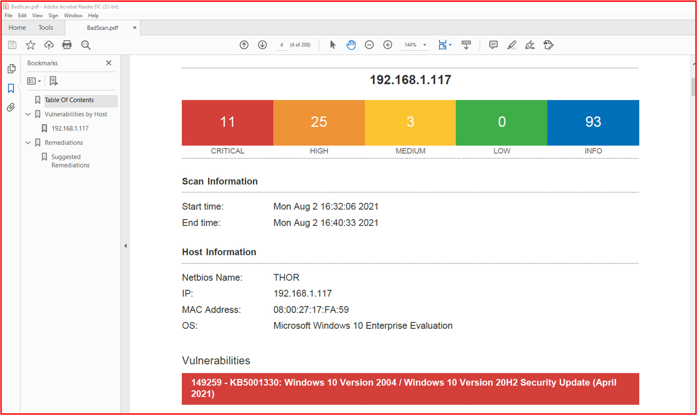
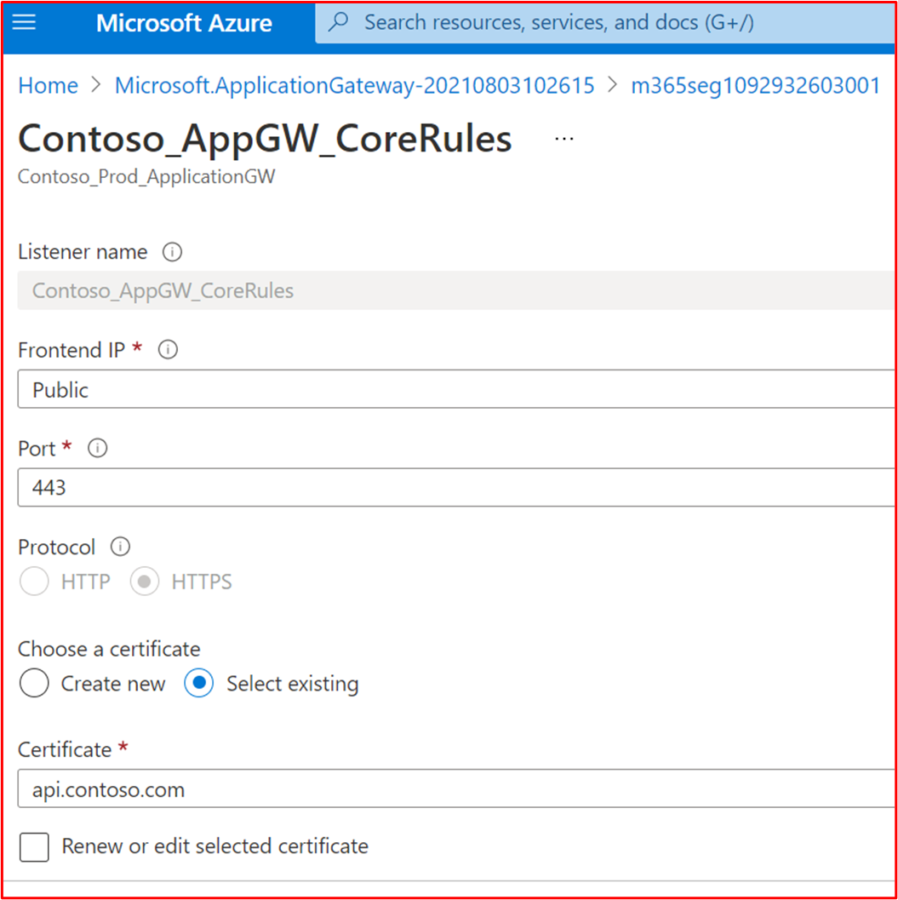
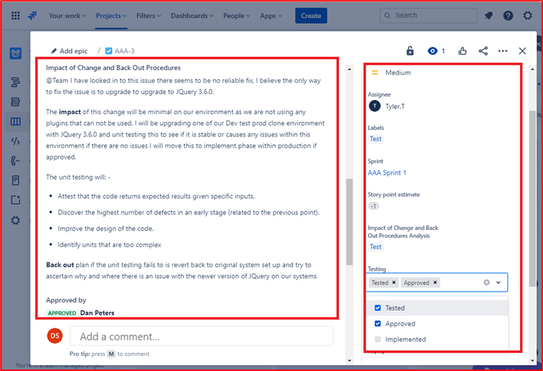
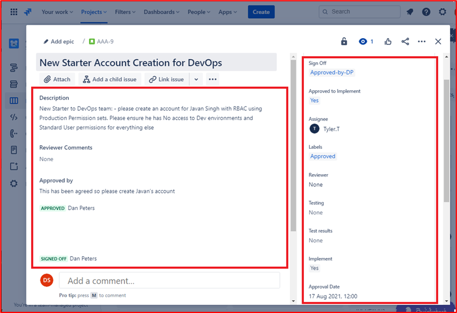
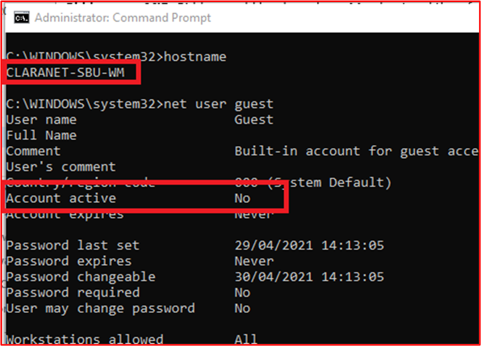
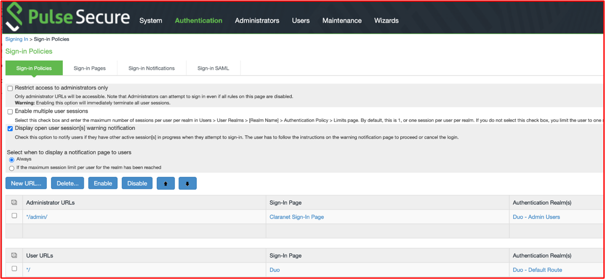
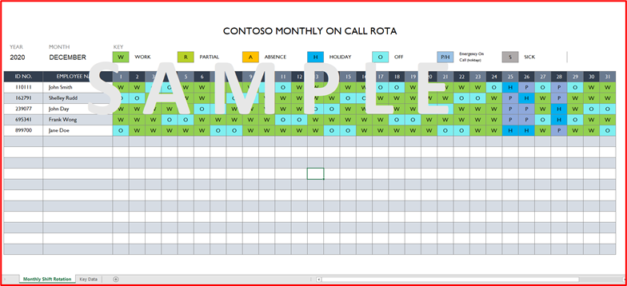
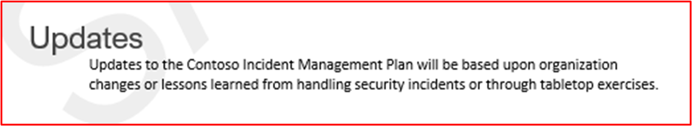
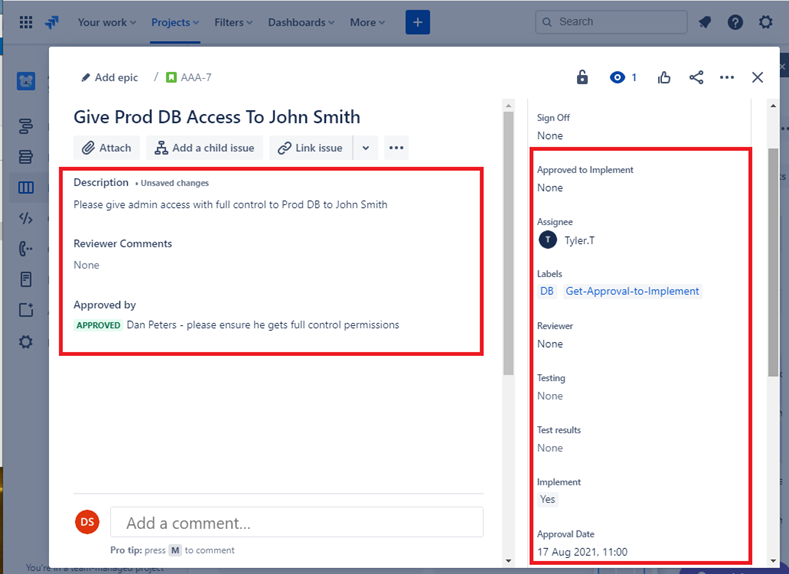

# Microsoft 365 Zertifizierung – Beispielnachweishandbuch

## Übersicht

Dieser Leitfaden wurde erstellt, um ISVs Beispiele für die Art der Nachweise und den Umfang der für jedes der Microsoft 365 Zertifizierungssteuerelemente erforderlichen Detaillierten bereitzustellen. Alle in diesem Dokument freigegebenen Beispiele stellen nicht die einzigen Nachweise dar, die verwendet werden können, um zu veranschaulichen, dass Steuerelemente erfüllt werden, sondern dienen nur als Richtlinie für die Art der erforderlichen Nachweise. 

Bitte beachten Sie: Die tatsächlichen Schnittstellen, Screenshots und Dokumentationen, die zur Erfüllung der Anforderungen verwendet werden, variieren je nach Produktverwendung, Systemeinrichtung und internen Prozessen. Beachten Sie außerdem, dass der ISV, wenn eine Richtlinien- oder Verfahrensdokumentation erforderlich ist, die ACTUAL-Dokumente senden muss und keine Screenshots, wie in einigen der Beispiele gezeigt. 

Es gibt zwei Abschnitte in der Zertifizierung, die Übermittlungen erfordern:
1. [**Die anfängliche Dokumentenübermittlung:**](../docs/initialdocumentsubguide.md) eine kleine Gruppe von Dokumenten auf hoher Ebene, die für die Bewertung erforderlich sind.
1. **Die Beweisübermittlung:** die vollständige Gruppe von Nachweisen, die für jedes Steuerelement im Umfang Ihrer Zertifizierungsbewertung erforderlich sind. 

## Structure 

Dieses Dokument wird direkt Steuerelementen zugeordnet, die Sie während Ihrer Zertifizierung im Partner Center präsentieren werden. Die in diesem Dokument bereitgestellten Anleitungen sind wie folgt aufgeführt:
- Sicherheitsdomäne: Die drei Sicherheitsdomänen, in die alle Steuerelemente gruppiert sind: Anwendungssicherheit, Betriebssicherheit sowie Datensicherheit und Datenschutz.
- Steuerelemente: = Beschreibung der Bewertungsaktivität – Diese Steuerelemente und die zugehörige Nummer (Nein) werden direkt aus der Microsoft 365 Zertifizierungscheckliste übernommen.  
- Absicht: = Die Absicht, warum die Sicherheitssteuerung in das Programm einbezogen wird, und das spezifische Risiko, das sie mindern soll.  Die Hoffnung ist, dass diese Informationen ISVs die Gründe für die Kontrolle liefern, um die Arten von Nachweisen, die gesammelt werden müssen, besser zu verstehen, und was ISV-Geräte beachten müssen und die sie bei der Erstellung ihrer Beweise sensibilisieren und verstehen müssen.
- Beispiel für Nachweisrichtlinien: = Wird angegeben, um die Nachweissammlungsaufgaben in der Tabelle Microsoft 365 Zertifizierungsprüfliste zu unterstützen, ermöglicht dies den ISV-Benutzern, beispiele für die Art der Nachweise deutlich zu sehen, die vom Zertifizierungsanalysten verwendet werden können, der es verwendet, um sicher zu bestimmen, dass ein Steuerelement vorhanden und verwaltet wird – es ist keineswegs erschöpfend.
- Beweisbeispiel: = Dieser Abschnitt enthält Beispielfotos und Bilder potenzieller Nachweise, die für jedes Steuerelement in der Kalkulationstabelle Microsoft 365 Zertifizierungsprüfliste erfasst wurden, insbesondere für die Domänen "Betriebliche Sicherheit" und "Datensicherheit und Datenschutzsicherheit" (Registerkarten innerhalb der Kalkulationstabelle). Bitte beachten Sie alle Informationen mit roten Pfeilen und Feldern in den Beispielen, um Ihr Verständnis der Anforderungen zu unterstützen, die erforderlich sind, um jedes Steuerelement zu erfüllen.

## Sicherheitsdomäne: Anwendungssicherheit

**Steuerung 1 - Steuerung 16**:

Die Anwendungssicherheitsdomänensteuerelemente können mit einem Penetrationstestbericht angezeigt werden, der innerhalb der letzten 12 Monate ausgestellt wurde und zeigt, dass Ihre App keine ausstehenden Sicherheitsrisiken aufweist. Die einzige erforderliche Einreichung ist ein sauberer Bericht von einem seriösen unabhängigen Unternehmen. 

## Sicherheitsdomäne: Betriebssicherheit / sichere Entwicklung

Die Sicherheitsdomäne "Operational Security / Secure Development" wurde entwickelt, um sicherzustellen, dass ISVs eine starke Reihe von Sicherheitsminderungstechniken gegen eine Vielzahl von Bedrohungen von Bedrohungsakteuren implementieren.  Dies dient zum Schutz der Betriebsumgebung und der Softwareentwicklungsprozesse, um sichere Umgebungen zu erstellen.

#### Schutz vor Schadsoftware – Virenschutz

**Steuerelement Nr. 1:** Stellen Sie Eine Richtliniendokumentation bereit, die die Praktiken und Verfahren von Antivirensoftware regelt.
- Absicht: Die Absicht dieses Steuerelements besteht darin, das Verständnis eines ISV über die Probleme zu bewerten, mit denen sie konfrontiert sind, wenn die Bedrohung durch Computerviren betrachtet wird. Durch die Einrichtung und Verwendung von branchenweit bewährten Methoden bei der Entwicklung einer Antivirenrichtlinie und -prozesse stellt ein ISV eine Ressource bereit, die auf die Fähigkeit ihrer Organisation zugeschnitten ist, die Risiken von Schadsoftware zu mindern, indem bewährte Methoden für die Virenerkennung und -beseitigung aufgeführt werden, und belegt, dass die dokumentierte Richtlinie vorgeschlagene Sicherheitsleitlinien für die Organisation und ihre Mitarbeiter bereitstellt. Durch die Dokumentation einer Richtlinie und eines Verfahrens, wie der ISV Antischadsoftware-Deklassien bereitstellt, stellt dies die konsistente Einführung und Wartung dieser Technologie sicher, um das Risiko von Schadsoftware für die Umgebung zu verringern.

- Beispielrichtlinien für Nachweise: Stellen Sie eine Kopie Ihrer Antivirus-/Antischadsoftwarerichtlinie bereit, die die in Ihrer Infrastruktur implementierten Prozesse und Verfahren enthält, um bewährte Methoden für Antivirus/Schadsoftware zu fördern.
Beispielbeweis

- Beispielbeweis:

**Hinweis:** Dieser Screenshot zeigt ein Richtlinien-/Prozessdokument. Es wird erwartet, dass ISVs die eigentliche unterstützende Richtlinien-/Verfahrensdokumentation freigeben und nicht einfach nur einen Screenshot bereitstellen.

**Steuerelement Nr. 2:** Stellen Sie nachweisbare Nachweise dafür bereit, dass Antivirensoftware auf allen getesteten Systemkomponenten ausgeführt wird.

- Absicht: Es ist wichtig, dass Anti-Virus (AV) (oder Antischadsoftwareschutz) in Ihrer Umgebung ausgeführt wird, um vor Cybersicherheitsrisiken zu schützen, die Sie möglicherweise oder möglicherweise nicht kennen, da potenziell schädliche Angriffe zunehmen, sowohl in Raffinesse als auch Zahlen. Wenn AV für alle Systemkomponenten bereitgestellt wird, die seine Verwendung unterstützen, können Einige der Risiken der Einführung von Antischadsoftware in die Umgebung verringert werden. Es dauert nur einen einzelnen Endpunkt, um ungeschützt zu sein, um potenziell einen Angriffsvektor für einen Bedrohungsakteur bereitzustellen, um in der Umgebung Fuß zu fassen. AV sollte daher als eine von mehreren Verteidigungsebenen zum Schutz vor dieser Art von Bedrohung verwendet werden.

- Beispielrichtlinien für Nachweise: Um nachzuweisen, dass eine aktive Instanz von AV in der bewerteten Umgebung ausgeführt wird. Stellen Sie einen Screenshot für _jedes Gerät_ im Beispiel bereit, das die Verwendung von Antivirensoftware unterstützt, die zeigt, wie der Antivirenprozess ausgeführt wird, die Antivirensoftware aktiv ist, oder wenn Sie über eine zentrale Verwaltungskonsole für Antivirensoftware verfügen, können Sie dies möglicherweise über diese Verwaltungskonsole demonstrieren. Wenn Sie die Verwaltungskonsole verwenden, müssen Sie in einem Screenshot nachweisen, dass die beispielierten Geräte verbunden sind und funktionieren.

- Beispiel 1: Der folgende Screenshot wurde aus Azure Security Center erstellt. Er zeigt, dass eine Antischadsoftwareerweiterung auf der VM mit dem Namen &quot;MSPGPRODAZUR01&quot; bereitgestellt wurde.

- Beweisbeispiel 2

Der folgende Screenshot wurde von einem Windows 10-Geräten übernommen und zeigt, dass &quot;der Echtzeitschutz&quot; für den Hostnamen &quot;CLARANET-SBU-WM&quot; aktiviert ist.

**Steuerelement Nr. 3:** Stellen Sie nachweisbare Nachweise dafür bereit, dass Antivirensignaturen in allen Umgebungen (innerhalb von 1 Tag) auf dem neuesten Stand sind.

- Absicht: Hunderttausende neue Schadsoftware und potenziell unerwünschte Anwendungen (PUA) werden jeden Tag identifiziert. Um einen angemessenen Schutz vor neu veröffentlichter Schadsoftware zu bieten, müssen AV-Signaturen regelmäßig aktualisiert werden, um neu veröffentlichte Schadsoftware zu berücksichtigen.

- Dieses Steuerelement ist vorhanden, um sicherzustellen, dass der ISV die Sicherheit der Umgebung und die Auswirkungen, die veraltete AV auf die Sicherheit haben kann, berücksichtigt hat.

- Beispielrichtlinien für Nachweise: Stellen Sie Antivirenprotokolldateien von jedem beispielierten Gerät bereit, die zeigen, dass Updates täglich angewendet werden.

- Beispielnachweis: Der folgende Screenshot zeigt, dass Microsoft Defender mindestens täglich aktualisiert wird, indem &#39;Ereignis 2000 angezeigt wird, Windows Defender&#39; das Update ist. Der Hostname wird angezeigt und zeigt, dass dies aus dem bereichsbezogenen System &quot;CLARANET-SBU-WM&quot; stammt.

**Hinweis:** Die bereitgestellten Nachweise müssten einen Export der Protokolle enthalten, um tägliche Aktualisierungen über einen längeren Zeitraum anzuzeigen. Einige Antivirenprodukte generieren Updateprotokolldateien, sodass diese Dateien bereitgestellt oder die Protokolle aus Ereignisanzeige exportiert werden sollten.

**Steuerelement Nr. 4:** Stellen Sie nachweisbare Nachweise dafür bereit, dass Antivirensoftware so konfiguriert ist, dass eine Überprüfung bei Zugriff oder eine regelmäßige Überprüfung über alle beispielbasierten Systemkomponenten hinweg durchgeführt wird.

**Hinweis:** Wenn die Überprüfung bei Zugriff nicht aktiviert ist, **müssen** mindestens die tägliche Überprüfung und alerting_ aktiviert _be.

- Absicht: Die Absicht dieses Steuerelements besteht darin, sicherzustellen, dass Schadsoftware schnell identifiziert wird, um die Auswirkungen auf die Umgebung zu minimieren. Wo On-Access-Scans durchgeführt und mit automatischer Blockierung von Schadsoftware gekoppelt werden, hilft dies, Schadsoftwareinfektionen zu stoppen, die von der Antivirensoftware bekannt sind. Wenn die Überprüfung bei Zugriff aufgrund von Risiken falsch positiver Ergebnisse, die zu Dienstausfällen führen,&#39;nicht wünschenswert ist, müssen geeignete tägliche (oder mehr) Überprüfungs- und Benachrichtigungsmechanismen implementiert werden, um eine rechtzeitige Reaktion auf Schadsoftwareinfektionen zu gewährleisten, um Schäden zu minimieren.

- Beispielrichtlinien für Nachweise: Stellen Sie einen Screenshot für _jedes Gerät_ im Beispiel bereit, das Anti-Virus unterstützt, und zeigen Sie, dass der Antivirus auf dem Gerät ausgeführt wird und für die Überprüfung bei Zugriff (Echtzeitüberprüfung) konfiguriert ist, **ODER** stellen Sie einen Screenshot bereit, der zeigt, dass regelmäßiges Scannen für die tägliche Überprüfung aktiviert ist, Warnungen konfiguriert sind und das letzte Scandatum für _jedes Gerät_ im Beispiel.

- Beispielnachweis: Der folgende Screenshot zeigt, dass der Echtzeitschutz für den Host &quot;CLARANET-SBU-WM&quot; aktiviert ist.

**Steuerelement Nr. 5:** Stellen Sie nachweisbare Nachweise dafür bereit, dass Antivirensoftware so konfiguriert ist, dass Schadsoftware oder Quarantäne automatisch blockiert wird und alle systemspezifischen Komponenten benachrichtigt werden.

- Absicht: Die Raffinesse von Schadsoftware entwickelt sich ständig weiter, zusammen mit den unterschiedlichen Graden der Verwüstung, die sie bringen können. Die Absicht dieses Steuerelements besteht darin, entweder die Ausführung von Schadsoftware zu verhindern und sie daher daran zu hindern, ihre potenziell verheerende Nutzlast auszuführen, oder wenn automatisches Blockieren keine Option ist, kann die Begrenzung der Zeit, die Schadsoftware verursacht, verheerend sein, indem sie benachrichtigt und sofort auf die potenzielle Malware-Infektion reagiert.

- Beispielrichtlinien für Nachweise: Stellen Sie einen Screenshot für _jedes Gerät_ im Beispiel bereit, das Anti-Virus unterstützt. Dabei wird gezeigt, dass der Antivirus auf dem Computer ausgeführt wird und so konfiguriert ist, dass Schadsoftware automatisch blockiert, eine Warnung oder eine Quarantäne und Warnung ausgeführt wird.

- Beispiel 1: Der folgende Screenshot zeigt, dass der Host &quot;CLARANET-SBU-WM&quot; mit Echtzeitschutz für Microsoft Defender Antivirus konfiguriert ist. Wie die Einstellung besagt, findet und verhindert dies, dass Schadsoftware auf dem Gerät installiert oder ausgeführt wird.

**Steuerelement Nr. 6:** Stellen Sie nachweisbare Nachweise dafür bereit, dass Anwendungen vor der Bereitstellung genehmigt wurden.

- Absicht: Mit der Anwendungssteuerung genehmigt die Organisation jede Anwendung/jeden Prozess, die unter dem Betriebssystem ausgeführt werden darf. Mit diesem Steuerelement soll sichergestellt werden, dass ein Genehmigungsprozess zur Autorisierung der Anwendungen/Prozesse eingerichtet ist, die ausgeführt werden können.

- Beispielrichtlinien für Nachweise: Nachweise können bereitgestellt werden, die zeigen, dass der Genehmigungsprozess befolgt wird. Dies kann durch signierte Dokumente, das Nachverfolgen innerhalb von Änderungskontrollsystemen oder die Verwendung von etwas wie Azure DevOps oder JIRA zur Nachverfolgung dieser Anforderungen und Autorisierung erfolgen.

- Beispielnachweis: Der folgende Screenshot zeigt eine Genehmigung durch die Verwaltung, dass jede Anwendung, die innerhalb der Umgebung ausgeführt werden darf, einem Genehmigungsprozess folgt. Dies ist ein papierbasierter Prozess bei Contoso, es können jedoch andere Mechanismen verwendet werden.

**Steuerelement Nr. 7:** Stellen Sie nachweisbare Nachweise dafür bereit, dass eine vollständige Liste der genehmigten Anwendungen mit geschäftlicher Begründung vorhanden und verwaltet wird.

- Absicht: Es ist wichtig, dass Organisationen eine Liste aller genehmigten Anwendungen zusammen mit Informationen darüber verwalten, warum die Anwendung/der Prozess genehmigt wurde. Dadurch wird sichergestellt, dass die Konfiguration auf dem neuesten Stand bleibt und anhand eines Basisplans überprüft werden kann, um sicherzustellen, dass nicht autorisierte Anwendungen/Prozesse nicht konfiguriert sind.

- Beispielrichtlinien für Nachweise: Geben Sie die dokumentierte Liste der genehmigten Anwendungen/Prozesse zusammen mit der geschäftlichen Begründung an.

- Beispielnachweis: Der folgende Screenshot listet die genehmigten Anwendungen mit geschäftlicher Begründung auf.

**Hinweis:** Dieser Screenshot zeigt ein Dokument, die Erwartung ist, dass ISVs das eigentliche Unterstützende Dokument freigeben und nicht einfach nur einen Screenshot bereitstellen.

**Steuerelement Nr. 8:** Stellen Sie unterstützende Dokumentationen bereit, in denen beschrieben wird, dass die Anwendungskontrolle software so konfiguriert ist, dass sie bestimmte Anwendungssteuerungsmechanismen erfüllt.

- Absicht: Die Konfiguration der Anwendungssteuerungstechnologie sollte zusammen mit einem Prozess der Wartung der Technologie dokumentiert werden, d. h. Anwendungen/Prozesse hinzufügen und löschen. Im Rahmen dieser Dokumentation sollte der verwendete Mechanismustyp für jede Anwendung/jeden Prozess detailliert sein. Dies wird in das nächste Steuerelement einfließen, um sicherzustellen, dass die Technologie wie dokumentiert konfiguriert ist.

- Beispielrichtlinien für Nachweise: Bereitstellen einer unterstützenden Dokumentation, in der beschrieben wird, wie die Anwendungssteuerung eingerichtet wurde und wie jede Anwendung/jeder Prozess innerhalb der Technologie konfiguriert wurde.

- Beispielbeweis: Der folgende Screenshot listet den Steuerelementmechanismus auf, der zum Implementieren des Anwendungssteuerelements verwendet wird. Unten sehen Sie, dass 1 App Zertifikatsteuerelemente verwendet und die anderen den Dateipfad verwenden.

**Hinweis:** Dieser Screenshot zeigt ein Dokument, die Erwartung ist, dass ISVs das eigentliche Unterstützende Dokument freigeben und nicht einfach nur einen Screenshot bereitstellen.

**Steuerelement Nr. 9:** Stellen Sie nachweisbare Nachweise dafür bereit, dass die Anwendungssteuerung wie aus allen beispielierten Systemkomponenten dokumentiert konfiguriert ist.

- Absicht: Dies soll überprüfen, ob das Anwendungssteuerelement im gesamten Beispiel gemäß der Dokumentation konfiguriert ist.

- Beispielrichtlinien für Nachweise: Stellen Sie einen Screenshot für _jedes Gerät_ im Beispiel bereit, um zu zeigen, dass anwendungssteuerelemente konfiguriert und aktiviert sind. Dies sollte Computernamen, die Gruppen, denen sie angehören, und die Anwendungssteuerungsrichtlinien anzeigen, die auf diese Gruppen und Computer angewendet werden.

- Beweisbeispiel: Der folgende Screenshot zeigt ein Gruppenrichtlinie-Objekt mit aktivierten Softwareeinschränkungsrichtlinien.

Dieser nächste Screenshot zeigt die Konfiguration entsprechend dem obigen Steuerelement.

Dieser nächste Screenshot zeigt die M365-Umgebung und die Computer, die in dem Bereich enthalten sind, der auf dieses GPO-Objekt &#39;Domänencomputer Einstellungen&#39; angewendet wird.

Dieser letzte Screenshot zeigt, dass sich der bereichsinterne Server &quot;DBServer1&quot; innerhalb der OE im screenshot oben befindet.

### Patch-Management – Risikorangfolge

Die schnelle Identifizierung und Behebung von Sicherheitslücken trägt dazu bei, die Risiken eines Bedrohungsakteurs zu minimieren, der die Umgebung oder Anwendung beeinträchtigt. Die Patchverwaltung ist in zwei Abschnitte unterteilt: Risikorangfolge und Patching. Diese drei Kontrollen decken die Identifizierung von Sicherheitslücken ab und ordnen sie nach dem risiko, das sie darstellen.

Diese Sicherheitssteuerungsgruppe ist im Bereich für PaaS-Hostingumgebungen (Platform-as-a-Service), da die Anwendungs-/Add-In-Softwarebibliotheken und die Codebasis von Drittanbietern basierend auf der Risikobewertung gepatcht werden müssen.

**Steuerelement Nr. 10:** Bereitstellungsrichtliniendokumentation, die bestimmt, wie neue Sicherheitslücken identifiziert und einer Risikobewertung zugewiesen werden.

- Absicht: Die Absicht dieses Steuerelements besteht darin, unterstützende Dokumentationen zu haben, um sicherzustellen, dass Sicherheitslücken schnell erkannt werden, um das Zeitfenster zu verringern, das Bedrohungsakteure haben, um diese Sicherheitsrisiken auszunutzen. Es muss ein robuster Mechanismus vorhanden sein, um Sicherheitsrisiken zu erkennen, die alle von den Organisationen verwendeten Systemkomponenten abdecken. Beispielsweise Betriebssysteme (Windows Server, Ubuntu usw.), Anwendungen (Tomcat, MS Exchange, SolarWinds usw.), Codeabhängigkeiten (AngularJS, jQuery usw.). Organisationen müssen nicht nur die rechtzeitige Identifizierung von Sicherheitsrisiken innerhalb des Bestandes sicherstellen, sondern auch alle Sicherheitsrisiken entsprechend bewerten, um sicherzustellen, dass die Behebung innerhalb eines geeigneten Zeitrahmens basierend auf dem Risiko, das die Sicherheitsanfälligkeit darstellt, durchgeführt wird.

**Hinweis** Selbst wenn Sie in einer reinen Plattform-als-Dienst-Umgebung ausgeführt werden, sind Sie dennoch dafür verantwortlich, Sicherheitsrisiken innerhalb Ihrer Codebasis zu identifizieren, d. h. Bibliotheken von Drittanbietern.

- Beispielrichtlinien für Nachweise: Bereitstellen der Supportdokumentation (keine Screenshots)

- Beispielnachweis: Dieser Screenshot zeigt einen Codeausschnitt einer Risikobewertungsrichtlinie.

**Hinweis:** Dieser Screenshot zeigt ein Richtlinien-/Prozessdokument. Es wird erwartet, dass ISVs die eigentliche unterstützende Dokumentation zu Richtlinien/Verfahren freigeben und nicht einfach nur eine screenshot._

**Steuerelement Nr. 11:** Stellen Sie nachweisen, wie neue Sicherheitslücken identifiziert werden.

- Absicht: Die Absicht dieses Steuerelements besteht darin, sicherzustellen, dass der Prozess befolgt wird, und es&#39;robust genug, um neue Sicherheitslücken in der gesamten Umgebung zu identifizieren. Dies kann nicht nur das Betriebssystem sein; Es kann Anwendungen enthalten, die in der Umgebung ausgeführt werden, und codeabhängigkeiten.

- Beispielrichtlinien für Nachweise: Nachweise können durch Anzeigen von Abonnements für Mailinglisten, manuelle Überprüfung von Sicherheitsquellen für neu veröffentlichte Sicherheitsrisiken (mit Zeitstempeln der Aktivitäten, d. h. mit JIRA oder Azure DevOps) ausreichend nachverfolgt werden), Tools, die veraltete Software finden (z. B. Snyk bei der Suche nach veralteten Softwarebibliotheken oder Nessus mit authentifizierten Scans sein, die  veraltete Software.).

**Hinweis** Wenn Sie Nessus verwenden, müsste dies regelmäßig ausgeführt werden, um Sicherheitsrisiken schnell zu erkennen. Wir empfehlen mindestens wöchentlich.

- Beispielnachweis: Dieser Screenshot zeigt, dass eine Mailinggruppe verwendet wird, um über Sicherheitslücken benachrichtigt zu werden.

**Steuerelement Nr. 12:** Stellen Sie Nachweise bereit, die belegen, dass allen Sicherheitsrisiken nach der Identifizierung eine Risikorangfolge zugewiesen wird.

- Absicht: Das Patchen muss auf dem Risiko basieren, je riskanter die Sicherheitsanfälligkeit ist, desto schneller muss es behoben werden. Die Risikobewertung identifizierter Sicherheitsrisiken ist ein integraler Bestandteil dieses Prozesses. Die Absicht dieses Steuerelements besteht darin, sicherzustellen, dass ein dokumentierter Prozess zur Risikorangfolge vorliegt, der befolgt wird, um sicherzustellen, dass alle identifizierten Sicherheitsrisiken entsprechend dem Risiko bewertet werden. Organisationen nutzen in der Regel die CVSS-Bewertung (Common Vulnerability Scoring System), die von Anbietern oder Sicherheitsforschern bereitgestellt wird. Wenn sich die Organisation auf CVSS stützt, wird empfohlen, dass ein Neubewertungsmechanismus in den Prozess einbezogen wird, damit die Organisation die Bewertung basierend auf einer internen Risikobewertung ändern kann. Manchmal ist die Sicherheitsanfälligkeit aufgrund der Art und Weise, wie die Anwendung in der Umgebung bereitgestellt wurde, möglicherweise nicht anwendungsweise. Beispielsweise kann eine Java-Sicherheitsanfälligkeit veröffentlicht werden, die sich auf eine bestimmte Bibliothek auswirkt, die nicht von der Organisation verwendet wird.

- Beispielrichtlinien für Nachweise: Bereitstellen von Nachweisen auf Screenshots oder auf andere Weise, z. B. DevOps/Jira, die zeigen, dass Sicherheitsrisiken den Risikorangfolgeprozess durchlaufen und von der Organisation eine angemessene Risikobewertung zugewiesen werden.

- Beispielnachweis: Dieser Screenshot zeigt die Risikorangfolge in Spalte D und die erneute Rangfolge in den Spalten F und G, wenn die Organisation eine Risikobewertung durchführt und feststellt, dass das Risiko herabgestuft werden kann. Nachweise für eine erneute Einstufung von Risikobewertungen müssten als nachweisende Nachweise vorgelegt werden.

### Patchverwaltung – Patching

Die folgenden Steuerelemente gelten für das Patchingelement für die Patchverwaltung. Um eine sichere Betriebsumgebung zu gewährleisten, müssen Anwendungen/Add-Ons und unterstützende Systeme entsprechend gepatcht werden. Ein geeigneter Zeitrahmen zwischen Identifizierung (oder öffentlicher Veröffentlichung) und Patching muss verwaltet werden, um das Zeitfenster für eine Sicherheitsanfälligkeit zu verringern, die von einem Bedrohungsakteur ausgenutzt werden kann. Die Microsoft 365 Zertifizierung sieht kein &#39;Patching-Fenster&#39; vor, zertifizierungsanalystizierende Analysten lehnen jedoch Zeitrahmen ab, die nicht angemessen sind.

Diese Sicherheitssteuerungsgruppe ist im Bereich für PaaS-Hostingumgebungen (Platform-as-a-Service), da die Anwendungs-/Add-In-Softwarebibliotheken und die Codebasis von Drittanbietern basierend auf der Risikobewertung gepatcht werden müssen.

**Steuerelement Nr. 13:** Bereitstellung einer Richtliniendokumentation für das Patchen von in-Scope-Systemkomponenten, die einen geeigneten minimalen Patchzeitrahmen für kritische, hohe und mittlere Sicherheitsrisiken umfasst; und Außerbetriebnahme von nicht unterstützten Betriebssystemen und Software.

- Absicht: Patchverwaltung ist von vielen Sicherheitscomplianceframeworks erforderlich, z. B. PCI-DSS, ISO 27001, NIST (SP) 800-53. Die Bedeutung eines guten Patch-Managements kann nicht übermäßig betont werden, da es Sicherheits- und Funktionalitätsprobleme in Software, Firmware und Sicherheitslücken beheben kann, was dazu beiträgt, die Nutzungsmöglichkeiten zu verringern. Die Absicht dieses Steuerelements besteht darin, das Zeitfenster zu minimieren, in dem ein Bedrohungsakteur Sicherheitsrisiken ausnutzen muss, die in der Bereichsumgebung vorhanden sein können.

- Beispiel für Nachweisrichtlinien: Stellen Sie eine Kopie aller Richtlinien und Verfahren bereit, die den Prozess für die Patchverwaltung detailliert darstellen. Dies sollte einen Abschnitt in einem minimalen Patchfenster enthalten, in dem nicht unterstützte Betriebssysteme und Software nicht in der Umgebung verwendet werden dürfen.

- Beispielbeweis: Unten sehen Sie ein Beispiel für ein Richtliniendokument.

**Hinweis:** Dieser Screenshot zeigt ein Richtlinien-/Prozessdokument. Es wird erwartet, dass ISVs die eigentliche unterstützende Dokumentation zu Richtlinien/Verfahren freigeben und nicht einfach nur eine screenshot._

**Steuerelement Nr. 14:** Stellen Sie nachweisbare Beweise dafür bereit, dass alle in die Stichprobe einbezogenen Systemkomponenten gepatcht werden.

**Hinweis:** Schließen Sie alle Software-/Drittanbieterbibliotheken ein.

- Absicht: Das Patchen von Sicherheitsrisiken stellt sicher, dass die unterschiedlichen Module, die Teil der Informationstechnologieinfrastruktur (Hardware, Software und Dienste) sind, auf dem neuesten Stand und frei von bekannten Sicherheitsrisiken sind. Patching muss so schnell wie möglich durchgeführt werden, um das Potenzial eines Sicherheitsvorfalls zwischen der Veröffentlichung von Details zur Sicherheitsanfälligkeit und patchen zu minimieren. Dies ist noch wichtiger, wenn die Nutzung von Schwachstellen, die bekanntermaßen in freier Wildbahn sind.

- Beispielrichtlinien für Nachweise: Stellen Sie einen Screenshot für _jedes Gerät_ im Beispiel bereit und unterstützen Sie Softwarekomponenten, die zeigen, dass Patches im Einklang mit dem dokumentierten Patching-Prozess installiert werden.

- Beispielbeweis: Der folgende Screenshot zeigt, dass die In-Scope-Systemkomponente &quot;CLARANET-SBU-WM&quot; Windows Updates gemäß der Patchingrichtlinie durchführt.

**Hinweis:** Das Patchen aller bereichsbezogenen Systemkomponenten muss nachweisbar sein. Dazu gehören Dinge wie; Betriebssystemupdates, Anwendungs-/Komponentenupdates (i.e__.,_ _Apache Tomcat, OpenSSL usw.), Softwareabhängigkeiten (z. B. JQuery, AngularJS usw.) usw._

**Steuerelement Nr. 15:** Stellen Sie nachweisbare Nachweise dafür bereit, dass nicht unterstützte Betriebssysteme und Softwarekomponenten nicht in der Umgebung verwendet werden.

- Absicht: Software, die nicht von Anbietern verwaltet wird, leidet unter bekannten Sicherheitsrisiken, die nicht behoben sind. Daher darf die Verwendung nicht unterstützter Betriebssysteme und Softwarekomponenten nicht in Produktionsumgebungen verwendet werden.

- Beispiel für Nachweisrichtlinien: Stellen Sie einen Screenshot für _jedes Gerät_ im Beispiel bereit, das die version des betriebssystems zeigt, die ausgeführt wird (einschließlich des Servers&#39;Namen im Screenshot). Darüber hinaus können Sie nachweisen, dass in der Umgebung ausgeführte Softwarekomponenten unterstützte Versionen ausführen. Dies kann durch die Bereitstellung der Ausgabe interner Überprüfungsberichte für Sicherheitsrisiken (die authentifizierte Überprüfung ist enthalten) und/oder durch die Ausgabe von Tools erfolgen, die Drittanbieterbibliotheken überprüfen, z. [B. Snyk](https://snyk.io/), [Trivy](https://github.com/aquasecurity/trivy) oder [NPM Audit](https://docs.npmjs.com/cli/v7/commands/npm-audit). Wenn nur paaS ausgeführt wird, muss nur das Patchen von Drittanbieterbibliotheken durch die Patching-Steuerelementgruppen abgedeckt werden.

- Beispielbeweis: Der folgende Nachweis zeigt, dass auf der bereichsbezogenen Systemkomponente THOR Software ausgeführt wird, die vom Anbieter unterstützt wird, da Nessus keine Probleme gekennzeichnet&#39;.

**Hinweis:** Der vollständige Bericht muss für die Zertifizierungsanalysten freigegeben werden.

- Beispielnachweis 2

Dieser Screenshot zeigt, dass die bereichsbezogene Systemkomponente &quot;CLARANET-SBU-WM&quot; auf einer unterstützten Windows Version ausgeführt wird.

- Beispielnachweis 3

Der folgende Screenshot zeigt die [Trivy-Ausgabe](https://github.com/aquasecurity/trivy) , in der im vollständigen Bericht keine nicht unterstützten Anwendungen aufgeführt&#39;.

**Hinweis:** Der vollständige Bericht muss für die Zertifizierungsanalysten freigegeben werden.

### Prüfung auf Schwachstellen

Durch die Einführung regelmäßiger Sicherheitsrisikobewertungen können Organisationen Schwachstellen und Unsicherheiten in ihren Umgebungen erkennen, die einen Einstiegspunkt für einen böswilligen Akteur darstellen können, um die Umgebung zu gefährden. Das Scannen von Sicherheitsrisiken kann dazu beitragen, fehlende Patches oder Fehlkonfigurationen in der Umgebung zu erkennen. Durch die regelmäßige Durchführung dieser Scans kann eine Organisation geeignete Korrekturen bereitstellen, um das Risiko einer Kompromittierung aufgrund von Problemen zu minimieren, die häufig von diesen Überprüfungstools für Sicherheitslücken erfasst werden.

**Steuerelement Nr. 16:** Stellen Sie die vierteljährlichen Berichte zur Überprüfung von Sicherheitsrisiken in Infrastruktur und Webanwendungen bereit. Die Überprüfung muss für den gesamten öffentlichen Fußabdruck (IP-Adressen und URLs) und interne IP-Bereiche durchgeführt werden.

**Hinweis:** Dies **MUSS** den gesamten Umfang der Umgebung umfassen.

- Absicht: Das Scannen von Sicherheitsrisiken sucht nach möglichen Schwachstellen in einem Computersystem, Netzwerken und Webanwendungen einer Organisation, um Löcher zu identifizieren, die potenziell zu Sicherheitsverletzungen und der Gefährdung vertraulicher Daten führen können. Das Scannen von Sicherheitsrisiken ist häufig durch Branchenstandards und behördenrechtliche Vorschriften erforderlich, z. B. den PCI DSS (Payment Card Industry Data Security Standard).

- Ein Bericht von Security Metric mit dem Titel &quot;["2020 Security Metrics Guide to PCI DSS Compliance](https://info.securitymetrics.com/pci-guide-2020)&quot; " gibt an, dass &#39;im Durchschnitt 166 Tage ab dem Zeitpunkt dauerte, zu dem eine Organisation sicherheitsanfällig war, damit ein Angreifer das System kompromittiert hat. Nach der Kompromittierung hatten Angreifer durchschnittlich 127 Tage lang Zugriff auf vertrauliche Daten&#39; daher zielt dieses Steuerelement darauf ab, potenzielle Sicherheitsschwächen innerhalb der Bereichsumgebung zu identifizieren.

- Beispielrichtlinien für Nachweise: Stellen Sie den vollständigen(n) Scanbericht(en) für jedes Quartal&#39;Sicherheitsrisikoüberprüfungen bereit, die in den letzten 12 Monaten durchgeführt wurden. Die Berichte sollten die Ziele eindeutig angeben, um zu überprüfen, ob der vollständige öffentliche Fußabdruck enthalten ist, und gegebenenfalls jedes interne Subnetz. Stellen Sie **ALLE** Scanberichte für **JEDES** Quartal bereit.

- Beispielnachweis: Beispielnachweise wären die Bereitstellung der Überprüfungsberichte aus dem verwendeten Überprüfungstool. Jedes Quartal&#39;Scanberichte sollten zur Überprüfung bereitgestellt werden. Die Überprüfung muss die gesamten Systemkomponenten der Umgebungen umfassen. jedes interne Subnetz und jede öffentliche IP-Adresse/URL, die für die Umgebung verfügbar ist.

**Steuerelement Nr. 17:** Stellen Sie nachweisbare Nachweise bereit, dass die Behebung von Sicherheitsrisiken, die während der Überprüfung von Sicherheitsrisiken erkannt wurden, im Einklang mit Ihrem dokumentierten Patching-Zeitrahmen gepatcht werden.

- Absicht: Wenn Sicherheitsrisiken und Fehlkonfigurationen nicht schnell erkannt, verwaltet und behoben werden, kann dies das Risiko einer Kompromittierung einer Organisation&#39;erhöhen, die zu potenziellen Datenschutzverletzungen führt. Die richtige Identifizierung und Behebung von Problemen wird als wichtig für eine Organisation&#39;der allgemeinen Sicherheitslage und -umgebung angesehen, die mit den bewährten Methoden verschiedener Sicherheitsframeworks in Einklang steht. Beispiel: ISO 27001 und PCI DSS.

- Beispielrichtlinien für Nachweise: Stellen Sie geeignete Artefakte (d. h. Screenshots) bereit, die zeigen, dass eine Stichprobe von entdeckten Sicherheitsrisiken durch die Überprüfung auf Sicherheitsrisiken im Einklang mit den oben in Steuerelement 13 bereitgestellten Patchfenstern behoben wird.

- Beispielnachweis: Der folgende Screenshot zeigt einen Nessus-Scan der Bereichsumgebung (ein einzelner Computer mit dem Namen &quot;THOR&quot;) mit Sicherheitsrisiken am 2. August 2021.

Der folgende Screenshot zeigt, dass die Probleme 2 Tage später im Patchfenster behoben wurden, das in der Patchingrichtlinie definiert ist.

**Hinweis:** Für dieses Steuerelement müssen Zertifizierungsanalysten berichte und Korrekturen für jedes Quartal der letzten zwölf Monate anzeigen.

### Firewalls

Firewalls bieten häufig eine Sicherheitsgrenze zwischen vertrauenswürdigen (internen Netzwerk), nicht vertrauenswürdigen (Internet) und semi-vertrauenswürdigen (DMZ)-Umgebungen. Dies ist in der Regel die erste Verteidigungslinie innerhalb einer defense-in-depth Security-Strategie einer Organisation, die darauf ausgelegt ist, Verkehrsströme für Ein- und Ausgehende Dienste zu kontrollieren und unerwünschten Datenverkehr zu blockieren. Diese Geräte müssen streng kontrolliert werden, um sicherzustellen, dass sie effektiv funktionieren und frei von Fehlkonfigurationen sind, die die Umgebung gefährden könnten.

**Steuerelement Nr. 18:** Stellen Sie Richtliniendokumentation bereit, die Die Firewallverwaltungspraktiken und -verfahren regelt.

- Absicht: Firewalls sind eine wichtige erste Verteidigungslinie in einer mehrschichtigen Sicherheitsstrategie (Defense in Depth) und schützen Umgebungen vor weniger vertrauenswürdigen Netzwerkzonen. Firewalls steuern in der Regel Datenverkehrsflüsse basierend auf IP-Adressen und Protokollen/Ports. Funktionsreichere Firewalls können auch zusätzliche &quot;Schutzmaßnahmen auf Anwendungsebene&quot; bereitstellen, indem der Anwendungsdatenverkehr überprüft wird, um sich vor Missbrauch, Sicherheitsrisiken und Bedrohungen basierend auf den anwendungen, auf die zugegriffen wird, zu schützen. Diese Schutzmaßnahmen sind nur so gut wie die Konfiguration der Firewall, daher müssen starke Firewallrichtlinien und Supportverfahren vorhanden sein, um sicherzustellen, dass sie so konfiguriert sind, dass ein angemessener Schutz interner Ressourcen gewährleistet ist. Beispielsweise fungiert eine Firewall mit einer Regel zum Zulassen des GESAMTEN Datenverkehrs von JEDER Quelle zu EINEM BELIEBIGEn Ziel nur als Router.

- Beispielrichtlinien für Nachweise: Stellen Sie die vollständige Firewallrichtlinie/das vollständige Verfahren bereit, die die Dokumentation unterstützt. Dieses Dokument sollte alle nachstehenden Punkte und alle zusätzlichen bewährten Methoden für Ihre Umgebung abdecken.

- Beispielnachweis: Unten sehen Sie ein Beispiel für die Art des Firewallrichtliniendokuments, das wir benötigen (dies ist eine Demo und ist möglicherweise nicht vollständig).

**Steuerelement Nr. 19:** Stellen Sie nachweisbare Beweise dafür bereit, dass alle standardmäßigen Administratoranmeldeinformationen vor der Installation in Produktionsumgebungen geändert werden.

- Absicht: Organisationen müssen die vom Anbieter bereitgestellten standardmäßigen Administratoranmeldeinformationen berücksichtigen, die während der Konfiguration des Geräts oder der Software konfiguriert werden. Standardanmeldeinformationen sind häufig von den Anbietern öffentlich verfügbar und können einem externen Bedrohungsakteur die Möglichkeit bieten, eine Umgebung zu kompromittieren. Beispielsweise wird bei einer einfachen Suche im Internet nach den standardmäßigen iDrac-Anmeldeinformationen (Integrated Dell Remote Access Controller) _root::calvin_ als Standardbenutzernamen und -kennwort hervorgehoben. Dadurch erhält jemand Remotezugriff auf die Remoteserververwaltung. Mit diesem Steuerelement soll sichergestellt werden, dass Umgebungen nicht anfällig für Angriffe durch Standardanmeldeinformationen des Anbieters sind, die während der Geräte-/Anwendungshärtung nicht geändert wurden.

- Beispielrichtlinien für Nachweise

- Dies kann über eine Screensharing-Sitzung nachgewiesen werden, bei der der Zertifizierungsanalyst versuchen kann, sich mithilfe von Standardanmeldeinformationen bei den In-Scope-Geräten zu authentifizieren.

- Beispielbeweis

Der folgende Screenshot zeigt, was der Zertifizierungsanalyst anhand eines ungültigen Benutzernamens/Kennworts aus einer WatchGuard-Firewall sehen würde.

**Steuerelement Nr. 20:** Stellen Sie nachweisbare Beweise dafür bereit, dass Firewalls an der Grenze der Bereichsumgebung installiert und zwischen dem Umkreisnetzwerk (auch als DMZ, demilitarisierte Zone und überwachtes Subnetz bezeichnet) und internen vertrauenswürdigen Netzwerken installiert werden.

- Absicht: Firewalls bieten die Möglichkeit, den Datenverkehr zwischen verschiedenen Netzwerkzonen unterschiedlicher Sicherheitsstufen zu steuern. Da alle Umgebungen mit dem Internet verbunden sind, müssen Firewalls an der Grenze installiert werden, d. h. zwischen dem Internet und der umgebungsinternen Umgebung. Darüber hinaus müssen Firewalls zwischen den weniger vertrauenswürdigen DMZ-Netzwerken (De-Militarized Zone) und internen vertrauenswürdigen Netzwerken installiert werden. DMZs werden in der Regel für den Datenverkehr aus dem Internet verwendet und sind daher Angriffsziel. Durch die Implementierung eines DMZ und die Verwendung einer Firewall zur Steuerung des Datenverkehrsflusses bedeutet eine Kompromittierung des DMZ&#39;nicht notwendigerweise eine Kompromittierung der internen vertrauenswürdigen Netzwerke und Unternehmens-/Kundendaten. Eine angemessene Protokollierung und Warnung sollte vorhanden sein, damit Organisationen schnell einen Kompromiss identifizieren können, um die Möglichkeit für den Bedrohungsakteur zu minimieren, die internen vertrauenswürdigen Netzwerke weiter zu kompromittieren. Mit diesem Steuerelement soll sichergestellt werden, dass zwischen vertrauenswürdigen und weniger vertrauenswürdigen Netzwerken eine angemessene Kontrolle besteht.

- Beispielrichtlinien für Nachweise: Nachweise sollten mithilfe von Firewallkonfigurationsdateien oder Screenshots bereitgestellt werden, die zeigen, dass eine DMZ vorhanden ist. Dies sollte mit den bereitgestellten Architekturdiagrammen übereinstimmen, die die verschiedenen Netzwerke demonstrieren, die die Umgebung unterstützen. Ein Screenshot der Netzwerkschnittstellen in der Firewall in Verbindung mit dem Netzwerkdiagramm, das bereits im Rahmen der anfänglichen Dokumentübermittlung bereitgestellt wurde, sollte diesen Nachweis liefern.

- Beispielnachweis: Unten sehen Sie einen Screenshot einer WatchGuard-Firewall, die zwei DMZ zeigt, eine für die eingehenden Dienste (mit dem Namen DMZ), die andere für die Jumpbox (Bastian Host).

**Steuerelement Nr. 21:** Stellen Sie nachweisbare Beweise dafür bereit, dass der gesamte öffentliche Zugriff in der demilitarisierten Zone (DMZ) beendet wird.

- Absicht: Öffentlich zugängliche Ressourcen sind für eine Vielzahl von Angriffen offen. Wie bereits oben erwähnt, besteht die Absicht eines DMZ darin, weniger vertrauenswürdige Netzwerke von vertrauenswürdigen internen Netzwerken zu segmentieren, die vertrauliche Daten enthalten können. Ein DMZ gilt als weniger vertrauenswürdig, da ein großes Risiko besteht, dass Hosts, die öffentlich zugänglich sind, von externen Bedrohungsakteuren kompromittiert werden. Der öffentliche Zugriff sollte immer in diesen weniger vertrauenswürdigen Netzwerken beendet werden, die von der Firewall angemessen segmentiert werden, um interne Ressourcen und Daten zu schützen. Die Absicht dieses Steuerelements besteht darin, sicherzustellen, dass der gesamte öffentliche Zugriff innerhalb dieser weniger vertrauenswürdigen DMZs beendet wird, als ob Ressourcen in den vertrauenswürdigen internen Netzwerken öffentlich zugänglich wären. Eine Kompromittierung dieser Ressourcen bietet einem Bedrohungsakteur den Zugriff auf das Netzwerk, in dem vertrauliche Daten gehalten werden.

- Beispielrichtlinien für Nachweise

- Dies kann sich auf Firewallkonfigurationen beziehen, in denen die eingehenden Regeln angezeigt werden und wo diese Regeln beendet werden, entweder durch Weiterleiten öffentlicher IP-Adressen an die Ressourcen oder durch Bereitstellen der NAT (Network Address Translation) des eingehenden Datenverkehrs.

- Beispielbeweis

Im screenshot below, there are three incoming rules, each showing the NAT to the 10.0.3.x and 10.0.4.x subnets, which are the DMZ subnets

**Steuerelement Nr. 22:** Stellen Sie nachweisbare Beweise dafür bereit, dass der gesamte datenverkehr, der über die Firewall zulässig ist, einen Genehmigungsprozess durchläuft.

- Absicht: Da Firewalls eine Verteidigungsbarriere zwischen nicht vertrauenswürdigem Datenverkehr und internen Ressourcen und zwischen Netzwerken unterschiedlicher Vertrauensebenen sind, müssen Firewalls sicher konfiguriert werden und sicherstellen, dass nur Datenverkehr aktiviert wird, der für Geschäftsvorgänge erforderlich ist. Durch das Zulassen eines unnötigen Datenverkehrsflusses oder eines zu permissiven Datenverkehrsflusses kann dies zu Schwachstellen innerhalb der Verteidigung an der Grenze dieser verschiedenen Netzwerkzonen führen. Durch die Einrichtung eines robusten Genehmigungsprozesses für alle Firewalländerungen wird das Risiko einer Regel reduziert, die ein erhebliches Risiko für die Umgebung darstellt. Verizon&#39;s [2020 Data Breach Investigation Report](https://enterprise.verizon.com/en-gb/resources/reports/dbir/) hebt hervor, dass &quot;Fehler&#39;s&quot;, die Fehlkonfigurationen enthalten, der einzige Aktionstyp ist, der von Jahr zu Jahr ständig zunimmt.

- Beispielrichtlinien für Nachweise: Nachweise können in Form einer Dokumentation vorliegen, die zeigt, dass eine Firewalländerungsanforderung autorisiert ist. Dies kann Minuten von einer CAB-Besprechung (Change Advisor Board) oder von einem Änderungskontrollsystem sein, das alle Änderungen nachverfolgt.

- Beispielnachweis: Der folgende Screenshot zeigt eine Firewallregeländerung, die mithilfe eines papierbasierten Prozesses angefordert und autorisiert wird. Dies könnte beispielsweise durch etwas wie DevOps oder Jira erreicht werden.

**Steuerelement Nr. 23:** Stellen Sie nachweisbare Beweise dafür bereit, dass die Firewallregelbasis so konfiguriert ist, dass der Datenverkehr, der nicht explizit definiert ist, abgelegt wird.

- Absicht: Die meisten Firewalls verarbeiten die Regeln in einem Top-Down-Ansatz, um zu versuchen, eine übereinstimmende Regel zu finden. Wenn eine Regel übereinstimmt, wird die Aktion dieser Regel angewendet, und die weitere Verarbeitung der Regeln wird beendet. Wenn keine übereinstimmenden Regeln gefunden werden, wird der Datenverkehr standardmäßig verweigert. Die Absicht dieses Steuerelements ist: Wenn die Firewall nicht standardmäßig Datenverkehr abwerfen&#39;, wenn keine übereinstimmende Regel gefunden wird, muss die Regelbasis eine &quot;Regel "Alle&quot; verweigern" am **Ende aller** Firewalllisten enthalten. Dadurch soll sichergestellt werden, dass die Firewall bei der Verarbeitung der Regeln nicht standardmäßig in einen standardzuzulassenden Zustand&#39;, sodass Datenverkehr zugelassen wird, der nicht explizit definiert&#39;.

- Beispielrichtlinien für Nachweise: Der Nachweis kann über die Firewallkonfiguration oder durch Screenshots mit allen Firewallregeln bereitgestellt werden, die eine Regel "Alle&quot; verweigern" am Ende zeigen&quot;, oder wenn die Firewall Datenverkehr abgibt, der&#39;standardmäßig nicht mit einer Regel übereinstimmt, geben Sie einen Screenshot aller Firewallregeln und einen Link zu administrativen Handbüchern des Anbieters an, der hervorhebt, dass die Firewall standardmäßig den gesamten Datenverkehr löscht, der nicht übereinstimmt.

- Beispielnachweis: Unten sehen Sie einen Screenshot der WatchGuard-Firewallregelbasis, die zeigt, dass keine Regeln konfiguriert sind, um den gesamten Datenverkehr zuzulassen. Am Ende gibt es keine Verweigerungsregel, da der WatchGuard Datenverkehr abgibt, der standardmäßig nicht übereinstimmt&#39;.

Der folgende WatchGuard-Hilfecenter-Link: [https://www.watchguard.com/help/docs/help-center/en-US/Content/en-US/Fireware/policies/policies\_about\_c.html](https://www.watchguard.com/help/docs/help-center/en-US/Content/en-US/Fireware/policies/policies_about_c.html) enthält die folgenden Informationen:

**Steuerelement Nr. 24:** Stellen Sie nachweisbare Beweise dafür bereit, dass die Firewall nur eine starke Kryptografie auf allen Nicht-Konsolen-Verwaltungsschnittstellen unterstützt.

- Absicht: Um Man-in-the-Middle-Angriffe auf administrativen Datenverkehr zu mindern, sollten alle nicht konsolenbasierten Verwaltungsschnittstellen nur eine starke Kryptografie unterstützen. Die Hauptabsicht dieses Steuerelements besteht darin, die Administratoranmeldeinformationen zu schützen, während die Nicht-Konsolenverbindung eingerichtet wird. Darüber hinaus kann dies auch dazu beitragen, vor Lauschangriffen in die Verbindung zu schützen, administrative Funktionen wiederzugeben, um das Gerät neu zu konfigurieren oder als Teil der Aufklärung.

- Beispiel für Nachweisrichtlinien: Stellen Sie die Firewallkonfiguration bereit, wenn die Konfiguration die kryptografische Konfiguration der Nicht-Konsolen-Verwaltungsschnittstellen bereitstellt (nicht alle Geräte enthalten dies als konfigurierbare Optionen). Wenn dies nicht innerhalb der Konfiguration&#39;ist, können Sie möglicherweise Befehle an das Gerät ausgeben, um anzuzeigen, was für diese Verbindungen konfiguriert ist. Einige Anbieter veröffentlichen diese Informationen möglicherweise in Artikeln, sodass dies auch eine Möglichkeit sein kann, diese Informationen zu belegen. Schließlich müssen Sie möglicherweise Tools ausführen, um die unterstützte Verschlüsselung auszugeben.

- Beispielnachweis: Der folgende Screenshot zeigt die Ausgabe von [SSLScan](https://github.com/rbsec/sslscan) für die Webadministratorschnittstelle der WatchGuard-Firewall am TCP-Port 8080. Dies zeigt TLS 1.2 oder höher mit einer minimalen Verschlüsselungschiffre von AES-128bit.

**Hinweis**: Die WatchGuard-Firewalls unterstützen auch administrative Funktionen mit SSH (TCP Port 4118) und WatchGuard System Manager (TCP Ports 4105 &amp; 4117). Es müssten auch Nachweise für diese nicht konsolenbasierten Verwaltungsschnittstellen erbracht werden.

**Steuerelement Nr. 25:** Stellen Sie nachweisbare Nachweise bereit, dass Sie mindestens alle 6 Monate Firewallregelüberprüfungen durchführen.

- Absicht: Im Laufe der Zeit besteht das Risiko, dass sich die Konfiguration in Systemkomponenten mit der In-Scope-Umgebung einschleichen kann. Dies kann häufig zu Unsicherheiten oder Fehlkonfigurationen führen, die das Risiko einer Gefährdung der Umgebung erhöhen können. Konfigurationsschleichen können aus zahlreichen Gründen eingeführt werden, z. B. temporäre Änderungen zur Problembehandlung, temporäre Änderungen für Ad-hoc-Funktionsänderungen, um Schnellkorrekturen für Probleme einzuführen, die manchmal aufgrund des Drucks, eine schnelle Lösung einzuführen, zu stark eingeschränkt sein können. Als Beispiel können Sie eine temporäre Firewallregel &quot;einführen, mit der Alle&quot; ein dringendes Problem überwinden können. Die Absicht dieses Steuerelements besteht in zweiFacher Weise: erstens, um festzustellen, wo es Fehlkonfigurationen gibt, die zu Unsicherheiten führen können, und zweitens, um Firewallregeln zu identifizieren, die nicht mehr benötigt werden und daher entfernt werden können, d. h., wenn ein Dienst eingestellt wurde, die Firewallregel jedoch zurückgelassen wurde.

- Beispielrichtlinien für Nachweise: Nachweise müssen nachweisen können, dass die Überprüfungsbesprechungen stattgefunden haben. Dies kann erreicht werden, indem Sie die Besprechungsprotokolle der Firewallüberprüfung und alle zusätzlichen Änderungskontrollnachweise freigeben, die alle aktionen zeigen, die aus der Überprüfung ausgeführt wurden. Stellen Sie sicher, dass die Termine vorhanden sind, da wir&#39;mindestens zwei dieser Besprechungen (d. h. alle sechs Monate) anzeigen müssen.

- Beispielnachweis: Der folgende Screenshot zeigt den Nachweis einer Firewallüberprüfung, die im Januar 2021 stattfindet.

Der folgende Screenshot zeigt Beweise für eine Firewallüberprüfung, die im Juli 2021 stattfindet.

### Firewalls – WAFs

Es ist optional, eine Web Application Firewall (WAF) in der Lösung bereitzustellen. Wenn ein WAF verwendet wird, wird dies als zusätzliches Guthaben für die Bewertungsmatrix innerhalb der &#39;Operational Security&#39; Sicherheitsdomäne gezählt. WAFs können den Webdatenverkehr prüfen, um den Webdatenverkehr zwischen dem Internet und veröffentlichten Webanwendungen zu filtern und zu überwachen, um webanwendungsspezifische Angriffe zu identifizieren. Webanwendungen können unter vielen Angriffen leiden, die spezifisch für Webanwendungen sind, wie SQL Injection (SQLi), Cross Site Scripting (XSS), Cross Site Request Forgery (CSRF/XSRF) usw. und WAFs sind so konzipiert, dass sie vor diesen Arten von schädlichen Nutzlasten schützen, um Webanwendungen vor Angriffen und potenziellen Kompromittierungen zu schützen.

**Steuerelement Nr. 26:** Stellen Sie nachweisbare Beweise dafür bereit, dass die Web Application Firewall (WAF) so konfiguriert ist, dass böswilliger Datenverkehr aktiv überwacht, benachrichtigt und blockiert wird.

- Absicht: Dieses Steuerelement ist vorhanden, um zu bestätigen, dass die WAF für alle eingehenden Webverbindungen eingerichtet ist und dass es so konfiguriert ist, dass böswilliger Datenverkehr blockiert oder benachrichtigt wird. Um eine zusätzliche Schutzebene für Webdatenverkehr bereitzustellen, müssen WAFs für alle eingehenden Webverbindungen konfiguriert werden. Andernfalls könnten externe Bedrohungsakteure die WAFs umgehen, die diese zusätzliche Schutzebene bieten. Wenn der WAF&#39;nicht so konfiguriert ist, dass böswilliger Datenverkehr aktiv blockiert wird, muss der WAF mitarbeitern, die schnell auf den potenziellen böswilligen Datenverkehr reagieren können, eine sofortige Warnung bereitstellen können, um die Sicherheit der Umgebung zu gewährleisten und die Angriffe zu stoppen.

- Beispielrichtlinien für Nachweise: Bereitstellen der Konfigurationsausgabe des WAF, in der die eingehenden Webverbindungen hervorgehoben werden, die bedient werden, und dass die Konfiguration böswilligen Datenverkehr aktiv blockiert oder überwacht und benachrichtigt. Alternativ können Screenshots der spezifischen Einstellungen freigegeben werden, um zu veranschaulichen, dass eine Organisation dieses Steuerelement erfüllt.

- Beispielnachweis: Die folgenden Screenshots zeigen, dass die Contoso Production Azure Application Gateway WAF-Richtlinie aktiviert ist und dass sie für &#39;Prevention&#39;-Modus konfiguriert ist, der böswilligen Datenverkehr aktiv abwerfen wird.

Der folgende Screenshot zeigt die Frontend-IP-Konfiguration

**Hinweis:** Die Nachweise sollten alle öffentlichen IPs belegen, die von der Umgebung verwendet werden, um sicherzustellen, dass alle Ausgangspunkte abgedeckt werden. Deshalb ist dieser Screenshot ebenfalls enthalten.

Der folgende Screenshot zeigt die eingehenden Webverbindungen, die diese WAF verwenden.

Der folgende Screenshot zeigt die ContosoAppGWCoreRules\_\_, die zeigt, dass dies für den api.contoso.com-Dienst gilt.

**Steuerelement Nr. 27:** Stellen Sie nachweisbare Beweise dafür bereit, dass die WAF SSL-Offloading unterstützt.

- Absicht: Die Konfiguration der WAF für die Unterstützung von SSL-Auslagerungen ist wichtig, andernfalls kann die WAF den HTTPS-Datenverkehr nicht überprüfen. Da diese Umgebungen HTTPS-Datenverkehr unterstützen müssen, ist dies eine wichtige Funktion für die WAF, um sicherzustellen, dass schädliche Nutzlasten im HTTPS-Datenverkehr identifiziert und gestoppt werden können.

- Beispielrichtlinien für Nachweise: Bereitstellen von Konfigurationsnachweisen über einen Konfigurationsexport oder Screenshots, die zeigen, dass SSL-Offloading unterstützt und konfiguriert wird.

- Beispielnachweis: In Azure Application Gateway, Konfiguration eines SSL-Listeners aktiviert SSL-Offloading, finden Sie [in der Übersicht über TLS-Beendigung und Ende-zu-Ende-TLS mit Application Gateway](/azure/application-gateway/ssl-overview) Microsoft-Dokumentationsseite. Der folgende Screenshot zeigt dies für die Contoso Production Azure Application Gateway konfiguriert.

**Steuerelement Nr. 28:** "Stellen Sie nachweisbare Nachweise bereit, dass die WAF vor einigen oder allen der folgenden Sicherheitsrisikenklassen gemäß dem OWASP Core Rule Set (3.0 oder 3.1) geschützt ist:
- Protokoll- und Codierungsprobleme,
- Headerinjektion, Anforderungsschmuggel und Antwortaufteilung,
- Datei- und Pfad-Traversalangriffe,
- Remote-Dateieinschlussangriffe( Remote File Inclusion, RFI)
- Remotecodeausführungsangriffe,
- PHP-Injection-Angriffe,
- websiteübergreifende Skriptangriffe,
- SQL-Injection-Angriffe,
- Sitzungsfixierungsangriffe.

- Absicht: WAFs müssen konfiguriert werden, um Angriffsnutzlasten für allgemeine Klassen von Sicherheitsrisiken zu identifizieren. Mit diesem Steuerelement soll sichergestellt werden, dass eine angemessene Erkennung von Sicherheitsrisikenklassen durch die Nutzung des OWASP-Kernregelsatzes abgedeckt wird.

- Beispielrichtlinien für Nachweise: Bereitstellen von Konfigurationsnachweisen über einen Konfigurationsexport oder Screenshots veranschaulichen, dass die meisten oben identifizierten Sicherheitsklassen durch die Überprüfung abgedeckt werden.

- Beispielnachweis: Der folgende Screenshot zeigt, dass die Contoso Production Azure Application Gateway WAF-Richtlinie so konfiguriert ist, dass sie mit dem OWASP Core Rule Set Version 3.2 überprüft wird.

### Steuerelement ändern

Ein etablierter und verstandener Änderungskontrollprozess ist unerlässlich, um sicherzustellen, dass alle Änderungen einen strukturierten Prozess durchlaufen, der wiederholbar ist. Indem sichergestellt wird, dass alle Änderungen einen strukturierten Prozess durchlaufen, können Organisationen sicherstellen, dass Änderungen effektiv verwaltet, überprüft und angemessen getestet werden, bevor sie abgemeldet werden. Dies trägt nicht nur dazu bei, das Risiko von Systemausfällen zu minimieren, sondern auch, das Risiko potenzieller Sicherheitsvorfälle durch unsachgemäße Änderungen zu minimieren.

**Steuerelement Nr. 29:** Stellen Sie Richtliniendokumentation bereit, die Änderungssteuerungsprozesse regelt.

- Absicht: Um eine sichere Umgebung und sichere Anwendung zu erhalten, muss ein robuster Änderungskontrollprozess eingerichtet werden, um sicherzustellen, dass alle Infrastruktur- und Codeänderungen mit starker Aufsicht und definierten Prozessen durchgeführt werden. Dadurch wird sichergestellt, dass Änderungen dokumentiert werden, Sicherheits implikationen berücksichtigt werden, darüber nachgedacht wurde, welche Sicherheitswirkungen die Änderung haben wird usw. Die Absicht besteht darin, sicherzustellen, dass der Änderungskontrollprozess dokumentiert ist, um sicherzustellen, dass ein sicherer und konsistenter Ansatz für alle Änderungen innerhalb der Umgebung und der Anwendungsentwicklungspraktiken angewendet wird.

- Beispielrichtlinien für Nachweise: Die dokumentierten Richtlinien/Verfahren zur Änderungssteuerung sollten für die Zertifizierungsanalysten freigegeben werden.

- Beispielbeweis: Unten ist der Anfang einer Beispielrichtlinie für die Änderungsverwaltung dargestellt. Bitte geben Sie ihre vollständigen Richtlinien und Verfahren im Rahmen der Bewertung an.

**Hinweis:** Dieser Screenshot zeigt ein Richtlinien-/Prozessdokument. Es wird erwartet, dass ISVs die eigentliche unterstützende Richtlinien-/Verfahrensdokumentation freigeben und nicht einfach nur einen Screenshot bereitstellen.

**Steuerelement Nr. 30:** Stellen Sie nachweisbare Nachweise dafür bereit, dass Entwicklungs- und Testumgebungen die Trennung von Aufgaben von der Produktionsumgebung erzwingen.

- Absicht: Die meisten Organisations-&#39;Entwicklungs-/Testumgebungen sind nicht auf die gleiche Stärke wie die Produktionsumgebungen konfiguriert und daher weniger sicher. Darüber hinaus sollten Tests nicht innerhalb der Produktionsumgebung durchgeführt werden, da dies Sicherheitsprobleme verursachen oder die Dienstbereitstellung für Kunden beeinträchtigen kann. Durch die Aufrechterhaltung separater Umgebungen, die eine Aufgabentrennung erzwingen, können Organisationen sicherstellen, dass Änderungen auf die richtigen Umgebungen angewendet werden, wodurch das Risiko von Fehlern reduziert wird, indem Änderungen an Produktionsumgebungen implementiert werden, wenn sie für die Entwicklungs-/Testumgebung vorgesehen waren.

- Beispiel für Nachweisrichtlinien: Es können Screenshots bereitgestellt werden, die verschiedene Umgebungen veranschaulichen, die für Entwicklungs-/Testumgebungen und Produktionsumgebungen verwendet werden. In der Regel verfügen Sie über unterschiedliche Personen/Teams mit Zugriff auf jede Umgebung, oder wenn dies nicht möglich ist, nutzen die Umgebungen unterschiedliche Autorisierungsdienste, um sicherzustellen, dass sich Benutzer nicht versehentlich in der falschen Umgebung anmelden können, um Änderungen anzuwenden.

- Beispielnachweis: Der folgende Screenshot zeigt ein Azure-Abonnement für die Testumgebung von Contoso&#39;.

Dieser nächste Screenshot zeigt ein separates Azure-Abonnement für contoso&#39;&#39;PRODUCTION&#39;-Umgebung.

**Steuerelement Nr. 31:** Stellen Sie nachweisbare Nachweise dafür bereit, dass vertrauliche Produktionsdaten nicht in Entwicklungs- oder Testumgebungen verwendet werden.

- Absicht: Wie bereits oben erwähnt, implementieren Organisationen keine Sicherheitsmaßnahmen einer Entwicklungs-/Testumgebung mit derselben Kraft wie die Produktionsumgebung. Daher erhöhen Sie durch die Verwendung vertraulicher Produktionsdaten in diesen Entwicklungs-/Testumgebungen das Risiko einer Kompromittierung und müssen die Verwendung von live/vertraulichen Daten in diesen Entwicklungs-/Testumgebungen vermeiden.

**Hinweis:** Sie können Live-Daten in Entwicklungs-/Testumgebungen verwenden, sofern der Entwicklungs-/Test im Rahmen der Bewertung enthalten ist, sodass die Sicherheit anhand der Microsoft 365 Zertifizierungskontrollen bewertet werden kann.

- Beispielrichtlinien für Nachweise: Nachweise können bereitgestellt werden, indem Screenshots der Ausgabe derselben SQL Abfrage für eine Produktionsdatenbank (redact alle vertraulichen Informationen) und die Entwicklungs-/Testdatenbank freigegeben werden. Die Ausgabe der gleichen Befehle sollte unterschiedliche Datensätze erzeugen. Wenn Dateien gespeichert werden, sollten beim Anzeigen der Inhalte der Ordner in beiden Umgebungen auch unterschiedliche Datensätze veranschaulicht werden.

- Beispielnachweis: Der folgende Screenshot zeigt die 3 wichtigsten Datensätze (für die Einreichung von Nachweisen geben Sie bitte die 20 besten Datensätze) aus der Produktionsdatenbank an.

Der nächste Screenshot zeigt dieselbe Abfrage aus der Entwicklungsdatenbank mit unterschiedlichen Datensätzen.

Dies zeigt, dass die Datensätze unterschiedlich sind.

**Steuerelement Nr. 32:** Stellen Sie nachweisbare Nachweise bereit, dass dokumentierte Änderungsanforderungen Auswirkungen der Änderung, Details von Back-Out-Verfahren und der durchzuführenden Tests enthalten.

- Absicht: Die Absicht dieses Steuerelements besteht darin, sicherzustellen, dass die änderung, die angefordert wird, berücksichtigt wurde. Die Auswirkungen der Änderung auf die Sicherheit des Systems/der Umgebung müssen berücksichtigt und klar dokumentiert werden, alle Back-out-Verfahren müssen dokumentiert werden, um bei der Wiederherstellung zu helfen, wenn etwas schief läuft, und schließlich müssen Details zu Tests, die erforderlich sind, um zu überprüfen, ob die Änderung erfolgreich war, ebenfalls berücksichtigt und dokumentiert werden.

- Beispielrichtlinien für Nachweise: Nachweise können bereitgestellt werden, indem sie eine Stichprobe von Änderungsanforderungen exportieren, Papieränderungsanforderungen bereitstellen oder Screenshots der Änderungsanforderungen bereitstellen, die diese drei Details anzeigen, die in der Änderungsanforderung enthalten sind.

- Beispielnachweis: Die folgende Abbildung zeigt eine neue Sicherheitsanfälligkeit für websiteübergreifende Skripterstellung (Cross Site Scripting Vulnerability, XSS), die zugewiesen wird, und ein Dokument für die Änderungsanforderung.

Die folgenden Tickets zeigen die Informationen, die festgelegt oder dem Ticket auf seiner Reise hinzugefügt wurden, um aufgelöst zu werden.

 

Die beiden folgenden Tickets zeigen die Auswirkungen der Änderung des Systems und alle Back-out-Verfahren, die im Falle eines Problems erforderlich sein können. Sie können die Auswirkungen von Änderungen sehen, und Back-Out-Verfahren haben einen Genehmigungsprozess durchlaufen und wurden zu Testzwecken genehmigt.

Auf der linken Seite des Bildschirms sehen Sie, dass das Testen der Änderungen genehmigt wurde, auf der rechten Seite sehen Sie, dass die Änderungen jetzt genehmigt und getestet wurden.

Beachten Sie während des gesamten Prozesses, dass die Person, die den Job ausführt, die Person, die darüber berichtet, und die Person, die die zu erledigende Arbeit genehmigt, unterschiedliche Personen sind.

Das Ticket oben zeigt, dass die Änderungen jetzt für die Implementierung in die Produktionsumgebung genehmigt wurden. Das rechte Feld zeigt, dass der Test erfolgreich war und dass die Änderungen nun in Prod Environment implementiert wurden.

**Steuerelement Nr. 33:** Stellen Sie nachweisbare Nachweise bereit, dass Änderungsanforderungen einem Autorisierungs- und Anmeldevorgang unterzogen werden.

- Absicht: Es muss ein Prozess implementiert werden, der die Durchführung von Änderungen ohne ordnungsgemäße Autorisierung und Abmeldung verbietet. Die Änderung muss vor der Implementierung autorisiert werden, und die Änderung muss nach Abschluss abgemeldet werden. Dadurch wird sichergestellt, dass die Änderungsanforderungen ordnungsgemäß überprüft wurden und eine person mit Autorität die Änderung abgemeldet hat.

- Beispielrichtlinien für Nachweise: Nachweise können durch Exportieren eines Beispiels von Änderungsanforderungen, Bereitstellen von Papieränderungsanforderungen oder Bereitstellen von Screenshots der Änderungsanforderungen bereitgestellt werden, die zeigen, dass die Änderung vor der Implementierung autorisiert wurde und dass die Änderung nach Abschluss abgemeldet wurde.

- Beispielnachweis: Der folgende Screenshot zeigt ein Jira-Beispielticket, das zeigt, dass die Änderung autorisiert werden muss, bevor sie von einer anderen Person als dem Entwickler/Antragsteller implementiert und genehmigt wird. Sie können sehen, dass die Änderungen hier von einer person mit Autorität genehmigt wurden. Auf der rechten Seite wurde dp einmal vollständig signiert.

Im ticket unten können Sie sehen, dass die Änderung nach Abschluss abgemeldet wurde und zeigt den Auftrag abgeschlossen und geschlossen.

### Sichere Softwareentwicklung/-bereitstellung

Organisationen, die an Softwareentwicklungsaktivitäten beteiligt sind, stehen häufig mit konkurrierenden Prioritäten zwischen Sicherheit und TTM (Time to Market)-Druck konfrontiert. Die Implementierung sicherheitsrelevanter Aktivitäten während des gesamten Softwareentwicklungslebenszyklus (SDLC) kann jedoch nicht nur Geld sparen, sondern auch Zeit sparen. Wenn die Sicherheit im Nachhinein belassen wird, werden Probleme in der Regel nur während der Testphase des (DSLC) identifiziert, was oft zeitaufwändiger und kostspieliger zu beheben sein kann. Der Zweck dieses Sicherheitsabschnitts besteht darin, sicherzustellen, dass sichere Softwareentwicklungspraktiken befolgt werden, um das Risiko zu verringern, dass Codierungsfehler in die entwickelte Software eingeführt werden. Darüber hinaus enthält dieser Abschnitt einige Steuerelemente, die die sichere Bereitstellung von Software unterstützen.

**Steuerelement Nr. 34:** Stellen Sie Richtlinien und Verfahren bereit, die die sichere Softwareentwicklung und -bereitstellung unterstützen, einschließlich sicherer Codierungsleitfaden für gängige Sicherheitsrisikenklassen wie OWASP Top 10 oder SANS Top 25 CWE.

- Absicht: Organisationen müssen alles tun, um sicherzustellen, dass Software sicher entwickelt und frei von Sicherheitsrisiken ist. In best effort to achieve this, a robust secure software development lifecycle (SDLC) and secure coding best practices should be established to promote secure coding techniques and secure development through the whole software development process. Die Absicht besteht darin, die Anzahl und den Schweregrad von Sicherheitsrisiken in der Software zu verringern.

- Beispielrichtlinien für Nachweise: Stellen Sie die dokumentierte SDLC- und/oder Supportdokumentation bereit, die zeigt, dass ein sicherer Entwicklungslebenszyklus verwendet wird und dass für alle Entwickler Anleitungen zur Förderung sicherer Codierungspraktiken bereitgestellt werden. Sehen Sie sich [OWASP in SDLC](https://owasp.org/www-project-integration-standards/writeups/owasp_in_sdlc/) und das [OWASP Software Assurance Maturity Model](https://owaspsamm.org/model/) (SAMM) an.

- Beispielnachweis: Es folgt ein Auszug aus contoso&#39;Secure Software Development Procedure, das sichere Entwicklungs- und Codierungsmethoden veranschaulicht.

**Hinweis:** Diese Screenshots zeigen das Dokument zur sicheren Softwareentwicklung, die Erwartung ist, dass ISVs die eigentliche Unterstützende Dokumentation freigeben und nicht einfach nur einen Screenshot bereitstellen.

**Steuerelement Nr. 35:** Stellen Sie nachweisbare Nachweise dafür bereit, dass Codeänderungen einem Überprüfungs- und Autorisierungsprozess durch einen zweiten Prüfer unterzogen werden.

- Absicht: Die Absicht mit diesem Steuerelement besteht darin, eine Codeüberprüfung durch einen anderen Entwickler durchzuführen, um alle Codierungsfehler zu identifizieren, die zu einer Sicherheitsanfälligkeit in der Software führen könnten. Die Autorisierung sollte eingerichtet werden, um sicherzustellen, dass Codeüberprüfungen durchgeführt, Tests durchgeführt werden usw. vor der Bereitstellung. Mit dem Autorisierungsschritt kann überprüft werden, ob die richtigen Prozesse befolgt wurden, was dem oben definierten SDLC zugrunde liegt.

- Beispielrichtlinien für Nachweise: Stellen Sie nachweisen, dass Code einer Peerüberprüfung unterzogen wird und autorisiert werden muss, bevor er auf die Produktionsumgebung angewendet werden kann. Dieser Nachweis kann durch einen Export von Änderungstickets erfolgen, der nachweist, dass Codeüberprüfungen durchgeführt wurden und die Änderungen autorisiert wurden, oder es könnte durch Code-Reviews-Software wie Crucible ([https://www.atlassian.com/software/crucible](https://www.atlassian.com/software/crucible)) erfolgen.

- Beispielbeweis

Unten sehen Sie ein Ticket, das zeigt, dass Codeänderungen einem Überprüfungs- und Autorisierungsprozess durch eine andere Person als den ursprünglichen Entwickler unterzogen werden. Es zeigt, dass eine Codeüberprüfung vom Beauftragten angefordert wurde und einer anderen Person für die Codeüberprüfung zugewiesen wird.

Die folgende Abbildung zeigt, dass die Codeüberprüfung einer anderen Person als dem ursprünglichen Entwickler zugewiesen wurde, wie im hervorgehobenen Abschnitt auf der rechten Seite der abbildung unten dargestellt. Auf der linken Seite können Sie sehen, dass der Code überprüft wurde und vom Codeprüfer einen &#39;PASSED CODE REVIEW&#39; Status erhalten hat.

Das Ticket muss nun von einem Vorgesetzten genehmigt werden, bevor die Änderungen auf Live-Produktionssystemen platziert werden können.

 Die abbildung oben zeigt, dass der überprüfte Code die Genehmigung erhalten hat, auf den Live-Produktionssystemen implementiert zu werden.

 Nachdem die Codeänderungen vorgenommen wurden, wird die endgültige Aufgabe wie in der Abbildung oben dargestellt abgemeldet.

Bitte beachten Sie, dass während des gesamten Prozesses drei Personen beteiligt sind, der ursprüngliche Entwickler des Codes, der Codeprüfer und ein Manager, der die Genehmigung erteilt und sich abmeldet. Um die Kriterien für dieses Steuerelement zu erfüllen, wäre es eine Erwartung, dass Ihre Tickets diesem Prozess folgen. Mindestens drei Personen, die am Änderungskontrollprozess für Ihre Codeüberprüfungen beteiligt sind.

**Steuerelement Nr. 36:** Stellen Sie nachweisbare Nachweise bereit, dass Entwickler jährlich eine sichere Softwareentwicklungsschulung absolvieren.

- Absicht: Die codierenden bewährten Methoden und Techniken sind für alle Programmiersprachen vorhanden, um sicherzustellen, dass Code sicher entwickelt wird. Es gibt externe Schulungskurse, die Entwicklern die verschiedenen Arten von Softwareschwachstellenklassen und die Codierungstechniken vermitteln sollen, die verwendet werden können, um die Einführung dieser Sicherheitsrisiken in die Software zu beenden. Die Absicht dieses Steuerelements ist es, diese Techniken allen Entwicklern zu vermitteln und sicherzustellen, dass diese Techniken nicht vergessen werden, oder neuere Techniken werden durch jährliche Durchführung gelernt.

- Beispielrichtlinien für Nachweise: Bereitstellen von Nachweisen durch Zertifikate, wenn sie von einem externen Schulungsunternehmen durchgeführt wurden, oder durch Die Bereitstellung von Screenshots der Schulungstagebücher oder anderer Artefakte, die zeigen, dass Entwickler an Schulungen teilgenommen haben. Wenn diese Schulung über interne Ressourcen durchgeführt wird, belegen Sie auch das Schulungsmaterial.

- Beispielnachweis: Im Folgenden finden Sie die E-Mail-Anforderung, dass Mitarbeiter im DevOps-Team für die OWASP Top Ten Training Annual Training registriert werden.

Unten sehen Sie, dass Schulungen mit geschäftlicher Begründung und Genehmigung angefordert wurden. Anschließend folgen Screenshots aus der Schulung und ein Abschlussdatensatz, der zeigt, dass die Person die jährliche Schulung abgeschlossen hat.

**Steuerelement Nr. 37:** Stellen Sie nachweisbare Nachweise dafür bereit, dass Code-Repositorys mit mehrstufiger Authentifizierung (Multi-Factor Authentication, MFA) gesichert sind.

- Absicht: Wenn ein Bedrohungsakteur auf eine Software&#39;Codebasis zugreifen und diese ändern kann, könnte er Sicherheitslücken, Hintertüren oder bösartigen Code in die Codebasis und damit in die Anwendung einführen. Es gab mehrere Instanzen davon bereits, mit wahrscheinlich die am meisten bekannt gemacht wird die NotPetya Ransomware Angriff, die angeblich durch ein kompromittiertes Update auf ukrainische Steuersoftware namens M.E.Doc infiziert ist (siehe [Was ist NotPetya](https://www.itpro.co.uk/malware/34381/what-is-notpetya)).

- Beispiel für Nachweisrichtlinien: Bereitstellen von Nachweisen durch Screenshots aus dem Coderepository, dass **MFA für ALLE** Benutzer aktiviert ist.

- Beispielnachweis: Der folgende Screenshot zeigt, dass MFA für alle 8 GitLab-Benutzer aktiviert ist.

**Steuerelement Nr. 38:** Stellen Sie nachweisbare Nachweise dafür bereit, dass Zugriffskontrollen zum Sichern von Code-Repositorys vorhanden sind.

- Absicht: Ausgehend von der vorherigen Steuerung sollten Zugriffssteuerungen implementiert werden, um den Zugriff nur auf einzelne Benutzer zu beschränken, die an bestimmten Projekten arbeiten. Indem Sie den Zugriff einschränken, begrenzen Sie das Risiko, dass nicht autorisierte Änderungen durchgeführt werden, und führen dadurch unsichere Codeänderungen ein. Zum Schutz des Coderepositorys sollte ein Ansatz mit den geringsten Rechten verfolgt werden.

- Beispielrichtlinien für Nachweise: Bereitstellen von Nachweisen durch Screenshots aus dem Coderepository, dass der Zugriff auf die benötigten Personen beschränkt ist, einschließlich verschiedener Berechtigungen.

- Beispielnachweis: Der folgende Screenshot zeigt Mitglieder des Kundenprojekts&quot; in GitLab, dem Contoso-Kundenportal&quot;&quot;.&quot; Wie im Screenshot zu sehen ist, haben Benutzer unterschiedliche &quot;Rollen&quot; , um den Zugriff auf das Projekt zu beschränken.

### Kontoverwaltung

Sichere Kontoverwaltungspraktiken sind wichtig, da Benutzerkonten die Grundlage für den Zugriff auf Informationssysteme, Systemumgebungen und Daten bilden. Benutzerkonten müssen ordnungsgemäß gesichert werden, da die Anmeldeinformationen des Benutzers&#39;nicht nur einen Zugang zur Umgebung und zugriff auf vertrauliche Daten bieten können, sondern auch administrative Kontrolle über die gesamte Umgebung oder wichtige Systeme bieten können, wenn die Anmeldeinformationen des Benutzers&#39;über Administratorrechte verfügen.

**Steuerelement Nr. 39:** Stellen Sie Richtliniendokumentation bereit, die Die Kontoverwaltungspraktiken und -verfahren regelt.

- Absicht: Benutzerkonten werden weiterhin von Bedrohungsakteuren adressiert und sind häufig die Quelle einer Datenkompromittierung. Durch die Konfiguration von zu eingeschränkten Konten erhöhen Organisationen nicht nur den Pool &#39;privilegierten&#39; Konten, die von einem Bedrohungsakteur zur Durchführung einer Datenschutzverletzung genutzt werden können, sondern können auch das Risiko einer erfolgreichen Ausnutzung einer Sicherheitsanfälligkeit erhöhen, die bestimmte Berechtigungen erfordern würde, um erfolgreich zu sein.

-  BeyondTrust erstellt jedes Jahr einen &quot;Microsoft-Sicherheitslückenbericht&quot; , in dem Microsoft-Sicherheitslücken für das vorjahr analysiert werden, und die Prozentsätze dieser Sicherheitsanfälligkeiten, die davon abhängen, dass das Benutzerkonto Über Administratorrechte hat. In einem kürzlich veröffentlichten Blogbeitrag &quot; "[Neuer Microsoft-Bericht über Sicherheitsrisiken" wird ein Anstieg der Sicherheitsanfälligkeiten &amp; um 48 % im Vergleich zum Vorjahr, wie sie mit den geringsten Berechtigungen](https://www.beyondtrust.com/blog/entry/microsoft-vulnerabilities-report)&quot; gemildert werden könnten, 90 % der kritischen Sicherheitsrisiken in Internet Explorer, 85 % der kritischen Sicherheitsrisiken in Microsoft Edge und 100 % der kritischen Sicherheitsrisiken in Microsoft Outlook durch das Entfernen von Administratorrechten verringert worden wären. Um die sichere Kontoverwaltung zu unterstützen, müssen Organisationen sicherstellen, dass unterstützende Richtlinien und Verfahren zur Förderung bewährter Sicherheitsmethoden vorhanden sind und befolgt werden, um diese Bedrohungen zu mindern.

- Beispiel für Nachweisrichtlinien: Stellen Sie die dokumentierten Richtlinien und Verfahrensdokumente bereit, die Ihre Kontoverwaltungspraktiken abdecken. Mindestens sollten die behandelten Themen an den Steuerelementen innerhalb der Microsoft 365 Zertifizierung ausgerichtet sein.

- Beispielnachweis: Der folgende Screenshot zeigt ein Beispiel für eine Kontoverwaltungsrichtlinie für Contoso.

**Hinweis:** Dieser Screenshot zeigt ein Richtlinien-/Prozessdokument. Es wird erwartet, dass ISVs die eigentliche unterstützende Richtlinien-/Verfahrensdokumentation freigeben und nicht einfach nur einen Screenshot bereitstellen.

**Steuerelement Nr. 40:** Stellen Sie nachweisbare Nachweise dafür bereit, dass Standardanmeldeinformationen in den beispielierten Systemkomponenten deaktiviert, entfernt oder geändert werden.

- Absicht: Obwohl dies immer beliebter wird, gibt es immer noch Fälle, in denen Bedrohungsakteure standardmäßige und gut dokumentierte Benutzeranmeldeinformationen nutzen können, um Produktionssystemkomponenten zu kompromittieren. Ein beliebtes Beispiel hierfür ist dell iDRAC (Integrated Dell Remote Access Controller). Dieses System kann für die Remoteverwaltung eines Dell-Servers verwendet werden, der von einem Bedrohungsakteur genutzt werden kann, um die Kontrolle über das Betriebssystem von Server&#39;zu erlangen. Die Standardanmeldeinformationen von root::calvin sind dokumentiert und können häufig von Bedrohungsakteuren genutzt werden, um Zugriff auf Systeme zu erhalten, die von Organisationen verwendet werden. Die Absicht dieses Steuerelements besteht darin, sicherzustellen, dass diese Standardanmeldeinformationen entweder deaktiviert oder entfernt werden.

- Beispielrichtlinien für Nachweise: Es gibt verschiedene Möglichkeiten, wie Nachweise gesammelt werden können, um dieses Steuerelement zu unterstützen. Screenshots von konfigurierten Benutzern in allen Systemkomponenten können ihnen helfen, d. h. Screenshots der Linux-Dateien /etc/shadow und /etc/passwd helfen zu veranschaulichen, ob Konten deaktiviert wurden. Bitte beachten Sie, dass die Datei /etc/shadow erforderlich wäre, um zu veranschaulichen, dass Konten wirklich deaktiviert sind, indem Sie feststellen, dass der Kennworthash mit einem ungültigen Zeichen beginnt, z. B. &#39;!&#39;, der angibt, dass das Kennwort nicht verwendet werden kann. Der Rat wäre, nur einige Zeichen des Kennworts zu deaktivieren und den Rest zu wiederholen. Weitere Optionen sind Bildschirmsharingsitzungen, bei denen der Prüfer die Standardanmeldeinformationen manuell testen konnte, z. B. in der obigen Diskussion über Dell iDRAC, muss der Prüfer versuchen, sich mit den Standardanmeldeinformationen für alle Dell iDRAC-Schnittstellen zu authentifizieren.

- Beispielnachweis: Der folgende Screenshot zeigt Benutzerkonten, die für die bereichsbezogene Systemkomponente &quot;CLARANET-SBU-WM&quot; konfiguriert sind. Es werden mehrere Standardkonten angezeigt; Administrator, DefaultAccount und Gast, die folgenden Screenshots zeigen jedoch, dass diese Konten deaktiviert sind.

Dieser nächste Screenshot zeigt, dass das Administratorkonto in der bereichsbezogenen Systemkomponente &quot;CLARANET-SBU-WM&quot; deaktiviert ist.

Dieser nächste Screenshot zeigt, dass das Gastkonto in der bereichsbezogenen Systemkomponente &quot;CLARANET-SBU-WM&quot; deaktiviert ist.

Dieser nächste Screenshot zeigt, dass das DefaultAccount für die bereichsbezogene Systemkomponente &quot;CLARANET-SBU-WM&quot; deaktiviert ist.

**Steuerelement Nr. 41:** Stellen Sie nachweisbare Nachweise dafür bereit, dass die Kontoerstellung, -änderung und -löschung einen etablierten Genehmigungsprozess durchläuft.

- Absicht: Die Absicht besteht darin, einen etablierten Prozess zu haben, um sicherzustellen, dass alle Kontoverwaltungsaktivitäten genehmigt werden, um sicherzustellen, dass Kontoberechtigungen die Grundsätze der geringsten Rechte beibehalten und dass Kontoverwaltungsaktivitäten ordnungsgemäß überprüft und nachverfolgt werden können.

- Beispielrichtlinien für Nachweise: Der Nachweis würde in der Regel in Form von Änderungsanforderungstickets, ITSM-Anfragen (IT Service Management) oder Papierkramen vorliegen, die anzeigen, dass Anforderungen für zu erstellende, zu ändernde oder zu löschende Konten einen Genehmigungsprozess durchlaufen haben.

- Beispielnachweis: Die folgenden Bilder zeigen die Kontoerstellung für einen neuen Starter für das DevOps-Team, das basierend auf den Berechtigungen der Produktionsumgebung ohne Zugriff auf die Entwicklungsumgebung und standardmäßigen nicht privilegierten Zugriff auf alles andere über eine RBAC-Einstellung verfügen muss.

Die Kontoerstellung hat den Genehmigungsprozess und den Abmeldevorgang durchlaufen, nachdem das Konto erstellt und das Ticket geschlossen wurde.

**Steuerelement Nr. 42:** Stellen Sie nachweisbare Beweise dafür bereit, dass ein Prozess zum Deaktivieren oder Löschen von Konten vorhanden ist, die nicht innerhalb von 3 Monaten verwendet werden.

- Absicht: Inaktive Konten können manchmal kompromittiert werden, entweder weil sie auf Brute-Force-Angriffe abzielen, die möglicherweise nicht gekennzeichnet werden, da der Benutzer nicht versucht, sich bei den Konten anzumelden, oder durch eine Kennwortdatenbankverletzung, bei der das Kennwort eines Benutzers&#39;wiederverwendet wurde und in einem Benutzernamen-/Kennwortabbild im Internet verfügbar ist. Nicht verwendete Konten sollten deaktiviert/entfernt werden, um die Angriffsfläche zu verringern, die ein Bedrohungsakteur ausführen muss, um Kontokompromittiert-Aktivitäten auszuführen. Diese Konten können darauf zurückzuführen sein, dass ein Leaver-Prozess nicht ordnungsgemäß durchgeführt wird, ein Mitarbeiter langfristig krank wird oder ein Mitarbeiter mutterschafts-/vaterschaftsurlaub geht. Durch die Implementierung eines vierteljährlichen Prozesses zur Identifizierung dieser Konten können Organisationen die Angriffsfläche minimieren.

- Beispielrichtlinien für Nachweise: Nachweise sollten zweifach sein. Erstens ein Screenshot oder Dateiexport mit der &quot;letzten Anmeldung&quot; aller Benutzerkonten innerhalb der Bereichsumgebung. Dies können sowohl lokale Konten als auch Konten innerhalb eines zentralisierten Verzeichnisdiensts sein, z. B. AAD (Azure Active Directory). Dies zeigt, dass keine Konten, die älter als 3 Monate sind, aktiviert sind. Zweitens: Nachweise des vierteljährlichen Überprüfungsprozesses, die belege dafür sein können, dass die Aufgabe innerhalb von ADO (Azure DevOps) oder JIRA-Tickets erledigt wird, oder durch Papierunterlagen, die abgemeldet werden sollten.

- Beispielnachweis: Dieser erste Screenshot zeigt die Ausgabe des Skripts, das vierteljährlich ausgeführt wird, um das letzte Anmeldeattribut für Benutzer in AAD anzuzeigen.

Wie im obigen Screenshot zu sehen ist, werden zwei Benutzer angezeigt, die sich seit einiger Zeit nicht angemeldet haben. Die folgenden beiden Screenshots zeigen, dass diese beiden Benutzer deaktiviert sind.

**Steuerelement Nr. 43:** Stellen Sie nachweisbare Nachweise dafür bereit, dass eine Richtlinie für sichere Kennwörter oder andere geeignete Maßnahmen zum Schutz von Benutzeranmeldeinformationen vorhanden sind.  Folgendes sollte als Mindestrichtlinie verwendet werden:
- Mindestlänge des Kennworts von 8 Zeichen
- Schwellenwert für die Kontosperrung von nicht mehr als 10 Versuchen
- Kennwortverlauf von mindestens 5 Kennwörtern
- Durchsetzung der Verwendung eines sicheren Kennworts

- Absicht: Wie bereits erläutert, sind Benutzeranmeldeinformationen häufig das Ziel von Angriffen durch Bedrohungsakteure, die versuchen, Zugriff auf eine Organisation&#39;Umgebung zu erhalten. Die Absicht einer Richtlinie für sichere Kennwörter besteht darin, Benutzer zu zwingen, sichere Kennwörter zu wählen, um die Wahrscheinlichkeit zu verringern, dass Bedrohungsakteure sie brute erzwingen können. Die Absicht, die &quot;oder andere geeignete Gegenmaßnahmen&quot; hinzuzufügen, besteht darin, zu erkennen, dass Organisationen andere Sicherheitsmaßnahmen implementieren können, um Benutzeranmeldeinformationen basierend auf Branchenentwicklungen wie &quot;[NIST Special Publication 800-63B](https://pages.nist.gov/800-63-3/sp800-63b.html)&quot; zu schützen.

- Beispielrichtlinien für Nachweise: Nachweise zur Veranschaulichen einer Richtlinie mit sicherem Kennwort können in Form eines Screenshots einer Organisation Gruppenrichtlinie Kontorichtlinien für Objekt- oder lokale Sicherheitsrichtlinien &quot;à Kennwortrichtlinie&quot; und &quot;Kontorichtlinien à Kontosperrungsrichtlinieneinstellungen&quot; vorliegen. Der Nachweis hängt von den eingesetzten Technologien ab; Für Linux könnte es sich also um die Konfigurationsdatei "/etc/pam.d/common-password" handeln, für BitBucket um den &quot;Abschnitt "Authentifizierungsrichtlinien&quot; " im Admin Portal ([https://support.atlassian.com/security-and-access-policies/docs/manage-your-password-policy/](https://support.atlassian.com/security-and-access-policies/docs/manage-your-password-policy/)) usw.

- Beispielnachweis: Die folgenden Nachweise zeigen die Kennwortrichtlinie, die in der &quot;lokalen Sicherheitsrichtlinie&quot; der in-Scope-Systemkomponente &quot;CLARANET-SBU-WM&quot; konfiguriert ist.

Der folgende Screenshot zeigt die Kontosperrungseinstellungen für eine WatchGuard-Firewall.

Nachfolgend finden Sie ein Beispiel für eine mindeste Passphrasenlänge für die WatchGaurd-Firewall.

**Steuerelement Nr. 44:** Stellen Sie nachweisbare Nachweise bereit, dass eindeutige Benutzerkonten für alle Benutzer ausgestellt werden.

- Absicht: Die Absicht dieses Steuerelements ist die Rechenschaftspflicht. Durch das Ausgeben von Benutzern mit eigenen eindeutigen Benutzerkonten sind Die Benutzer für ihre Aktionen verantwortlich, da Benutzeraktivitäten einem einzelnen Benutzer nachverfolgt werden können.

- Beispielrichtlinien für Nachweise: Der Nachweis erfolgt anhand von Screenshots, die konfigurierte Benutzerkonten in den bereichsbezogenen Systemkomponenten anzeigen, die Server, Code-Repositorys, Cloudverwaltungsplattformen, Active Directory, Firewalls usw. umfassen können.

- Beispielnachweis: Der folgende Screenshot zeigt Benutzerkonten, die für die bereichsbezogene Systemkomponente &quot;CLARANET-SBU-WM&quot; konfiguriert sind.

Dieser nächste Screenshot zeigt, dass das Administratorkonto in der bereichsbezogenen Systemkomponente &quot;CLARANET-SBU-WM&quot; deaktiviert ist.

Dieser nächste Screenshot zeigt, dass das Gastkonto in der bereichsbezogenen Systemkomponente &quot;CLARANET-SBU-WM&quot; deaktiviert ist.

Dieser nächste Screenshot zeigt, dass das DefaultAccount für die bereichsbezogene Systemkomponente &quot;CLARANET-SBU-WM&quot; deaktiviert ist.

**Steuerelement Nr. 45:** Stellen Sie nachweisbare Beweise dafür bereit, dass die Grundsätze der geringsten Rechte innerhalb der Umgebung befolgt werden.

- Absicht: Benutzern sollten nur die Privilegien zur Verfügung gestellt werden, die zur Erfüllung ihrer Aufgaben erforderlich sind. Dies besteht darin, das Risiko zu begrenzen, dass ein Benutzer absichtlich oder unbeabsichtigt auf Daten zugreift, die er nicht&#39;sollte oder eine böswillige Handlung ausführt. Durch dieses Prinzip wird auch die potenzielle Angriffsfläche (d. h. privilegierte Konten) reduziert, die von einem böswilligen Bedrohungsakteur adressiert werden kann.

- Beispielrichtlinien für Nachweise: Die meisten Organisationen verwenden Gruppen, um Berechtigungen basierend auf Teams innerhalb der Organisation zuzuweisen. Nachweise können Screenshots sein, die die verschiedenen privilegierten Gruppen und nur Benutzerkonten aus den Teams anzeigen, die diese Berechtigungen erfordern. In der Regel wird dies durch unterstützende Richtlinien/Prozesse gesichert, die jede definierte Gruppe mit den erforderlichen Berechtigungen und geschäftlichen Begründungen definieren, und eine Hierarchie von Teammitgliedern, um zu überprüfen, ob die Gruppenmitgliedschaft ordnungsgemäß konfiguriert ist.

- Beispiel: In Azure sollte die Gruppe "Besitzer" sehr eingeschränkt sein, daher sollte dies dokumentiert werden und eine begrenzte Anzahl von Personen dieser Gruppe zugewiesen sein. Ein weiteres Beispiel könnte eine begrenzte Anzahl von Mitarbeitern mit der Möglichkeit sein, Codeänderungen vorzunehmen. Eine Gruppe kann mit dieser Berechtigung eingerichtet werden, wobei die Mitarbeiter diese Berechtigung als konfiguriert erachten. Dies sollte dokumentiert werden, damit der Zertifizierungsanalyst mit den konfigurierten Gruppen auf das Dokument verweisen kann usw.

- Beispielnachweis: Der folgende Screenshot zeigt, dass die Umgebung mit Gruppen konfiguriert ist, die entsprechend der Auftragsfunktion zugewiesen sind.

Der folgende Screenshot zeigt, dass Benutzer basierend auf ihrer Aufgabenfunktion Gruppen zugewiesen werden.

**Steuerelement Nr. 46:** Stellen Sie nachweisbare Nachweise dafür bereit, dass ein Prozess zum Sichern oder Sichern von Dienstkonten vorhanden ist und dass der Prozess befolgt wird.

- Absicht: Dienstkonten werden häufig von Bedrohungsakteuren adressiert, da sie häufig mit erhöhten Rechten konfiguriert sind. Diese Konten folgen möglicherweise nicht den Standardkennwortrichtlinien, da das Ablaufen von Dienstkontokennwörtern häufig die Funktionalität beeinträchtigt. Daher können sie mit schwachen Kennwörtern oder Kennwörtern konfiguriert werden, die innerhalb der Organisation wiederverwendet werden. Ein weiteres potenzielles Problem, insbesondere innerhalb einer Windows-Umgebung, kann sein, dass das Betriebssystem den Kennworthash zwischenspeichert. Dies kann entweder ein großes Problem sein: Das Dienstkonto ist innerhalb eines Verzeichnisdiensts konfiguriert, da dieses Konto über mehrere Systeme hinweg mit der konfigurierten Berechtigungsstufe verwendet werden kann oder das Dienstkonto lokal ist, ist die Wahrscheinlichkeit, dass dasselbe Konto/Kennwort auf mehreren Systemen innerhalb der Umgebung verwendet wird. Die oben genannten Probleme können dazu führen, dass ein Bedrohungsakteur Zugriff auf mehr Systeme innerhalb der Umgebung erhält und zu einer weiteren Erhöhung von Privilegien und/oder lateralen Bewegungen führen kann. Daher soll sichergestellt werden, dass Dienstkonten ordnungsgemäß gehärtet und gesichert werden, um sie vor der Übernahme durch einen Bedrohungsakteur zu schützen, oder indem das Risiko begrenzt wird, wenn eines dieser Dienstkonten kompromittiert wird.

- Beispielrichtlinien für Nachweise: Es gibt viele Leitfäden im Internet, mit denen Dienstkonten gehärtet werden können. Der Nachweis kann in Form von Screenshots vorliegen, die veranschaulichen, wie die Organisation die sichere Härtung des Kontos implementiert hat. Einige Beispiele (die Erwartung ist, dass mehrere Techniken verwendet werden) umfassen:
- Einschränken der Konten auf eine Gruppe von Computern in Active Directory,
- Festlegen des Kontos so, dass die interaktive Anmeldung&#39;nicht zulässig ist,
- Festlegen eines äußerst komplexen Kennworts,
- Aktivieren Sie für Active Directory, dass das &quot;Konto vertraulich ist und nicht delegiert&quot; werden kann. Diese Techniken werden im folgenden Artikel &quot;[Segmentierung und freigegebenes Active Directory für eine Kartenhalterdatenumgebung](https://pciramblings.com/2019/12/13/segmentation-and-shared-active-directory-of-a-cardholder-data-environment/)&quot; erläutert.

- Beispielnachweis: Es gibt mehrere Möglichkeiten zum Sichern eines Dienstkontos, die von jeder einzelnen Umgebung abhängig sind. Die für Ihre Umgebung geeigneten Mechanismen, die verwendet werden, würden zuvor im Dokument "Kontoverwaltungsrichtlinie/-verfahren" dokumentiert, wodurch diese Nachweise überprüft werden können. Im Folgenden sind einige der Mechanismen aufgeführt, die eingesetzt werden können:

Der folgende Screenshot zeigt, &#39;Konto vertraulich ist und eine Stellvertretung hergestellt wird,&#39; Option für das Dienstkonto &quot;\_"Prod SQL Dienstkonto&quot;" ausgewählt ist.

Dieser nächste Screenshot zeigt, dass das Dienstkonto &quot;\_Prod SQL Dienstkonto&quot; für die SQL Server gesperrt ist und sich nur bei diesem Server anmelden kann.

Dieser nächste Screenshot zeigt, dass das Dienstkonto &quot;\_Prod SQL Dienstkonto&quot; nur als Dienst angemeldet werden darf.

**Steuerelement Nr. 47:** Stellen Sie nachweisbare Nachweise dafür bereit, dass MFA für alle Remotezugriffsverbindungen und alle Nicht-Konsolen-Verwaltungsschnittstellen konfiguriert ist.

Begriffe definiert als:
- **Remotezugriff** – In der Regel bezieht sich dies auf Technologien, die für den Zugriff auf die unterstützende Umgebung verwendet werden. Beispiel: IPSec-VPN für Remotezugriff, SSL-VPN oder Jumpbox/Bastian-Host.
- **Nicht-Konsolen-Verwaltungsschnittstellen** – In der Regel bezieht sich dies auf über die Netzwerkverwaltungsverbindungen zu Systemkomponenten. Dies kann über Remotedesktop, SSH oder eine Webschnittstelle erfolgen.

- Absicht: Die Absicht dieses Steuerelements besteht darin, Gegenmaßnahmen gegen brute erzwingen privilegierte Konten und Konten mit sicherem Zugriff auf die Umgebung bereitzustellen. Durch die Bereitstellung der mehrstufigen Authentifizierung (Multi-Factor Authentication, MFA) sollte ein kompromittiertes Kennwort weiterhin vor einer erfolgreichen Anmeldung geschützt werden, da der MFA-Mechanismus weiterhin gesichert werden sollte. Dadurch wird sichergestellt, dass alle Zugriffs- und Verwaltungsaktionen nur von autorisierten und vertrauenswürdigen Mitarbeitern ausgeführt werden.

- Beispielrichtlinien für Nachweise: Nachweise müssen zeigen, dass MFA für alle Technologien aktiviert ist, die in die oben genannten Kategorien passen. Dies kann durch einen Screenshot erfolgen, der zeigt, dass MFA auf Systemebene aktiviert ist. Auf Systemebene benötigen wir Nachweise, dass es für alle Benutzer aktiviert ist und nicht nur ein Beispiel für ein Konto mit aktivierter MFA. Wenn die Technologie auf eine MFA-Lösung zurückgeführt wird, benötigen wir die Nachweise, um zu zeigen, dass sie aktiviert und verwendet wird. Was damit gemeint ist, ist; wenn die Technologie für die Radius-Authentifizierung eingerichtet ist, die auf einen MFA-Anbieter verweist, müssen Sie auch nachweisen, dass der Radius-Server, auf den er verweist, eine MFA-Lösung ist und dass Konten für die Verwendung konfiguriert sind.

- Beispielnachweis 1: Die folgenden Screenshots zeigen die Authentifizierungsbereiche, die in Pulse Secure konfiguriert sind und für den Remotezugriff auf die Umgebung verwendet werden. Die Authentifizierung wird durch den Duo SaaS-Dienst für MFA-Support gesichert.

Dieser Screenshot zeigt, dass ein zusätzlicher Authentifizierungsserver aktiviert ist, der auf &quot;Duo-LDAP&quot; für den Authentifizierungsbereich &#39;Duo - Standardroute&#39; zeigt.

Dieser letzte Screenshot zeigt die Konfiguration für den Duo-LDAP-Authentifizierungsserver, die zeigt, dass dies auf den Duo SaaS-Dienst für MFA verweist.

Beispielbeweis 2: Die folgenden Screenshots zeigen, dass alle Azure-Benutzer MFA aktiviert haben.

**Hinweis:** Sie müssen Nachweise für alle Nicht-Konsolenverbindungen bereitstellen, um zu veranschaulichen, dass MFA für sie aktiviert ist. Beispielsweise, wenn Sie RDP oder SSH zu Servern oder anderen Systemkomponenten (d. h. Firewalls) verwenden.

**Steuerelement Nr. 48:** Stellen Sie nachweisbare Beweise dafür bereit, dass eine starke Verschlüsselung für alle Remotezugriffsverbindungen und alle Nicht-Konsolen-Verwaltungsschnittstellen konfiguriert ist, einschließlich des Zugriffs auf Code-Repositorys und Cloudverwaltungsschnittstellen.

Begriffe definiert als:
- **Code-Repositorys** – Die Codebasis der App muss vor bösartigen Änderungen geschützt werden, die Schadsoftware in die App einbringen könnten. MFA muss im Coderepository konfiguriert werden.
- **Cloud-Verwaltungsschnittstellen** – Wenn ein Teil oder die gesamte Umgebung innerhalb des Cloud Service Provider (CSP) gehostet wird, ist hier die administrative Schnittstelle für die Cloudverwaltung enthalten.

- Absicht: Die Absicht dieser Kontrolle ist es, sicherzustellen, dass der gesamte administrative Datenverkehr angemessen verschlüsselt ist, um vor Man-in-the-Middle-Angriffen zu schützen.

- Beispiel für Nachweisrichtlinien: Der Nachweis kann durch Screenshots mit Verschlüsselungseinstellungen für Remotezugriffstechnologien, RDP-, SSH- und Webadministratorschnittstellen bereitgestellt werden. Für Webadministratorschnittstellen kann der Qualys SSL Labs-Scanner (wenn öffentlich zugänglich, d. h. Cloudverwaltungsschnittstellen, SaaS-Code-Repositorys oder SSL-VPN-Verbindungen) verwendet werden.

- Beispielnachweis: Der folgende Nachweis zeigt die RDP-Verschlüsselungsstufe auf &quot;Webserver01&quot; , die mit einer Einstellung von &#39;High Level&quot; konfiguriert wird. Wie der Hilfetext zeigt, verwendet dies eine starke 128-Bit-Verschlüsselung (dies ist die höchste Ebene für Microsoft Windows RDP.

Der folgende Nachweis zeigt auch, dass die RDP-Transportsicherheit für die Verwendung von TLS 1.0 auf &quot;Webserver01&quot; konfiguriert ist (dies ist die höchste für Windows Server).

**Steuerelement Nr. 49:** Stellen Sie nachweisbare Nachweise bereit, dass MFA zum Schutz des Verwaltungsportals verwendet wird, das Sie zum Verwalten und Verwalten aller DNS-Einträge (Public Domain Name Service) verwenden.

- Absicht: Wenn ein Angreifer mit böswilligen Bedrohungen Zugriff auf öffentliche DNS-Einträge erhalten kann, besteht das Risiko, dass er in der Lage ist, von der App verwendete URLs zu ändern, oder wenn die Manifestdatei darauf hinweist, bösartigen Code einzuführen oder den Benutzerdatenverkehr an einen Endpunkt unter der Kontrolle der Akteure zu leiten. Dies kann zu einem Verlust von Benutzerdaten oder zu Schadsoftware-/Ransomware-Infektionen in der gesamten Benutzerbasis der App führen.

- Beispiel für Nachweisrichtlinien: Stellen Sie Nachweise bereit, die belegen, dass öffentliche DNS-Verwaltungsportale durch MFA geschützt sind. Auch wenn öffentliche DNS auf Servern innerhalb der bereichsbezogenen Umgebung gehostet wird (d. h. kontrolle und von der Organisation betrieben wird), gibt es möglicherweise immer noch ein Administratorportal, in dem der Domänenname registriert wurde, und die DNS-Einträge wurden &#39;verwalteten&#39;, um die DNS-Server auf Ihre eigene Infrastruktur zu verweisen. In diesem Fall sollte MFA auf der Administrativen Schnittstelle der Domänenregistrierungsstelle aktiviert werden, wenn die DNS-Einträge der Domänen geändert werden können. Es sollte ein Screenshot angezeigt werden, der zeigt, dass die Verwaltungsschnittstelle für MFA auf Systemebene aktiviert ist (d. h. alle privilegierten Konten).

- Beispielnachweis: Der folgende Screenshot zeigt, contoso.com DNS innerhalb Microsoft Azure für die Contoso Corporation verwaltet wird.

**Hinweis:** Die IP-Adressen sind private RFC 1918-Adressen und werden nicht öffentlich weitergeleitet. Dies dient nur zu Demonstrationszwecken.

Die folgenden Screenshots zeigen, dass für alle Azure-Benutzer MFA aktiviert ist.

### Angriffserkennung und -verhinderung (optional)

Intrusion Detection and Prevention Systems (IDPS) am Gateway kann eine zusätzliche Schutzebene gegen eine Vielzahl von internetbasierten und internen Bedrohungen bieten. Diese Systeme können dazu beitragen, zu verhindern, dass diese Bedrohungen erfolgreich sind, und können wichtige Benachrichtigungsfunktionen bereitstellen, um Organisationen auf Live-Kompromittierungsversuche aufmerksam zu machen, damit Organisationen zusätzliche Verteidigungsstrategien implementieren können, um die Umgebung vor diesen aktiven Bedrohungen weiter zu schützen.

**Dieser Abschnitt dient der zusätzlichen Gutschrift und ist daher optional. Es ist jedoch nicht erforderlich, wenn Sie es abschließen, zeigt Ihre Bewertung ein vollständigeres Bild Ihrer Umgebung und der von Ihnen eingerichteten Steuerelemente und Standards an.**

**Steuerelement Nr. 50:** Stellen Sie nachweisbare Nachweise dafür bereit, dass Intrusion Detection and Prevention Systems (IDPS) am Umfang der umgebungsbezogenen Umgebungen bereitgestellt wird.

- Absicht: Obwohl einige Quellen Insider-Bedrohungen so beschreiben, dass sie die Bedrohungen durch externe Bedrohungsakteure überschreiten, umfassen Insider-Bedrohungen auch Fahrlässigkeit, wobei menschliche Fehler im Vergleich zum Jahr in Prozent zunehmen. Die Absicht der Installation von IDPS auf dem Umfang der In-Scope-Umgebung(en) besteht darin, dass externe Bedrohungen aufgrund der Art und Techniken, die von diesen Arten von Bedrohungen verwendet werden, häufig über IDPS-Mechanismen erkannt werden können.

- Beispielrichtlinien für Nachweise: Es sollten Nachweise bereitgestellt werden, die zeigen, dass IDPS am Umkreis installiert ist. Dies kann sich direkt in der Firewall befinden, wenn eine NextGen-Firewall ausgeführt wird, oder durch IdPS-Sensoren für die Bereitstellung, die auf Spiegelschalterports konfiguriert sind, um sicherzustellen, dass der gesamte Datenverkehr von den bereitgestellten Sensoren angezeigt wird. Wenn IDPS-Sensoren verwendet werden, müssen möglicherweise zusätzliche Nachweise vorgelegt werden, um zu veranschaulichen, dass die Sensoren alle externen Verkehrsströme sehen können.

- Beispielnachweis: Der folgende Screenshot zeigt, dass die IDPS-Funktion in der WatchGuard-Firewall aktiviert ist.

Der folgende zusätzliche Screenshot zeigt, dass IDPS für alle Regeln in der WatchGuard Firewall&#39;s-Konfiguration aktiviert ist.

**Steuerelement Nr. 51:** Stellen Sie nachweisbare Nachweise dafür bereit, dass IDPS-Signaturen (innerhalb von 24 Stunden) auf dem neuesten Stand gehalten werden.

- Absicht: Es gibt mehrere Betriebsmodi für IDPS, am häufigsten werden Signaturen verwendet, um Angriffsverkehr zu identifizieren. Wenn Angriffe weiterentwickelt und neuere Sicherheitsrisiken erkannt werden, ist es wichtig, dass IDPS-Signaturen auf dem neuesten Stand sind, um angemessenen Schutz zu bieten. Die Absicht dieses Steuerelements besteht darin, sicherzustellen, dass IDPS beibehalten wird.

- Beispielrichtlinien für Nachweise: Der Nachweis erfolgt wahrscheinlich anhand eines Screenshots, der zeigt, dass der IDPS so konfiguriert ist, dass Signaturen mindestens täglich aktualisiert werden, und zeigt das letzte Update an.

- Beispielnachweis: Obwohl dieser Screenshot&#39;nicht zeigt, dass die IDPS-Signaturen innerhalb der letzten 24 Stunden aktualisiert wurden, zeigt er, dass die neueste Version installiert ist, die vor einer Woche stammt (_Nachweise, die am 18__th Mai gesammelt wurden_). In Kombination mit dem folgenden Screenshot wird gezeigt, dass Signaturen innerhalb eines Zeitraums von 24hour auf dem neuesten Stand sind.

**Steuerelement Nr. 52:** Stellen Sie nachweisbare Nachweise dafür bereit, dass IDPS so konfiguriert ist, dass die TLS-Überprüfung des gesamten eingehenden Webdatenverkehrs unterstützt wird.

- Absicht: Da IDPS auf Signaturen basiert, muss es in der Lage sein, alle Datenverkehrsströme zu untersuchen, um den Angriffsverkehr zu identifizieren. DER TLS-Datenverkehr ist verschlüsselt, weshalb IDPS den Datenverkehr nicht ordnungsgemäß überprüfen kann. Dies ist wichtig für HTTPS-Datenverkehr, da es eine Vielzahl von Bedrohungen gibt, die für Webdienste üblich sind. Mit diesem Steuerelement soll sichergestellt werden, dass verschlüsselte Datenverkehrsströme auch auf IDPS überprüft werden können.

- Beispielrichtlinien für Nachweise: Nachweise sollten anhand von Screenshots bereitgestellt werden, die zeigen, dass auch der verschlüsselte TLS-Datenverkehr von der IDPS-Lösung überprüft wird.

- Beispielnachweis: Dieser Screenshot zeigt die HTTPS-Regeln in der Firewall

Dieser nächste Screenshot zeigt, dass IDPS für diese Regeln aktiviert ist.

Der folgende Screenshot zeigt, dass eine &quot;Proxyaktion&quot; auf die &#39;InboundBotTraffic\_\_-&#39; regel angewendet wird, die zum Aktivieren der Inhaltsüberprüfung verwendet wird.

Der folgende Screenshot zeigt, dass die Inhaltsüberprüfung aktiviert ist.

**Steuerelement Nr. 53:** Stellen Sie nachweisbare Nachweise dafür bereit, dass IDPS so konfiguriert ist, dass alle eingehenden Datenverkehrsströme überwacht werden.

- Absicht: Wie bereits erläutert, ist es wichtig, dass alle eingehenden Datenverkehrsströme von IDPS überwacht werden, um jede Form von Angriffsverkehr zu identifizieren.

- Beispielrichtlinien für Nachweise: Es sollten Nachweise anhand von Screenshots bereitgestellt werden, um zu veranschaulichen, dass alle eingehenden Datenverkehrsströme überwacht werden. Dies kann die NextGen-Firewall sein, die zeigt, dass alle eingehenden Regeln für IDPS aktiviert sind, oder durch die Verwendung von IDPS-Sensoren und demonstrieren, dass der gesamte Datenverkehr so konfiguriert ist, dass der IDPS-Sensor erreicht wird.

- Beispielnachweis: Dieser Screenshot zeigt, dass IDPS für alle Regeln (Richtlinien) der WatchGuard Firewall&#39;konfiguriert ist.

**Steuerelement Nr. 54:** Stellen Sie nachweisbare Nachweise dafür bereit, dass IDPS so konfiguriert ist, dass alle ausgehenden Datenverkehrsströme überwacht werden.

- Absicht: Wie bereits erläutert, ist es wichtig, dass alle ausgehenden Datenverkehrsströme von IDPS überwacht werden, um jede Form von Angriffsverkehr zu identifizieren. Einige IDPS-Systeme können auch potenzielle interne Verletzungen erkennen, indem sie den gesamten ausgehenden Datenverkehr überwachen. Dazu können Sie Datenverkehr identifizieren, der für &#39;Command and Control&#39; Endpunkte bestimmt ist.

- Beispielrichtlinien für Nachweise: Es sollten Nachweise anhand von Screenshots bereitgestellt werden, um zu veranschaulichen, dass alle ausgehenden Datenverkehrsströme überwacht werden. Dies kann die NextGen-Firewall sein, die zeigt, dass alle ausgehenden Regeln für IDPS aktiviert sind, oder sie kann mithilfe von IDPS-Sensoren verwendet werden und demonstrieren, dass der gesamte Datenverkehr so konfiguriert ist, dass er den IDPS-Sensor erreicht.

- Beispielnachweis: Dieser Screenshot zeigt, dass IDPS für alle Regeln (Richtlinien) der WatchGuard Firewall&#39;konfiguriert ist.

- Beispielnachweis 2: Azure bietet IDPS über Drittanbieter-Apps an. Im folgenden Beispiel wurde die Netwatcher-Paketerfassung zum Erfassen von Paketen verwendet und zusammen mit Suricata verwendet, einem Open-Source IDS-Tool.

Durch die Kombination von Paketerfassungen, die von Network Watcher und Open-Source-IDS-Tools wie Suricata bereitgestellt werden, können Sie eine Netzwerkangriffserkennung für eine Vielzahl von Bedrohungen durchführen. Die folgende Abbildung zeigt die Suricata-Schnittstelle.

Signaturen werden verwendet, um Warnungen auszulösen, und diese können auf einfache Weise installiert und aktualisiert werden. Die folgende Abbildung zeigt eine Momentaufnahme einiger Signaturen.

Die folgende Abbildung zeigt, wie Sie Ihre IDPS-Einrichtung von Netwatcher- und Suricata-Drittanbietersoftware mit Sentinel SIEM/SOAR überwachen würden.

- Beispiel für Nachweis 3: Die folgende Abbildung zeigt, wie Sie eine Außerkraftsetzungs-Angriffssignatur oder eine Umgehungsregel für die Angriffserkennung mithilfe von CLI hinzufügen.

Die folgende Abbildung zeigt, wie sie alle Konfigurationen zur Angriffserkennung mithilfe von CLI auflisten.

- Beispielnachweis 4: Azure hat kürzlich begonnen, IDPS mit dem Namen Azure Firewall Premium anzubieten, der die Konfiguration von TLS, Threat Intelligence und IDPS über Richtlinien ermöglicht. Bitte beachten Sie jedoch, dass Sie weiterhin Front Door oder Anwendungsgateway für das SSL-Offloading des eingehenden Datenverkehrs verwenden müssen, da Azure Firewall Premium  unterstützt IDPS bei eingehenden SSL-Verbindungen nicht.

Im folgenden Beispiel wurden die Standard-Premiumeinstellungen für die Konfiguration von Richtlinienregeln und tls-Prüfung, IDPS-Modus, Threat Intelligence verwendet, alle wurden zusammen mit dem Schutz des Vnets aktiviert.

### Protokollierung von Sicherheitsereignissen

Die Protokollierung von Sicherheitsereignissen ist ein integraler Bestandteil des Sicherheitsprogramms einer Organisation&#39;. Eine angemessene Protokollierung von Sicherheitsereignissen in Verbindung mit abgestimmten Benachrichtigungs- und Überprüfungsprozessen hilft Organisationen, Sicherheitsverletzungen oder versuchte Verstöße zu identifizieren, die von der Organisation verwendet werden können, um Sicherheits- und Verteidigungssicherheitsstrategien zu verbessern. Darüber hinaus ist eine angemessene Protokollierung entscheidend für die Reaktionsfähigkeit einer Organisation auf Vorfälle, die sich in andere Aktivitäten einspeisen kann, z. B. in der Lage zu sein, genau zu identifizieren, welche und welche&#39;Daten kompromittiert wurden, den Zeitraum der Kompromittierung, detaillierte Analyseberichte an Regierungsbehörden usw. zu übermitteln.

**Steuerelement Nr. 55:** Stellen Sie Richtliniendokumentation für bewährte Methoden und Verfahren bereit, die die Protokollierung von Sicherheitsereignissen regeln.

- Absicht: Die Protokollierung von Sicherheitsereignissen ist eine wichtige Funktion jedes Unternehmens&#39;Sicherheitsprogramm. Richtlinien und Verfahren müssen vorhanden sein, um Klarheit und Konsistenz zu schaffen, um sicherzustellen, dass Organisationen Protokollierungskontrollen gemäß den empfohlenen Methoden des Anbieters und der Branche implementieren. Dies trägt dazu bei, sicherzustellen, dass relevante und detaillierte Protokolle genutzt werden, die nicht nur bei der Identifizierung potenzieller oder tatsächlicher Sicherheitsereignisse nützlich sind, sondern auch einer Vorfallreaktionsaktivität helfen können, das Ausmaß einer Sicherheitsverletzung zu identifizieren.

- Beispiel für Nachweisrichtlinien: Stellen Sie die dokumentierten Richtlinien- und Verfahrensdokumente der Organisation zur Verfügung, die bewährte Methoden für die Protokollierung von Sicherheitsereignissen abdecken.

- Beispielnachweis: Unten sehen Sie einen Auszug aus der Protokollierungsrichtlinie/-prozedur.

**Hinweis:** Dieser Screenshot zeigt ein Richtlinien-/Prozessdokument. Es wird erwartet, dass ISVs die eigentliche unterstützende Richtlinien-/Verfahrensdokumentation freigeben und nicht einfach nur einen Screenshot bereitstellen.

**Steuerelement Nr. 56:** Stellen Sie nachweisbare Nachweise bereit, die zeigen, dass die Protokollierung von Sicherheitsereignissen für alle beispielweise Systemkomponenten eingerichtet wurde, um die folgenden Ereignisse zu protokollieren:
- Benutzerzugriff auf Systemkomponenten und die Anwendung
- Alle Aktionen, die von einem Benutzer mit hohen Berechtigungen ausgeführt werden
- Ungültige logische Zugriffsversuche
- Erstellung oder Änderung eines privilegierten Kontos
- Manipulation des Ereignisprotokolls
- Deaktivieren von Sicherheitstools, z. B. Antischadsoftware oder Ereignisprotokollierung
- Antischadsoftwareprotokollierung, z. B. Updates, Schadsoftwareerkennung und Scanfehler
- IDPS- und WAF-Ereignisse, falls konfiguriert

- Absicht: Um versuchte und tatsächliche Sicherheitsverletzungen zu identifizieren, ist es wichtig, dass von allen Systemen, aus denen die Umgebung besteht, angemessene Sicherheitsereignisprotokolle gesammelt werden. Die Absicht dieses Steuerelements besteht darin, sicherzustellen, dass die richtigen Arten von Sicherheitsereignissen erfasst werden, die dann in Überprüfungs- und Benachrichtigungsprozesse einfließen können, um diese Ereignisse zu identifizieren und darauf zu reagieren.

- Beispielrichtlinien für Nachweise: Nachweise anhand von Screenshots oder Konfigurationseinstellungen sollten auf allen beispielierten Geräten und allen relevanten Systemkomponenten bereitgestellt werden, um zu veranschaulichen, wie die Protokollierung konfiguriert ist, um sicherzustellen, dass diese Arten von Sicherheitsereignissen erfasst werden.

- Beispielnachweis 1: Der folgende Screenshot zeigt die Konfigurationseinstellungen von einem der beispielbasierten Geräte mit dem Namen &quot;VICTIM1-WINDOWS&quot;. Die Einstellungen zeigen verschiedene Überwachungseinstellungen an, die in den Einstellungen für &#39;lokale Sicherheitsrichtlinie  Lokale Richtlinien  Überwachungsrichtlinie&#39; aktiviert sind.

Dieser nächste Screenshot zeigt ein Ereignis, bei dem ein Benutzer ein Ereignisprotokoll von einem der beispielbasierten Geräte namens &quot;VICTIM1-WINDOWS&quot; gelöscht hat.

Dieser letzte Screenshot zeigt, dass die Protokollmeldung in der zentralen Protokollierungslösung angezeigt wird.

**Hinweis**: Screenshots sind für alle in die Stichprobe einbezogenen Systemkomponenten erforderlich **UND** **MÜSSEN** alle oben beschriebenen Sicherheitsereignisse nachweisen.

**Steuerelement Nr. 57:** Stellen Sie nachweisbare Nachweise bereit, dass protokollierte Sicherheitsereignisse die folgenden Mindestinformationen enthalten:
- Benutzer
- Ereignistyp
- Datum und Uhrzeit
- Erfolgs- oder Fehlerindikatoren
- Bezeichnung, die das betroffene System identifiziert

- Absicht: Protokollierte Sicherheitsereignisse müssen genügend Informationen bereitstellen, um festzustellen, ob der Angriffsverkehr erfolgreich war, auf welche Informationen zugegriffen wurde, auf welche Ebene, wer verantwortlich war, woher er stammt usw.

- Beispielrichtlinien für Nachweise: Nachweise sollten Beispiele von Protokollen aus allen Systemkomponenten mit diesen Arten von Sicherheitsereignissen anzeigen. Die Protokolle sollten alle oben aufgeführten Informationen enthalten.

- Beispielnachweis: Der folgende Screenshot zeigt die Informationen aus den Sicherheitsereignissen in Windows Ereignisanzeige aus der bereichsinternen Systemkomponente &quot;SEGSVR02&quot;.

**Hinweis**: Screenshots sind in allen beispielierten Systemkomponenten erforderlich **UND MÜSSEN** alle sicherheitsrelevanten Ereignisse nachweisen, die im obigen Steuerelement beschrieben sind. Es ist wahrscheinlich, dass die für das oben genannten Steuerelement gesammelten Nachweise auch dieses Steuerelement erfüllen, wobei angemessene Details der Protokollierungsinformationen bereitgestellt wurden.

**Steuerelement Nr. 58:** Stellen Sie nachweisbare Nachweise dafür bereit, dass alle in die Stichprobe einbezogenen Systemkomponenten zeitsynchron mit denselben primären und sekundären Servern synchronisiert werden.

- Absicht: Eine wichtige Komponente der Protokollierung ist die Sicherstellung, dass Protokolle auf allen Systemen über Systemuhren verfügen, die alle synchronisiert sind. Dies ist wichtig, wenn eine Untersuchung erforderlich ist, um einen Kompromiss und/oder eine Datenschutzverletzung nachzuverfolgen. Das Nachverfolgen der Ereignisse über verschiedene Systeme kann nahezu unmöglich werden, wenn die Protokolle unterschiedliche Zeitstempel aufweisen, da wichtige Protokolle übersehen werden könnten und es schwierig wird, sie nachzuverfolgen.

- Beispielrichtlinien für Nachweise: Im Idealfall sollte eine Zeitsynchronisierungstopologie beibehalten werden, die zeigt, wie die Zeit im gesamten Bestand synchronisiert wird. Dies kann dann anhand von Screenshots von Zeitsynchronisierungseinstellungen in den beispielierten Systemkomponenten nachgewiesen werden. Dies sollte zeigen, dass die Synchronisierung immer auf demselben primären (oder wenn vorhandenen sekundären) Server erfolgt.

- Beispielnachweis: Dieses Diagramm zeigt die verwendete Zeitsynchronisierungstopologie.

Der nächste Screenshot zeigt den WatchGuard, der als NTP-Server konfiguriert ist und auf time.windows.com zeigt, da er&#39;Zeitquelle.

Dieser letzte Screenshot zeigt die bereichsbezogene Systemkomponente, CLARANET-SBU-WM&quot; ist für NTP so konfiguriert, &quot;dass sie auf den primären Server zeigt, der watchGuard Firewall (10.0.1.1).

**Steuerelement Nr. 59:** Stellen Sie nachweisbare Nachweise bereit, wenn öffentlich zugängliche Systeme verwendet werden, dass Sicherheitsereignisprotokolle an eine zentralisierte Protokollierungslösung gesendet werden, die sich nicht im Umkreisnetzwerk befindet.

- Absicht: Mit diesem Steuerelement soll eine logische oder physische Trennung zwischen dem DMZ und dem Protokollierungsendpunkt sichergestellt werden. Da das DMZ öffentlich ist, ist dies externen Bedrohungsakteuren ausgesetzt und daher stärker gefährdet als andere Komponenten innerhalb der Umgebung. Sollte eine DMZ-Komponente kompromittiert werden, muss die Integrität der Protokollierungsdaten beibehalten werden, um nicht nur zu verhindern, dass der Bedrohungsakteur die Protokolle manipuliert, um die Kompromittierung auszublenden, sondern auch, um alle forensischen Untersuchungsarbeiten zu unterstützen, die möglicherweise erforderlich sind. Durch die Protokollierung bei Systemen außerhalb der DMZ sollten Sicherheitskontrollen, die verwendet werden, um den Datenverkehr von der DMZ zu diesen Sicherheitssystemen einzuschränken, dazu beitragen, sie vor böswilligen Aktivitäten und Manipulationsversuchen zu schützen.

- Beispielrichtlinien für Nachweise: Nachweise sollten mithilfe von Screenshots oder Konfigurationseinstellungen bereitgestellt werden, die zeigen, dass Protokolle so konfiguriert sind, dass sie sofort (oder unmittelbar) an eine zentralisierte Protokollierungslösung gesendet werden, die sich außerhalb der DMZ befindet. Wir suchen nach einem fast sofortigen Versand von Protokollen, da je länger es dauert, bis Protokolle an die zentralisierte Protokollierungslösung versendet werden, desto mehr Zeit müsste ein Behandlungsakteur die lokalen Protokolle vor dem Versand manipulieren.

- Beispielnachweis: Die Contoso DMZ-Systeme verwenden NXLog für den Versand von Protokolldateien. Der folgende Screenshot zeigt den &#39;nxlog&#39; Dienst, der auf der &quot;DMZ-Jumpbox DESKTOP-7S65PN&quot; ausgeführt wird, die zum Verwalten aller DMZ-Server verwendet wird.

Der folgende Screenshot zeigt einen Auszug aus der Datei nxlog.conf, der zeigt, dass das Ziel ein interner Protokollsammler im Anwendungssubnetz am 10.0.1.250 ist, der zum Versenden an AlienVault verwendet wird.

Die folgende URL für NXLog ([https://nxlog.co/documentation/nxlog-user-guide/modes.html](https://nxlog.co/documentation/nxlog-user-guide/modes.html)) zeigt, dass der Protokollversand über den folgenden Auszug in Echtzeit erfolgt:

**Steuerelement Nr. 60:** Stellen Sie nachweisbare Nachweise bereit, um zu zeigen, dass die zentralisierte Protokollierungslösung vor unbefugter Manipulation von Protokollierungsdaten geschützt ist.

- Absicht: Obwohl zwischen Protokollierungsgeräten und der zentralisierten Protokollierungslösung häufig eine logische / physische Trennung besteht, besteht weiterhin das Risiko, dass jemand versuchen könnte, die Protokolle zu manipulieren, um ihre Aktivitäten auszublenden. Mit diesem Steuerelement soll sichergestellt werden, dass angemessene Autorisierungsmechanismen vorhanden sind, um die Anzahl der Benutzer zu begrenzen, die administrative Aktionen für die zentralisierte Protokollierungslösung ausführen können.

- Beispielrichtlinien für Nachweise: Der Nachweis erfolgt in der Regel anhand von Screenshots, die die Autorisierungs- und Authentifizierungskonfiguration der zentralisierten Protokollierungslösung zeigen und zeigen, dass Benutzer auf diejenigen beschränkt sind, die für ihre Aufgabenrolle/Funktion erforderlich sind.

- Beispielnachweis: Das von Contoso ausgelagerte SOC nutzt AlienVault als zentrale SIEM-Tools. AlienVault wurde 2018 von ATT&amp; gekauft und geht jetzt von USM Anywhere. Auf der folgenden Webseite ([https://cybersecurity.att.com/documentation/usm-anywhere/deployment-guide/admin/usm-anywhere-data-security.htm](https://cybersecurity.att.com/documentation/usm-anywhere/deployment-guide/admin/usm-anywhere-data-security.htm)) wird erläutert, wie USM Anywhere die Daten vor unbefugter Manipulation schützt. Der folgende Link ([https://cybersecurity.att.com/documentation/usm-appliance/raw-logs/raw-log-management.htm](https://cybersecurity.att.com/documentation/usm-appliance/raw-logs/raw-log-management.htm)) zeigt, wie das USM Anywhere-Produkt auch die Integrität archivierter Protokolle gewährleistet.

**Hinweis:** Wenn es sich um ein internes SIEM handelt, müssen Nachweise dafür erbracht werden, dass der Zugriff auf die Protokollierungsdaten auf eine ausgewählte Anzahl von Benutzern basierend auf ihrer Anforderung beschränkt ist und dass die Plattform selbst vor Manipulationen geschützt ist (die meisten Lösungen integrieren dies in die Funktionalität der Protokollierungslösung).

**Steuerelement Nr. 61:** Stellen Sie nachweisbare Beweise dafür bereit, dass mindestens 30 Tage an Protokollierungsdaten für Sicherheitsereignisse sofort verfügbar sind, wobei 90 Tage Sicherheitsereignisprotokolle aufbewahrt werden.

- Absicht: Manchmal gibt es einen Zeitunterschied zwischen einem Kompromittierungs- oder Sicherheitsereignis und einer Organisation, die es identifiziert. Die Absicht dieses Steuerelements besteht darin, sicherzustellen, dass die Organisation Zugriff auf historische Ereignisdaten hat, um die Reaktion auf Vorfälle und alle forensischen Untersuchungsarbeiten zu unterstützen, die möglicherweise erforderlich sind.

- Beispielrichtlinien für Nachweise: Der Nachweis erfolgt in der Regel durch Anzeigen der zentralen Protokollierungslösung&#39;Konfigurationseinstellungen, die zeigen, wie lange Daten aufbewahrt werden. Die Protokollierungsdaten für Sicherheitsereignisse im Wert von 30 Tagen müssen innerhalb der Lösung sofort verfügbar sein, aber wenn Daten archiviert werden, muss dies nachweisen, dass ein Wert von 90 Tagen verfügbar ist. Dies kann durch Anzeigen von Archivordnern mit Datumsangaben exportierter Daten erfolgen.

- Beispielnachweis 1: Die folgenden Screenshots zeigen, dass Protokolle im Wert von 30 Tagen in AlienVault verfügbar sind.

**Hinweis**: Da es sich um ein öffentlich zugängliches Dokument handelt, wurde die Seriennummer der Firewall korrigiert, wir würden jedoch&#39;isVs nicht in Betracht ziehen, alle bearbeiteten Screenshots zu unterstützen, es sei denn, sie enthält personenbezogene Informationen.

Dieser nächste Screenshot zeigt, dass Protokolle verfügbar sind, indem ein Protokollextrakt angezeigt wird, der 5 Monate zurückgeht.

**Hinweis**: Da es sich um ein öffentlich zugängliches Dokument handelt, wurden die öffentlichen IP-Adressen bearbeitet, wir würden jedoch&#39;nicht in Erwägung ziehen, dass ISVs alle bearbeiteten Screenshots unterstützen, es sei denn, sie enthält personenbezogene Informationen.

- Beispiel: Beweis 2: Der folgende Screenshot zeigt, dass Protokollereignisse 30 Tage lang live und 90 Tage im Kaltspeicher in Azure aufbewahrt werden.

### Überprüfung (Sicherheitsereignisprotokollierungsdaten)

Das Überprüfen von Sicherheitsprotokollen ist eine wichtige Funktion, um Organisationen bei der Identifizierung von Sicherheitsereignissen zu unterstützen, die auf sicherheitsverstöße oder Aufklärungsaktivitäten hindeuten können, die auf eine bevorstehende Aktion hindeuten können. Dies kann entweder durch einen manuellen Prozess täglich oder durch die Verwendung einer SIEM-Lösung (Security Information and Event Management) erfolgen, die durch die Analyse von Überwachungsprotokollen und die Suche nach Korrelationen und Anomalien hilft, die für eine manuelle Inspektion gekennzeichnet werden können.

**Steuerelement Nr. 62:** Stellen Sie Richtliniendokumentation bereit, die die Protokollüberprüfungspraktiken und -verfahren regelt.

- Absicht: Ein Bericht von IBM mit dem Titel &quot;[Cost of a data breach Report 2020](https://www.ibm.com/security/digital-assets/cost-data-breach-report/#/)&quot; hebt hervor, dass die durchschnittliche Zeit zum Identifizieren und Eindämmen einer Datenschutzverletzung 280 Tage dauern kann, dies ist größer, wenn die Verletzung von einem böswilligen Bedrohungsakteur stammt, der als 315 Tage gemeldet wird. Da die durchschnittlichen Kosten einer Datenschutzverletzung in Millionen von Dollar angegeben werden, ist es wichtig, dass dieser Lebenszyklus von Datenschutzverletzungen reduziert wird, um nicht nur das Expositionsfenster für Daten zu minimieren, sondern auch den Zeitrahmen zu reduzieren, den ein Bedrohungsakteur zum Exfiltrieren von Daten aus der Umgebung hat. Durch die Reduzierung dieses Fensters können Organisationen die Gesamtkosten einer Datenschutzverletzung reduzieren.

- Durch die Implementierung eines robusten Überprüfungs- und Benachrichtigungsprozesses sind Organisationen viel besser in der Lage, Verstöße viel früher im Lebenszyklus von Datenschutzverletzungen zu erkennen, um ihre Auswirkungen auf die Organisation zu minimieren. Darüber hinaus kann ein starker Prozess dazu beitragen, Angriffsversuche zu identifizieren, sodass Organisationen Sicherheitsschutzmechanismen verstärken können, um diese erhöhte Bedrohung zu mindern, um die Wahrscheinlichkeit einer Kompromittierung durch die Angriffskampagne weiter zu verringern.

- Beispielrichtlinien für Nachweise: Stellen Sie den Organisationen dokumentierte Richtlinien- und Verfahrensdokumente zur Verfügung, die bewährte Methoden zur Protokollüberprüfung abdecken.

- Beispielnachweis: Unten ist ein Auszug aus der Protokollüberprüfungsrichtlinie/-prozedur aufgeführt.

**Hinweis:** Dieser Screenshot zeigt ein Richtlinien-/Prozessdokument. Es wird erwartet, dass ISVs die eigentliche unterstützende Richtlinien-/Verfahrensdokumentation freigeben und nicht einfach nur einen Screenshot bereitstellen.

**Steuerelement Nr. 63:** Stellen Sie nachweisbare Beweise dafür bereit, dass Protokolle täglich von einem menschlichen oder automatisierten Tool überprüft werden, um potenzielle Sicherheitsereignisse zu identifizieren.

- Absicht: Die Absicht dieses Steuerelements besteht darin, sicherzustellen, dass tägliche Protokollprüfungen durchgeführt werden. Dies ist wichtig, um Anomalien zu identifizieren, die von den Warnungsskripts/Abfragen, die für die Bereitstellung von Sicherheitsereigniswarnungen konfiguriert sind, möglicherweise nicht erfasst werden.

- Beispielrichtlinien für Nachweise: Nachweise würden in der Regel durch Screenshot oder eine Bildschirmfreigabe bereitgestellt, die zeigen, dass Protokollüberprüfungen durchgeführt werden. Dies kann durch Formulare erfolgen, die jeden Tag ausgefüllt werden, oder durch ein JIRA oder DevOps Ticket mit relevanten Kommentaren, um zu zeigen, dass dies täglich durchgeführt wird. Beispielsweise kann ein wöchentliches JIRA-Ticket erstellt &quot;werden Daily Log Review W/C 26th June 2021&quot;, each day someone posts the results of the daily log review. Wenn Anomalien gekennzeichnet werden, kann dies in diesem Ticket dokumentiert werden, um das nächste Steuerelement in einer einzigen JIRA zu veranschaulichen.

- Wenn automatisierte Tools verwendet werden, können Screenshotnachweise bereitgestellt werden, um die konfigurierte Automatisierung zu veranschaulichen und zusätzliche Nachweise bereitzustellen, um zu zeigen, dass die Automatisierung ausgeführt wird und jemand die automatisierte Ausgabe überprüft.

- Beispielnachweis: Contoso nutzt einen Drittanbieter-SOC-Anbieter, Claranet Cyber Security, für die Protokollkorrelation und Überprüfungen. AlienVault wird vom SOC-Anbieter verwendet, der über die Funktionen verfügt, automatisierte Protokollanalysen für anomale Protokolle und verkettete Ereignisse bereitzustellen, die ein potenzielles Sicherheitsereignis hervorheben könnten. Die folgenden drei Screenshots zeigen Korrelationsregeln in AlienVault.

Dieser erste Screenshot zeigt, wo ein Benutzer der Gruppe &#39;Domänenadministratoren&#39; hinzugefügt wurde.

Dieser nächste Screenshot zeigt, wo mehrere fehlgeschlagene Anmeldeversuche dann von einer erfolgreichen Anmeldung gefolgt werden, die einen erfolgreichen Brute-Force-Angriff hervorheben kann.

Dieser letzte Screenshot gibt an, wo beim Festlegen der Richtlinie eine Kennwortrichtlinienänderung vorgenommen wurde, sodass Kontokennwörter&#39;nicht ablaufen.

Dieser nächste Screenshot zeigt, dass ein Ticket automatisch innerhalb des SOC&#39;ServiceNow-Tools ausgelöst wird, wodurch die oben genannte Regel ausgelöst wird.

**Steuerelement Nr. 64:** Stellen Sie nachweisbare Beweise dafür bereit, dass potenzielle Sicherheitsereignisse und Anomalien untersucht und behoben werden.

- Absicht: Die Absicht besteht darin, dass alle Anomalien, die während des täglichen Protokollüberprüfungsprozesses identifiziert werden, untersucht und geeignete Korrekturen oder Maßnahmen durchgeführt werden. Dies umfasst in der Regel einen Triageprozess, um zu ermitteln, ob die Anomalien eine Aktion erfordern, und dann möglicherweise den Prozess zur Reaktion auf Vorfälle aufrufen müssen.

- Beispielrichtlinien für Nachweise: Nachweise sollten mithilfe eines Screenshots bereitgestellt werden, der zeigt, dass Anomalien, die im Rahmen der täglichen Protokollüberprüfung identifiziert wurden, weiterverfolgt werden. Wie bereits oben erwähnt, kann dies durch JIRA-Tickets erfolgen, die eine Anomalie zeigen, die gekennzeichnet wird, und dann die aktivitäten, die danach durchgeführt wurden. Dies kann dazu führen, dass ein bestimmtes JIRA-Ticket ausgelöst wird, um alle ausgeführten Aktivitäten nachzuverfolgen, oder es kann nur im täglichen Protokollprüfticket dokumentiert werden. Wenn eine Aktion zur Reaktion auf Vorfälle erforderlich ist, sollte dies im Rahmen des Vorfallreaktionsprozesses dokumentiert werden, und es sollten Nachweise bereitgestellt werden, um dies zu demonstrieren.

- Beispielnachweis: Das folgende Screenshotbeispiel zeigt eine Sicherheitswarnung, die in ServiceNow vom Claranet Cyber Security MDR (Managed Detection and Response) SOC nachverfolgt wird.

Dieser nächste Screenshot zeigt die Bestätigung, dass dies von David Ashton @ Contoso durch ein Update im ServiceNow-Kundenportal behoben wurde.

### Warnungen zu Sicherheitsereignissen

Kritische Sicherheitsereignisse müssen sofort untersucht werden, um die Auswirkungen auf die Daten und die betriebsbereite Umgebung zu minimieren. Mithilfe von Warnungen können Mitarbeiter sofort potenzielle Sicherheitsverletzungen hervorheben, um eine rechtzeitige Reaktion sicherzustellen, damit die Organisation das Sicherheitsereignis so schnell wie möglich eindämmen kann. Indem sichergestellt wird, dass die Warnung effektiv funktioniert, können Organisationen die Auswirkungen einer Sicherheitsverletzung minimieren und so die Wahrscheinlichkeit einer schweren Verletzung verringern, die die Marke der Organisation beschädigen und finanzielle Verluste durch Bußgelder und Reputationsschäden verursachen könnte.

**Steuerelement Nr. 65:** Stellen Sie Richtliniendokumentation bereit, die Benachrichtigungspraktiken und -verfahren für Sicherheitsereignisse regelt.

- Absicht: Warnungen sollten für wichtige Sicherheitsereignisse verwendet werden, die eine sofortige Antwort von einer Organisation erfordern, da das Potenzial des Ereignisses auf eine Umgebungsverletzung und/oder eine Datenschutzverletzung hindeuten kann. Ein starker Prozess rund um den Warnungsprozess sollte dokumentiert werden, um sicherzustellen, dass dies auf konsistente und wiederholbare Weise erfolgt. Dies wird hoffentlich dazu beitragen, die Zeitachse für den Lebenszyklus&quot; von &quot;Datenschutzverletzungen zu reduzieren.

- Beispiel für Nachweisrichtlinien: Stellen Sie den Organisationen dokumentierte Richtlinien- und Verfahrensdokumente zur Verfügung, die bewährte Methoden für Sicherheitsereignisse mit Warnungen abdecken.

- Beispielnachweis: Unten sehen Sie einen Auszug aus der Richtlinie/Prozedur zur Warnung für Sicherheitsereignisse. Bitte geben Sie die vollständigen Richtlinien- und Verfahrensdokumente an, um Ihre Bewertung zu unterstützen.

**Hinweis:** Dieser Screenshot zeigt ein Richtlinien-/Prozessdokument. Es wird erwartet, dass ISVs die eigentliche unterstützende Richtlinien-/Verfahrensdokumentation freigeben und nicht einfach nur einen Screenshot bereitstellen.

**Steuerelement Nr. 66:** Stellen Sie nachweisbare Beweise dafür bereit, dass Warnungen für die sofortige Triage für die folgenden Arten von Sicherheitsereignissen ausgelöst werden:
- Erstellung oder Änderung eines privilegierten Kontos
- Viren- oder Schadsoftwareereignisse
- Manipulation des Ereignisprotokolls
- IDPS- oder WAF-Ereignisse, falls konfiguriert

- Absicht: Oben sind eine Liste einiger Arten von Sicherheitsereignissen aufgeführt, die ein Sicherheitsereignis hervorheben könnten, das auf eine Umgebungsverletzung und/oder Datenschutzverletzung hinweisen kann.

- Beispielrichtlinien für Nachweise: Nachweise sollten mithilfe von Screenshots der Warnungskonfiguration **und** nachweisen der empfangenen Warnungen bereitgestellt werden. Die Konfigurations-Screenshots sollten die Logik anzeigen, die die Warnungen auslöst, und die Art und Weise, wie die Warnungen gesendet werden. Benachrichtigungen können per SMS, E-Mail, Teams Kanälen, Slack-Kanälen usw. gesendet werden...

- Beispielnachweis: Contoso nutzt ein Drittanbieter-SOC, das von [Claranet Cyber Security](https://www.claranet.co.uk/services/cybersecurity/managed-detection-and-response) bereitgestellt wird. Das folgende Beispiel zeigt, dass Benachrichtigungen innerhalb von AlienVault, die vom SOC verwendet werden, so konfiguriert sind, dass eine Warnung an ein Mitglied des SOC-Teams, Dan Turner bei Claranet Cyber Security, gesendet wird.

Dieser nächste Screenshot zeigt eine Benachrichtigung, die von Dan empfangen wird.

**Steuerelement Nr. 67:** Stellen Sie nachweisbare Nachweise bereit, die zeigen, dass Mitarbeiter den ganzen Tag über zur Verfügung stehen, um auf Sicherheitswarnungen zu reagieren.

- Absicht: Es ist wichtig, dass Sicherheitswarnungen so schnell wie möglich triaged werden, um die Exposition gegenüber der Umgebung und/oder den Daten zu begrenzen. Mitarbeiter müssen immer zur Verfügung stehen, um auf Warnungen zu reagieren und kritische Untersuchungsarbeiten zu leisten, wenn eine Sicherheitsverletzung erkannt wird. Je schneller dieser Prozess beginnt, desto schneller kann der Sicherheitsvorfall eingedämmt werden, um die Daten zu schützen oder die Auswirkungen der Verletzung zu begrenzen.

- Beispielrichtlinien für Nachweise: Es sollten Nachweise bereitgestellt werden, die belegen, dass Mitarbeiter 24 Stunden am Tag verfügbar sind, um auf Sicherheitswarnungen zu reagieren. Dies kann durch eine Bereitschaftsrota erfolgen.

- Beispiel: Der folgende Screenshot zeigt eine Anrufrota für Dezember 2020 für Contoso. Das Claranet Cyber Security SOC-Team warnte Mitglieder des Contoso-Bereitschaftsteams.

### Informationssicherheits-Risikomanagement

Das Informationssicherheits-Risikomanagement ist eine wichtige Aktivität, die alle Organisationen mindestens jährlich durchführen sollten. Organisationen müssen ihre Bedrohungen und Risiken verstehen, um diese Bedrohungen effektiv zu mindern. Ohne effektives Risikomanagement können Organisationen bewährte Sicherheitsmethoden in Bereichen implementieren, die sie für wichtig halten, und daher Ressourcen, Zeit und Geld in diese Bereiche investieren, wenn andere Bedrohungen viel wahrscheinlicher sind und daher abgemildert werden sollten. Ein effektives Risikomanagement hilft Organisationen dabei, sich auf Risiken zu konzentrieren, die die größte Bedrohung für das Unternehmen darstellen. Dies sollte jährlich durchgeführt werden, da sich die Sicherheitslandschaft ständig ändert und sich daher Bedrohungen und Risiken über die Zeit ändern können. Ein gutes Beispiel dafür ist COVID-19, das eine massive Zunahme von Phishing-Angriffen und die massenhafte (und schnelle) Einführung von Remotearbeit für Hunderte oder Tausende von Mitarbeitern sah.

**Steuerelement Nr. 68:** Stellen Sie nachweisbare Nachweise für die Einrichtung eines formalen Risikomanagementprozesses für die Informationssicherheit bereit.

- Absicht: Wie bereits erwähnt, ist ein stabiler Risikomanagementprozess für die Informationssicherheit wichtig, um Organisationen dabei zu helfen, Risiken effektiv zu verwalten. Dies hilft Organisationen bei der Planung effektiver Gegenmaßnahmen gegen Bedrohungen für die Umgebung.

**Es ist wichtig, dass die Risikobewertung das Informationssicherheitsrisiko und nicht nur allgemeine &quot;Geschäftsrisiken&quot; einschließt.**

- Beispielrichtlinien für Nachweise: Der formal dokumentierte Risikomanagementprozess sollte bereitgestellt werden.

- Beispielnachweis: Der folgende Nachweis ist ein Screenshot eines Teils des Prozesses zur Risikobewertung von Contoso&#39;.

**Hinweis:** Dieser Screenshot zeigt ein Richtlinien-/Prozessdokument. Es wird erwartet, dass ISVs die eigentliche unterstützende Richtlinien-/Verfahrensdokumentation freigeben und nicht einfach nur einen Screenshot bereitstellen.

**Steuerelement Nr. 69:** Stellen Sie nachweisbare Nachweise dafür bereit, dass mindestens jährlich eine formale Risikobewertung stattfindet.

- Absicht: Sicherheitsbedrohungen ändern sich ständig basierend auf Änderungen der Umgebung, Änderungen der angebotenen Dienste, externen Einflüssen, der Entwicklung der Sicherheitsbedrohungslandschaft usw. Organisationen müssen diesen Prozess mindestens jährlich durchlaufen. Es wird empfohlen, dass dieser Prozess auch bei erheblichen Änderungen durchgeführt wird, da sich Bedrohungen ändern können.

- Beispielrichtlinien für Nachweise: Nachweise können durch Versionsnachverfolgung oder veraltete Nachweise erfolgen. Es sollten Nachweise vorgelegt werden, die die Ausgabe der Risikobewertung für die Informationssicherheit und **KEINE** Daten über den Prozess der Risikobewertung für die Informationssicherheit selbst belegen.

- Beispielnachweis: Dieser Screenshot zeigt eine Besprechung zur Risikobewertung, die alle sechs Monate geplant ist.

Diese beiden Screenshots zeigen die Besprechungsprotokolle aus zwei Besprechungen zur Risikobewertung.

**Steuerelement Nr. 70:** Stellen Sie nachweisbare Beweise dafür bereit, dass die Risikobewertung der Informationssicherheit Bedrohungen, Sicherheitsrisiken oder das Entsprechende umfasst.

- Absicht: Risikobewertungen zur Informationssicherheit sollten gegen Bedrohungen der Umgebung und der Daten sowie gegen mögliche Sicherheitsrisiken durchgeführt werden, die vorhanden sein können. Dies hilft Organisationen dabei, die Vielzahl von Bedrohungen/Sicherheitsrisiken zu identifizieren, die ein erhebliches Risiko darstellen können.

- Beispiel für Nachweisrichtlinien: Die Nachweise sollten nicht nur durch den bereits bereitgestellten Risikobewertungsprozess für die Informationssicherheit, sondern auch durch die Ausgabe der Risikobewertung (über ein Risikoregister / einen Risikobehandlungsplan) erbracht werden, der Risiken und Sicherheitsrisiken umfassen sollte.

- Beispielnachweis: Der folgende Screenshot zeigt das Risikoregister, das zeigt, dass Bedrohungen und Sicherheitsrisiken enthalten sind.

**Hinweis:** Die vollständige Dokumentation zur Risikobewertung sollte anstelle eines Screenshots bereitgestellt werden.

**Steuerelement Nr. 71:** Stellen Sie nachweisbare Beweise dafür bereit, dass die Risikobewertung der Informationssicherheit Auswirkungen, Wahrscheinlichkeitsrisikomatrix oder die entsprechende Risikomatrix umfasst.

- Absicht: Risikobewertungen zur Informationssicherheit sollten Auswirkungs- und Wahrscheinlichkeitsbewertungen dokumentieren. Diese Matrizen werden in der Regel verwendet, um einen Risikowert zu identifizieren, der von der Organisation verwendet werden kann, um die Risikobehandlung zu priorisieren, um den Risikowert zu verringern.

- Beispiel für Nachweisrichtlinien: Die Nachweise sollten nicht nur im Rahmen des bereits bereitgestellten Prozesses zur Risikobewertung der Informationssicherheit bereitgestellt werden, sondern auch durch die Ausgabe der Risikobewertung (mittels eines Risikoregisters /Risikobehandlungsplans), die Auswirkungs- und Wahrscheinlichkeitsbewertungen enthalten sollte.

- Beispielnachweis: Der folgende Screenshot zeigt das Risikoregister, das zeigt, dass Auswirkungen und Wahrscheinlichkeiten enthalten sind.

**Hinweis:** Das vollständige Risiko assessment_ _document__ation sollte anstelle eines Screenshots bereitgestellt werden.

**Steuerelement Nr. 72:** Stellen Sie nachweisbare Beweise dafür bereit, dass die Risikobewertung der Informationssicherheit ein Risikoregister und einen Behandlungsplan enthält.

- Absicht: Organisationen müssen Risiken effektiv verwalten. Dies muss ordnungsgemäß nachverfolgt werden, um entweder eine der vier angewendeten Risikobehandlungen zu erfassen. Risikobehandlungen sind:

- **Vermeiden/Beenden** : Das Unternehmen kann feststellen, dass die Kosten für den Umgang mit dem Risiko höher sind als der Umsatz, der durch den Dienst generiert wird. Das Unternehmen kann sich daher entscheiden, die Ausführung des Diensts zu beenden.
- **Übertragung/Freigabe** : Das Unternehmen kann sich entscheiden, das Risiko auf einen Dritten zu übertragen, indem es die Verarbeitung auf einen Dritten verschiebt.
- **Akzeptieren/Tolerieren/Aufbewahren** : Das Unternehmen kann entscheiden, ob das Risiko akzeptabel ist. Dies hängt sehr stark von der Risikobereitschaft der Unternehmen ab und kann je nach Organisation variieren.
- **Treat/Mitigate/Modify** : Das Unternehmen beschließt, Entschärfungskontrollen zu implementieren, um das Risiko auf ein akzeptables Niveau zu reduzieren.

- Die Absicht dieser Kontrolle besteht darin, sicherzustellen, dass die Organisation die Risikobewertung durchführt und entsprechend darauf einwirken.

- Beispielrichtlinien für Nachweise: Der Risikobehandlungsplan /das Risikoregister (oder eine gleichwertige Methode) sollte bereitgestellt werden, um nachzuweisen, dass der Risikobewertungsprozess ordnungsgemäß durchgeführt wird.

- Beispielnachweis: Unten sehen Sie ein Risikoregister für Contoso.

**Hinweis:** Die vollständige Dokumentation zur Risikobewertung sollte anstelle eines Screenshots bereitgestellt werden.

Der folgende Screenshot zeigt einen Risikobehandlungsplan.

### Reaktion auf Sicherheitsvorfälle

Eine Reaktion auf Sicherheitsvorfälle ist für alle Organisationen wichtig, da dies die von einer Organisation aufgewendete Zeit reduzieren kann, um einen Sicherheitsvorfall einzudämmen, und die Gefährdung durch Datenexfiltration in Organisationen begrenzen kann. Durch die Entwicklung eines umfassenden und detaillierten Plans zur Reaktion auf Sicherheitsvorfälle kann diese Exposition vom Zeitpunkt der Identifizierung bis zur Eindämmung erheblich reduziert werden.

Ein Bericht von IBM mit dem Titel &quot;["Cost of a data breach Report 2020](https://www.ibm.com/security/digital-assets/cost-data-breach-report/#/)&quot; " weist darauf hin, dass die Zeit für die Eindämmung einer Verletzung durchschnittlich 73 Tage betrug. Darüber hinaus identifiziert derselbe Bericht die größte Kostenersparnis für Organisationen, die eine Verletzung erlitten haben, war die Bereitschaft zur Reaktion auf Vorfälle, was eine durchschnittliche Kostenersparnis von 2.000.000 USD bietet.

Organisationen sollten bewährte Methoden für die Sicherheitscompliance unter Verwendung von Branchenstandardframeworks wie ISO 27001, NIST, SOC 2, PCI DSS usw. einhalten.

**Steuerelement Nr. 73:** Stellen Sie den Sicherheitsvorfallreaktionsplan (Security Incident Response Plan, IRP) bereit.

- Absicht: Wie bereits erläutert, besteht die Absicht dieses Steuerelements darin, einen formal dokumentierten Plan zur Reaktion auf Vorfälle zu verlangen. Dies wird dazu beitragen, eine Reaktion auf Sicherheitsvorfälle effizienter zu verwalten, wodurch letztendlich die Gefährdung durch Datenverlust in Organisationen begrenzt und die Kosten des Kompromisses reduziert werden können.

- Beispielrichtlinien für Nachweise: Stellen Sie die Vollversion des Vorfallreaktionsplans/-verfahrens bereit. Dies sollte einen dokumentierten Kommunikationsprozess umfassen, der im nächsten Steuerelement behandelt wird.

- Beispielbeweis: Der folgende Screenshot zeigt den Start des Contoso&#39;Vorfallreaktionsplans. Im Rahmen Ihrer Beweisübermittlung müssen Sie den gesamten Plan für die Reaktion auf Vorfälle bereitstellen.

**Hinweis:** Dieser Screenshot zeigt ein Richtlinien-/Prozessdokument. Es wird erwartet, dass ISVs die eigentliche unterstützende Richtlinien-/Verfahrensdokumentation freigeben und nicht einfach nur einen Screenshot bereitstellen.

**Steuerelement Nr. 74:** Stellen Sie nachweisbare Beweise dafür bereit, dass das Sicherheits-IRP einen dokumentierten Kommunikationsprozess umfasst, um wichtige Interessengruppen wie Zahlungsmarken und Acquirer, Aufsichtsbehörden, Direktoren und Kunden rechtzeitig zu informieren.

- Absicht: Organisationen können auf der Grundlage des Landes/der Länder, in denen sie tätig sind (z. B. der Datenschutz-Grundverordnung; DSGVO) oder basierend auf der angebotenen Funktionalität (z. B. PCI DSS, wenn Zahlungsdaten verarbeitet werden). Wenn eine rechtzeitige Benachrichtigung nicht erfolgt, kann dies schwerwiegende Auswirkungen haben. Um sicherzustellen, dass die Benachrichtigungspflichten erfüllt sind, sollten die Pläne für die Reaktion auf Vorfälle einen Kommunikationsprozess umfassen, einschließlich der Kommunikation mit allen Beteiligten, Medienkommunikationsprozessen und personen, die mit den Medien sprechen können und können.

- Beispiel für Nachweisrichtlinien: Stellen Sie die Vollversion des Plans/verfahrens zur Reaktion auf Vorfälle bereit, die einen Abschnitt zum Kommunikationsprozess enthalten sollte.

- Beispielnachweis: Der folgende Screenshot zeigt einen Auszug aus dem Plan zur Reaktion auf Vorfälle, der den Kommunikationsprozess zeigt.

**Steuerelement Nr. 75:** Stellen Sie nachweisbare Beweise dafür bereit, dass alle Mitglieder des Vorfallreaktionsteams eine jährliche Schulung oder eine Tischübung abgeschlossen haben.

- Absicht: Je länger es dauert, bis eine Organisation einen Kompromiss eindämmt, desto größer ist das Risiko einer Datenexfiltration, was möglicherweise zu einem größeren Volumen von exfiltrierten Daten und je höher die Gesamtkosten des Kompromisses sind. Es ist wichtig, dass die Teams der Organisation&#39;zur Reaktion auf Vorfälle rechtzeitig auf Sicherheitsvorfälle reagieren können. Durch regelmäßige Schulungen und Die Durchführung von Tabletop-Übungen rüstet dies das Team aus, um Sicherheitsvorfälle schnell und effizient zu behandeln.

- Es wird empfohlen, sowohl interne Schulungen zur Reaktion auf Vorfälle für das Vorfallreaktionsteam durchzuführen **als** auch regelmäßige Tabletop-Übungen durchzuführen, die mit der Risikobewertung zur Informationssicherheit verknüpft werden sollten, um die Sicherheitsvorfälle zu identifizieren, die am wahrscheinlichsten auftreten. Auf diese Weise weiß das Team schnell, welche Schritte unternommen werden müssen, um die wahrscheinlichsten Sicherheitsvorfälle einzudämmen und zu untersuchen.

- Beispielrichtlinien für Nachweise: Es sollten Nachweise bereitgestellt werden, die nachweisen, dass schulungen mithilfe der Freigabe der Schulungsinhalte durchgeführt wurden, und Datensätze, die zeigen, wer teilgenommen hat (einschließlich des gesamten Vorfallreaktionsteams). Alternativ oder auch Datensätze, die zeigen, dass eine Tabletopübung durchgeführt wurde. All dies muss innerhalb eines Zeitraums von 12 Monate nach Vorlage des Nachweises abgeschlossen worden sein.

- Beispielnachweis: Contoso führte eine Tabletopübung zur Reaktion auf Vorfälle mithilfe eines externen Sicherheitsunternehmens namens Claranet Cyber Security durch. Nachfolgend finden Sie ein Beispiel für den Bericht, der im Rahmen der Beratung erstellt wurde.

**Hinweis:** Der vollständige Bericht müsste geteilt werden. Diese Übung könnte auch intern durchgeführt werden, da es keine Microsoft 365 Anforderung gibt, dies von einem Drittanbieterunternehmen durchzuführen.

**Steuerelement Nr. 76:** Stellen Sie nachweisbare Nachweise bereit, um zu zeigen, dass die Sicherheits-IRP basierend auf den gewonnenen Erkenntnissen oder organisatorischen Änderungen aktualisiert wurde.

- Absicht: Im Laufe der Zeit sollte sich der Plan zur Reaktion auf Vorfälle (Incident Response Plan, IRP) basierend auf organisatorischen Änderungen oder auf der Grundlage von Erkenntnissen entwickeln, die beim Erlass des IRP gewonnen wurden. Änderungen an der Betriebsumgebung erfordern möglicherweise Änderungen am IRP, da sich die Bedrohungen ändern können, oder behördliche Anforderungen können sich ändern. Darüber hinaus können durch Tabletop-Übungen und tatsächliche Reaktionen auf Sicherheitsvorfälle häufig Bereiche des IRP identifiziert werden, die verbessert werden können. Dies muss in den Plan integriert werden, und die Absicht dieses Steuerelements besteht darin, sicherzustellen, dass dieser Prozess in das IRP einbezogen wird.

- Beispielrichtlinien für Nachweise: Dies wird häufig durch die Überprüfung der Ergebnisse von Sicherheitsvorfällen oder Tabletop-Übungen belegt, bei denen die gewonnenen Erkenntnisse in einer Aktualisierung des IRP identifiziert und daraus resultieren. Das IRP sollte ein Änderungsprotokoll beibehalten, das auch auf Änderungen verweisen sollte, die basierend auf den gewonnenen Erkenntnissen oder organisatorischen Änderungen implementiert wurden.

- Beispielnachweis: Die folgenden Screenshots stammen aus der bereitgestellten IRP, die einen Abschnitt zum Aktualisieren des IRP basierend auf den gewonnenen Erkenntnissen und/oder Organisationsänderungen enthält.

Das IRP-Änderungsprotokoll zeigt ein Update auf der Rückseite der Tabletop-Übung, die im Juli 2021 durchgeführt wurde.

## Sicherheitsdomäne: Datensicherheit und Datenschutz

Diese Sicherheitsdomäne ist enthalten, um sicherzustellen, dass alle von M365 verbrauchten Daten sowohl während der Übertragung als auch im Ruhezustand angemessen geschützt sind. Diese Domäne stellt auch sicher, dass verbraucherrechtliche Bedenken (betroffene Personen) vom ISV im Einklang mit der Datenschutz-Grundverordnung (DSGVO) erfüllt werden, die sich mit der Privatsphäre von EU-Bürgern befasst.

### Daten während der Übertragung

Aufgrund der Konnektivitätsanforderungen von M365 entwickelten Apps/Add-Ins erfolgt die Kommunikation über öffentliche Netzwerke, nämlich das Internet. Aus diesem Grund müssen die Daten bei der Durchfuhr entsprechend geschützt werden. Dieser Abschnitt befasst sich mit dem Schutz der Datenkommunikation über das Internet.

**Steuerelement Nr. 1:** Stellen Sie nachweisbare Nachweise bereit, dass die TLS-Konfiguration die Verschlüsselungsanforderungen innerhalb der [TLS-Profilkonfigurationsanforderungen](../docs/certification-submission-guide.md#appendix-a) erfüllt oder übersteigt.

- Absicht: Die Absicht dieses Steuerelements besteht darin, sicherzustellen, dass M365-Daten, die von Ihrer Organisation genutzt werden, sicher übertragen werden. Die TLS-Profilkonfiguration definiert TLS-spezifische Anforderungen, um sicherzustellen, dass der Datenverkehr vor Man-in-the-Middle-Angriffen sicher ist.

- Beispielrichtlinien für Nachweise: Die einfachste Möglichkeit, dies zu belegen, besteht darin, das [Qualys SSL Server Test-Tool](https://www.ssllabs.com/ssltest/) für **ALLE** Weblistener auszuführen, einschließlich aller, die auf nicht standardmäßigen Ports ausgeführt werden.

- Denken Sie bitte daran, die &quot;Option "Ergebnisse nicht anzeigen" in der Boards-Option&quot; anzukreuzen, wodurch verhindert wird, dass die URL zur Website hinzugefügt wird.

- Sie können auch Nachweise bereitstellen, um die einzelnen Prüfungen innerhalb der TLS-Profilkonfigurationsanforderungen zu veranschaulichen. Konfigurationseinstellungen können zusammen mit Skripts und Softwaretools verwendet werden, um nachweisen zu können, dass einige der spezifischen Einstellungen, d. h. die TLS-Komprimierung, deaktiviert sind.

- Beispielnachweis: Der folgende Screenshot zeigt die Ergebnisse für den  www.clara.net:443-Weblistener.

**Hinweis**: Die Zertifizierungsanalysten überprüfen die vollständige Ausgabe, um zu bestätigen, dass alle Anforderungen der TLS-Profilkonfigurationsanforderungen erfüllt sind (bitte geben Sie Screenshots der vollständigen Scanausgabe an). Depending_ __what_ Nachweise vorliegen, können die Analysten einen eigenen Qualys-Scan durchführen.

- Beispiel für Nachweis 2: Der folgende Screenshot zeigt, dass TLS 1.2 auf dem Speicher konfiguriert ist.

**Hinweis:** Dieser Screenshot allein kann diese Anforderung nicht erfüllen.

- Beispiel 3: Die folgenden Screenshots zeigen, dass TLS V1.3 nur auf dem Server aktiviert ist.

In diesem Beispiel werden die Registrierungsschlüssel verwendet, um ein Protokoll zu deaktivieren oder zu aktivieren, indem die Werte wie folgt angepasst werden:

Binär: 0 - off 1 - on

Hexadezimal: 0x00000000 - aus 0xffffffff - ein

**Bitte beachten Sie** : - Verwenden Sie diese Methode nicht, wenn Sie sie nicht verstehen, da wir (Microsoft) nicht dafür verantwortlich sind, dass Sie dieses Beispiel verwenden oder diesem Beispiel folgen oder welche Auswirkungen ihre Verwendung auf Ihre Systeme hat. Es ist hier, um lediglich eine andere Möglichkeit zu veranschaulichen, um zu zeigen, ob TLS aktiviert oder deaktiviert ist.

**Hinweis**: Diese Screenshots allein können diese Anforderung nicht erfüllen.

**Steuerelement Nr. 2:** Stellen Sie nachweisbare Beweise dafür bereit, dass die TLS-Komprimierung für alle öffentlich zugänglichen Dienste deaktiviert ist, die Webanforderungen verarbeiten.

- Absicht: Es gibt eine bestimmte TLS-Sicherheitsanfälligkeit, CRIME ([CVE-2012-4929](https://nvd.nist.gov/vuln/detail/CVE-2012-4929)), die die TLS-Komprimierung betrifft. Aus diesem Grund sollen Branchenempfehlungen diese Funktionalität deaktivieren.

- Beispielrichtlinien für Nachweise: Dies kann ein Nachweis über das Qualys SSL Labs-Tool sein.

- Beispielnachweis: Der folgende Screenshot zeigt dies über das Qualys SSL Labs-Tool.

**Steuerelement Nr. 3:** Stellen Sie nachweisbare Nachweise dafür bereit, dass TLS HTTP strict transport security aktiviert und auf allen Websites auf >= 15552000 konfiguriert ist.

- Absicht: HTTP Strict Transport Security (HSTS) ist ein Sicherheitsmechanismus, der Websites vor Man-in-the-Middle-Angriffen schützt, indem TLS-Verbindungen über ein HTTPS-Antwortheaderfeld namens &quot;Strict-Transport-Security&quot; erzwungen werden.

- Beispielrichtlinien für Nachweise: Dies kann ein Nachweis über das Qualys SSL Labs-Tool oder andere Tools und Webbrowser-Add-Ins sein.

- Beispielnachweis: Der folgende Screenshot zeigt dies über ein Webbrowser-Add-In namens &#39;HTTP Header Spy&#39; für die [www.microsoft.com](https://www.microsoft.com/) Website.

### Ruhedaten

Wenn von der Microsoft 365 Plattform genutzte Daten von ISVs gespeichert werden, müssen die Daten entsprechend geschützt werden. In diesem Abschnitt werden die Schutzanforderungen von Daten behandelt, die in Datenbanken und Dateispeichern gespeichert sind.

**Steuerelement Nr. 4:** Stellen Sie nachweisbare Beweise dafür bereit, dass ruhenden Daten inline mit den Verschlüsselungsprofilanforderungen verschlüsselt werden, indem Sie Verschlüsselungsalgorithmen wie AES, Blowfish, TDES und Verschlüsselungsschlüsselgrößen von 128-Bit und 256-Bit verwenden.

- Absicht: Einige ältere Verschlüsselungsalgorithmen enthalten bekannte kryptografische Schwächen, was die Wahrscheinlichkeit erhöht, dass ein Bedrohungsakteur die Daten ohne Kenntnis des Schlüssels entschlüsseln kann. Aus diesem Grund besteht die Absicht dieses Steuerelements darin, sicherzustellen, dass nur in der Branche akzeptierte Verschlüsselungsalgorithmen verwendet werden, um gespeicherte M365-Daten zu schützen.

- Beispielrichtlinien für Nachweise: Nachweise können mithilfe von Screenshots bereitgestellt werden, die die Verschlüsselung zeigen, die zum Schutz von M365-Daten in Datenbanken und anderen Speicherorten verwendet wird. Der Nachweis sollte zeigen, dass die Verschlüsselungskonfiguration den [Konfigurationsanforderungen für das Verschlüsselungsprofil](../docs/certification-submission-guide.md#appendix-b) der Microsoft 365-Zertifizierung entspricht.

- Beispielnachweis: Der folgende Screenshot zeigt, dass TDE (Transparent Data Encryption) in der Contoso-Datenbank aktiviert ist. Der zweite Screenshot zeigt die Microsoft-Dokumentseite &#39;[Transparente Datenverschlüsselung für SQL-Datenbank, SQL Managed Instance und Azure Synapse Analytics](/azure/azure-sql/database/transparent-data-encryption-tde-overview?view=sql-server-ver15&amp;tabs=azure-portal)&#39;, die zeigt, dass die AES 256-Verschlüsselung für Azure TDE verwendet wird.

- Beispiel für Nachweis 2: Der folgende Screenshot zeigt Azure Storage mit Verschlüsselung für Blobs und Dateien konfiguriert. Der folgende Screenshot zeigt die Microsoft-Dokumentationsseite &quot;[Azure Storage Verschlüsselung für ruhenden](/azure/storage/common/storage-service-encryption)&quot; Daten, die zeigt, dass Azure Storage AES-256 für die Verschlüsselung verwendet.

**Steuerelement Nr. 5:** Stellen Sie nachweisbare Nachweise dafür bereit, dass die Hashfunktion oder Nachrichtenauthentifizierung (HMAC-SHA1) nur verwendet wird, um ruhenden Daten inline mit den Verschlüsselungsprofilanforderungen zu schützen.

- Absicht: Wie bei Verschlüsselungsalgorithmen basieren einige Hashfunktionen und Nachrichtenauthentifizierungsalgorithmen auf Algorithmen mit kryptografischen Schwächen. Mit diesem Steuerelement soll sichergestellt werden, dass M365-Daten durch starke Hashfunktionen geschützt werden, wenn Hashing als Datenschutzmechanismus verwendet wird. Wenn dies nicht von der Umgebung und/oder anwendung verwendet wird, müssen Nachweise vorgelegt werden, die dies bestätigen können.

- Beispielrichtlinien für Nachweise: Der Nachweis kann in Form von Screenshots vorliegen, die Codeausschnitte zeigen, in denen die Hashfunktion funktioniert.

- Beispielnachweis: Contoso verwendet Hashing-Funktionen in seiner Anwendung. Der folgende Screenshot zeigt, dass SHA256 als Teil der Hashfunktion verwendet wird.

**Steuerelement Nr. 6:** Stellen Sie eine Bestandsaufnahme aller gespeicherten Daten bereit, einschließlich des Speicherorts und der Verschlüsselung, die zum Schutz der Daten verwendet werden.

- Absicht: Um Daten ordnungsgemäß zu schützen, müssen Organisationen wissen, welche Daten ihre Umgebung / Systeme verbrauchen und wo die Daten gespeichert werden. Sobald dies vollständig verstanden und dokumentiert ist, können Organisationen nicht nur einen angemessenen Datenschutz implementieren, sondern auch konsolidieren, wo sich die Daten befinden, um den Schutz effektiver zu implementieren. Wenn Daten an möglichst wenigen Stellen konsolidiert werden, ist es viel einfacher, eine angemessene RBAC (rollenbasierte Zugriffssteuerung) zu implementieren, um den Zugriff auf so wenige Mitarbeiter wie nötig zu beschränken.

- Beispielrichtlinien für Nachweise: Nachweise sollten über ein Dokument oder einen Export aus einem internen System bereitgestellt werden, d. h. SharePoint oder Confluence, wobei alle verbrauchten Daten, alle Speicherorte und welche Verschlüsselungsebene implementiert werden.

- Beispielnachweis: Der folgende Screenshot zeigt ein Beispiel dafür, wie ein Dokument mit Datentypen aussehen könnte.

### Datenaufbewahrung und -entsorgung

Wenn ISVs M365-Daten nutzen und speichern, besteht das Risiko einer Datenkompromittierung, wenn ein Bedrohungsakteur die ISV-Umgebung kompromittiert. Um dieses Risiko zu minimieren, sollten Organisationen nur Daten aufbewahren, die sie für Zustellungsdienste benötigen, und keine Daten, &quot;&quot; die in Zukunft möglicherweise von Nutzen sind. Darüber hinaus sollten Daten nur so lange aufbewahrt werden, wie dies erforderlich ist, um die Dienste bereitzustellen, für die die Daten erfasst wurden. Die Datenaufbewahrung sollte definiert und mit den Benutzern kommuniziert werden. Sobald Daten den definierten Aufbewahrungszeitraum überschreiten, müssen diese sicher gelöscht werden, damit die Daten nicht rekonstruiert oder wiederhergestellt werden können.

**Steuerelement Nr. 7:** Stellen Sie nachweisbare Nachweise dafür bereit, dass ein genehmigter und dokumentierter Datenaufbewahrungszeitraum formell festgelegt ist.

- Absicht: Eine dokumentierte und befolgte Aufbewahrungsrichtlinie ist nicht nur wichtig, um einige rechtliche Verpflichtungen zu erfüllen, z. B. datenschutzrechtliche Vorschriften wie die Datenschutz-Grundverordnung (EU-DSGVO) und das Datenschutzgesetz (UK DPA 2018), sondern auch um das Risiko eines Unternehmens zu begrenzen. Durch das Verständnis der Datenanforderungen von Organisationen und der Dauer, die Daten benötigt werden, damit das Unternehmen seine Funktionen ausführen kann, können Organisationen sicherstellen, dass Daten ordnungsgemäß verworfen werden, sobald ihre Nützlichkeit abläuft. Durch die Verringerung der Datenmengen verringern Organisationen die Datenmenge, die im Fall einer Datenkompromittierung verfügbar gemacht würde. Dadurch wird die Gesamtwirkung begrenzt.

- Häufig speichern Organisationen Daten einfach deshalb, weil es schön&#39;&quot;, nur für den Fall&quot; zu haben, dass die Organisation die Daten jedoch&#39;nicht benötigt, um ihre Dienst- oder Geschäftsfunktion auszuführen, dann sollten Daten nicht gespeichert werden, da dies die Risiken der Organisationen unnötig erhöht.

- Beispielrichtlinien für Nachweise: Stellen Sie die vollständige Datenaufbewahrungsrichtlinie bereit, in der klar angegeben wird, wie lange Daten (müssen alle Datentypen abdecken) aufbewahrt werden sollen, damit das Unternehmen seine Geschäftsfunktionen ausführen kann.

- Beispielnachweis: Der folgende Screenshot zeigt die Datenaufbewahrungsrichtlinie von Contoso&#39;.

**Hinweis:** Dieser Screenshot zeigt ein Richtlinien-/Prozessdokument. Es wird erwartet, dass ISVs die eigentliche unterstützende Richtlinien-/Verfahrensdokumentation freigeben und nicht einfach nur einen Screenshot bereitstellen.

**Steuerelement Nr. 8:** Stellen Sie nachweisbare Nachweise bereit, dass die aufbewahrten Daten mit dem definierten Aufbewahrungszeitraum übereinstimmen.

- Absicht: Die Absicht dieses Steuerelements besteht darin, einfach zu überprüfen, ob die definierten Datenaufbewahrungszeiträume eingehalten werden. Wie bereits erläutert, haben Organisationen möglicherweise eine gesetzliche Verpflichtung, dies zu erfüllen, aber auch durch die Aufbewahrung von Daten, die erforderlich sind, und solange dies erforderlich ist, hilft, das Risiko für die Organisation zu verringern, wenn eine Datenschutzverletzung auftritt.

- Beispielrichtlinien für Nachweise: Bereitstellen von Screenshots (oder per Bildschirmfreigabe), die zeigen, dass gespeicherte Daten (an allen verschiedenen Datenspeicherorten, z. B. Datenbanken, Dateifreigaben, Archiven usw.) die definierte Datenaufbewahrungsrichtlinie&#39;nicht überschreiten. Beispiele hierfür sind Screenshots von Datenbankdatensätzen mit einem Datumsfeld, die in der ältesten Datensatzreihenfolge durchsucht wurden, und/oder Dateispeicherorte mit Zeitstempeln, die innerhalb des Aufbewahrungszeitraums liegen.

**Hinweis:** Alle persönlichen/vertraulichen Kundendaten sollten innerhalb des Screenshots bearbeitet werden.

- Beispielnachweis: Der folgende Nachweis zeigt eine SQL Abfrage, die den Inhalt der Datenbanktabelle in aufsteigender Reihenfolge im feld &#39;DATETRANSACTION\_&#39; zeigt, um die ältesten Datensätze in der Datenbank anzuzeigen. Die Daten sollten zwei Monate alt sein und den definierten Aufbewahrungszeitraum&#39;nicht überschreiten.

**Hinweis:** Dies ist eine Testdatenbank, daher sind&#39;nicht viele historische Daten enthalten.

**Steuerelement Nr. 9:** Stellen Sie nachweisbare Nachweise bereit, dass Prozesse zum sicheren Löschen von Daten nach dem Aufbewahrungszeitraum vorhanden sind.

- Absicht: Die Absicht dieses Steuerelements besteht darin, sicherzustellen, dass der Mechanismus zum Löschen von Daten, der den Aufbewahrungszeitraum überschreitet, dies sicher tut. Gelöschte Daten können manchmal wiederhergestellt werden; Daher muss der Löschvorgang stabil genug sein, um sicherzustellen, dass Daten nicht wiederhergestellt werden können, nachdem sie gelöscht wurden.

- Beispielrichtlinien für Nachweise: Wenn der Löschvorgang programmgesteuert ausgeführt wird, stellen Sie einen Screenshot des Skripts bereit, das dazu verwendet wird. Wenn es nach einem Zeitplan ausgeführt&#39;, geben Sie einen Screenshot mit dem Zeitplan an. Beispielsweise kann ein Skript zum Löschen von Dateien innerhalb einer Dateifreigabe als CRON-Auftrag konfiguriert werden. Screenshot des CRON-Auftrags mit dem ausgeführten Zeitplan und Skript und Bereitstellen des Skripts mit dem verwendeten Befehl.

- Beispielnachweis 1: Dies ist ein einfaches Skript, das verwendet werden kann, um alle Datensätze zu löschen, die basierend auf dem Datum -WHERE DateAdd -30 Tage lang aufbewahrt werden, wodurch alle aufbewahrten Datensätze gelöscht werden, die älter als 30 Tage nach dem ausgewählten Datenaufbewahrungsdatum sind. Bitte beachten Sie, dass wir das Skript benötigen, aber auch nachweisen, dass der Auftrag ausgeführt wird und ergebnisse.

- Beispielnachweis 2: Die folgenden Daten wurden aus dem Contoso-Datenaufbewahrungsplan aus Steuerelement 7 entnommen – Dies zeigt die Verfahren für die Datenvernichtung.

**Hinweis:** Dieser Screenshot zeigt ein Richtlinien-/Prozessdokument. Es wird erwartet, dass ISVs die eigentliche unterstützende Richtlinien-/Verfahrensdokumentation freigeben und nicht einfach nur einen Screenshot bereitstellen.

- Beispielnachweis 3: In diesem Beispiel wurde ein Runbook und ein entsprechender Zeitplan in Azure erstellt, um Datensätze mit einem Enddatum, das nach Ablauf der Aufbewahrungsrichtlinie für Datensätze erstellt wurde, sicher zu löschen. Dieser Auftrag wird jeden Monat am letzten Tag des Monats ausgeführt.

Das folgende Fenster zeigt, dass das Runbook bearbeitet wurde, um Datensätze zu suchen, und Löschbefehle enthält, die nicht wie das Skript angezeigt werden. Bitte beachten Sie, dass die vollständige URL und der Benutzername für diese Screenshots angezeigt werden müssen, und ISV-&#39;müssen einen Screenshot der Anzahl vor dem Löschen des Datensatzes und einen Screenshot der Anzahl nach dem Löschen des Datensatzes anzeigen. Diese Screenshots sind nur Beispiele für die verschiedenen Möglichkeiten, wie dies angegangen werden kann.

### Datenzugriffsverwaltung

Der Datenzugriff muss auf so wenige Personen beschränkt werden, wie dies erforderlich ist, um die Wahrscheinlichkeit zu verringern, dass Daten böswillig oder versehentlich kompromittiert werden. Der Zugriff auf Daten und Verschlüsselungsschlüssel sollte auf Benutzer beschränkt werden, deren geschäftsmäßiger Zugriff berechtigt ist, um ihre Berufliche Rolle zu erfüllen. Dies sollte gut dokumentiert und ein gut etablierter Prozess zum Anfordern des Zugriffs implementiert werden. Der Zugriff auf Daten und Verschlüsselungsschlüssel sollte dem Prinzip der geringsten Rechte entsprechen.

**Steuerelement Nr. 10:** Stellen Sie eine Liste aller Personen bereit, die Zugriff auf Daten oder Verschlüsselungsschlüssel haben, einschließlich der geschäftlichen Begründung.

- Absicht: Organisationen sollten den Zugriff auf Daten und Verschlüsselungsschlüssel auf so wenige Mitarbeiter wie möglich beschränken. Die Absicht dieses Steuerelements besteht darin, sicherzustellen, dass mitarbeiterzugriff auf Daten und/oder Verschlüsselungsschlüssel auf Mitarbeiter beschränkt sind, die einen klaren geschäftlichen Bedarf für diesen Zugriff haben.

- Beispielrichtlinien für Nachweise: Dokumentation oder Screenshots interner Systeme, die alle Mitarbeiter dokumentieren, die Zugriff auf Daten und/oder Verschlüsselungsschlüssel haben, zusammen mit der geschäftlichen Begründung, warum diese Personen Zugriff haben, sollten bereitgestellt werden. Diese Liste wird vom Zertifizierungsanalysten verwendet, um Benutzer für die nächsten Steuerelemente zu testen.

- Beispielnachweis: Das folgende Dokument zeigt die dokumentierte Liste der Benutzer mit Zugriff auf Daten und die geschäftliche Begründung.

**Steuerelement Nr. 11:** Stellen Sie nachweisbare Nachweise dafür bereit, dass die in die Stichprobe einbezogenen Personen, die Zugriff auf Daten oder Verschlüsselungsschlüssel haben, formell genehmigt wurden, und geben Sie die für ihre Aufgaben erforderlichen Berechtigungen an.

- Absicht: Der Prozess zum Gewähren des Zugriffs auf Daten und/oder Verschlüsselungsschlüssel muss eine Genehmigung enthalten, um sicherzustellen, dass ein einzelner&#39;Zugriff für seine Aufgabenfunktion erforderlich ist. Dadurch wird sichergestellt, dass Mitarbeiter ohne echten Grund für den Zugriff keinen unnötigen Zugriff erhalten&#39;.

- Beispielrichtlinien für Nachweise: In der Regel können die für das vorherige Steuerelement bereitgestellten Nachweise helfen, dieses Steuerelement zu unterstützen. Wenn in der bereitgestellten Dokumentation&#39;keine förmliche Genehmigung vorliegt, kann der Nachweis aus einer Änderungsanforderung bestehen, die für den Zugriff innerhalb eines Tools wie Azure DevOps oder Jira erhoben und genehmigt wird.

- Beispielnachweis: Dieser Satz von Bildern zeigt Jira Tickets, die für die oben genannte Liste in Control 10 erstellt und genehmigt wurden, um den Zugriff auf vertrauliche Daten und/oder Verschlüsselungsschlüssel zu gewähren oder zu verweigern.

Dieses Bild zeigt, dass eine Anforderung in Jira erstellt wurde, um die Sam Daily-Genehmigung für Verschlüsselungsschlüssel in der Back-End-Umgebung des Systems zu erhalten. Dies geschieht als nächster Schritt, um 10 oben zu steuern, wo die schriftliche Autorisierung erlangt wurde.

Dies zeigt, dass die Anforderung, Sam Daily Zugriff zu gewähren, von Jon Smith einer Person aus dem Management genehmigt wurde, die in Kontrolle 10 zu sehen ist. (Bitte beachten Sie, dass die Genehmigung von einer Person mit ausreichender Berechtigung stammen muss, um die Änderungsanforderung zuzulassen, es kann kein anderer Entwickler sein).

Die obige Abbildung zeigt einen Workflow in Jira für diesen Prozess hinweist, dass nichts als Fertig hinzugefügt werden kann, es sei denn, es wurde durch den Genehmigungsprozess, der automatisiert ist daher nicht durch übergeben werden.

Das Project Board oben zeigt nun, dass die Genehmigung für Sam Daily&#39;Zugriff auf Verschlüsselungsschlüssel erteilt wurde. Unterhalb des Backlogs sehen Sie die Anforderungsgenehmigung von Sam Daily&#39;und die Person, der die Arbeit zugewiesen wurde.

Um die Anforderungen dieses Steuerelements zu erfüllen, müssen Sie alle diese Screenshots oder ähnliches mit einer Erklärung anzeigen, um zu veranschaulichen, dass Sie die Steuerelementanforderung erfüllt haben.

- Beispielnachweis 2: Im folgenden Beispiel wurden Administratorzugriffs- und Vollzugriffsberechtigungen für einen Benutzer für die Produktionsdatenbank angefordert. Die Anforderung wurde zur Genehmigung gesendet, wie auf der rechten Seite des Bilds zu sehen ist, und dies wurde genehmigt, wie Sie auf der linken Seite sehen können.

Oben sehen Sie, dass der Zugriff genehmigt und wie erledigt abgemeldet wurde.

**Steuerelement Nr. 12:** Stellen Sie nachweisbare Nachweise dafür bereit, dass die in die Stichprobe einbezogenen Personen, die Zugriff auf Daten oder Verschlüsselungsschlüssel haben, nur über die in der Genehmigung enthaltenen Berechtigungen verfügen.

- Absicht: Die Absicht dieses Steuerelements besteht darin, zu bestätigen, dass der Zugriff auf Daten und/oder Verschlüsselungsschlüssel gemäß den dokumentierten Bestimmungen konfiguriert ist.

- Beispielrichtlinien für Nachweise: Nachweise können als Screenshot bereitgestellt werden, der die Zugriffsberechtigungen für Daten und/oder Verschlüsselungsschlüssel zeigt, die den in die Stichprobe einbezogenen Personen gewährt wurden. Nachweise müssen alle Datenspeicherorte umfassen.

- Beispielnachweis: Dieser Screenshot zeigt die Berechtigungen, die dem Benutzer &quot;John Smith&quot; erteilt wurden, auf die gegenüber der Genehmigungsanforderung für diesen Benutzer querverweist würde, wie dies für das vorherige Steuerelement der Nachweis ist.

**Steuerelement Nr. 13:** Stellen Sie eine Liste aller Drittanbieter bereit, für die Kundendaten freigegeben werden.

- Absicht: Wenn Dritte für die Speicherung oder Verarbeitung von M365-Daten verwendet werden, können diese Entitäten ein erhebliches Risiko darstellen. Organisationen sollten einen guten Due Diligence- und Managementprozess von Drittanbietern entwickeln, um sicherzustellen, dass diese Drittanbieter Daten sicher speichern/verarbeiten und um sicherzustellen, dass sie alle rechtlichen Verpflichtungen erfüllen, die sie möglicherweise haben, z. B. als Datenverarbeiter gemäß der DSGVO.

- Organisationen sollten eine Liste aller Drittanbieter verwalten, mit denen sie Daten für einige oder alle folgenden Elemente freigeben:

- welche Dienste bereitgestellt werden,
- welche Daten freigegeben werden,
- warum die Daten freigegeben werden,
- wichtige Kontaktinformationen (z. B. Primärkontakt, Kontakt mit Sicherheitsverletzungen, Datenschutzbeauftragter usw.),
- Vertragsverlängerung/Ablauf
- Gesetzliche/Compliance-Verpflichtungen (d. h. DSGVO, HIPPA, PCI DSS, FedRamp usw.)

- Beispiel für Nachweisrichtlinien: Bereitstellungsdokumentation mit **ALLEN** Drittanbietern, für die M365-Daten freigegeben werden.

**Hinweis:** Wenn Dritte nicht verwendet werden, muss dies schriftlich (per E-Mail) durch ein Mitglied des Senior Leadership Teams bestätigt werden.

- Beispielnachweis 1

- Beispiel für Nachweis 2: Dieser Screenshot zeigt ein E-Mail-Beispiel eines Mitglieds des Leitenden Führungsteams, das bestätigt, dass keine Dritten zur Verarbeitung von M365-Daten verwendet werden.

**Steuerelement Nr. 14:** Stellen Sie nachweisbare Nachweise dafür bereit, dass für alle Drittanbieter, die Kundendaten nutzen, Freigabevereinbarungen bestehen.

- Absicht: Wenn M365-Daten an Dritte weitergegeben werden, ist es wichtig, dass die Daten angemessen und sicher behandelt werden. Vereinbarungen zur Datenfreigabe müssen getroffen werden, um sicherzustellen, dass Dritte Daten nur nach Bedarf verarbeiten und ihre Sicherheitsverpflichtungen verstehen. Die Sicherheit einer Organisation ist nur so stark wie das schwächste Glied. Die Absicht dieser Kontrolle besteht darin, sicherzustellen, dass Dritte nicht zu einem schwachen Link von Organisationen werden.

- Beispielrichtlinien für Nachweise: Teilen sie die Vereinbarungen über die Gemeinsame Nutzung von Daten, die mit dritten Parteien bestehen.

- Beispielnachweis: Der folgende Screenshot zeigt eine einfache Beispielvereinbarung für die Datenfreigabe.

**Hinweis:** Die vollständige Vereinbarung sollte geteilt werden und kein Screenshot.

### DSGVO

Die meisten Organisationen werden Daten verarbeiten, bei denen es sich möglicherweise um daten eines europäischen Bürgers&#39;(betroffene Personen) handelt. Wenn Daten von **JEDER** betroffenen Person verarbeitet werden, müssen Organisationen die Datenschutz-Grundverordnung (DSGVO) erfüllen. Dies gilt sowohl für Datenverantwortliche (sie erfassen diese Daten direkt) als auch für Datenverarbeiter (Sie verarbeiten diese Daten im Auftrag eines Datenverantwortlichen). Obwohl in diesem Abschnitt nicht&#39;die gesamte Verordnung behandelt wird, werden einige der wichtigsten Elemente der DSGVO behandelt, um sicherzustellen, dass die Organisation die DSGVO ernst nimmt.

**Steuerelement Nr. 15:** Stellen Sie ein dokumentiertes Verfahren zur Anforderung des Zugriffs auf Antragsteller (Sar) bereit, und stellen Sie Nachweise bereit, die belegen, dass betroffene Personen in der Lage sind, SARs zu erheben.

- Absicht: Die DSGVO umfasst spezifische Verpflichtungen, die von Organisationen erfüllt werden müssen, die betroffene Personen&#39; Daten verarbeiten. Die Verpflichtung für Organisationen zur Verwaltung von Antragstellerzugriffsanforderungen (SaRs) ist in Artikel 12 enthalten, der gemäß Artikel 12.3 einem Datenverantwortlichen einen Monat nach Erhalt der SAR gewährt, um auf die Anforderung zu reagieren. Eine Verlängerung ist bei Bedarf um weitere zwei Monate zulässig. Selbst wenn Ihre Organisation als Datenverarbeiter fungiert, wird dies dennoch benötigt, um Ihren Kunden (dem Datenverantwortlichen) bei der Erfüllung ihrer SAR-Verpflichtungen zu helfen.

- Beispiel für Nachweisrichtlinien: Bereitstellen des dokumentierten Prozesses für die Behandlung von SARs.

- Beispielnachweis: Das folgende Beispiel zeigt einen dokumentierten Prozess für die Behandlung von SARs.

**Hinweis:** Dieser Screenshot zeigt ein Richtlinien-/Prozessdokument. Es wird erwartet, dass ISVs die eigentliche unterstützende Richtlinien-/Verfahrensdokumentation freigeben und nicht einfach nur einen Screenshot bereitstellen.

**Steuerelement Nr. 16:** Stellen Sie nachweisbare Nachweise bereit, dass Sie bei der Reaktion auf eine SAR alle Standorte der Daten der betroffenen Personen identifizieren können.

- Absicht: Die Absicht dieses Steuerelements besteht darin, sicherzustellen, dass die Organisation über einen stabilen Mechanismus verfügt, um alle betroffenen Personen&#39; Daten zu identifizieren. Dies kann ein manueller Prozess sein, da der gesamte Datenspeicher gut dokumentiert ist oder andere Tools verwendet werden können, um sicherzustellen, dass sich alle Daten im Rahmen des SARs-Prozesses befinden.

- Beispielrichtlinien für Nachweise: Nachweise können über eine Liste aller Datenspeicherorte und einen dokumentierten Prozess bereitgestellt werden, um alle Datenspeicherorte nach Daten zu durchsuchen. Dies schließt alle erforderlichen Befehle ein, um nach Daten zu suchen, d. h. wenn SQL Speicherorte enthalten sind, werden bestimmte SQL Anweisungen detailliert, um sicherzustellen, dass die Daten ordnungsgemäß gefunden werden.

- Beispielnachweis: Der folgende Screenshot ist ein Codeausschnitt aus der oben genannten SAR-&#39;-Prozedur, der zeigt, wie Daten gefunden werden.

Die folgenden vier Bilder zeigen, wie die ISV-Datenspeicherorte abgefragt wurden und dann Storage Explorer verwendet, um einen Drilldown zu den Dateien oder Blobs zu erstellen, die aus dem Speicher entfernt werden mussten, um die SARs-Anforderung zu erfüllen.

Diese Abfrage bestätigt die verwendeten Speicherkonten. Sie können Speicher, Blobs und/oder Dateien mit Resource Graph Explorer (Kusto) oder PowerShell abfragen und entfernen (siehe unten).

Die obige Abbildung zeigt die Daten, die im Blobcontainer für den Client gefunden wurden, die entfernt werden müssen, und unten sehen Sie die Aktion zum Löschen oder vorläufigen Löschen der Informationen im Blob.

**Steuerelement Nr. 17:** Geben Sie einen Link zum Datenschutzhinweis an, der alle erforderlichen Elemente wie folgt enthalten sollte:

- Firmendetails (Name, Adresse usw.).
- Details zu den Arten von personenbezogenen Daten, die verarbeitet werden.
- Details zur Rechtmäßigkeit der Verarbeitung personenbezogener Daten.
- Details betroffene Person&#39;Rechte:
  - - Recht auf Information,
  - - Auskunftsrecht der betroffenen Person,
  - - Recht auf Löschung,
  - - Recht auf Einschränkung der Verarbeitung,
  - - Recht auf Datenübertragbarkeit,
  - - Objektrecht,
  - - Rechte in Bezug auf automatisierte Entscheidungsfindung, einschließlich Profiling.
- Details, wie lange personenbezogene Daten aufbewahrt werden.

- Absicht: Artikel 13 der DSGVO enthält spezifische Informationen, die betroffenen Personen zum Zeitpunkt des Erhalts personenbezogener Daten zur Verfügung gestellt werden müssen. Die Absicht dieser Kontrolle besteht darin, sicherzustellen, dass die Datenschutzhinweise der Organisationen betroffenen Personen einige der in Artikel 13 enthaltenen wichtigen Informationen zur Verfügung stellen.

- Beispielrichtlinien für Nachweise: Dies würde in der Regel durch Die Angabe des Datenschutzhinweiss bereitgestellt. Zertifizierungsanalysten werden dies überprüfen, um sicherzustellen, dass alle innerhalb des Steuerelements bereitgestellten Informationen in den Datenschutzhinweis aufgenommen werden.

- Beispielbeweis

Die Bilder eines Datenschutzhinweiss oben und daneben zeigen ein Beispiel für eine Online-Datenschutzrichtlinie mit Artikel 13 der DSGVO.

Im Folgenden finden Sie eine Datenschutzrichtlinie, die in Verbindung mit den zuvor dargestellten Datenschutzhinweisen verwendet werden kann.

Die obige Abbildung von Azure zeigt, wie Azure so konfiguriert wurde, dass es die Complianceanforderungen der DSGVO für Daten erfüllt, die in einer Back-End-Umgebung gespeichert sind. Die Richtlinie (_die aus Azure Blueprints erstellt oder erstellt werden kann_) ermöglicht es dem ISV, sicherzustellen, dass die Client-&#39;-Daten ordnungsgemäß gespeichert sind und dass nur die festgelegten Metriken und Warnungen darauf zugreifen können, um die Compliance sicherzustellen, und dass nicht konforme Daten oder Der Benutzerzugriff auf das Compliance-Manager-Dashboard angezeigt wird.

Bücher

Murdoch D. (2018) Blue Team Handbook: Incident Response Edition: Ein kompakter Feldleitfaden für den Cyber Security Incident Responder. 2nd Edition, Publisher: CreateSpace Independent Publishing Platform.

References

- Action Fraud Cyber Crime Reporting Verfügbar unter: [https://www.actionfraud.police.uk/](https://www.actionfraud.police.uk/) (Abgerufen am 08/02/21).
- EU. (2021) DSGVO-Prüfliste für Datenverantwortliche Verfügbar unter: [https://gdpr.eu/checklist/](https://gdpr.eu/checklist/) (Abgerufen am 21.02.21).
- Microsoft. (2018) Ereignisprotokollierung (Windows Installer) Verfügbar unter: docs.microsoft.com/en-us/windows/win32/msi/event-logging (Zugriff: 20.13.2012).
- Positive Technologien. (2020) Vorgehensweise für sichere Softwareentwicklung Verfügbar unter: [https://www.ptsecurity.com/ww-en/analytics/knowledge-base/how-to-approach-secure-software-development/](https://www.ptsecurity.com/ww-en/analytics/knowledge-base/how-to-approach-secure-software-development/)(Abgerufen am 21/12/20).
- Verordnung (EU) 2016/679 des Europäischen Parlaments und des Rates vom 27. April 2016 zum Schutz natürlicher Personen bei der Verarbeitung personenbezogener Daten und zum freien Datenverkehr sowie zur Aufhebung der Richtlinie 95/46/EG (Datenschutz-Grundverordnung) (Text von Bedeutung für den EWR) (2016) Verfügbar unter: [https://www.legislation.gov.uk/eur/2016/679/contents](https://www.legislation.gov.uk/eur/2016/679/contents) (Abgerufen am 11.01.2021).
- Sicherheitsmetriken. (2020) Leitfaden für Sicherheitsmetriken zur PCI DSS-Compliance. Verfügbar unter: [https://info.securitymetrics.com/pci-guide-2020](https://info.securitymetrics.com/pci-guide-2020)(Zugriff: 06.01.21).
- Williams J. OWASP Risk Ranking Verfügbar unter: [https://owasp.org/www-community/OWASP\_Risk\_Rating\_Methodology](https://owasp.org/www-community/OWASP_Risk_Rating_Methodology) (Abgerufen: 12.08.20).
- Qualys. (2014) SSL Labs: New Grades for Trust (T) and Mismatch (M) Issues Available at: [https://blog.qualys.com/product-tech/2014/06/17/ssl-labs-new-grades-for-trust-t-and-mismatch-m-issues](https://blog.qualys.com/product-tech/2014/06/17/ssl-labs-new-grades-for-trust-t-and-mismatch-m-issues) (Accessed: 29/01/21).
- NIST SP800-61r2: Computer Security Incident Handling Guide Verfügbar unter:[https://csrc.nist.gov/publications/detail/sp/800-61/rev-2/final](https://csrc.nist.gov/publications/detail/sp/800-61/rev-2/final) (Zugriff am 24/01/21).

**Bilder aus Microsoft-Dokumenten**

- [https://www.sans.org/information-security-policy/](https://www.sans.org/information-security-policy/)(Zugriff am 18/02/21).
- [https://docs.microsoft.com/cloud-app-security/anomaly-detection-policy](/cloud-app-security/anomaly-detection-policy)(Zugriff am 16/02/21).
- [https://docs.microsoft.com/azure/azure-monitor/alerts/alerts-overview](/azure/azure-monitor/alerts/alerts-overview) (Zugriff am 17/02/21).
- [https://docs.microsoft.com/cloud-app-security/anomaly-detection-policy](/cloud-app-security/anomaly-detection-policy) (Zugriff am 22/02/21).
- [https://docs.microsoft.com/azure/security-center/security-center-managing-and-responding-alerts](/azure/security-center/security-center-managing-and-responding-alerts) (Zugriff am 24/02/21).
- [https://docs.microsoft.com/azure/security-center/security-center-managing-and-responding-alerts](/azure/security-center/security-center-managing-and-responding-alerts) (Zugriff am 24/02/21).
- [https://microsoft.github.io/AzureTipsAndTricks/blog/tip272.html](https://microsoft.github.io/AzureTipsAndTricks/blog/tip272.html)
- [https://docs.microsoft.com/azure/information-protection/what-is-information-protection](/azure/information-protection/what-is-information-protection)
- [https://docs.microsoft.com/azure/azure-sql/database/transparent-data-encryption-tde-overview?tabs=azure-portal](/azure/azure-sql/database/transparent-data-encryption-tde-overview?tabs=azure-portal)
- [https://docs.microsoft.com/azure/governance/policy/assign-policy-portal](/azure/governance/policy/assign-policy-portal)
- [https://docs.microsoft.com/azure/azure-sql/database/threat-detection-configure](/azure/azure-sql/database/threat-detection-configure)
