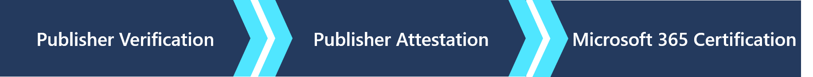

# Microsoft 365 Compliance-ProgrammMicrosoft 365 App Compliance Program

Das Microsoft 365 App-Compliance-Programm ist ein dreistufiger Ansatz für App-Sicherheit und -Compliance.The Microsoft 365 App Compliance Program, is a three tier approach to app security and compliance. Jede Stufe baut auf der nächsten auf – und bieten ein mehrschichtiges Programm, um den Benutzern die Sicherheit zu geben, die sie bei der Verwendung von Apps im Microsoft 365-Ökosystem benötigen.Each tier builds upon the next – offering a layered program to give users the confidence they need while using apps in the Microsoft 365 ecosystem. Derzeit sind alle Stufen des Programms freiwillig und werden nach Ermessen des App-Entwicklers abgeschlossen.Currently all tiers in the program are voluntary and is completed at the app developers discretion. 

Unser Leitbild: Microsoft-Kunden haben volles Vertrauen in die Anwendungen, mit denen ihre Organisationen arbeiten.Our mission statement: Microsoft customers have complete trust in the applications that run their organizations.
   

## HerausgeberüberprüfungPublisher Verification

Die [Herausgeberüberprüfung](https://docs.microsoft.com/azure/active-directory/develop/publisher-verification-overview) hilft Administratoren und Anwendern, die Authentizität von App-Entwicklern zu verstehen, die sich in die Microsoft-Identitätsplattform integrieren.[Publisher Verification](https://docs.microsoft.com/azure/active-directory/develop/publisher-verification-overview) helps admins and users understand the authenticity of app developers integrating with the Microsoft identity platform. Wenn eine App als „vom Herausgeber überprüft“ gekennzeichnet ist, bedeutet dies, dass der Herausgeber seine Identität mithilfe eines Microsoft Partner Network-Kontos überprüft hat, das den Überprüfungsprozess abgeschlossen und dieses MPN-Konto mit seiner Anwendungsregistrierung verknüpft hat.When an app is marked as publisher verified, it means that the publisher has verified their identity using a Microsoft Partner Network account that has completed the verification process and has associated this MPN account with their application registration.
Die Herausgeberüberprüfung gilt für Apps, die folgende Bedingungen erfüllen:Publisher Verification applies to apps that meet the following conditions:  
- Verwenden von OAuth 2.0 und OpenID Connect, um Benutzer anzumelden und den Zugriff auf Daten mithilfe dienstseitiger APIs wie Microsoft Graph anzufordern.Using OAuth 2.0 and OpenID Connect to sign users in and request access to data using service-side APIs such as Microsoft Graph. 
- Registriert in Azure AD als Mehrfachmandant.Registered in Azure AD as multi-tenant.  

> [!IMPORTANT]
> Die Herausgeberüberprüfung hindert einen App-Entwickler nicht daran, den Herausgebernachweis oder die Microsoft 365-Zertifizierung zu starten oder abzuschließen.Publisher Verification does not preclude an app developer from starting or completing Publisher Attestation or Microsoft 365 Certification. Wenn dies auf die App nicht zutrifft, kann die Überprüfung übersprungen und der Nachweis gestartet werden.If it does not apply to the app verification may be skipped and the attestation can be started.

## HerausgebernachweisPublisher Attestation

Der [Herausgebernachweis](https://docs.microsoft.com/microsoft-365-app-certification/docs/enterprise-app-attestation-guide) ist der Ort, an dem Entwickler allgemeine Informationen, Informationen zur Datenverarbeitung sowie Sicherheits- und Compliance-Informationen zu ihrem App-Dienst freigeben.[Publisher Attestation](https://docs.microsoft.com/microsoft-365-app-certification/docs/enterprise-app-attestation-guide) is where developers share general, data handling, and security and compliance information about their app service. Dies reduziert die Notwendigkeit für IT-Administratoren, direkt mit App-Herausgebern zusammenzuarbeiten.This reduces the need for IT admins to work directly with app publishers. Alle Informationen, die für eine informierte Entscheidung erforderlich sind, können für alle Apps, welche den Herausgebernachweis abgeschlossen haben, an einem Ort und in einem einheitlichen Format gefunden werden.All the information needed to make an informed decision can be found for all apps that have completed the publisher attestation in one place and in a consistent format. Das Ziel ist es, den Prozess der App-Einführung zu vereinfachen und zu beschleunigen und gleichzeitig sicherzustellen, dass die Apps, welche die Kunden in ihren Mandanten verwenden, ihren Unternehmensstandards entsprechen.The goal is to make it easier and speed up the process of app adoption while assuring customers that the apps they use in their tenants meets their organizational standards.

Der Herausgebernachweis gilt für Apps, welche sich mit diesen Microsoft-Plattformen integrieren:Publisher Attestation applies to apps that integrate with these Microsoft platforms:
-   Microsoft TeamsTeams
-   WordWord
-   ExcelExcel
-   PowerPointPowerPoint 
-   OutlookOutlook
- SharePointSharePoint
- ProjectProject
- OneNoteOneNote

> [!IMPORTANT]
> Microsoft überprüft die zur Verfügung gestellten Informationen nicht.Microsoft does not validate the information provided. Der Entwickler bestätigt alleine die Richtigkeit, Genauigkeit und Integrität der Nachweisdokumentation und der entsprechenden App-Leistungsdaten.The developer, solely affirms the veracity, accuracy, and integrity of the attestation documentation and corresponding app performance data. 

## Microsoft 365-ZertifizierungMicrosoft 365 Certification
Die [Microsoft 365-Zertifizierung](https://docs.microsoft.com/microsoft-365-app-certification/docs/enterprise-app-certification-guide) bietet Unternehmen die Gewissheit und das Vertrauen, dass Daten und Privatsphäre bei der Verwendung von Microsoft Teams-Apps angemessen gesichert und geschützt sind.The [Microsoft 365 Certification](https://docs.microsoft.com/microsoft-365-app-certification/docs/enterprise-app-certification-guide) offers assurance and confidence to organizations that data and privacy are adequately secured and protected when using Microsoft Teams apps. Die Zertifizierung bestätigt, dass eine App-Lösung mit Microsoft-Technologien kompatibel ist, den bewährten Methoden für Cloud App Security entspricht und von Microsoft unterstützt wird.Certification confirms that an app solution is compatible with Microsoft technologies, compliant with cloud app security best practices, and supported by Microsoft. Während diesem Prozess arbeiten die App-Entwickler mit einem externen Prüfer zusammen, um die Sicherheits- und Compliance-Standards des Unternehmens zu validieren. During this process, app developers work with a third-party assessor to validate organizational security and compliance standards. Die Microsoft 365-Zertifizierung gilt für Apps, welche sich mit diesen Microsoft-Plattformen integrieren:Microsoft 365 Certification applies to apps that integrate with these Microsoft platforms:

-   Microsoft TeamsTeams
-   WordWord
-   ExcelExcel
-   PowerPointPowerPoint 
-   OutlookOutlook
- SharePointSharePoint
- ProjectProject
- OneNoteOneNote
