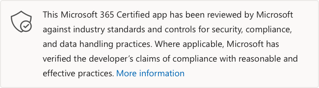

# Admin Center

Zuletzt aktualisiert vom Entwickler am: 24. Januar 2022

* <a href="https://appsource.microsoft.com/product/web-apps/officeatwork.admin-center" target="_blank">Ansicht in AppSource</a>

::: zone pivot="general"

### Allgemeine Informationen

Von officeatwork an Microsoft bereitgestellte Informationen:

| **Information** | **Response** |
|:----------------|:-------------|
| App-Name | Admin Center |
| ID | officeatwork.admin-center |
| Name des Partnerunternehmens | officeatwork |
| Website des Unternehmens | [https://www.officeatwork.com](https://www.officeatwork.com) |
| Nutzungsbedingungen der App | [https://links.officeatwork.com/officeatwork-licenseterms](https://links.officeatwork.com/officeatwork-licenseterms) |
| Kernfunktionen der App | Verwalten und konfigurieren Sie alle Officeatwork-Apps und Add-Ins an einem zentralen Ort. |
| Firmenstandort | Schweiz |
| Seite "App-Informationen" | |
| Welche Hostingumgebung oder welches Dienstmodell wird zum Ausführen Ihrer App verwendet? | Paas |
| Welche Hosting-Cloudanbieter verwendet die App? | Azure |

 [!INCLUDE [Corrections or suggestions contact information](../includes/corrections-or-suggestions.md)]

::: zone-end

::: zone pivot="data"

### So behandelt die App Daten

Diese Informationen wurden von Office-Mitarbeitern darüber bereitgestellt, wie diese App Organisationsdaten sammelt und speichert und welche Kontrolle Ihre Organisation über die von der App gesammelten Daten hat.

| **Information** | **Response** |
|:----------------|:-------------|
| Verarbeitet die App oder die zugrunde liegende Infrastruktur Daten, die sich auf einen Microsoft-Kunden oder sein Gerät beziehen? | Ja |
| Welche Daten werden von Ihrer App verarbeitet? | Microsoft.Ingestion.Attestation.DocsPublishingCommon.AppInfos.DataProcess |
| Unterstützt die App TLS 1.1 oder höher? | Ja |
| Speichert die App oder die zugrunde liegende Infrastruktur Microsoft-Kundendaten? | Ja |
| Welche Daten werden in Ihren Datenbanken gespeichert? |  |
| Wo werden diese Daten geografisch gespeichert, wenn zugrunde liegende Unstruktur Microsoft-Kundendaten verarbeitet oder speichert? |  |
| Verfügen Sie über einen etablierten Daten- und Entsorgungsprozess? |  |
| Wie lange werden Daten nach der Beendigung des Kontos aufbewahrt? |  |
| Verfügen Sie über einen etablierten Datenzugriffsverwaltungsprozess? |  |
| Übertragen Sie Kundendaten oder Kundeninhalte an Dritte oder Unterverarbeiter? | Nein |
| Verfügen Sie über Datenfreigabevereinbarungen mit Einem Drittanbieterdienst, mit dem Sie Microsoft-Kundendaten teilen? |  |

[!INCLUDE [Corrections or suggestions contact information](../includes/corrections-or-suggestions.md)]

::: zone-end

::: zone pivot="security"

Informationen aus dem [Microsoft Cloud App Security](https://www.microsoft.com/enterprise-mobility-security/cloud-app-security) Katalog werden unten angezeigt.

| **Information** | **Response** |
|:----------------|:-------------|
| Führen Sie jährliche Penetrationstests für die App durch? | Ja |
| Verfügt die App über einen dokumentierten Notfallwiederherstellungsplan, einschließlich einer Sicherungs- und Wiederherstellungsstrategie? | Ja |
| Verwendet Ihre Umgebung herkömmliche Anti-Malware-Schutz- oder Anwendungssteuerelemente? | ApplicationControls |
| Verfügen Sie über einen etablierten Prozess für die Einrückung und Risikobewertung von Sicherheitsrisiken? | Ja |
| Verfügen Sie über eine Richtlinie, die Ihren Service Level Agreement (SLA) für das Anwenden von Patches regelt? | Ja |
| Führen Sie Patchverwaltungsaktivitäten gemäß Ihren Patchrichtlinien-SLAs aus? | Ja |
| Verfügt Ihre Umgebung über nicht unterstützte Betriebssysteme oder Software? | Nein |
| Führen Sie vierteljährliche Sicherheitsrisikoüberprüfungen für Ihre App und die Struktur durch, die sie unterstützt? | Ja |
| Haben Sie eine Firewall an Der Grenze für das externe Netzwerk installiert? | Ja |
| Haben Sie einen eingerichteten Change Management-Prozess verwendet, um Änderungsanforderungen zu überprüfen und zu genehmigen, bevor sie in der Produktion bereitgestellt werden? | Ja |
| Überprüft und genehmigt eine zusätzliche Person alle Codeänderungsanforderungen, die vom ursprünglichen Entwickler an die Produktion übermittelt wurden? | Ja |
| Berücksichtigen sichere Codierungspraktiken allgemeine Sicherheitsrisikoklassen wie OWASP Top 10? | Ja |
| Mehrstufige Authentifizierung (MFA) aktiviert für: | CodeRepositories, DNSManagement, Credential |
| Verfügen Sie über einen etablierten Prozess für die Bereitstellung, Änderung und Löschung von Mitarbeiterkonten? | Ja |
| Haben Sie Software zur Erkennung und Verhinderung von Eindringversuchen (Intrusion Detection and Prevention, IDPS) am Umkreis der Netzwerkgrenze bereitgestellt, die Ihre App unterstützt? | Nicht zutreffend |
| Haben Sie die Ereignisprotokollierung für alle Systemkomponenten eingerichtet, die Ihre App unterstützen? | Ja |
| Werden alle Protokolle regelmäßig von menschlichen oder automatisierten Tools überprüft, um potenzielle Sicherheitsereignisse zu erkennen? | Ja|
| Wenn ein Sicherheitsereignis erkannt wird, werden Warnungen automatisch zur Triage an einen Mitarbeiter gesendet? | Ja |
| Haben Sie einen formalen Informationssicherheits-Risikomanagementprozess eingerichtet? | Ja |
| Haben Sie einen formalen Prozess zur Reaktion auf Sicherheitsvorfälle dokumentiert und eingerichtet? |  |
| Melden Sie App- oder Dienstdatenverstöße innerhalb von 72 Stunden nach der Erkennung an Aufsichtsbehörden und Einzelpersonen, die von der Verletzung betroffen sind?| |

[!INCLUDE [Corrections or suggestions contact information](../includes/corrections-or-suggestions.md)]

::: zone-end

::: zone pivot="compliance"

| **Information** | **Response** |
|:----------------|:-------------|
| Entspricht die App dem Health Insurance Portability and Accounting Act (HIPAA)? | Nicht zutreffend |
| Entspricht die App health Information Trust Alliance, Common Security Framework (HITRUST CSF)? | Nicht zutreffend |
| Entspricht die App den Kontrollen der Serviceorganisation (SOC 1)? | Nicht zutreffend |
| Letztes SOC1-Zertifizierungsdatum |   |
| Entspricht die App den Dienstorganisationssteuerelementen (SOC 2)? | Nein |
| Welche SOC 2-Zertifizierung haben Sie erreicht? | |
| Letztes SOC2-Zertifizierungsdatum | |
| Entspricht die App den Dienstorganisationssteuerelementen (SOC 3)? | Nein |
| Letztes SOC3-Zertifizierungsdatum | |
| Führen Sie jährliche PCI DSS-Bewertungen für die App und ihre unterstützende Umgebung durch? | Nicht zutreffend |
| Ist die App International Organization for Standardization (ISO 27001) zertifiziert? | Nein |
| Entspricht die App der International Organization for Standardization (ISO 27018)? | Nicht zutreffend |
| Entspricht die App der International Organization for Standardization (ISO 27017)? | Nein |
| Entspricht die App der International Organization for Standardization (ISO 27002)? | Nein |
| Ist die App FedRAMP (Federal Risk and Authorization Management Program) konform? | Nein |
| Entspricht die App dem FERPA (Family Educational Rights and Privacy Act)? | Nicht zutreffend |
| Entspricht die App dem Children's Online Privacy Protection Act (COPPA)? | Nicht zutreffend |
| Entspricht die App Sarbanes-Oxley Act (SOX)? | Nicht zutreffend |
| Entspricht die App NIST 800-171? | Nicht zutreffend |
| Wurde die App von der Cloud Security Alliance (CSA Star) zertifiziert? | Nein |

[!INCLUDE [Corrections or suggestions contact information](../includes/corrections-or-suggestions.md)]

::: zone-end

::: zone pivot="privsection"

| **Information** | **Response** |
|:----------------|:-------------|
| Haben Sie die DSGVO oder andere Datenschutz- oder Datenschutzanforderungen oder -verpflichtungen (z. B. CCPA)? | Ja |
| Verfügt die App über einen externen Datenschutzhinweis, der beschreibt, wie Kundendaten gesammelt, verwendet, freigaben und gespeichert werden? | Ja |
| URL der Datenschutzrichtlinie | https://links.officeatwork.com/officeatwork-privacypolicy |
| Führt die App eine automatisierte Entscheidungsfindung durch, einschließlich Profilerstellung, die rechtliche Auswirkungen oder ähnliche Auswirkungen haben könnte? | Nein |
| Verarbeitet die App Kundendaten für einen sekundären Zweck, der nicht in der Datenschutzerklärung (d. h. Marketing, Analyse) beschrieben ist? | Nein |
| Verarbeiten Sie besondere Kategorien vertraulicher Daten (z. B. ethnische Herkunft, politische Meinung, religiöse oder religiöse Überzeugungen, genetischen oder biometrischen Daten, Gesundheitsdaten) oder Kategorien von Daten, die gegen Benachrichtigungsgesetze verstoßen? | Nein |
| Erfasst oder verarbeitet die App Daten von Minderjährigen (d. h. Personen unter 16 Jahren)? | Nein |
| Verfügt die App über Funktionen zum Löschen der personenbezogenen Daten einer Person auf Anfrage? | Ja |
| Verfügt die App über Funktionen zum Einschränken oder Einschränken der Verarbeitung personenbezogener Daten einer Person auf Anfrage? | Ja |
| Bietet die App Einzelpersonen die Möglichkeit, ihre personenbezogenen Daten zu korrigieren oder zu aktualisieren? | Ja |
| Werden regelmäßige Datenschutz- und Datenschutzüberprüfungen (z. B. Datenschutz-Folgenabschätzungen oder Datenschutzrisikobewertungen) durchgeführt, um Risiken im Zusammenhang mit der Verarbeitung personenbezogener Daten für die App zu identifizieren? | Ja |

[!INCLUDE [Corrections or suggestions contact information](../includes/corrections-or-suggestions.md)]

::: zone-end

::: zone pivot="zerotrust"

| **Information** | **Response** |
|:----------------|:-------------|
| Ist Ihre Anwendung in die Microsoft Identity Platform (Azure AD) für einmaliges Anmelden, API-Zugriff usw. integriert? | Ja |
| Haben Sie alle anwendbaren bewährten Methoden in der Checkliste für die Microsoft Identity Platform Integration überprüft und berücksichtigt? | Ja |
| Verwendet Ihre App die neueste Version von MSAL (Microsoft-Authentifizierungsbibliothek) oder Microsoft Identity Web für die Authentifizierung? | Nicht zutreffend |
| Welche Authentifizierungsbibliotheken werden von Ihrer App verwendet, wenn sie keine der oben genannten Bibliotheken verwendet? |  |
| Unterstützt Ihre App Richtlinien für bedingten Zugriff? | Ja |
| Auflisten der unterstützten Richtlinientypen | Sicherheitsstandards |
| Unterstützt Ihre App continuous Access Evaluation (CAE) | Ja |
| Speichert Ihre App Anmeldeinformationen im Code? | Nein |
| Apps und Add-Ins für Microsoft 365 verwenden möglicherweise zusätzliche Microsoft-APIs außerhalb von Microsoft Graph. Verwendet Ihre App oder Ihr Add-In zusätzliche Microsoft-APIs? | Nein |

#### Datenzugriff mithilfe von Microsoft Graph

>|   **Graph-Berechtigung**  | **Berechtigungstyp** |          **Justification**          |
>|:------------------------|:--------------------|:------------------------------------|
>| openid | Delegiert | Aktivieren der Anmeldung |
>| User.Read | Delegiert | Aktivieren der Anzeige des angemeldeten Benutzers |
>| Sites.Read.All | Delegiert | Ermöglicht die Überprüfung der Bibliothekserstellung |
>| Directory.Read.All | Delegiert | Aktivieren der Anzeige des Zustimmungsstatus |
>| Group.Read.All | Delegiert | Aktivieren der Einschränkung der Benutzergruppe von Bibliotheken |
>| User.ReadBasic.All | Delegiert | Aktivieren der Anzeige von Benutzereigenschaften |

>Diese Anwendung verfügt nicht über zusätzliche APIs.

[!INCLUDE [Corrections or suggestions contact information](../includes/corrections-or-suggestions.md)]

::: zone-end

