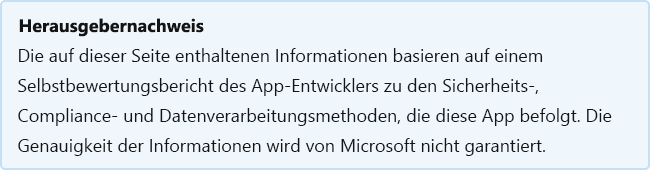

# Gaggle für SharePoint

Zuletzt aktualisiert vom Entwickler am: 3. November 2020

* <a href="https://appsource.microsoft.com/product/office/WA104374324" target="_blank">Anzeigen in AppSource</a>

::: zone pivot="general"

### Allgemeine Informationen

Informationen, die Gaggle.net, Inc. Microsoft zur Verfügung gestellt hat:

| **Information** | **Antwort** |
|:----------------|:-------------|
| App-Name | Gaggle für SharePoint |
| ID | WA104374324 |
| Office 365 unterstützten Clients | SharePoint 2013 oder später |
| Name des Partnerunternehmens | Gaggle.net, Inc. |
| URL der Partner-Website | [https://gaggle.net/](https://gaggle.net/) |
| URL der Datenschutzrichtlinie | [https://gaggle.net/privacy](https://gaggle.net/privacy) |
| URL der Nutzungsbedingungen | [https://go.microsoft.com/fwlink/?LinkID=521715&amp;omkt=de-US](https://go.microsoft.com/fwlink/?LinkID=521715&amp;omkt=en-US) |

 [!INCLUDE [Corrections or suggestions contact information](../includes/corrections-or-suggestions.md)]

::: zone-end

::: zone pivot="data"

### Wie die App mit Daten umgeht

Diese Informationen wurden von Gaggle.net, Inc. darüber bereitgestellt, wie diese App Organisationsdaten sammelt und speichert und welche Kontrolle Ihre Organisation über die von der App erfassten Daten hat.

#### Datenzugriff mit Microsoft Graph

Listen Sie alle [Microsoft-Graph Berechtigungen](https://docs.microsoft.com/graph/permissions-reference) auf, die diese App benötigt.

>Diese Anwendung verwendet keine Microsoft-Graph.

#### Nicht Microsoft-Dienste verwendet

Wenn die App Organisationsdaten an Nicht-Microsoft-Dienst überträgt oder diese teilt, listen Sie den Nicht-Microsoft-Dienst auf, den die App verwendet, welche Daten übertragen werden, und geben Sie eine Begründung dafür an, warum die App diese Informationen übertragen muss.

>Nicht-Microsoft-Dienste werden nicht verwendet.

#### Telemetriedaten

Werden in der Telemetrie oder in den Protokollen dieser Anwendung unternehmensbezogene identifizierbare Informationen (OII) oder Benutzer-identifizierbare Informationen (EUII) angezeigt? Wenn ja, beschreiben Sie, welche Daten gespeichert werden und welche Richtlinien für aufbewahrungs- und Entfernungsrichtlinien?

>IP-Adressen, E-Mail-Adressen, Benutzernamen. Der Zugriff auf alle Telemetriedaten/Protokollierung basiert auf einem gruppenbasierten Berechtigungsschema, wobei das Prinzip der geringsten Berechtigungen verwendet wird. Physische und logische Zugriffskontrollen sind vorhanden, um sicherzustellen, dass der unbefugte Zugriff auf OII und EIUU verhindert wird.

#### Organisationssteuerelemente für vom Partner gespeicherte Daten

Beschreiben Sie, wie Administratoren von Organisationen ihre Informationen in Partnersystemen steuern können? z.B. Löschen, Aufbewahrung, Auditing, Archivierung, Endbenutzerrichtlinie usw.

>Daten, die in Protokollierungssystemen auf Systemebene oder in Datenbanken gespeichert werden. Der Zugriff auf alle Daten basiert auf einem gruppenbasierten Berechtigungsschema, wobei das Prinzip der geringsten Berechtigungen verwendet wird. Physische und logische Zugriffskontrollen sind vorhanden, um sicherzustellen, dass der unbefugte Zugriff auf OII und EIUU verhindert wird.

#### Menschliche Überprüfung von Organisationsinformationen

Sind Menschen an der Überprüfung oder Analyse von OII-Daten (Organizational identifiabling Information) beteiligt, die von dieser App erfasst oder gespeichert werden?

>Ja

[!INCLUDE [Corrections or suggestions contact information](../includes/corrections-or-suggestions.md)]

::: zone-end

::: zone pivot="mcas"

Die Informationen aus dem [Microsoft Cloud App Security-Katalog](https://www.microsoft.com/enterprise-mobility-security/cloud-app-security) werden unten angezeigt.

<iframe height='1020' title='Microsoft Cloud App Security Informationen' src='https://appmcasinfoprod.azurewebsites.net/#/dashboard/20688' frameborder='no' style='width: 100%;'></iframe>

<a href="https://appmcasinfoprod.azurewebsites.net/#/dashboard/20688" target="_blank">Anzeigen in einer neuen Registerkarte</a>

[!INCLUDE [Corrections or suggestions contact information](../includes/corrections-or-suggestions.md)]

::: zone-end

