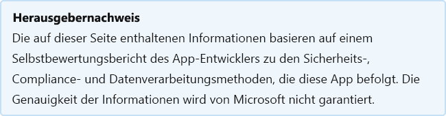

# HyperproofHyperproof

Last updated by the developer on: March 18, 2021Last updated by the developer on: March 18, 2021

* <a href="https://teams.microsoft.com/l/app/1683c88b-f5ca-4acc-a777-c1e3cf820ef5" target="_blank">Anzeigen im Teams Speicher</a><a href="https://teams.microsoft.com/l/app/1683c88b-f5ca-4acc-a777-c1e3cf820ef5" target="_blank">View in Teams store</a>
* <a href="https://appsource.microsoft.com/product/office/WA200002692" target="_blank">Ansicht in AppSource</a><a href="https://appsource.microsoft.com/product/office/WA200002692" target="_blank">View in AppSource</a>

::: zone pivot="general"

### Allgemeine InformationenGeneral information

Von Hyperproof für Microsoft bereitgestellte Informationen:Information provided by Hyperproof to Microsoft:

| **Information****Information** | **Antwort****Response** |
|:----------------|:-------------|
| App-NameApp name | HyperproofHyperproof |
| IDID | WA200002692WA200002692 |
| Office 365 unterstützten ClientsOffice 365 clients supported | Microsoft TeamsMicrosoft Teams |
| Name des PartnerunternehmensPartner company name | HyperproofHyperproof |
| URL der PartnerwebsiteURL of partner website | [https://hyperproof.io](https://hyperproof.io) |
| URL der Seite mit Teams AnwendungsinformationenURL of Teams application info page | [https://hyperproof.io/product](https://hyperproof.io/product) |
| URL der DatenschutzrichtlinieURL of Privacy Policy | [https://hyperproof.io/privacy-policy](https://hyperproof.io/privacy-policy) |
| URL der NutzungsbedingungenURL of Terms of Use | [https://hyperproof.io/terms-of-use](https://hyperproof.io/terms-of-use) |

 [!INCLUDE [Corrections or suggestions contact information](../includes/corrections-or-suggestions.md)]

::: zone-end

::: zone pivot="data"

### So behandelt die App DatenHow the app handles data

Diese Informationen wurden von Hyperproof darüber bereitgestellt, wie diese App Organisationsdaten sammelt und speichert und welche Kontrolle Ihre Organisation über die von der App gesammelten Daten hat.This information has been provided by Hyperproof about how this app collects and stores organizational data and the control that your organization will have over the data the app collects.

#### Datenzugriff mithilfe von Microsoft GraphData access using Microsoft Graph

Listet alle [Microsoft Graph Berechtigungen](https://docs.microsoft.com/graph/permissions-reference) auf, die diese App benötigt.List any [Microsoft Graph permissions](https://docs.microsoft.com/graph/permissions-reference) this app requires.

>Diese Anwendung verwendet microsoft Graph nicht.This application does not use Microsoft Graph.

#### Nicht Microsoft-Dienste verwendetNon-Microsoft services used

Wenn die App Organisationsdaten mit einem Nicht-Microsoft-Dienst überträgt oder teilt, listen Sie den von der App verwendeten Nicht-Microsoft-Dienst auf, welche Daten übertragen werden, und geben Sie eine Begründung dafür an, warum die App diese Informationen übertragen muss.If the app transfers or shares organizational data with non-Microsoft service, list the non-Microsoft service the app uses, what data is transferred, and include a justification for why the app needs to transfer this information.

>Nicht Microsoft-Dienste werden nicht verwendet.Non-Microsoft services are not used.

#### Datenzugriff über BotsData access via bots

Wenn diese App einen Bot oder eine Messaging-Erweiterung enthält, kann sie auf Identifizierbare Endbenutzerinformationen (EUII) zugreifen: die Liste (Vorname, Nachname, Anzeigename, E-Mail-Adresse) eines beliebigen Teammitglieds in einem Team oder Chat, dem sie hinzugefügt wird.If this app contains a bot or a messaging extension, it can access end-user identifiable information (EUII): the roster (first name, last name, display name, email address) of any team member in a team or chat it's added to. Nutzt diese App diese Funktion?Does this app make use of this capability?

>Es wird nicht auf EUII zugegriffen.No EUII is accessed.

#### TelemetriedatenTelemetry data

Werden organisationsbezogene Informationen (OII) oder Endbenutzer-Informationen (EUII) in den Telemetrie- oder Protokollen dieser Anwendung angezeigt?Does any organizational identifiable information (OII) or end-user identifiable information (EUII) appear in this application's telemetry or logs? Wenn ja, beschreiben Sie, welche Daten gespeichert werden und was sind die Aufbewahrungs- und Entfernungsrichtlinien?If yes, describe what data is stored and what are the retention and removal policies?

>In den Telemetrie- oder Protokollen der Anwendungen werden keine OII oder EUII angezeigt.No OII or EUII appear in the applications telemetry or logs.

#### Organisationssteuerungen für vom Partner gespeicherte DatenOrganizational controls for data stored by partner

Beschreiben, wie Administratoren ihrer Organisation ihre Informationen in Partnersystemen steuern können? z. B. Löschen, Aufbewahrung, Überwachung, Archivierung, Endbenutzerrichtlinie usw.Describe how organization's administrators can control their information in partner systems? e.g. deletion, retention, auditing, archiving, end-user policy, etc.

>Partnerdaten werden nicht gesteuert.We don't control partner data.

#### Menschliche Überprüfung von OrganisationsinformationenHuman review of organizational information

Sind Menschen an der Überprüfung oder Analyse von Organisationsdaten (OII) beteiligt, die von dieser App gesammelt oder gespeichert werden?Are humans involved in reviewing or analyzing any organizational identifiable information (OII) data that is collected or stored by this app?

>NeinNo

[!INCLUDE [Corrections or suggestions contact information](../includes/corrections-or-suggestions.md)]

::: zone-end

::: zone pivot="mcas"

Informationen aus dem [Microsoft Cloud App Security](https://www.microsoft.com/enterprise-mobility-security/cloud-app-security) Katalog werden unten angezeigt.Information from the [Microsoft Cloud App Security](https://www.microsoft.com/enterprise-mobility-security/cloud-app-security) catalog appears below.

<iframe height='1020' title='Microsoft Cloud App Security InformationenMicrosoft Cloud App Security Information' src='https://appmcasinfoprod.azurewebsites.net/#/dashboard/37868' frameborder='no' style='width: 100%;'></iframe>

<a href="https://appmcasinfoprod.azurewebsites.net/#/dashboard/37868" target="_blank">Ansicht auf einer neuen Registerkarte</a>

<a href="https://appmcasinfoprod.azurewebsites.net/#/dashboard/37868" target="_blank">View in a new tab</a>

[!INCLUDE [Corrections or suggestions contact information](../includes/corrections-or-suggestions.md)]

::: zone-end

::: zone pivot="identity"

### IdentitätsinformationenIdentity information

Diese Informationen wurden von Hyperproof darüber bereitgestellt, wie diese App Authentifizierung, Autorisierung, bewährte Methoden für die Anwendungsregistrierung und andere Identitätskriterien behandelt.This information has been provided by Hyperproof about how this app handles authentication, authorization, application registration best practices, and other Identity criteria.

| **Information****Information** | **Antwort****Response** |
|:----------------|:-------------|
| Integrieren Sie die Microsoft Identify Platform (Azure AD)?Do you integrate with Microsoft Identify Platform (Azure AD)?  | JaYes |
| Haben Sie alle anwendbaren bewährten Methoden, die in der Checkliste für die Microsoft Identity Platform Integration beschrieben sind, überprüft und befolgt?Have you reviewed and complied with all applicable best practices outlined in the Microsoft identity platform integration checklist?  | JaYes |
| Verwendet Ihre App MSAL (Microsoft-Authentifizierungsbibliothek) für die Authentifizierung?Does your app use MSAL (Microsoft Authentication Library) for authentication? | NeinNo |
| Unterstützt Ihre App Richtlinien für bedingten Zugriff?Does your app support Conditional Access policies? | NeinNo |
| Fordert Ihre App berechtigungen mit den geringsten Rechten für Ihr Szenario an?Does your app request least privilege permissions for your scenario? | JaYes |
| Spiegeln die statisch registrierten Berechtigungen Ihrer App genau die Berechtigungen wider, die Ihre App dynamisch und inkrementell anfordert?Does your app's statically registered permissions accurately reflect the permissions your app will request dynamically and incrementally? | JaYes |
| Unterstützt Ihre App Mehrmandantenfähigkeit?Does your app support multi-tenancy? | JaYes |
| Verfügt Ihre App über einen vertraulichen Client?Does your app have a confidential client? | NeinNo |
| Besitzen Sie alle Umleitungs-URI (Unified Resource Identifier), die für Ihre App registriert sind?Do you own all of the redirect Unified Resource Identifier (URI) registered for your app? | JaYes |
| Macht Ihre App Web-APIs verfügbar?Does your app expose any web APIs? | JaYes |
| Ermöglicht Ihr Berechtigungsmodell nur, dass Aufrufe erfolgreich sind, wenn die Client-App die richtige Zustimmung erhält?Does your permission model only allow calls to succeed if the client app receives the proper consent? | JaYes |
| Verwendet Ihre App Vorschau-APIs?Does your app use preview APIs? | NeinNo |
| Verwendet Ihre App veraltete APIs?Does your app use deprecated APIs? | NeinNo |

[!INCLUDE [Corrections or suggestions contact information](../includes/corrections-or-suggestions.md)]

::: zone-end
